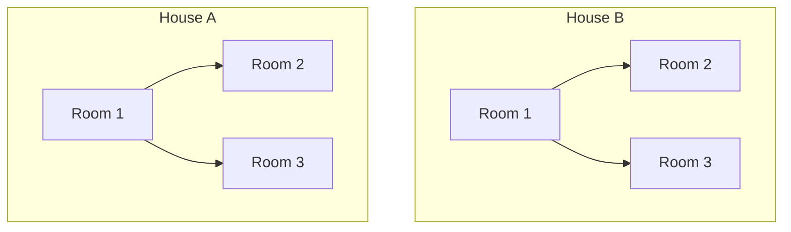
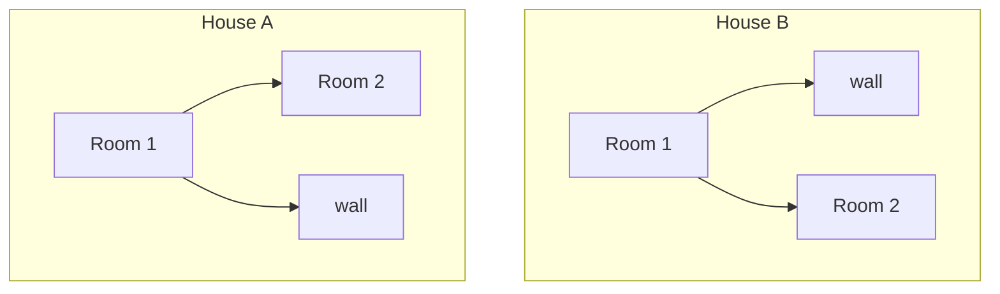
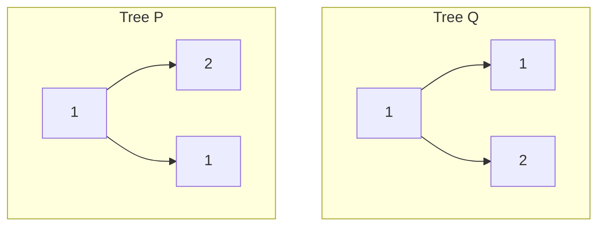

# Same Tree - Mental Model

## The Twin House Inspection Analogy

Understanding this problem is like two building inspectors walking through two houses simultaneously, room by room, to verify the houses are identical.

**How the analogy maps to the problem:**
- A house → A binary tree
- A room with a number on the door → A tree node with a value
- The left hallway out of a room → The left child pointer
- The right hallway out of a room → The right child pointer
- Hitting a wall (no room) → A null node
- The two inspectors walking in sync → The recursive DFS traversal

## Understanding the Analogy (No Code Yet!)

### The Setup

Imagine you're a real estate inspector. Your job: determine whether House A and House B are **perfectly identical**. Same layout, same room numbers on every door, same hallways leading to the same places.

You and your partner each stand at the front door of one house. You'll walk through both houses at the exact same pace, making the exact same turns. At every room, you compare notes. If anything ever differs - you stop and declare the houses different.

Each room has:
- A **number on the door** (the node's value)
- A **left hallway** that may lead to another room or a wall
- A **right hallway** that may lead to another room or a wall

### How It Works

The inspectors start at the front entrance (the root) of each house. At every step, they face exactly one of four situations:

**Situation 1: Both inspectors hit a wall.** Neither house has a room here. That's a match - if both houses have nothing in the same spot, they agree. The inspectors report back: "This spot is identical." This is the simplest case - nothing to compare, nothing to disagree about.

**Situation 2: One inspector finds a room, the other hits a wall.** One house has a room where the other doesn't. The structures are different. Immediately declare: "Houses are NOT identical." It doesn't matter what's deeper in the house - a structural mismatch at any point means the houses differ.

**Situation 3: Both inspectors find rooms, but the door numbers are different.** Both houses have a room in the same spot, but Inspector A sees room #5 while Inspector B sees room #8. The values don't match. Immediately declare: "Houses are NOT identical."

**Situation 4: Both inspectors find rooms with the same door number.** This is the only situation where we keep going. The rooms match so far, but we need to check everything beyond them. Both inspectors now:
1. First, walk down the **left hallway** together
2. Then, walk down the **right hallway** together

Both hallways must lead to identical sub-structures for the houses to be truly identical.

### Why This Approach Works

The key insight is that **we check the current room before exploring deeper**. This is the preorder pattern: visit the node first, then recurse into children.

This is efficient because a single mismatch anywhere means we can stop immediately. We don't need to inspect every room in both houses - the moment something differs, we know the answer is "not identical."

The other key insight: **both null is a match, not a failure**. When both inspectors hit a wall at the same spot, that's actually good news - it means both houses have the same absence of rooms there.

### Simple Example Through the Analogy

**House A:** Front door opens to Room 1. Room 1's left hallway leads to Room 2. Room 1's right hallway leads to Room 3.

**House B:** Front door opens to Room 1. Room 1's left hallway leads to Room 2. Room 1's right hallway leads to Room 3.



The inspectors walk through:

1. **Front door:** Both find Room 1. Same number. Keep going.
2. **Left hallway from Room 1:** Both find Room 2. Same number. Keep going.
3. **Left hallway from Room 2:** Both hit a wall. Match.
4. **Right hallway from Room 2:** Both hit a wall. Match.
5. **Back to Room 1, right hallway:** Both find Room 3. Same number. Keep going.
6. **Left hallway from Room 3:** Both hit a wall. Match.
7. **Right hallway from Room 3:** Both hit a wall. Match.

Every spot matched. The houses are identical.

### A Failing Example

**House A:** Room 1 → left leads to Room 2, right leads to nothing (wall).

**House B:** Room 1 → left leads to nothing (wall), right leads to Room 2.



1. **Front door:** Both find Room 1. Same number. Keep going.
2. **Left hallway from Room 1:** Inspector A finds Room 2, Inspector B hits a wall. **Mismatch!** Houses are NOT identical.

We stopped immediately. We didn't even need to check the right hallway.

Now you understand HOW to solve the problem. Let's translate this to code.

---

## Building the Algorithm Step-by-Step

Now we'll translate each part of our mental model into code.

### Step 1: The Inspectors Arrive at a Spot

**In our analogy:** Two inspectors stand at the same position in their respective houses. They need to compare what they see.

**In code:**
```typescript
function isSameTree(houseA: TreeNode | null, houseB: TreeNode | null): boolean {
    // The inspectors are now looking at their current rooms
}
```

**Why:** Each call to this function is one moment where both inspectors compare their current position.

### Step 2: Both Hit a Wall (Both Null)

**In our analogy:** If both inspectors hit a wall at the same spot, that's a match. Nothing exists in either house here - they agree.

**Adding to our code:**
```typescript
function isSameTree(houseA: TreeNode | null, houseB: TreeNode | null): boolean {
    if (!houseA && !houseB) return true;  // Both walls → match
}
```

**Why:** Two nulls means both trees have nothing at this position. That's structurally identical.

### Step 3: One Wall, One Room (One Null)

**In our analogy:** If one inspector finds a room but the other hits a wall, the houses differ structurally. Immediate mismatch.

**Adding to our code:**
```typescript
function isSameTree(houseA: TreeNode | null, houseB: TreeNode | null): boolean {
    if (!houseA && !houseB) return true;
    if (!houseA || !houseB) return false;  // One wall, one room → mismatch
}
```

**Why:** If we passed the first check, we know they're not both null. So if either one is null, exactly one is null - a structural difference.

### Step 4: Different Door Numbers (Different Values)

**In our analogy:** Both inspectors found rooms, but the numbers on the doors don't match. The houses differ.

**Adding to our code:**
```typescript
function isSameTree(houseA: TreeNode | null, houseB: TreeNode | null): boolean {
    if (!houseA && !houseB) return true;
    if (!houseA || !houseB) return false;
    if (houseA.val !== houseB.val) return false;  // Different door numbers → mismatch
}
```

**Why:** At this point we know both nodes exist. If their values differ, the trees differ.

### Step 5: Same Room - Check Both Hallways

**In our analogy:** The rooms match. Now both inspectors walk down the left hallway together, then the right hallway together. **Both** hallways must lead to identical sub-structures.

**Complete algorithm:**
```typescript
function isSameTree(houseA: TreeNode | null, houseB: TreeNode | null): boolean {
    if (!houseA && !houseB) return true;   // Both walls → match
    if (!houseA || !houseB) return false;   // One wall, one room → mismatch
    if (houseA.val !== houseB.val) return false;  // Different numbers → mismatch

    // Same room! Now check left hallway AND right hallway
    return isSameTree(houseA.left, houseB.left)
        && isSameTree(houseA.right, houseB.right);
}
```

**Why:** The `&&` is critical. If the left hallways don't match, we don't even bother checking right (short-circuit). Both sides must be identical for the whole tree to be identical.

---

## Tracing Through an Example

**Input:** p = [1, 2, 1], q = [1, 1, 2]



| Step | Inspector A (House A) | Inspector B (House B) | Result |
|------|----------------------|----------------------|--------|
| 1 | Room 1 | Room 1 | Same number. Check hallways. |
| 2 | Left → Room 2 | Left → Room 1 | **Different numbers! Return false.** |

The right hallway is never checked. One mismatch is enough.

**Another trace:** p = [1, 2, 3], q = [1, 2, 3]

| Step | Inspector A | Inspector B | Result |
|------|------------|------------|--------|
| 1 | Room 1 | Room 1 | Match. Go left. |
| 2 | Room 2 | Room 2 | Match. Go left. |
| 3 | Wall | Wall | Both null → true. |
| 4 | Back to Room 2, go right | Same | |
| 5 | Wall | Wall | Both null → true. |
| 6 | Back to Room 1, go right | Same | |
| 7 | Room 3 | Room 3 | Match. Go left. |
| 8 | Wall | Wall | Both null → true. |
| 9 | Back to Room 3, go right | Same | |
| 10 | Wall | Wall | Both null → true. |

Every spot matched → return **true**.

---

## Common Misconceptions

### ❌ "If both nodes are null, that's an error"
Why it's wrong: Both inspectors hitting a wall at the same spot is actually good news - the houses agree that nothing exists there. `null == null` is a match, not a failure. This is the base case that makes recursion work.

### ❌ "I need to compare the full trees before deciding"
Why it's wrong: The moment one inspector sees something different, we can stop. We don't need to explore every room. Early returns (`return false`) let us short-circuit the moment any mismatch is found.

### ❌ "I should compare values first, then check for nulls"
Why it's wrong: If you try to access `.val` on a null node, you'll crash. Always handle the null cases first:
1. Both null → true
2. One null → false
3. Now safe to compare values

### ✅ "The order of null checks matters"
Why it's right: Check both-null first (the happy base case), then one-null (structural mismatch), then values. This ordering ensures you never access properties on null.

---

## Try It Yourself

**Trace this example by hand:**

House A: Room 1 → left: Room 2 (left: Room 4, right: Room 5) → right: Room 3
House B: Room 1 → left: Room 2 (left: Room 4, right: Room 99) → right: Room 3

```
p = [1, 2, 3, 4, 5]
q = [1, 2, 3, 4, 99]
```

Walk through as the inspectors:
1. Start at the front door of each house
2. At each room, check: both walls? One wall? Different numbers? Same number?
3. If same number, go left first, then right
4. At what point do you find the mismatch?
5. What rooms do you never visit?

**Expected:** The inspectors match at Room 1, Room 2, Room 4, then diverge at position right-of-Room-2 (Room 5 vs Room 99). Room 3 is never inspected. Result: **false**.
