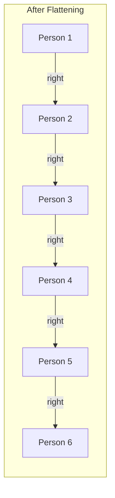

# Flatten Binary Tree to Linked List - Mental Model (Alt)

## The People Holding Ropes Analogy

Understanding this solution is like a line of **people standing in a tree formation, each holding a rope in their left hand and right hand** — and we need to rearrange them so everyone only holds a rope in their right hand, forming a single-file line.

**How the analogy maps to the problem:**
- Each **person** → A tree node
- **Left-hand rope** → Node's left child pointer (leads to the person on their left)
- **Right-hand rope** → Node's right child pointer (leads to the person on their right)
- **Dropping a rope** → Setting a pointer to null
- **Handing a rope to someone** → Reassigning a pointer
- **The last person in a chain** → The tail node returned by DFS

## Understanding the Analogy (No Code Yet!)

### The Setup

Picture a group of people arranged in a tree formation. Person 1 stands at the top. They hold a rope in their left hand that leads down to Person 2, and a rope in their right hand that leads down to Person 5. Person 2, in turn, holds ropes leading to Person 3 (left) and Person 4 (right). And so on.

```
        Person 1
       /L        \R
    Person 2    Person 5
   /L     \R       \R
Person 3  Person 4  Person 6
```

Our goal: rearrange so that every person drops their left-hand rope entirely and only holds a right-hand rope to the next person, forming one straight chain: `1 → 2 → 3 → 4 → 5 → 6`.

### How It Works

We visit people **bottom-up** — starting with the people at the very ends (leaves) and working our way back up. The algorithm asks each person to do a simple task, but only after the people below them have already been sorted out.

Here's what happens at each person:

1. **First, wait.** Let everyone reachable through your left-hand rope get sorted out. Then let everyone reachable through your right-hand rope get sorted out. By the time it's your turn, the people below you are already standing in neat right-hand-only chains.

2. **Check your left hand.** If you're holding a left-hand rope (meaning there's a chain of people on your left side), you need to splice that chain into your right side. This is a three-move operation:
   - The **last person in your left chain** grabs your right-hand rope with their right hand (connecting the left chain's end to the right chain's start).
   - You **switch your left-hand rope to your right hand** (the left chain is now your right chain).
   - You **drop your left hand** entirely (left is now empty).

3. **Report who's last.** Tell the person above you: "The last person in my chain is ___." This is critical — the person above needs to know who's at the end of your chain so they can connect things properly.

### Why This Approach Works

The beauty is that by the time any person does their splice, both their left chain and right chain are already straight lines (thanks to the bottom-up order). So splicing is simple: take the end of the left line, connect it to the beginning of the right line, and swing everything to the right hand. You're just linking two already-straight chains.

The "report who's last" step is what makes the whole thing possible. When Person 2 finishes and reports "Person 4 is last in my chain," Person 1 now knows exactly who needs to grab Person 5's rope. Without this reporting, nobody would know where the chains end.

### Simple Example Through the Analogy

```
        Person 1
       /L        \R
    Person 2    Person 5
   /L     \R       \R
Person 3  Person 4  Person 6
```

We start at the deepest people and work up:

**Visit Person 3:** No ropes in either hand — they're standing alone at the end. Nothing to rearrange. Reports back: "I'm the last person — Person 3."

**Visit Person 4:** Same situation — standing alone. Reports back: "Person 4."

**Visit Person 2:** Left chain reported Person 3 as the last person. Right chain reported Person 4.
- Person 2 IS holding a left-hand rope (to Person 3), so we splice:
  - Person 3 (last in left chain) grabs Person 4 with their right hand. Now: `3 →R 4`
  - Person 2 switches their left-hand rope to their right hand. Now: `2 →R 3 →R 4`
  - Person 2 drops their left hand. Left is empty.
- Person 2's chain is now a straight right-hand line: `2 → 3 → 4`
- Reports back: "Person 4 is last" (the rightmost tail).

**Visit Person 6:** Standing alone. Reports back: "Person 6."

**Visit Person 5:** No left-hand rope, right chain reported Person 6. Nothing to splice — already a right-only chain: `5 → 6`. Reports back: "Person 6 is last."

**Visit Person 1:** Left chain reported Person 4 as last. Right chain reported Person 6.
- Person 1 IS holding a left-hand rope (to Person 2), so we splice:
  - Person 4 (last in left chain) grabs Person 5 with their right hand. Now: `4 →R 5 →R 6`
  - Person 1 switches their left-hand rope to their right hand. Now: `1 →R 2 →R 3 →R 4 →R 5 →R 6`
  - Person 1 drops their left hand. Left is empty.
- Final chain: `1 → 2 → 3 → 4 → 5 → 6` — everyone in a single-file, right-hand-only line.



Now you understand HOW this solution works. Let's translate this to code.

---

## Building the Algorithm Step-by-Step

Now we'll translate each part of our rope-holding analogy into code.

### Step 1: Visit a Person (Base Case)

**In our analogy:** We visit each person. If we reach for someone who doesn't exist (an empty spot), there's nobody there — nothing to do, nothing to report.

**In code:**

```typescript
function dfs(node: TreeNode | null): TreeNode | null {
    if (!node) return;
}
```

**Why:** A null node means "no person standing here." No rope to rearrange, no one to report as the last person.

### Step 2: Wait for the People Below to Get Sorted

**In our analogy:** Before this person does anything, let the left-hand chain and right-hand chain below them get fully sorted. Each chain reports back who the last person in their line is.

**Adding to our code:**

```typescript
function dfs(node: TreeNode | null): TreeNode | null {
    if (!node) return;

    const leftTail = dfs(node.left);   // Last person in the left chain
    const rightTail = dfs(node.right);  // Last person in the right chain
}
```

**Why:** `leftTail` is the last person standing in the sorted left chain. `rightTail` is the last person in the sorted right chain. Both chains are already straight right-hand-only lines by this point.

### Step 3: The Three-Move Splice

**In our analogy:** If this person is holding a left-hand rope, do the splice: (1) last person in left chain grabs the right chain, (2) switch left rope to right hand, (3) drop left hand.

**The logic:**

```typescript
function dfs(node: TreeNode | null): TreeNode | null {
    if (!node) return;

    const leftTail = dfs(node.left);
    const rightTail = dfs(node.right);

    if (leftTail) {
        leftTail.right = node.right;  // Left chain's last person grabs right chain
        node.right = node.left;       // Switch left rope to right hand
        node.left = null;             // Drop left hand
    }
}
```

**Why:** The order matters. We first connect the left chain's tail to the right chain (`leftTail.right = node.right`) *before* overwriting `node.right`. This ensures the right chain isn't lost — the left tail is already holding onto it before we move anything.

### Step 4: Report Who's Last

**In our analogy:** Tell the person above you who the very last person in your chain is. If there's a right chain, it's at the end. If there's only a left chain (now spliced right), its tail is the end. If you're alone, you're the last person.

**Complete algorithm:**

```typescript
function flatten(root: TreeNode | null): void {
    function dfs(node: TreeNode | null): TreeNode | null {
        if (!node) return;

        const leftTail = dfs(node.left);
        const rightTail = dfs(node.right);

        if (leftTail) {
            leftTail.right = node.right;
            node.right = node.left;
            node.left = null;
        }

        return rightTail || leftTail || node;
    }
    dfs(root);
}
```

**Why the priority order?** After the splice, the chain reads: `person → [left chain people] → [right chain people]`. So the last person is:
- `rightTail` — if a right chain exists, it's at the very end
- `leftTail` — if only a left chain existed, it's now the end (spliced into right)
- `node` itself — if this person is standing alone with no ropes at all

---

## Tracing Through an Example

**Input:**

```
      1
     / \
    2    5
   / \    \
  3   4    6
```

| Step | Person | Left Tail | Right Tail | What Happens | Reports Back |
|------|--------|-----------|------------|--------------|-------------|
| 1 | 3 | nobody | nobody | Standing alone, nothing to do | 3 (itself) |
| 2 | 4 | nobody | nobody | Standing alone, nothing to do | 4 (itself) |
| 3 | 2 | 3 | 4 | Person 3 grabs Person 4 with right hand. Person 2 switches left rope to right. Drops left. Chain: `2→3→4` | 4 (rightTail) |
| 4 | 6 | nobody | nobody | Standing alone | 6 (itself) |
| 5 | 5 | nobody | 6 | No left rope, nothing to splice. Chain: `5→6` | 6 (rightTail) |
| 6 | 1 | 4 | 6 | Person 4 grabs Person 5 with right hand. Person 1 switches left rope to right. Drops left. Chain: `1→2→3→4→5→6` | 6 (rightTail) |

**Final result:** `1 → 2 → 3 → 4 → 5 → 6` — single-file, right-hand ropes only.

## Common Misconceptions

### "Switching the left rope to right hand loses the right chain"

It looks like when Person 1 puts their left rope into their right hand, Person 5's chain vanishes. But look at the step before: Person 4 (end of the left chain) already grabbed Person 5 with their right hand. The right chain is safely connected *through* the left chain before anyone switches hands. It's like passing a baton before letting go — the connection is made first.

### "Why report who's last instead of just rearranging?"

Without the report, the person above has no idea where a chain ends. When Person 2 says "Person 4 is last," Person 1 now knows *exactly* who needs to grab Person 5. Without that information, Person 1 would have to walk the entire left chain to find the end — making the whole thing slower.

## Try It Yourself

**Input tree:**

```
    1
   /
  2
 /
3
```

Walk through what each person does:
1. Person 3: Standing alone, no ropes — reports back as themselves.
2. Person 2: Left tail is Person 3, no right tail. Splice: Person 3 grabs... nothing (right chain is empty). Person 2 switches left to right. Drops left. Chain: `2→3`. Reports back... who?
3. Person 1: Left tail is ___, no right tail. Splice and report.

**Expected output:** `1 → 2 → 3` — everyone in a right-hand-only line.
