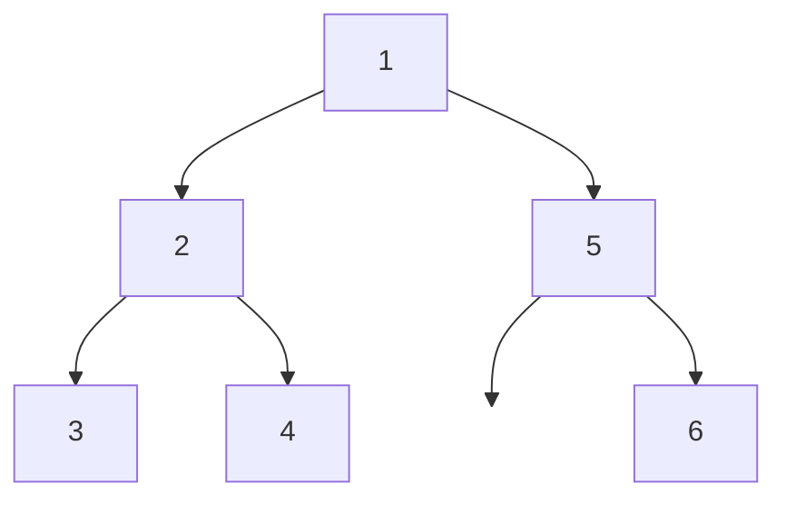
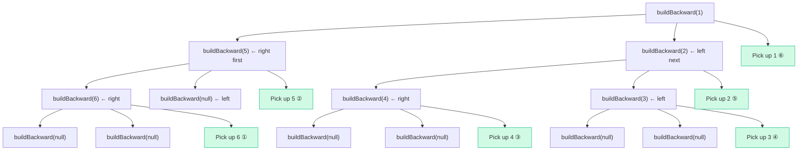

# 114. Flatten Binary Tree to Linked List - Mental Model

## The Backward Chain Building Analogy

Understanding this problem is like building a chain from the **last link to the first**. Instead of starting at the head and appending, you start at the tail and keep prepending — each new link you add becomes the new head of the chain.

**How the analogy maps to the problem:**
- A chain link → A tree node
- Adding a link to the front → Setting `node.right = lastLinked`
- Snipping a side attachment → Setting `node.left = null`
- The last link you added → The `prev` pointer
- Walking the workshop in reverse order → The DFS traversal (right → left → self)
- The finished chain → The flattened linked list

## Understanding the Analogy (No Code Yet!)

### The Setup

Imagine you work in a chain-link workshop. You have a set of links scattered across a workbench in a tree-shaped arrangement:

```
         [1]
        /   \
      [2]   [5]
     /   \     \
   [3]   [4]   [6]
```

Your job: thread these links into a single chain in **preorder** — meaning `1 → 2 → 3 → 4 → 5 → 6`.

Here's the catch: you can't just walk through the tree picking up links front-to-back and stringing them together. Instead, you're going to build the chain **from the tail backward**. You'll pick up link 6 first, then 5, then 4, 3, 2, and finally 1 — each time attaching the new link to the front of the chain you've already built.

### How It Works

You hold a pointer to the **last link you connected** — call it `lastLinked`. It starts as nothing (the chain doesn't exist yet).

You walk through the workshop in a very specific order: at every junction, you **go right first, then left, then pick up the link at the junction**. This seems odd, but it guarantees you encounter links in the **reverse** of preorder — exactly what you need to build the chain backward.

Here's the process for each link you reach:

1. **Connect it to the chain**: Set this link's right connector to point at `lastLinked` (the chain you've built so far).
2. **Snip the left connector**: This link shouldn't branch anymore — it only points forward.
3. **Update your pointer**: This link is now the new head of the chain, so `lastLinked = this link`.

That's it. Three operations per link, and the chain builds itself from back to front.

### Why Right-Then-Left-Then-Self?

This is the key insight that makes the whole approach work.

Preorder visits nodes in the order: **self → left → right**. That means in the final chain, the rightmost descendant appears last and the root appears first.

If you're building backward, you need to visit the **last node in preorder first** and the **first node in preorder last**. Reversing "self → left → right" gives you "right → left → self" — which is exactly the DFS order we use.

By going right first, you reach the deepest right nodes (which belong at the END of the chain). By going left next, you reach the left descendants (which go BEFORE the right ones). By processing yourself last, you place yourself BEFORE all your descendants — exactly where preorder says you belong.

### Why Building Backward Works

Think about what happens as you build:

- You pick up link **6**. There's no chain yet, so 6 points to nothing. Chain: `6 → null`
- You pick up link **5**. It connects to 6. Chain: `5 → 6`
- You pick up link **4**. It connects to 5. Chain: `4 → 5 → 6`
- You pick up link **3**. It connects to 4. Chain: `3 → 4 → 5 → 6`
- You pick up link **2**. It connects to 3. Chain: `2 → 3 → 4 → 5 → 6`
- You pick up link **1**. It connects to 2. Chain: `1 → 2 → 3 → 4 → 5 → 6`

Each time you add a link, it becomes the new front. The chain grows backward until it's complete. You never need to find the end of the chain or traverse it — you always know the head because it's just `lastLinked`.

### Simple Example Through the Analogy

Starting tree:

```
         [1]
        /   \
      [2]   [5]
     /   \     \
   [3]   [4]   [6]
```

Walk the workshop (right → left → self at each junction):

- Start at junction 1. Go right to junction 5.
  - At junction 5. Go right to link 6.
    - At link 6. No right, no left.
    - **Pick up 6.** Connect to nothing. Snip left. `lastLinked = 6`. Chain: `6`
  - Back at 5. No left branch.
  - **Pick up 5.** Connect to 6. Snip left. `lastLinked = 5`. Chain: `5 → 6`
- Back at 1. Go left to junction 2.
  - At junction 2. Go right to link 4.
    - At link 4. No right, no left.
    - **Pick up 4.** Connect to 5. Snip left. `lastLinked = 4`. Chain: `4 → 5 → 6`
  - Back at 2. Go left to link 3.
    - At link 3. No right, no left.
    - **Pick up 3.** Connect to 4. Snip left. `lastLinked = 3`. Chain: `3 → 4 → 5 → 6`
  - **Pick up 2.** Connect to 3. Snip left. `lastLinked = 2`. Chain: `2 → 3 → 4 → 5 → 6`
- **Pick up 1.** Connect to 2. Snip left. `lastLinked = 1`. Chain: `1 → 2 → 3 → 4 → 5 → 6`

The chain is complete. Every link points to the next via `.right`, and every `.left` is null.

Now you understand HOW to solve the problem. Let's translate this to code.

---

## Building the Algorithm Step-by-Step

Now we'll translate each part of our backward chain building into code.

### Step 1: The Last-Linked Pointer

**In our analogy:** We need a pointer to track the last link we connected to the chain. It starts as nothing.

**In code:**

```typescript
function flatten(root: TreeNode | null): void {
    let lastLinked: TreeNode | null = null;
}
```

**Why:** `lastLinked` is the head of the chain we've built so far. Before we start, there's no chain, so it's `null`.

### Step 2: Walk the Workshop (Right → Left → Self)

**In our analogy:** At each junction, go right first, then left, then pick up the current link. This is the recursive DFS pattern that visits nodes in reverse preorder.

**Adding to our code:**

```typescript
function flatten(root: TreeNode | null): void {
    let lastLinked: TreeNode | null = null;

    function buildBackward(link: TreeNode | null): void {
        if (!link) return;

        buildBackward(link.right);  // Go right first
        buildBackward(link.left);   // Then go left
        // Then pick up this link (process self)
    }

    buildBackward(root);
}
```

**Why:** Recursion naturally handles the branching workshop. By calling `right` before `left`, we ensure deeper right nodes are processed first — building the chain from the tail.

### Step 3: Pick Up the Link (Three Operations)

**In our analogy:** When you pick up a link, you (1) connect it to the chain, (2) snip its left connector, and (3) update `lastLinked`.

**The logic:**

```typescript
function buildBackward(link: TreeNode | null): void {
    if (!link) return;

    buildBackward(link.right);
    buildBackward(link.left);

    // Connect this link to the chain built so far
    link.right = lastLinked;
    // Snip the left connector
    link.left = null;
    // This link is now the head of the chain
    lastLinked = link;
}
```

**Why:** Three pointer operations that mirror the three physical actions:
- `link.right = lastLinked` — this link now points to the rest of the chain
- `link.left = null` — no branching allowed in a chain
- `lastLinked = link` — update our pointer to the new head

### Step 4: Complete Algorithm

**In our analogy:** The chain builder walks the entire workshop in reverse preorder, picking up and connecting links from the tail backward to the head.

**Complete algorithm:**

```typescript
function flatten(root: TreeNode | null): void {
    let lastLinked: TreeNode | null = null;

    function buildBackward(link: TreeNode | null): void {
        if (!link) return;

        buildBackward(link.right);   // right branch first
        buildBackward(link.left);    // left branch next

        link.right = lastLinked;     // connect to chain
        link.left = null;            // snip left
        lastLinked = link;           // new chain head
    }

    buildBackward(root);
}
```

---

## Tracing Through an Example

**Input:** `[1, 2, 5, 3, 4, null, 6]`



| Order Processed | Link Picked Up | lastLinked Before | Action | Chain After |
|:-:|:-:|:-:|:-:|:-:|
| 1st | 6 | null | 6.right = null, 6.left = null | `6` |
| 2nd | 5 | 6 | 5.right = 6, 5.left = null | `5 → 6` |
| 3rd | 4 | 5 | 4.right = 5, 4.left = null | `4 → 5 → 6` |
| 4th | 3 | 4 | 3.right = 4, 3.left = null | `3 → 4 → 5 → 6` |
| 5th | 2 | 3 | 2.right = 3, 2.left = null | `2 → 3 → 4 → 5 → 6` |
| 6th | 1 | 2 | 1.right = 2, 1.left = null | `1 → 2 → 3 → 4 → 5 → 6` |

**Result:** `1 → 2 → 3 → 4 → 5 → 6`

The DFS call stack (showing the right → left → self order):



Notice: the green "Pick up" nodes appear in the order 6, 5, 4, 3, 2, 1 — the exact **reverse** of preorder (1, 2, 3, 4, 5, 6). Building backward from this order produces the correct chain.

---

## Common Misconceptions

### "I need to collect nodes in preorder first, then rewire"

You might think you need to first traverse the tree, store nodes in an array in preorder, then loop through and set `.right` pointers. That works (O(n) space for the array), but the backward chain building eliminates the need for any extra storage. By visiting nodes in reverse preorder and maintaining a single `lastLinked` pointer, you build the chain in-place.

### "Why not just go self → left → right and build forward?"

If you process yourself before your children, you'd overwrite `.right` (your right child pointer) with `lastLinked` before you've recursed into the right subtree — you'd lose access to it. The backward approach avoids this entirely: by the time you process yourself, both subtrees have already been fully explored and chained.

### "Doesn't modifying `.right` during traversal break things?"

This is the beauty of going right-then-left-then-self. When you finally modify a node's `.right`, you've already finished recursing into both its right and left subtrees. Those subtrees are fully chained. You're not modifying anything you still need to visit — the modification is always safe because DFS has already returned from those branches.

---

## Try It Yourself

**Tree:**

```
        (4)
       /   \
     (2)    (7)
    /   \   /
  (1)  (3) (6)
```

1. What is the preorder of this tree?
2. In what order will the backward chain builder pick up the links? (reverse preorder)
3. Trace through: for each link picked up, what is `lastLinked` and what does the chain look like after?
4. Write the final chain.

**Expected answer:** `4 → 2 → 1 → 3 → 7 → 6`

**Processing order (reverse preorder):** 6, 7, 3, 1, 2, 4

| Step | Pick Up | lastLinked | Chain |
|:-:|:-:|:-:|:-:|
| 1 | 6 | null | `6` |
| 2 | 7 | 6 | `7 → 6` |
| 3 | 3 | 7 | `3 → 7 → 6` |
| 4 | 1 | 3 | `1 → 3 → 7 → 6` |
| 5 | 2 | 1 | `2 → 1 → 3 → 7 → 6` |
| 6 | 4 | 2 | `4 → 2 → 1 → 3 → 7 → 6` |
