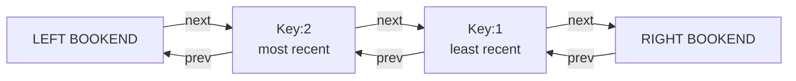
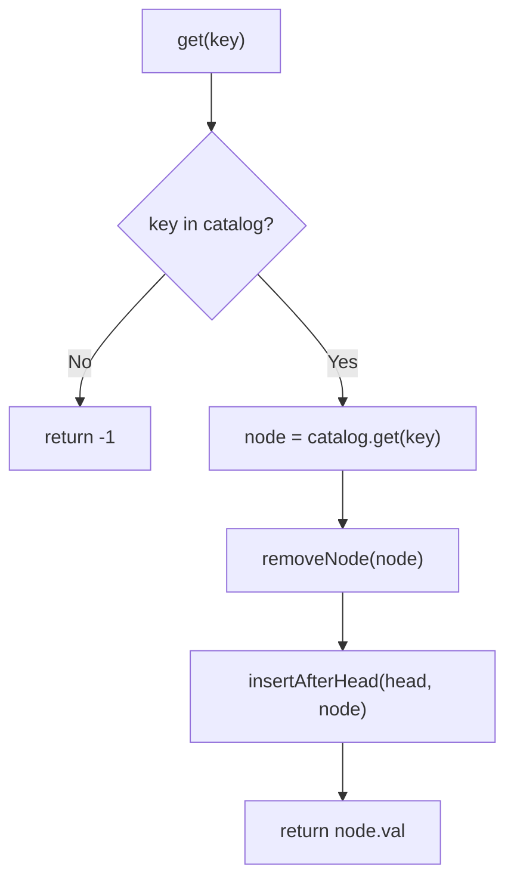
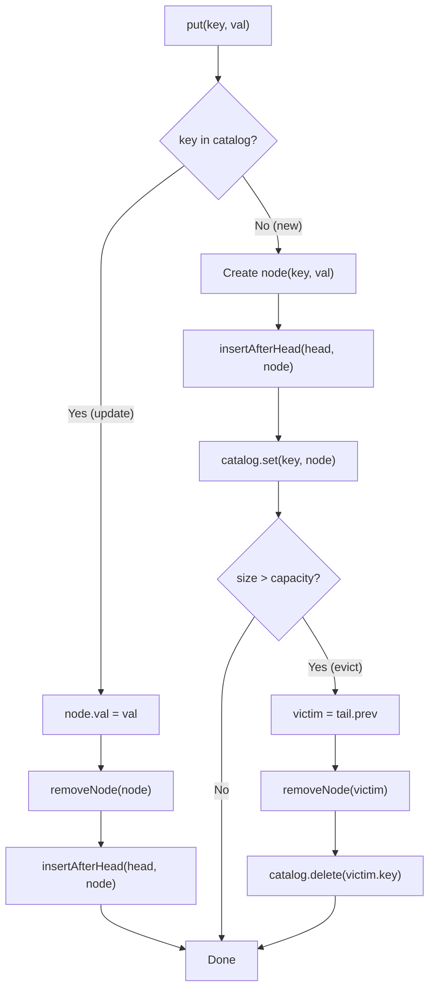

# LRU Cache - Mental Model

## The Hot Shelf Analogy

A library keeps a "hot shelf" near the checkout desk — a display rack with limited slots for the most recently touched books. Every time you check out a book or even just browse it, it gets moved to the front of the rack. When the rack is full and a new book arrives, the book that has sat at the back untouched the longest gets removed and returned to the stacks.

Next to the rack sits a card catalog — a fast lookup system that maps every title directly to the book's exact position on the hot shelf. Together, the rack and catalog give you both instant access (via catalog) and instant eviction (via the rack's back end).

---

## Understanding the Analogy (No Code Yet!)

### The Setup

The hot shelf has two permanently fixed **bookends**: a left bookend and a right bookend. Real books always live strictly between them. This trick eliminates every edge case — you never need to ask "am I at the edge?" because a bookend is always there to serve as a neighbor.

- **Left bookend** (dummy head): marks the front of the rack; the most-recently-used book always sits right next to it
- **Right bookend** (dummy tail): marks the back of the rack; the least-recently-used book always sits right next to it
- **Real books**: live between the bookends, ordered from most-recent (near left) to least-recent (near right)



Alongside the shelf, the card catalog (hashmap) maps each book's title (key) to its actual node object on the shelf — not just whether the book exists, but a direct pointer to the exact node.

### The Two Primitive Operations

Everything the cache does boils down to two shelf operations.

**Operation 1: Take a book off the shelf (`removeNode`)**

When you pull a book off the rack, its left neighbor's right-pointer and its right neighbor's left-pointer must skip over the gap. The neighbors "close ranks."

```
Before: [LEFT-NBR] ↔ [BOOK] ↔ [RIGHT-NBR]

Remove BOOK:
  LEFT-NBR.next = RIGHT-NBR
  RIGHT-NBR.prev = LEFT-NBR

After: [LEFT-NBR] ↔ [RIGHT-NBR]
```

This takes O(1) — no scanning — because every book already knows both its immediate neighbors.

**Operation 2: Place a book in the prime slot (`insertAfterHead`)**

The prime slot is immediately to the right of the left bookend. Placing a book there pushes everyone else one position toward the right bookend.

```
Before: [HEAD] ↔ [FIRST] ↔ ...

Insert BOOK after HEAD:
  BOOK.prev = HEAD
  BOOK.next = FIRST
  HEAD.next = BOOK
  FIRST.prev = BOOK

After: [HEAD] ↔ [BOOK] ↔ [FIRST] ↔ ...
```

Also O(1). Combined — remove then insert-after-head — is "move to front": the O(1) heart of the LRU cache.

### Why the Shelf Needs to be Doubly Linked

With only forward pointers (singly linked), removing a book from the middle would require walking from the head to find its predecessor — O(n). The backward pointer (`prev`) lets each book instantly reach its predecessor in O(1), making removal a constant-time snip. The whole cache is O(1) only because of those backward pointers.

### How get() Works

When someone requests a book by title (key):

1. Check the card catalog. If the title isn't listed → the book isn't in the cache, return -1
2. If found: get the node pointer from the catalog
3. Remove the node from its current shelf position
4. Insert it into the prime slot (right after the left bookend)
5. Return its value

After step 4 this book is the most recently used. Every other book slid one slot toward the right bookend.



### How put() Works

When a new key-value pair arrives:

**If the key already exists in the catalog** (updating a book already on the shelf):
1. Update the node's value in place
2. Remove it from its current shelf position
3. Insert it into the prime slot — it was just touched, so it is now most recent

**If the key is new** (a book not yet on the shelf):
1. Create a new node for this book
2. Insert it into the prime slot
3. Register it in the card catalog

After either branch:
4. If the shelf now holds more books than `capacity` → evict the least-recently-used book. The LRU book is always the one sitting just to the left of the right bookend (`tail.prev`). Remove it from the shelf and delete it from the catalog.



### Simple Example Through the Analogy

Let's trace `capacity=2` with operations: `put(1,1)`, `put(2,2)`, `get(1)`, `put(3,3)`, `get(2)`.

**Initial state:** Empty shelf with just the two bookends.
```
Shelf:   [HEAD] ↔ [TAIL]
Catalog: {}
```

**put(1,1):** Book #1 arrives. Create node, place at prime slot.
```
Shelf:   [HEAD] ↔ [1:val=1] ↔ [TAIL]
Catalog: {1 → node1}
```
Size=1 ≤ capacity=2. No eviction.

**put(2,2):** Book #2 arrives. Place at prime slot. Book #1 slides one step back.
```
Shelf:   [HEAD] ↔ [2:val=2] ↔ [1:val=1] ↔ [TAIL]
Catalog: {1 → node1, 2 → node2}
```
Size=2 ≤ capacity=2. No eviction.

**get(1):** Request book #1. Catalog says it's in the slot right before TAIL. Remove it, place at prime slot.
```
removeNode(node1): node2.next = TAIL, TAIL.prev = node2
insertAfterHead(node1): HEAD.next = node1, node1.next = node2

Shelf:   [HEAD] ↔ [1:val=1] ↔ [2:val=2] ↔ [TAIL]
Catalog: {1 → node1, 2 → node2}
Return: 1
```
Book #1 is now most recently used. Book #2 slid to the LRU position.

**put(3,3):** Book #3 arrives — new key. Place at prime slot, register in catalog.
```
Shelf:   [HEAD] ↔ [3:val=3] ↔ [1:val=1] ↔ [2:val=2] ↔ [TAIL]
Catalog: {1 → node1, 2 → node2, 3 → node3}
```
Size=3 > capacity=2 → evict! LRU is `tail.prev` = node2 (key=2).
```
removeNode(node2): node1.next = TAIL, TAIL.prev = node1
catalog.delete(2)

Shelf:   [HEAD] ↔ [3:val=3] ↔ [1:val=1] ↔ [TAIL]
Catalog: {1 → node1, 3 → node3}
```

**get(2):** Request book #2. Catalog... key 2 was evicted. Return -1.

Now you understand HOW to solve the problem. Let's translate this to code.

---

## How I Think Through This

The problem asks me to design a cache that holds at most `capacity` items and automatically evicts the least-recently-used item when full. The core insight is that two data structures work together: a hashmap called `catalog` that maps each key to its node (giving O(1) lookup), and a doubly linked list called the `shelf` where position encodes recency — the front is most recent, the back is least recent. To eliminate null-pointer edge cases, I plant two permanent sentinel nodes: `head` (left bookend) and `tail` (right bookend). Real items always live strictly between them. The whole system revolves around two primitive operations: `removeNode(node)`, which unlinks a node by rewiring `node.prev!.next` and `node.next!.prev`, and `insertAfterHead(node)`, which splices a node into the slot immediately after `head`. Every `get(key)` does: catalog lookup → if found, removeNode + insertAfterHead + return val. Every `put(key, val)` takes one of two paths — if the key exists, update val + promote to front; if key is new, create a node, insert at front, and register in catalog — then always checks if `catalog.size > capacity`, and if so removes `tail.prev` (the LRU) and deletes it from catalog. The invariant throughout: `head.next` is always the most-recently-used item and `tail.prev` is always the least-recently-used item.

Take `capacity=2` and the sequence `put(1,1)`, `put(2,2)`, `get(1)`, `put(3,3)`, `get(2)`. After `put(1,1)`: shelf is `HEAD↔[1:1]↔TAIL`, catalog holds `{1}`. After `put(2,2)`: node2 inserts after head, node1 shifts back — shelf is `HEAD↔[2:2]↔[1:1]↔TAIL`. On `get(1)`: catalog finds node1 at the tail-adjacent position. `removeNode(node1)` rewires node2's next to TAIL and TAIL's prev to node2; `insertAfterHead(node1)` rewires HEAD's next to node1 and node1's next to node2 — shelf becomes `HEAD↔[1:1]↔[2:2]↔TAIL`, returning 1. On `put(3,3)`: key 3 is new, so we insert node3 after head — the shelf temporarily holds 3 items. Since `catalog.size` (3) exceeds capacity (2), the victim is `tail.prev` = node2 (key=2). `removeNode(node2)` and `catalog.delete(2)` — final shelf: `HEAD↔[3:3]↔[1:1]↔TAIL`, catalog holds `{1, 3}`. `get(2)` finds nothing in catalog, returns -1.

---

## Building the Algorithm Step-by-Step

### Step 1: The Book Node

**In our analogy:** Each book on the shelf knows its key (title), its value (content), and has handles to both its immediate left and right neighbors.

**In code:**
```typescript
class ListNode {
  key: number;
  val: number;
  prev: ListNode | null = null;
  next: ListNode | null = null;
  constructor(key = 0, val = 0) {
    this.key = key;
    this.val = val;
  }
}
```

**Why we store `key` in the node:** When we evict the LRU node via `tail.prev`, we need to know which catalog entry to delete. Without `key` in the node, we'd have no way to clean up the catalog.

### Step 2: removeNode — Unlink from Shelf

**In our analogy:** Pull a book off the rack. Left neighbor closes in, right neighbor closes in.

**In code:**
```typescript
function removeNode(node: ListNode): void {
  node.prev!.next = node.next;
  node.next!.prev = node.prev;
}
```

**Why the non-null assertions are safe:** Because of the sentinel bookends, every real node always has a non-null `prev` and `next`. The sentinels are always there as neighbors — there's no "first" or "last" position without a neighbor.

### Step 3: insertAfterHead — Place in Prime Slot

**In our analogy:** Place a book in the slot right after the left bookend.

**Adding to our code:**
```typescript
function insertAfterHead(head: ListNode, node: ListNode): void {
  const first = head.next!;
  head.next = node;
  node.prev = head;
  node.next = first;
  first.prev = node;
}
```

**Why we save `first` before rewiring:** `head.next` gets overwritten in the third line. Saving it first ensures we can still connect `node.next` to the old front.

### Step 4: Constructor — Build the Empty Shelf + Catalog

**In our analogy:** Set up the shelf with just the two bookends connected, and create an empty card catalog.

**In code:**
```typescript
class LRUCache {
  private capacity: number;
  private catalog: Map<number, ListNode>;
  private head: ListNode;  // left bookend
  private tail: ListNode;  // right bookend

  constructor(capacity: number) {
    this.capacity = capacity;
    this.catalog = new Map();
    this.head = new ListNode();
    this.tail = new ListNode();
    this.head.next = this.tail;
    this.tail.prev = this.head;
  }
}
```

**Why link them immediately:** Every subsequent operation assumes `head.next` and `tail.prev` are non-null. Wiring the sentinels together at construction time makes this true from the first operation.

### Step 5: get — Lookup + Move to Front

**In our analogy:** Check the catalog. If found, remove from current shelf slot and move to prime slot. Return value.

**Adding to the class:**
```typescript
  get(key: number): number {
    if (!this.catalog.has(key)) return -1;
    const node = this.catalog.get(key)!;
    removeNode(node);
    insertAfterHead(this.head, node);
    return node.val;
  }
```

**Why move to front on every get:** Position on the shelf IS the recency record. If we don't move the node, its position will lie — it would still look like an old item even though it was just accessed.

### Step 6: put — Insert or Update + Evict If Needed

**In our analogy:** If the book exists, update it and move it to the prime slot. If new, place it at front. Then check if the shelf is overfull — if so, evict the node right before the right bookend.

**Complete algorithm:**
```typescript
  put(key: number, value: number): void {
    if (this.catalog.has(key)) {
      const node = this.catalog.get(key)!;
      node.val = value;
      removeNode(node);
      insertAfterHead(this.head, node);
    } else {
      const node = new ListNode(key, value);
      insertAfterHead(this.head, node);
      this.catalog.set(key, node);
      if (this.catalog.size > this.capacity) {
        const lru = this.tail.prev!;
        removeNode(lru);
        this.catalog.delete(lru.key);
      }
    }
  }
```

**Why evict AFTER inserting (not before):** We check `catalog.size > capacity` after inserting the new node. This way we always evict at most one node per `put`, and only when we've genuinely exceeded capacity.

---

## Tracing Through an Example

**Input:** `capacity=2`, operations: `put(1,1)`, `put(2,2)`, `get(1)`, `put(3,3)`, `get(2)`

| Step | Operation | Shelf (head→tail) | Catalog keys | Return |
|------|-----------|-------------------|--------------|--------|
| 1 | `put(1,1)` | HEAD ↔ [1:1] ↔ TAIL | {1} | — |
| 2 | `put(2,2)` | HEAD ↔ [2:2] ↔ [1:1] ↔ TAIL | {1,2} | — |
| 3 | `get(1)` | HEAD ↔ [1:1] ↔ [2:2] ↔ TAIL | {1,2} | **1** |
| 4 | `put(3,3)` | HEAD ↔ [3:3] ↔ [1:1] ↔ TAIL | {1,3} | — |
| 5 | `get(2)` | unchanged | {1,3} | **-1** |

At step 3, `get(1)` moved node1 from the LRU position to the front — making node2 the new LRU.
At step 4, `put(3,3)` inserts node3 at front, then evicts `tail.prev` which is now node2 (key=2).

---

## Common Misconceptions

### ❌ "A hashmap alone is enough for O(1) operations"

A hashmap gives O(1) lookup, but it can't answer "which key was least recently used?" in O(1). You'd have to scan all entries comparing timestamps — O(n). The doubly linked list makes the LRU always available at `tail.prev` in O(1).

### ❌ "I need to store access timestamps to track recency"

No! Position on the shelf IS the timestamp. Moving a node to the front on every access is the entire recency tracking mechanism. No clock or counter needed.

### ✅ "The sentinel bookends eliminate all null checks"

Because `head` and `tail` are always present, every real node always has non-null `prev` and `next`. The `removeNode` and `insertAfterHead` helpers can use non-null assertions safely — there is no "empty list" edge case to handle separately.

### ❌ "put() on an existing key should insert a new node"

No — it updates the existing node's value and moves it to front. Creating a new node would leave the old stale node on the shelf with no catalog reference pointing to it, leaking memory and corrupting the shelf order.

### ❌ "Evict before inserting to stay within capacity"

Evicting before inserting means you'd need to handle the case where the key being put already exists (no eviction needed). Inserting first and then checking `size > capacity` handles both cases naturally: updates never trigger eviction because the catalog size doesn't change, and new entries evict exactly when they push the size over capacity.
