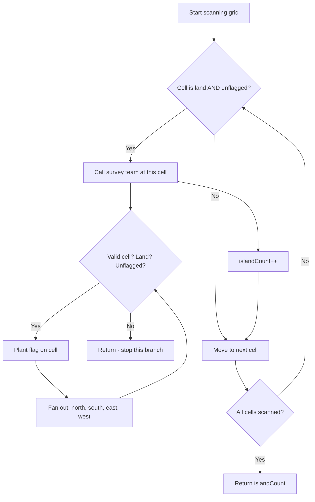
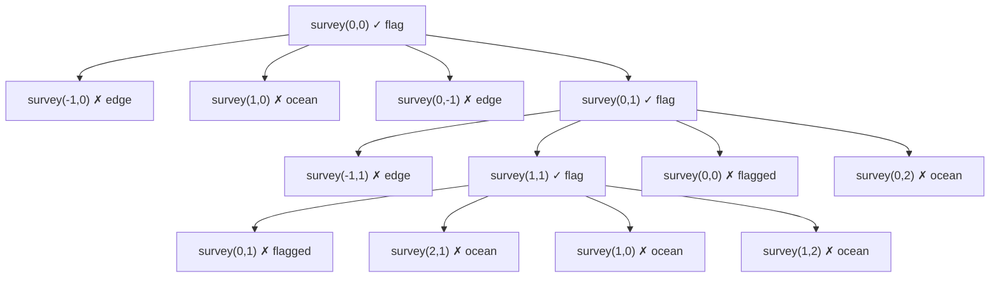

# 200. Number of Islands — Mental Model

> **Fundamentals Reference**: This problem is the canonical application of **Grid DFS / Island Counting** from [[graphs-fundamentals]]. Before reading this guide, make sure you've covered:
> - [[graphs-fundamentals#Level 2 DFS — Following One Path Until It Ends|Level 2: DFS]] — the visited set and flood fill logic
> - [[graphs-fundamentals#Level 3 BFS — Exploring Layer by Layer|Level 3: Grid DFS]] — adapting DFS to a 2D grid
> - [[graphs-fundamentals#Pattern 1 Island Counting Flood Fill Grid DFS|Pattern 1: Island Counting / Flood Fill]] — the exact template this problem uses
>
> This problem is the first in the practice path listed at the bottom of that guide.

---

## The Park Ranger Territory Survey Analogy

Understanding this problem is like a park ranger systematically surveying an uncharted coastal region — tile by tile — counting every separate landmass.

## Understanding the Analogy (No Code Yet!)

### The Setup

Imagine you're a park ranger with an aerial photograph of a coastal region. The photograph is divided into a grid of tiles — each tile is either **land** (`'1'`) or **ocean** (`'0'`). Your mission: count how many separate **islands** exist.

You have two tools:
- A **scanning eye**: you examine the photo systematically, row by row, left to right
- A **survey team**: when you spot uncharted land, you radio them to map the entire connected island from that position, planting an **orange flag** on every tile they visit

The orange flags are the whole mechanism. Once a tile is flagged, no future scan will trigger another survey on it. The first team to reach a tile claims it permanently.

### The Survey Process

The critical insight is what happens when your survey team receives a radio call. They don't just record a single tile. They **fan out in all four cardinal directions** — north, south, east, west — planting flags and continuing onto any connected land tile they can reach. They stop only when they hit ocean or the photograph's edge.

This means one radio call maps the **entire island** in one go. By the time the survey finishes, every tile in that connected landmass has a flag.

Back at your desk, you continue scanning. When you see a land tile with a flag, you skip it — it was already claimed by an earlier survey. When you see a land tile *without* a flag, you know you've found a brand-new island that no previous survey could have reached. Radio the team. Count goes up by one.

### Why This Works

Two land tiles belong to the same island if and only if you can walk between them stepping only on land tiles. The survey team's spreading behavior (DFS flood fill) guarantees exactly this: starting from any tile, they claim everything reachable by land.

The scan's outer loop handles the harder problem: *multiple separate islands*. Your scanning eye keeps moving after each survey finishes. If another unflagged land tile turns up, it *must* be a new island — because if it were connected to any already-surveyed island, that survey team would have already walked to it and planted a flag.

**The two pieces work as a pair: the scan finds new islands, the survey maps them completely.**

### The Key Rule — Plant the Flag Before You Move

The survey team has one non-negotiable rule: plant the flag on a tile **before** calling out to neighbors, not after. Here's why it matters.

Suppose your team is at tile A, which connects to B, and B also connects back to A (a cycle). If they move to B first and only flag A when they return, a surveyor at B will look north, see A is unflagged, and call out another surveyor to A. That surveyor calls another to B. You've just created an infinite loop.

Plant the flag the moment you step on the tile. Anyone who looks back will see "already claimed" and stop.

### Simple Example Through the Analogy

Aerial photo (4×4):

```
1 1 0 0
1 0 0 1
0 0 0 1
0 0 0 0
```

**Scanning begins at (row 0, col 0):**
- (0,0): Land, no flag. Radio the survey team.
- Team at (0,0): plant flag. Check north → edge. Check south → (1,0) is land, go.
- Team at (1,0): plant flag. Check south → (2,0) ocean, stop. Check east → (1,1) ocean, stop. Check west → edge. Check north → (0,0) flagged, stop.
- Back at (0,0). Check east → (0,1) is land, go.
- Team at (0,1): plant flag. All neighbors: (0,0) flagged, (0,2) ocean, (1,1) ocean, edge.
- Survey complete. **Island #1 counted.** Flagged tiles: (0,0), (1,0), (0,1).

**Continue scanning:**
- (0,1): flagged, skip. (0,2): ocean, skip. (0,3): ocean, skip.
- (1,0): flagged, skip. (1,1): ocean, skip. (1,2): ocean, skip.
- (1,3): Land, **no flag**. Radio the survey team.
- Team at (1,3): plant flag. Check south → (2,3) land, go.
- Team at (2,3): plant flag. All neighbors are ocean or edge.
- Survey complete. **Island #2 counted.** Flagged tiles: (1,3), (2,3).

**Continue scanning:** everything remaining is ocean or flagged.

**Final count: 2 islands.**

---

Now you understand HOW to solve the problem. Let's translate this to code.

---

## How I Think Through This

The problem asks: how many disconnected landmasses exist in this grid? The approach uses two nested loops acting as the scanning eye, and a recursive DFS function acting as the survey team. I set up a `flagged` boolean grid the same dimensions as the input — all `false` at the start. As I scan row by row, the moment I find a `'1'` tile that isn't flagged, I trigger the DFS from that cell and then increment `islandCount`. The DFS fans out recursively in four directions, and its first action on any cell is to set `flagged[row][col] = true` — before recursing. This ensures no cell gets processed twice and no cycle causes infinite recursion. Each of the four recursive calls immediately returns if it hits a boundary, hits ocean, or hits an already-flagged tile. The outer scan keeps going after each DFS; the next unflagged `'1'` it finds must be a completely separate island.

Take the 3×3 grid `[["1","1","0"],["0","1","0"],["0","0","0"]]`. The scan hits (0,0): unflagged land. DFS at (0,0) flags it, recurses north → out of bounds, south → (1,0) is `'0'` stop, west → out of bounds, east → (0,1) land. DFS at (0,1) flags it, recurses north → out of bounds, south → (1,1) land. DFS at (1,1) flags it, recurses and finds all neighbors are ocean, out of bounds, or flagged. Unwinding completes. Survey done. `islandCount` is now 1. The scan resumes: (0,1) flagged, (0,2) ocean, (1,0) ocean, (1,1) flagged, everything else ocean. No more unflagged land. Return 1.

---

## Building the Algorithm Step-by-Step

### Step 1: The Aerial Photo and Flag System

**In our analogy:** The grid is given. We need orange flags — a visited tracker the same size as the grid.

**In code:**
```typescript
function numIslands(grid: string[][]): number {
    const rows = grid.length;
    const cols = grid[0].length;
    const flagged = Array.from({ length: rows }, () => new Array(cols).fill(false));
```

**Why:** `flagged[r][c] = true` is our flag at tile (r, c). Initialized all `false` — every tile starts unclaimed.

### Step 2: The Scanning Pattern

**In our analogy:** Scan row by row. Each unflagged land tile triggers a survey and increments the island count.

**Adding to our code:**
```typescript
    let islandCount = 0;

    for (let r = 0; r < rows; r++) {
        for (let c = 0; c < cols; c++) {
            if (grid[r][c] === '1' && !flagged[r][c]) {
                survey(r, c);
                islandCount++;
            }
        }
    }

    return islandCount;
}
```

**Why:** `grid[r][c] === '1'` finds land. `!flagged[r][c]` confirms it's a new island. The survey call happens before the count increments — the team maps the whole island, *then* we count it.

### Step 3: The Survey Team (Grid DFS)

**In our analogy:** The team plants a flag on arrival, then sends surveyors in all four directions. Each surveyor follows the same three stopping rules.

**The survey function:**
```typescript
    function survey(row: number, col: number): void {
        // Stopping rule 1: edge of the photograph
        if (row < 0 || row >= rows || col < 0 || col >= cols) return;
        // Stopping rule 2: ocean tile
        if (grid[row][col] === '0') return;
        // Stopping rule 3: already claimed
        if (flagged[row][col]) return;

        // Plant the flag BEFORE fanning out
        flagged[row][col] = true;

        survey(row - 1, col);  // north
        survey(row + 1, col);  // south
        survey(row, col - 1);  // west
        survey(row, col + 1);  // east
    }
```

**Why:** The three guards at the top are the stopping rules. `flagged[row][col] = true` must come before the four recursive calls — this is the "plant before moving" rule that prevents cycles.

### Step 4: Complete Solution

**In our analogy:** Scan finds islands, survey maps them completely.

```typescript
function numIslands(grid: string[][]): number {
    const rows = grid.length;
    const cols = grid[0].length;
    const flagged = Array.from({ length: rows }, () => new Array(cols).fill(false));

    function survey(row: number, col: number): void {
        if (row < 0 || row >= rows || col < 0 || col >= cols) return;
        if (grid[row][col] === '0') return;
        if (flagged[row][col]) return;

        flagged[row][col] = true;

        survey(row - 1, col);
        survey(row + 1, col);
        survey(row, col - 1);
        survey(row, col + 1);
    }

    let islandCount = 0;

    for (let r = 0; r < rows; r++) {
        for (let c = 0; c < cols; c++) {
            if (grid[r][c] === '1' && !flagged[r][c]) {
                survey(r, c);
                islandCount++;
            }
        }
    }

    return islandCount;
};
```

---

## Tracing Through an Example

**Input:**
```
1 1 0
0 1 0
0 0 0
```

| Step | Cell | Action | flagged tiles | islandCount |
|------|------|---------|---------------|-------------|
| Scan (0,0) | `'1'`, unflagged | Trigger survey | — | — |
| Survey fans out | (0,0)→(0,1)→(1,1) | Plant flags at each | (0,0),(0,1),(1,1) | — |
| Survey returns | — | All neighbors are ocean/edge/flagged | — | — |
| Count | — | islandCount++ | — | **1** |
| Scan (0,1) | flagged | Skip | — | 1 |
| Scan (0,2) | `'0'` | Skip | — | 1 |
| Scan (1,0) | `'0'` | Skip | — | 1 |
| Scan (1,1) | flagged | Skip | — | 1 |
| All others | `'0'` | Skip | — | 1 |
| **Return** | | | | **1** |

---

## Algorithm Decision Flow



---

## Survey Team DFS Expansion (Example)

Starting survey at (0,0) on the grid above:



Each `✓` node plants a flag and recurses. Each `✗` node returns immediately — these are the stopping rules. The entire connected landmass gets flagged in one call.

---

## Common Misconceptions

### ❌ "I should mark a tile visited after I finish exploring from it"

Wrong. If you wait, a cycle can bring you back to an unfinished tile before it's marked. You'll recurse into it again, creating an infinite loop.

In ranger terms: the team marks a tile *as they step on it*, not after they've finished surveying from it. Anyone who looks back at an already-stepped-on tile sees the flag and turns around.

**The rule:** `flagged[row][col] = true` comes *before* the four recursive calls — always.

### ❌ "The outer loop double-counts tiles already flagged by a previous survey"

No. The outer loop's guard is `!flagged[r][c]`. A flagged tile triggers no survey and increments no counter. The outer loop only reacts to unflagged land.

In ranger terms: you're scanning a photo, not walking the terrain. You see a flagged tile? Skip it. You only radio the team when you spot *unclaimed* land.

### ❌ "I need to unflag tiles after the survey (backtracking)"

No. Unlike some backtracking problems, here you want the flags to *persist*. The whole point is that other parts of the outer scan should see those flags and skip them. If you un-plant the flags, every scan cell would re-trigger the survey on already-counted islands.

---

## Try It Yourself

**Input:**
```
1 0 1 1
0 0 0 1
1 0 0 0
1 1 0 1
```

Walk through it as a park ranger:
1. What's the first unflagged land tile you encounter?
2. Where does the survey team fan out to from there?
3. After the first survey completes, what's the next unflagged land tile?
4. How many total radio calls do you make?

<details>
<summary>Answer</summary>

- First unflagged land: (0,0). Survey fans to... only (0,0) itself (all neighbors are ocean or edge). Island #1.
- (0,2) next unflagged land. Survey: (0,2) → (0,3) → (1,3). Island #2.
- (2,0) next unflagged land. Survey: (2,0) → (3,0) → (3,1). Island #3.
- (3,3) next unflagged land. Survey: just (3,3). Island #4.
- **Total: 4 islands.**

</details>

---

## Complexity

- **Time:** O(rows × cols) — each cell is visited at most once by the survey team (the flag prevents re-entry)
- **Space:** O(rows × cols) — the `flagged` array + recursion stack depth in the worst case (one giant snake island)

---

## Connection to Fundamentals

This problem is a direct application of everything in [[graphs-fundamentals]]:

| Concept in fundamentals | How it appears here |
|---|---|
| [[graphs-fundamentals#Level 2 DFS — Following One Path Until It Ends\|Level 2: DFS visited set]] | `flagged` array — prevents cycles and re-visits |
| [[graphs-fundamentals#Level 2 DFS — Following One Path Until It Ends\|Level 2: Mark before recursing]] | `flagged[row][col] = true` before the four recursive calls |
| [[graphs-fundamentals#Level 2 DFS — Following One Path Until It Ends\|Level 2: Disconnected graph outer loop]] | The `for r / for c` scan — each unflagged land is a new component |
| [[graphs-fundamentals#Level 3 BFS — Exploring Layer by Layer\|Level 3: Grid DFS]] | Grid cells as nodes, 4-directional neighbors, bounds check in guard |
| [[graphs-fundamentals#Pattern 1 Island Counting Flood Fill Grid DFS\|Pattern 1: Island counting template]] | This *is* that template — the flood fill pattern in its purest form |

The `survey` function here is identical to the `gridDFS` function in the fundamentals. The outer scan loop is the "outer loop for disconnected graphs" from Level 2. If the two-phase structure (scan + DFS) felt abstract in the fundamentals, this problem is where it becomes concrete.
