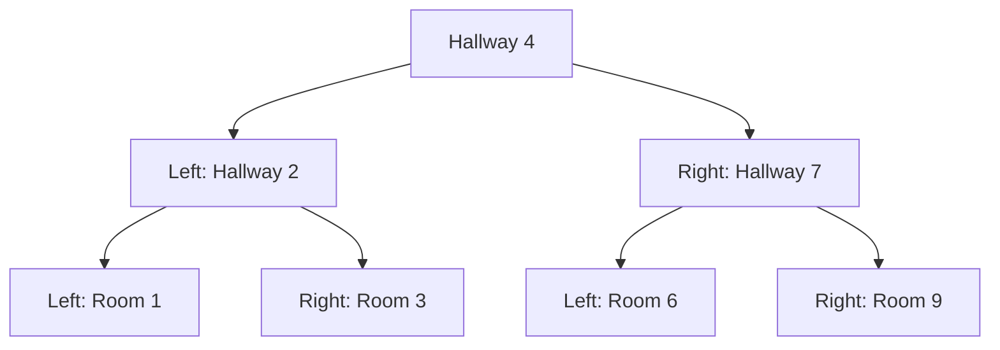
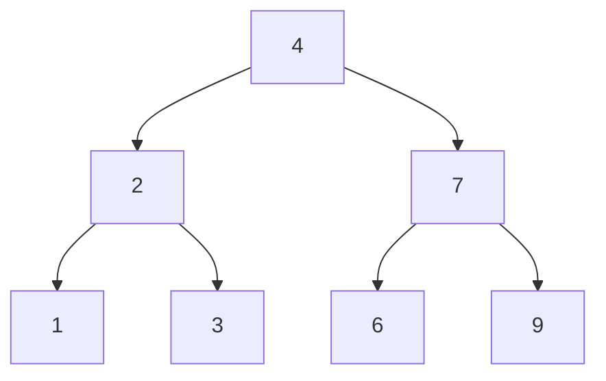
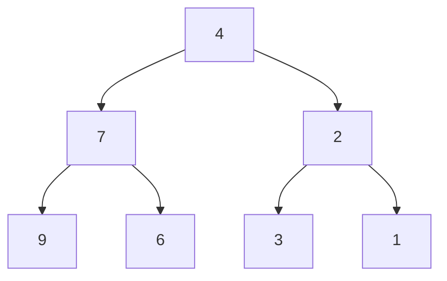

# Invert Binary Tree - Mental Model

## The Mirror Hallway Analogy

Understanding this problem is like placing a mirror at the end of a hallway and seeing how every room swaps sides.

**How the analogy maps to the problem:**
- A hallway → A node in the tree
- The left room off a hallway → The left child
- The right room off a hallway → The right child
- Placing a mirror → Swapping children at that node
- A hallway leading to more hallways → Subtrees with deeper levels

---

## Understanding the Analogy (No Code Yet!)

### The Setup

Imagine you're the caretaker of a grand mansion. The mansion is built symmetrically: from every hallway, there's a room on the left and a room on the right. Some hallways lead to more hallways deeper inside the mansion, and some rooms are dead ends (empty walls).

Your task: **place a mirror at the end of every single hallway** so that when anyone looks down any hallway, left and right are swapped. The left room appears on the right, and the right room appears on the left.

Here's the mansion layout before mirroring:



### How It Works

You start at the entrance of the mansion — the very first hallway. You look down this hallway and see two doors: one on the left, one on the right. You place a mirror, and now the left door appears on the right, and the right door appears on the left. That hallway is done.

But wait — those doors lead to more hallways! So you walk through the (now-swapped) left door and find yourself in another hallway with its own left and right rooms. You place a mirror there too. Then you go back and do the same for the right door.

The key insight is this: **you don't need to think about the entire mansion at once.** At each hallway, all you do is one simple thing — swap the left and right doors. Then you trust that the same process will handle every hallway deeper inside. By the time you've visited every hallway and placed a mirror in each one, the entire mansion is mirrored.

This is recursion in its purest form. Each hallway's job is tiny: just swap your two doors, then ask each sub-hallway to do the same. The deepest hallways (the ones with only dead-end rooms or empty walls) have nothing to swap, so they're done instantly.

### Why This Approach Works

The reason this works is that inverting a tree is a **self-similar** problem. Inverting a big tree means: swap the two children of the root, then invert the left subtree and invert the right subtree. Each subtree is itself a smaller tree, so the same logic applies. Eventually you reach nodes with no children (dead-end walls), and there's nothing to swap — that's your base case.

You don't need to track depth, count nodes, or remember where you've been. Each hallway handles itself, and the recursion naturally covers every level.

### Simple Example Through the Analogy

Let's walk through mirroring this small mansion:

```
Mansion before:
        Hallway 4
       /         \
   Hallway 2   Hallway 7
   /     \       /     \
Room 1  Room 3  Room 6  Room 9
```

**Step 1:** You arrive at Hallway 4. You swap the left and right doors.
- Left door (was Hallway 2) moves to the right
- Right door (was Hallway 7) moves to the left

```
        Hallway 4
       /         \
   Hallway 7   Hallway 2
   /     \       /     \
Room 6  Room 9  Room 1  Room 3
```

**Step 2:** You walk into the left door (now Hallway 7). You swap its doors.
- Left door (was Room 6) moves to the right
- Right door (was Room 9) moves to the left

```
        Hallway 4
       /         \
   Hallway 7   Hallway 2
   /     \       /     \
Room 9  Room 6  Room 1  Room 3
```

**Step 3:** Room 9 and Room 6 are dead ends (no more doors). Nothing to do. You go back to Hallway 4 and walk into the right door (now Hallway 2). You swap its doors.
- Left door (was Room 1) moves to the right
- Right door (was Room 3) moves to the left

```
        Hallway 4
       /         \
   Hallway 7   Hallway 2
   /     \       /     \
Room 9  Room 6  Room 3  Room 1
```

**Step 4:** Room 3 and Room 1 are dead ends. Done!

The entire mansion is now mirrored. Every single hallway had its left and right swapped.

Now you understand HOW to solve the problem. Let's translate this to code.

---

## Building the Algorithm Step-by-Step

Now we'll translate each part of our mental model into code.

### Step 1: Reaching a Dead End

**In our analogy:** When you walk through a door and find an empty wall (no hallway), there's nothing to do. You just turn around.

**In code:**
```typescript
function invertTree(root: TreeNode | null): TreeNode | null {
    if (root === null) return null;  // Dead end — empty wall
}
```

**Why:** A `null` node means there's no hallway here. Nothing to swap, so we return `null`.

### Step 2: Swapping the Doors

**In our analogy:** At each hallway, you swap the left and right doors. This is the ONE thing each hallway does for itself.

**Adding to our code:**
```typescript
function invertTree(root: TreeNode | null): TreeNode | null {
    if (root === null) return null;

    // Swap the left and right doors
    const leftDoor = root.left;
    root.left = root.right;
    root.right = leftDoor;
}
```

**Why:** We save a reference to the left child, move right to left, then put the old left on the right. Classic swap.

### Step 3: Mirror the Sub-Hallways

**In our analogy:** After swapping your doors, you walk into each sub-hallway and ask them to mirror themselves too. You trust the same process handles everything deeper.

**Adding to our code:**
```typescript
function invertTree(root: TreeNode | null): TreeNode | null {
    if (root === null) return null;

    const leftDoor = root.left;
    root.left = root.right;
    root.right = leftDoor;

    // Walk into each sub-hallway and mirror it
    invertTree(root.left);
    invertTree(root.right);
}
```

**Why:** Each recursive call handles an entire sub-mansion. We don't need to think about what's deeper — that's recursion's job.

### Step 4: Return the Mirrored Mansion

**In our analogy:** When someone asks you "what does the mirrored mansion look like?", you hand them the entrance — the same entrance, now leading to a fully mirrored interior.

**Complete algorithm:**
```typescript
function invertTree(root: TreeNode | null): TreeNode | null {
    if (root === null) return null;

    const leftDoor = root.left;
    root.left = root.right;
    root.right = leftDoor;

    invertTree(root.left);
    invertTree(root.right);

    return root;  // Same entrance, mirrored mansion
}
```

---

## Tracing Through an Example

**Input:** `[4, 2, 7, 1, 3, 6, 9]`



| Step | Hallway | Action | Left After | Right After |
|------|---------|--------|------------|-------------|
| 1 | 4 | Swap doors | 7 | 2 |
| 2 | 7 (now left of 4) | Swap doors | 9 | 6 |
| 3 | 9 (left of 7) | Dead ends below, done | — | — |
| 4 | 6 (right of 7) | Dead ends below, done | — | — |
| 5 | 2 (now right of 4) | Swap doors | 3 | 1 |
| 6 | 3 (left of 2) | Dead ends below, done | — | — |
| 7 | 1 (right of 2) | Dead ends below, done | — | — |

**Result:**



**Output:** `[4, 7, 2, 9, 6, 3, 1]`

---

## Common Misconceptions

### "Do I need to swap at every level, or just the root?"

You swap at **every** hallway, not just the entrance. If you only swapped at the root, Hallway 7 and Hallway 2 would trade places, but Room 6 would still be to the left of Hallway 7 and Room 9 to the right. The mansion wouldn't be truly mirrored — only the first floor would look different.

### "Does the order of swap vs recurse matter?"

It doesn't matter whether you swap first then recurse, or recurse first then swap. Either way, every hallway gets its doors swapped exactly once. The mansion ends up the same. Swapping first (as we did) is slightly more intuitive — you fix your hallway, then send workers into the sub-hallways.

### "Doesn't swapping mess up the recursive calls?"

After swapping, `root.left` is what *used to be* `root.right`, and vice versa. That's fine! We're calling `invertTree` on both children regardless. Each child subtree still gets fully inverted no matter which side it's now on.

---

## Try It Yourself

**Mansion layout:**

```
        2
       / \
      1    3
```

1. You arrive at Hallway 2. What do you do?
2. What does the mansion look like after that?
3. You walk into the left sub-hallway. What do you find?
4. What's the final output?

<details>
<summary>Answer</summary>

1. Swap the doors: left (1) goes right, right (3) goes left
2. `2 -> left: 3, right: 1`
3. Room 3 has no sub-doors (both children are null). Dead end. Same for Room 1.
4. Output: `[2, 3, 1]`

</details>
