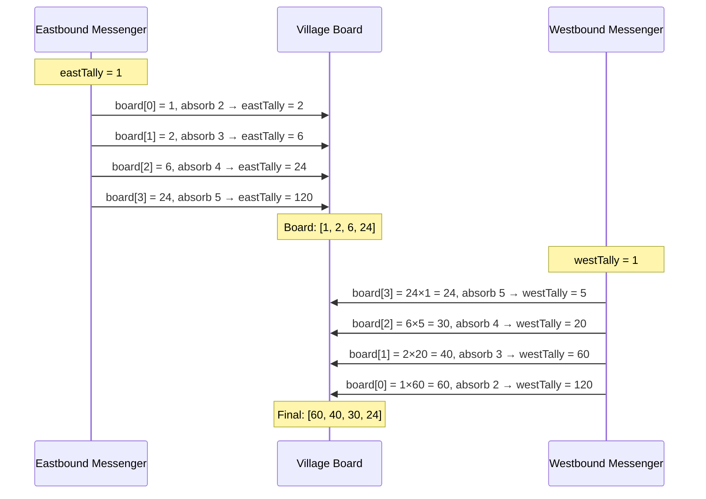

# Product of Array Except Self - Mental Model

## The Two Messengers Analogy

Understanding this problem is like two messengers traveling through a row of villages, each collecting harvest tallies as they go — and leaving just the right record at every stop.

---

## Understanding the Analogy (No Code Yet!)

### The Setup

Imagine a row of villages along a single road. Each village has a harvest number posted on a sign. Every village needs to know the **combined product of every other village's harvest** — but NOT its own. No village can see any other village's sign directly.

The village elders send out **two messengers**:
- An **eastbound messenger** who starts at the western edge and walks east (left to right)
- A **westbound messenger** who starts at the eastern edge and walks west (right to left)

Each messenger carries a **running tally** — a product of all the harvests they've absorbed so far. Both messengers start with a tally of **1** (they haven't seen any harvests yet).

### How It Works

Every messenger follows the same rule at each village they visit:

1. **First**, write your current tally on the village's board
2. **Then**, absorb this village's harvest into your tally
3. Continue walking to the next village

The order matters enormously. By writing their tally **before** absorbing the current harvest, the messenger ensures that what they write on the board never includes the current village. It only captures everything they passed through on the way here.

The **eastbound messenger** walks left to right. When they arrive at a village, their tally holds the product of everything to the **left** — all the harvests they absorbed before this stop. They write that down, absorb the current harvest, and continue east.

The **westbound messenger** then walks right to left. At each village, their tally holds the product of everything to the **right**. They don't need a separate slot — they just multiply their right-side tally directly into what the eastbound messenger already wrote. Then they absorb this village's harvest and continue west.

After both messengers have passed through, every village's board reads:

> eastbound tally × westbound tally = (product of everything to my left) × (product of everything to my right) = **product of everything except me**

### Why This Approach Works

Think about what each village is missing from the total product — just one thing: itself. That means everything it needs is split into two natural groups: **everything before me** and **everything after me**. The eastbound messenger perfectly accumulates the first group, the westbound messenger accumulates the second. Neither messenger ever includes the current village in the tally they hand off, because they write before they absorb.

This is also why we never need division. Instead of computing the full product and dividing out each element (which breaks when any harvest is 0), we simply never include that element in the first place.

---

## How I Think Through This

Each position's answer is the product of every element except itself. I think of that as two halves — everything to my left, and everything to my right — because together those two groups cover every element except the one sitting at the current position, so multiplying them gives the answer. To collect both halves I make two passes. First I walk left to right keeping a `leftProduct` that starts at 1. At each position I write `leftProduct` into the output array, then multiply the current element into it before moving on. Writing before updating is the key — each slot ends up holding the compressed product of everything before it, never including itself. Then I walk right to left with a `rightTally` that also starts at 1. At each position I multiply `rightTally` into the output slot — the slot already holds the left product, so now it holds both halves combined. Then I multiply the current element into `rightTally` before stepping left, so the next position's right product includes this one.

Take `[1, 2, 3, 4]`. Left pass, `leftProduct` starts at 1: position 0 writes 1, `leftProduct` becomes 1. Position 1 writes 1, `leftProduct` becomes 2. Position 2 writes 2, `leftProduct` becomes 6. Position 3 writes 6. Output is now `[1, 1, 2, 6]` — each slot is the product of everything to its left. Right pass, `rightTally` starts at 1: position 3 has 6, multiply in 1 → 6, then `rightTally` becomes 4. Position 2 has 2, multiply in 4 → 8, then `rightTally` becomes 12. Position 1 has 1, multiply in 12 → 12, then `rightTally` becomes 24. Position 0 has 1, multiply in 24 → 24. Final output: `[24, 12, 8, 6]`.

---

### Simple Example Through the Analogy

Villages with harvests: `[1, 2, 3, 4]`

**Eastbound messenger (left → right), starting tally = 1:**

| Village               | Arrives with tally | Writes on board | Absorbs harvest | Leaves with tally |
|-----------------------|--------------------|-----------------|-----------------|-------------------|
| Village 0 (harvest 1) | 1                  | **1**           | 1 × 1           | 1                 |
| Village 1 (harvest 2) | 1                  | **1**           | 1 × 2           | 2                 |
| Village 2 (harvest 3) | 2                  | **2**           | 2 × 3           | 6                 |
| Village 3 (harvest 4) | 6                  | **6**           | 6 × 4           | 24                |

Board after eastbound: `[1, 1, 2, 6]`

Each village's board now holds: "the product of every village to my left."

**Westbound messenger (right → left), starting tally = 1:**

| Village               | Arrives with tally | Reads board | Board × tally = final | Absorbs harvest | Leaves with tally |
|-----------------------|--------------------|-------------|-----------------------|-----------------|-------------------|
| Village 3 (harvest 4) | 1                  | 6           | 6 × 1 = **6**         | 1 × 4           | 4                 |
| Village 2 (harvest 3) | 4                  | 2           | 2 × 4 = **8**         | 4 × 3           | 12                |
| Village 1 (harvest 2) | 12                 | 1           | 1 × 12 = **12**       | 12 × 2          | 24                |
| Village 0 (harvest 1) | 24                 | 1           | 1 × 24 = **24**       | 24 × 1          | 24                |

Final board: `[24, 12, 8, 6]`

Verify: `[2×3×4, 1×3×4, 1×2×4, 1×2×3]` = `[24, 12, 8, 6]`. Correct!

Now you understand HOW to solve the problem. Let's translate this to code.

---

## Building the Algorithm Step-by-Step

### Step 1: Set Up the Village Board

**In our analogy:** We need a board at each village to record tallies from both messengers.

**In code:**
```typescript
function productExceptSelf(nums: number[]): number[] {
  const board = new Array(nums.length);
}
```

**Why:** One array to hold both messengers' contributions. We'll use the same slots for both passes.

### Step 2: Eastbound Messenger — Left to Right

**In our analogy:** The eastbound messenger walks left to right. At each village, they write their current tally first, then absorb the harvest.

**Adding to our code:**
```typescript
function productExceptSelf(nums: number[]): number[] {
  const board = new Array(nums.length);

  let eastTally = 1;
  for (let i = 0; i < nums.length; i++) {
    board[i] = eastTally;     // Write BEFORE absorbing — excludes current village
    eastTally *= nums[i];     // Absorb this village's harvest, then move on
  }
}
```

**Why:** After this loop, `board[i]` holds the product of everything to the left of `i`. Village 0 receives `1` (nothing to its left), which is correct.

### Step 3: Westbound Messenger — Right to Left

**In our analogy:** The westbound messenger walks right to left. At each village, they multiply their right-side tally into the existing board value, then absorb the harvest.

**Complete algorithm:**
```typescript
function productExceptSelf(nums: number[]): number[] {
  const board = new Array(nums.length);

  let eastTally = 1;
  for (let i = 0; i < nums.length; i++) {
    board[i] = eastTally;
    eastTally *= nums[i];
  }

  let westTally = 1;
  for (let i = nums.length - 1; i >= 0; i--) {
    board[i] *= westTally;    // Combine: left product × right product
    westTally *= nums[i];     // Absorb this village's harvest, then move on
  }

  return board;
}
```

**Why:** The westbound messenger multiplies their right-side tally with the left-side tally already on the board. Together they produce the product of everything except the current village.

---

## Tracing Through an Example

**Input:** `[2, 3, 4, 5]`



Verify: `[3×4×5, 2×4×5, 2×3×5, 2×3×4]` = `[60, 40, 30, 24]`. Correct!

---

## Common Misconceptions

### ❌ "The messenger absorbs the harvest before writing on the board"

If the messenger absorbs first, the tally they write includes the current village — which breaks everything. The rule is always: write first, absorb after.

```typescript
// WRONG: current village contaminates the board
eastTally *= nums[i];
board[i] = eastTally;

// CORRECT: write the clean tally first, then absorb
board[i] = eastTally;
eastTally *= nums[i];
```

### ❌ "The westbound messenger should replace the board value, not multiply into it"

The board already holds the eastbound tally (left product). The westbound messenger's job is to **combine** the right product with it — not overwrite it.

```typescript
// WRONG: throws away the eastbound messenger's work
board[i] = westTally;

// CORRECT: combines both messengers' contributions
board[i] *= westTally;
```

### ✅ "Starting both tallies at 1 is correct"

Before either messenger has seen any village, the product of "nothing" is 1 — the multiplicative identity. Starting at 0 would zero out every tally permanently.

---

## Complexity

- **Time: O(n)** — Two passes through the array, each visiting every village once
- **Space: O(1)** — Only two tally variables beyond the output array (the output array itself doesn't count as extra space per the problem's definition)

---

## Try It Yourself

**Villages:** `[1, 0, 3, 2]`

1. Walk the eastbound messenger. What does each village's board show after the first pass?
2. Walk the westbound messenger. What's the final board?
3. Why doesn't the zero cause a problem here?

**Expected answer:** `[0, 6, 0, 0]`

**Hint for question 3:** Once the eastbound messenger absorbs village 1's harvest of 0, their tally becomes 0 — which correctly propagates to villages 2 and 3, since they all have 0 to their left. The algorithm handles zeros naturally without any special casing.
