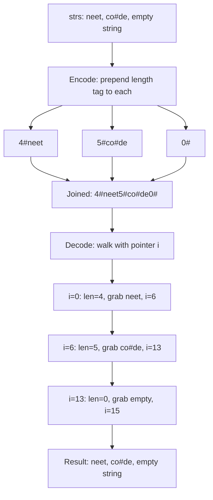
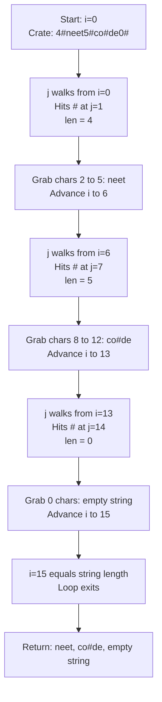

# Encode and Decode Strings — Mental Model

## The Shipping Parcel Tag Analogy

Understanding this problem is like a warehouse worker tagging parcels with measurement strips before loading them all into one shipping crate.

## Understanding the Analogy (No Code Yet!)

### The Setup

Imagine you work at a shipping warehouse. Your job: pack several separate parcels into one large crate for transport, then unpack them correctly at the destination. Each parcel can contain *anything* — text, numbers, symbols, even the characters you'd normally use as separators.

The naive approach fails immediately. If you try to mark parcel boundaries by taping a `|` strip between them, you're in trouble the moment a parcel description contains `|`. The receiver splits on the wrong `|` and reconstructs the wrong parcels. Use a comma? Same problem. Use a newline? A parcel might contain a newline. You cannot win with fixed delimiters if the contents are arbitrary.

You need a tagging system that works regardless of what's inside each parcel.

### The Measurement Tag System

Before loading each parcel, you wrap a **measurement tag** around it. The tag says: `"{charCount}#"`. The number is the exact character count of the parcel's contents, and the `#` is just the end-of-number marker — the divider between the tag and the parcel body.

Three parcels leave the warehouse:

- `"hello"` → tagged as `5#hello`
- `"world"` → tagged as `5#world`
- `"how#are#you"` → tagged as `11#how#are#you`

All three are loaded into the crate back-to-back: `5#hello5#world11#how#are#you`

No separator is placed between parcels. None is needed — each parcel's tag tells the receiver exactly where it ends.

### How Unpacking Works

At the destination, the receiver follows one unwavering routine:

1. **Read digits until you hit `#`** — that number is the character count of the next parcel
2. **Count exactly that many characters** — those are the parcel contents
3. **Mark your position** — you are now at the start of the next measurement tag
4. **Repeat** until nothing remains in the crate

The receiver **never searches for a separator inside the parcel**. Once they know the count from the tag, they count forward exactly that many characters and stop. They never interpret what those characters mean. The `#` symbols embedded inside `"how#are#you"` are invisible to the receiver while counting — they are in "counting mode", not "scanning mode".

### Why The Tag Survives Any Content

The tag format `{N}#` has a precise reading procedure:

1. Read digit characters until you encounter `#` — those digits form the count `N`
2. Skip the `#`
3. Advance exactly `N` characters — those are the parcel
4. You are now positioned at the start of the *next* tag — go to step 1

Because step 3 is "advance N characters" — not "scan until you find something" — the contents of those N characters are never examined for structure. A `#` at position 3 inside a 10-character parcel is just the 4th character being counted, nothing more.

**Length is what controls where you stop. Not a special character.**

### Simple Example Through the Analogy

Pack three parcels: `["neet", "co#de", ""]`

**Tagging (encoding):**
- `"neet"` has 4 characters → tagged: `4#neet`
- `"co#de"` has 5 characters → tagged: `5#co#de`
- `""` has 0 characters → tagged: `0#`

**Crate contents:** `4#neet5#co#de0#`

**Unpacking (decoding):**
- Position 0: read digits, hit `#` at index 1 → count = 4. Grab 4 chars: `neet`. Advance to position 6.
- Position 6: read digits, hit `#` at index 7 → count = 5. Grab 5 chars: `co#de`. Advance to position 13.
- Position 13: read digits, hit `#` at index 14 → count = 0. Grab 0 chars: `""`. Advance to position 15.
- Position 15 = end of crate. Done.

Unpacked: `["neet", "co#de", ""]` — exactly the originals. Notice that the `#` at position 2 of `co#de` was simply the 3rd character being counted. It never triggered a split.

---

Now you understand HOW to solve the problem. Let's translate this to code.

---

## How I Think Through This

The problem asks me to design two functions that are inverses of each other: one serializes a list of strings into a single string, and one deserializes it back. The core challenge is that strings can contain any character, so I can't use a fixed delimiter. The solution is length-prefix framing — I prefix each string with its character count and a `#` separator, then concatenate all prefixed strings. For encoding, I map over every string `s`, prepend `${s.length}#`, and join everything into one flat string. For decoding, I maintain a pointer `i` that starts at 0. At each step, a second pointer `j` advances from `i` until it finds `#` — everything between `i` and `j` is the length number. I parse it, then slice exactly `len` characters starting at `j + 1` (skipping the `#`) to get the next string, then jump `i` to `j + 1 + len`. The key habit: I never look inside those `len` characters for structure — I count them and move on.

Take `["cat", "2#3"]`. Encoding: `"cat"` → `3#cat`, `"2#3"` → `3#2#3`. Concatenated: `"3#cat3#2#3"`. Decoding: pointer `i` at 0, `j` walks right — finds `#` at index 1, length = 3. Slice from index 2 for 3 chars: `"cat"`. Jump `i` to 5. Now `j` walks from 5 — finds `#` at index 6, length = 3. Slice from index 7 for 3 chars: `"2#3"`. Jump `i` to 10, which equals the string length. Return `["cat", "2#3"]`.

---

## Building the Algorithm Step-by-Step

### Step 1: The Measurement Tag

**In our analogy:** For each parcel, attach a tag showing how long it is, followed by `#`, then the parcel body.

**In code:**
```typescript
function encode(strs: string[]): string {
  return strs.map(s => `${s.length}#${s}`).join('');
}
```

**Why:** `s.length` gives the exact character count. The `#` marks the end of the numeric tag. We join with `''` — no separator needed between parcels because tags are self-delimiting.

### Step 2: Setting Up the Receiver's Pointer

**In our analogy:** The receiver stands at position 0 in the crate and tracks their current position as they unpack one parcel at a time.

**In code:**
```typescript
function decode(s: string): string[] {
  const parcels: string[] = [];
  let i = 0;  // pointer: current position in the crate
```

**Why:** `i` is always at the start of the next tag's digit sequence. It advances past both the tag and the parcel body in one jump.

### Step 3: Reading the Tag Number

**In our analogy:** Let a second worker (`j`) walk forward from the current position until they hit `#` — everything they passed over is the count.

**Adding to our code:**
```typescript
  while (i < s.length) {
    let j = i;
    while (s[j] !== '#') j++;         // walk j until '#'
    const len = parseInt(s.slice(i, j));  // digits between i and j are the count
```

**Why:** `j` starts at `i` and advances until it finds `#`. `s.slice(i, j)` extracts just the digit characters. `parseInt` converts them to a number. `j` always lands exactly on the `#`.

### Step 4: Extracting the Parcel and Advancing

**In our analogy:** Skip the `#`, count exactly `len` characters as the parcel body, then mark the position just past that parcel as the new starting point.

**The logic:**
```typescript
    const parcel = s.slice(j + 1, j + 1 + len);  // j+1 skips the '#'
    parcels.push(parcel);
    i = j + 1 + len;  // jump i to the start of the next tag
  }
```

**Why:** `j + 1` is the first content character (one past the `#`). `j + 1 + len` is where the parcel ends — and where the next tag begins. Setting `i = j + 1 + len` positions the receiver at the start of the next measurement tag.

### Step 5: Complete Solution

```typescript
function encode(strs: string[]): string {
  return strs.map(s => `${s.length}#${s}`).join('');
}

function decode(s: string): string[] {
  const parcels: string[] = [];
  let i = 0;

  while (i < s.length) {
    let j = i;
    while (s[j] !== '#') j++;
    const len = parseInt(s.slice(i, j));
    parcels.push(s.slice(j + 1, j + 1 + len));
    i = j + 1 + len;
  }

  return parcels;
}
```

---

## Tracing Through an Example

**Input:** `["neet", "co#de", ""]`
**Encoded:** `"4#neet5#co#de0#"`

| Step | i | j (finds #) | len | Sliced parcel | i after |
|------|---|-------------|-----|---------------|---------|
| 1 | 0 | 1 | 4 | `"neet"` (chars 2–5) | 6 |
| 2 | 6 | 7 | 5 | `"co#de"` (chars 8–12) | 13 |
| 3 | 13 | 14 | 0 | `""` (empty slice) | 15 |
| End | 15 | — | — | loop exits | — |

**Output:** `["neet", "co#de", ""]`

---

## Encode/Decode Overview



---

## Decoder Pointer Walk



---

## Common Misconceptions

### ❌ "I can use a special separator character that strings won't contain"

Unless you control the input, you can't guarantee any character is absent. The problem states strings can contain any printable character — including `|`, `,`, `\n`, and even `#`. There is no safe delimiter.

In parcel terms: there is no tape color that can't accidentally appear on a parcel's surface. You need the measurement tag system, not tape.

### ❌ "The `#` delimiter could appear in a string and confuse the decoder"

The decoder only searches for `#` while in "tag-reading mode" — when `j` is walking forward from `i`. Once it finds `#` and reads the length, it switches to "counting mode" for exactly `len` characters. During those `len` characters, `j` is never moved and `#` is never searched for. The count controls when counting mode ends, not any character.

### ❌ "What if a string is empty?"

An empty string has length 0. Its tag is `0#` — two characters. The decoder reads length `0`, slices 0 characters (producing `""`), and advances `i` by 2. Works identically to any other string.

### ✅ "Length is what controls where you stop — not a special character"

This is the core insight. Because decoding advances by a count rather than scanning for a terminator, the contents are irrelevant. The parcel's tag tells you everything you need to know before you ever touch the parcel body.

---

## Try It Yourself

Pack and unpack: `["a#b", "#", "3#xyz", ""]`

1. What measurement tag does each parcel get?
2. What does the full crate string look like?
3. Walk the decoder pointer step by step
4. Do you recover the original parcels?

<details>
<summary>Answer</summary>

**Encoding:**
- `"a#b"` → `3#a#b`
- `"#"` → `1##`
- `"3#xyz"` → `5#3#xyz`
- `""` → `0#`

**Crate string:** `3#a#b1##5#3#xyz0#`

**Decoding:**
- i=0: j finds `#` at 1, len=3, grab `a#b` (chars 2–4), i=5
- i=5: j finds `#` at 6, len=1, grab `#` (char 7), i=8
- i=8: j finds `#` at 9, len=5, grab `3#xyz` (chars 10–14), i=15
- i=15: j finds `#` at 16, len=0, grab `` (empty), i=17
- i=17 = end of string

**Recovered:** `["a#b", "#", "3#xyz", ""]` ✓

</details>

---

## Complexity

- **Encode Time:** O(n × L) — one pass over all strings of total length n×L
- **Decode Time:** O(n × L) — pointer walks the entire encoded string exactly once
- **Space:** O(n × L) — the output array holding all decoded strings
