# Decode String - Visual Guide

## Understanding the Stack Approach

### The Core Idea

We use a **stack** to process the string from left to right. When we hit `]`, we decode that segment and push the result back.

```mermaid
graph LR
    A[Scan left → right] --> B[Push everything]
    B --> C{"Hit ']'?"}
    C -->|Yes| D[Pop & Decode]
    C -->|No| B
    D --> E[Push result back]
    E --> B

    style A fill:#e6f3ff
    style D fill:#ffeb99
    style E fill:#99ff99
```

### Stack Contents

The stack contains **four types of elements**:


**Color Legend:**
- 🟡 Yellow = Numbers (digits)
- 🔴 Red = Brackets `[`
- 🔵 Blue = Letters
- 🟢 Green = Decoded segments

---

## The Decoding Process

When we see `]`, here's what happens:

```mermaid
graph TD
    Start["See ']'"] --> Step1["1-Pop chars until '['<br/>(prepend to reverse order!)"]
    Step1 --> Step2["2-Pop '['"]
    Step2 --> Step3["3-Pop digits to build number<br/>(prepend to build correctly!)"]
    Step3 --> Step4["4-Repeat string × number"]
    Step4 --> Step5["5-Push result back to stack"]

    style Start fill:#ff9999
    style Step1 fill:#87CEEB
    style Step3 fill:#FFD700
    style Step4 fill:#ffeb99
    style Step5 fill:#90EE90
```

---

## Step-by-Step Visual Example

Let's decode: `"3[a2[c]]"`

### Initial State


---

### Step 1: i=0, char='3' (digit)

**Action**: Push '3' to stack


**Stack**: `['3']` 🟡

---

### Step 2: i=1, char='[' (bracket)

**Action**: Push '[' to stack


**Stack**: `['3', '[']` 🟡🔴

---

### Step 3: i=2, char='a' (letter)

**Action**: Push 'a' to stack

```mermaid
graph LR
    subgraph Stack
        S3["'3'"]
        S2["'['"]
        S1["'a'"]
    end

    subgraph "Current State"
        C["Scanning: 3[a2[c]]<br/>           ↑"]
    end

    S3 -.-> S2 -.-> S1

    style S3 fill:#FFD700
    style S2 fill:#ff9999
    style S1 fill:#87CEEB
```

**Stack**: `['3', '[', 'a']` 🟡🔴🔵

---

### Step 4: i=3, char='2' (digit)

**Action**: Push '2' to stack


**Stack**: `['3', '[', 'a', '2']` 🟡🔴🔵🟡

---

### Step 5: i=4, char='[' (bracket)

**Action**: Push '[' to stack

```mermaid
graph LR
    subgraph Stack
        S5["'3'"]
        S4["'['"]
        S3["'a'"]
        S2["'2'"]
        S1["'['"]
    end

    subgraph "Current State"
        C["Scanning: 3[a2[c]]<br/>             ↑"]
    end

    S5 -.-> S4 -.-> S3 -.-> S2 -.-> S1

    style S5 fill:#FFD700
    style S4 fill:#ff9999
    style S3 fill:#87CEEB
    style S2 fill:#FFD700
    style S1 fill:#ff9999
```

**Stack**: `['3', '[', 'a', '2', '[']` 🟡🔴🔵🟡🔴

---

### Step 6: i=5, char='c' (letter)

**Action**: Push 'c' to stack

```mermaid
graph LR
    subgraph Stack
        S6["'3'"]
        S5["'['"]
        S4["'a'"]
        S3["'2'"]
        S2["'['"]
        S1["'c'"]
    end

    subgraph "Current State"
        C["Scanning: 3[a2[c]]<br/>              ↑"]
    end

    S6 -.-> S5 -.-> S4 -.-> S3 -.-> S2 -.-> S1

    style S6 fill:#FFD700
    style S5 fill:#ff9999
    style S4 fill:#87CEEB
    style S3 fill:#FFD700
    style S2 fill:#ff9999
    style S1 fill:#87CEEB
```

**Stack**: `['3', '[', 'a', '2', '[', 'c']` 🟡🔴🔵🟡🔴🔵

---

### Step 7: i=6, char=']' (DECODE!)

**Action**: Decode the innermost bracket

#### Part A: Pop characters until '['

```mermaid
graph TB
    subgraph "Stack Before"
        B6["'3'"]
        B5["'['"]
        B4["'a'"]
        B3["'2'"]
        B2["'['"]
        B1["'c'"]
    end

    subgraph "Build String"
        P["Pop 'c' → str = 'c' + '' = 'c'<br/>Hit '['? YES, stop"]
        P2["Result: str = 'c'"]
    end

    subgraph "Stack After Popping String"
        A6["'3'"]
        A5["'['"]
        A4["'a'"]
        A3["'2'"]
        A2["'['"]
    end

    B6 --> P
    B5 --> P
    B4 --> P
    B3 --> P
    B2 --> P
    B1 --> P

    P --> A6

    style B1 fill:#87CEEB,stroke:#333,stroke-width:3px
    style P fill:#87CEEB
    style A2 fill:#ff9999,stroke:#333,stroke-width:3px
```

#### Part B: Pop '['


#### Part C: Pop number

```mermaid
graph TB
    subgraph "Stack"
        S["['3', '[', 'a', '2']"]
    end

    subgraph "Build Number"
        P["Pop '2' → num = '2' + '' = '2'<br/>Next is 'a' (not digit)? STOP"]
        P2["Result: num = '2'"]
    end

    S --> P --> P2

    style P fill:#FFD700
    style P2 fill:#FFD700
```

#### Part D: Repeat and push back

```mermaid
graph TB
    subgraph "Computation"
        C["str = 'c'<br/>num = 2<br/>result = 'c' × 2 = 'cc'"]
    end

    subgraph "Stack Before"
        B["['3', '[', 'a']"]
    end

    subgraph "Stack After"
        A["['3', '[', 'a', 'cc']"]
    end

    C --> B --> |"Push 'cc'"| A

    style C fill:#ffeb99
    style B fill:#87CEEB
    style A fill:#90EE90
```

**Stack After Decode**: `['3', '[', 'a', 'cc']` 🟡🔴🔵🟢

**Key Insight**: We pushed the decoded `'cc'` back because it's part of the outer encoding!

---

### Step 8: i=7, char=']' (DECODE AGAIN!)

**Action**: Decode the outer bracket

#### Part A: Pop characters until '['

```mermaid
graph TB
    subgraph "Stack"
        S4["'3'"]
        S3["'['"]
        S2["'a'"]
        S1["'cc'"]
    end

    subgraph "Build String"
        direction TB
        P1["Pop 'cc' → str = 'cc' + '' = 'cc'"]
        P2["Pop 'a' → str = 'a' + 'cc' = 'acc'"]
        P3["Hit '['? YES, stop"]
        P4["Result: str = 'acc'"]
    end

    S1 --> P1 --> P2 --> P3 --> P4

    style S1 fill:#90EE90,stroke:#333,stroke-width:3px
    style S2 fill:#87CEEB,stroke:#333,stroke-width:3px
    style P1 fill:#90EE90
    style P2 fill:#87CEEB
    style P4 fill:#ffeb99
```

**Critical**: We **prepend** (add to front) when popping to reverse the stack order!
- First pop: 'cc' → str = 'cc'
- Second pop: 'a' → str = 'a' + 'cc' = 'acc' ✓

If we appended: 'cc' + 'a' = 'cca' ✗ WRONG!

#### Part B: Pop '[', then pop number


#### Part C: Repeat and push back

```mermaid
graph TB
    subgraph "Computation"
        C["str = 'acc'<br/>num = 3<br/>result = 'acc' × 3 = 'accaccacc'"]
    end

    subgraph "Stack Before"
        B["[]"]
    end

    subgraph "Stack After"
        A["['accaccacc']"]
    end

    C --> B --> |"Push 'accaccacc'"| A

    style C fill:#ffeb99
    style A fill:#90EE90,stroke:#333,stroke-width:3px
```

**Stack After Decode**: `['accaccacc']` 🟢

---

### Step 9: Done!

**Action**: No more characters, join the stack


**Final Answer**: `"accaccacc"` ✓

---

## The Prepend Pattern (Critical!)

### Why We Prepend When Popping

Stack pops in **reverse order** (Last-In-First-Out):

```mermaid
graph TB
    subgraph "Stack State"
        S["Top → 'c'<br/>'b'<br/>'a'<br/>Bottom → '['"]
    end

    subgraph "❌ Wrong: str += pop()"
        W1["str = ''"]
        W2["Pop 'c' → str = '' + 'c' = 'c'"]
        W3["Pop 'b' → str = 'c' + 'b' = 'cb'"]
        W4["Pop 'a' → str = 'cb' + 'a' = 'cba'"]
        W5["Result: 'cba' ✗"]
    end

    subgraph "✅ Correct: str = pop() + str"
        C1["str = ''"]
        C2["Pop 'c' → str = 'c' + '' = 'c'"]
        C3["Pop 'b' → str = 'b' + 'c' = 'bc'"]
        C4["Pop 'a' → str = 'a' + 'bc' = 'abc'"]
        C5["Result: 'abc' ✓"]
    end

    S --> W1
    S --> C1

    W1 --> W2 --> W3 --> W4 --> W5
    C1 --> C2 --> C3 --> C4 --> C5

    style S fill:#87CEEB
    style W5 fill:#ff6b6b,color:#fff
    style C5 fill:#90EE90
```

**The Fix**: Always prepend: `str = stack.pop() + str`

---

## Multi-Digit Numbers

### Example: `"10[a]"`

Stack evolution:

```mermaid
graph TB
    subgraph "Step 1: Push '1'"
        S1["['1']"]
    end

    subgraph "Step 2: Push '0'"
        S2["['1', '0']"]
    end

    subgraph "Step 3: Push '['"
        S3["['1', '0', '[']"]
    end

    subgraph "Step 4: Push 'a'"
        S4["['1', '0', '[', 'a']"]
    end

    subgraph "Step 5: Hit ']' - Decode"
        D1["Pop 'a' → str = 'a'"]
        D2["Pop '['"]
        D3["Pop '0' → num = '0'"]
        D4["Pop '1' → num = '1' + '0' = '10'"]
        D5["Repeat 'a' × 10"]
    end

    S1 --> S2 --> S3 --> S4 --> D1 --> D2 --> D3 --> D4 --> D5

    style S1 fill:#FFD700
    style S2 fill:#FFD700
    style S3 fill:#ff9999
    style S4 fill:#87CEEB
    style D4 fill:#FFD700,stroke:#333,stroke-width:3px
    style D5 fill:#90EE90
```

**Key**: Build number by prepending: `num = pop() + num`
- Pop '0' → num = '0'
- Pop '1' → num = '1' + '0' = '10' ✓

If we appended: '0' + '1' = '01' → Number('01') = 1 ✗ WRONG!

---

## Why Push Decoded Result Back?

### Example: `"2[a3[b]]"`

```mermaid
graph TB
    subgraph "Phase 1: Process Inner '3[b]'"
        P1["Stack: ['2', '[', 'a', '3', '[', 'b']"]
        P2["Decode: 3[b] → 'bbb'"]
        P3["Stack: ['2', '[', 'a', 'bbb']"]
    end

    subgraph "Phase 2: Process Outer '2[abbb]'"
        P4["Stack: ['2', '[', 'a', 'bbb']"]
        P5["Decode: 2[abbb] → 'abbbabbb'"]
        P6["Stack: ['abbbabbb']"]
    end

    P1 --> P2 --> P3
    P3 --> P4 --> P5 --> P6

    style P2 fill:#ffeb99
    style P3 fill:#90EE90,stroke:#333,stroke-width:3px
    style P5 fill:#ffeb99
    style P6 fill:#90EE90
```

**Without pushing 'bbb' back**: The outer encoding can't access it!

**With push back**: 'bbb' becomes part of the outer encoding's content.

---

## Decision Tree

```mermaid
flowchart TD
    Start(["Scan character"]) --> Check{char type?}

    Check -->|Digit| Digit["Push to stack"]
    Check -->|"["| Bracket["Push to stack"]
    Check -->|Letter| Letter["Push to stack"]
    Check -->|"]"| Decode["DECODE!"]

    Decode --> D1["Pop chars until '['<br/>(prepend each!)"]
    D1 --> D2["Pop '['"]
    D2 --> D3["Pop digits until non-digit<br/>(prepend each!)"]
    D3 --> D4["Repeat string × number"]
    D4 --> D5["Push result back"]

    Digit --> Continue([Continue])
    Bracket --> Continue
    Letter --> Continue
    D5 --> Continue

    style Digit fill:#FFD700
    style Bracket fill:#ff9999
    style Letter fill:#87CEEB
    style Decode fill:#ffeb99
    style D5 fill:#90EE90
```

---

## Edge Cases

### Case 1: No Brackets - `"abc"`

```mermaid
graph LR
    subgraph "Process"
        P["Push 'a', 'b', 'c'<br/>No ']' encountered"]
    end

    subgraph "Stack"
        S["['a', 'b', 'c']"]
    end

    subgraph "Result"
        R["Join: 'abc'"]
    end

    P --> S --> R

    style S fill:#87CEEB
    style R fill:#90EE90
```

### Case 2: Characters Outside Brackets - `"a2[b]c"`

```mermaid
graph TB
    S1["Push 'a'<br/>['a']"]
    S2["Push '2', '[', 'b'<br/>['a', '2', '[', 'b']"]
    S3["Hit ']', decode 2[b] → 'bb'<br/>['a', 'bb']"]
    S4["Push 'c'<br/>['a', 'bb', 'c']"]
    S5["Join: 'abbc'"]

    S1 --> S2 --> S3 --> S4 --> S5

    style S1 fill:#87CEEB
    style S2 fill:#FFD700
    style S3 fill:#90EE90
    style S4 fill:#87CEEB
    style S5 fill:#99ff99
```

### Case 3: Deep Nesting - `"2[2[2[a]]]"`

```mermaid
graph TD
    L1["Innermost: 2[a] → 'aa'<br/>Stack: ['2', '[', '2', '[', 'aa']"]
    L2["Middle: 2[aa] → 'aaaa'<br/>Stack: ['2', '[', 'aaaa']"]
    L3["Outer: 2[aaaa] → 'aaaaaaaa'<br/>Stack: ['aaaaaaaa']"]

    L1 --> L2 --> L3

    style L1 fill:#87CEEB
    style L2 fill:#90EE90
    style L3 fill:#99ff99,stroke:#333,stroke-width:3px
```

---

## Common Mistakes

```mermaid
graph TD
    M1["❌ Not prepending when building string"] --> E1["Results in reversed output"]
    M2["❌ Not prepending when building number"] --> E2["'10' becomes '01' → 1"]
    M3["❌ Not pushing decoded result back"] --> E3["Nested encodings fail"]
    M4["❌ Popping '[' before building string"] --> E4["Can't find where to stop"]

    style M1 fill:#ff6b6b,color:#fff
    style M2 fill:#ff6b6b,color:#fff
    style M3 fill:#ff6b6b,color:#fff
    style M4 fill:#ff6b6b,color:#fff
```

---

## Algorithm Summary

```mermaid
flowchart TD
    Start([Start]) --> Init["stack = []<br/>i = 0"]
    Init --> Loop{i < s.length?}

    Loop -->|Yes| Type{s[i] type?}

    Type -->|"]"| Decode
    Type -->|Other| Push["stack.push(s[i])<br/>i++"]

    subgraph Decode["Decode Process"]
        D1["str = ''<br/>while stack.top() ≠ '[':<br/>  str = stack.pop() + str"]
        D2["stack.pop() // remove '['"]
        D3["num = ''<br/>while isDigit(stack.top()):<br/>  num = stack.pop() + num"]
        D4["result = str.repeat(Number(num))<br/>stack.push(result)<br/>i++"]

        D1 --> D2 --> D3 --> D4
    end

    Push --> Loop
    D4 --> Loop

    Loop -->|No| Return["return stack.join('')"]

    style Init fill:#e6f3ff
    style D1 fill:#87CEEB
    style D3 fill:#FFD700
    style D4 fill:#90EE90
    style Return fill:#99ff99
```

---

## Complexity

- **Time**: O(n) where n is the length of the **decoded** string (each character written once)
- **Space**: O(n) for the stack (stores intermediate results)

---

## Try It Yourself

Practice with: `"2[ab]c"`

<details>
<summary>Click to see solution</summary>

```mermaid
flowchart TD
    S0["Initial: []<br/>Scan '2'"]
    S1["Push '2': ['2']<br/>Scan '['"]
    S2["Push '[': ['2', '[']<br/>Scan 'a'"]
    S3["Push 'a': ['2', '[', 'a']<br/>Scan 'b'"]
    S4["Push 'b': ['2', '[', 'a', 'b']<br/>Scan ']'"]
    S5["Decode 2[ab]:<br/>str='ab', num=2<br/>result='abab'<br/>Stack: ['abab']"]
    S6["Push 'c': ['abab', 'c']<br/>Done"]
    S7["Join: 'ababc'"]

    S0 --> S1 --> S2 --> S3 --> S4 --> S5 --> S6 --> S7

    style S5 fill:#90EE90
    style S7 fill:#99ff99,stroke:#333,stroke-width:3px
```

</details>
