# Remove K Digits - Visual Guide

## Understanding the Monotonic Stack Approach

### The Core Idea

Given a number as a string, remove `k` digits to make the **smallest possible number**. We use a **monotonic increasing stack** - whenever we see a smaller digit, we remove larger digits before it.

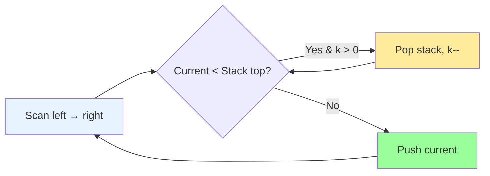
```mermaid
graph LR
    A[Scan left → right] --> B{Current < Stack top?}
    B -->|Yes & k > 0| C[Pop stack, k--]
    C --> B
    B -->|No| D[Push current]
    D --> A

    style A fill:#e6f3ff
    style C fill:#ffeb99
    style D fill:#99ff99
```

### Why This Works

**Key Insight**: For the leftmost positions, we want the **smallest possible digits**.

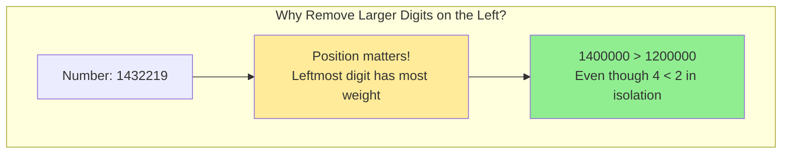
```mermaid
graph TB
    subgraph "Why Remove Larger Digits on the Left?"
        A["Number: 1432219"]
        B["Position matters!<br/>Leftmost digit has most weight"]
        C["1400000 > 1200000<br/>Even though 4 < 2 in isolation"]
    end

    A --> B --> C

    style B fill:#ffeb99
    style C fill:#90EE90
```

**Greedy Choice**: If we see digit `d` and the previous digit is larger, removing the larger one always helps because:
- The smaller digit shifts left (gains weight)
- The larger digit is gone (reduces the number)

---

## Algorithm as Sequence Diagram

This shows the interaction between components as we process each digit:

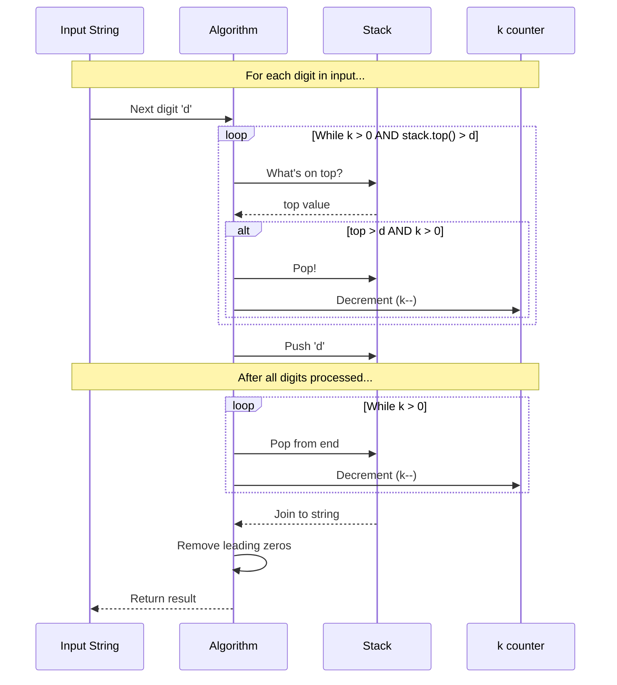
```mermaid
sequenceDiagram
    participant Input as Input String
    participant Algo as Algorithm
    participant Stack as Stack
    participant K as k counter

    Note over Input,K: For each digit in input...

    Input->>Algo: Next digit 'd'

    loop While k > 0 AND stack.top() > d
        Algo->>Stack: What's on top?
        Stack-->>Algo: top value
        alt top > d AND k > 0
            Algo->>Stack: Pop!
            Algo->>K: Decrement (k--)
        end
    end

    Algo->>Stack: Push 'd'

    Note over Input,K: After all digits processed...

    loop While k > 0
        Algo->>Stack: Pop from end
        Algo->>K: Decrement (k--)
    end

    Stack-->>Algo: Join to string
    Algo->>Algo: Remove leading zeros
    Algo-->>Input: Return result
```

---

## The Monotonic Stack Pattern

### What Makes a Stack "Monotonic Increasing"?

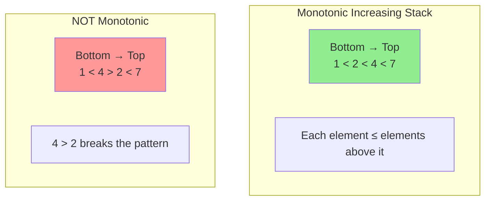
```mermaid
graph TB
    subgraph "Monotonic Increasing Stack"
        S["Bottom → Top<br/>1 < 2 < 4 < 7"]
        E["Each element ≤ elements above it"]
    end

    subgraph "NOT Monotonic"
        N["Bottom → Top<br/>1 < 4 > 2 < 7"]
        X["4 > 2 breaks the pattern"]
    end

    style S fill:#90EE90
    style N fill:#ff9999
```

### The Removal Decision

```mermaid
flowchart TD
    Start(["See digit 'd'"]) --> Check{stack.top() > d<br/>AND k > 0?}

    Check -->|Yes| Pop["Pop stack<br/>k--"]
    Pop --> Check

    Check -->|No| Push["Push 'd' to stack"]
    Push --> Continue([Continue to next digit])

    style Pop fill:#ffeb99
    style Push fill:#90EE90
```

---

## Step-by-Step Example: `"1432219", k = 3`

### Complete Execution Sequence

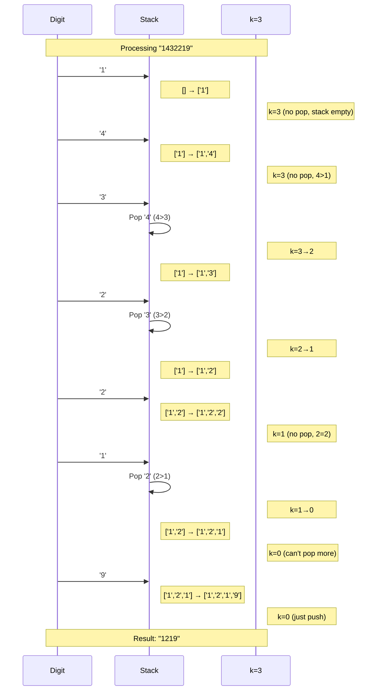
```mermaid
sequenceDiagram
    participant D as Digit
    participant S as Stack
    participant K as k=3

    Note over D,K: Processing "1432219"

    D->>S: '1'
    Note right of S: [] → ['1']
    Note right of K: k=3 (no pop, stack empty)

    D->>S: '4'
    Note right of S: ['1'] → ['1','4']
    Note right of K: k=3 (no pop, 4>1)

    D->>S: '3'
    S->>S: Pop '4' (4>3)
    Note right of K: k=3→2
    Note right of S: ['1'] → ['1','3']

    D->>S: '2'
    S->>S: Pop '3' (3>2)
    Note right of K: k=2→1
    Note right of S: ['1'] → ['1','2']

    D->>S: '2'
    Note right of S: ['1','2'] → ['1','2','2']
    Note right of K: k=1 (no pop, 2=2)

    D->>S: '1'
    S->>S: Pop '2' (2>1)
    Note right of K: k=1→0
    Note right of S: ['1','2'] → ['1','2','1']
    Note right of K: k=0 (can't pop more)

    D->>S: '9'
    Note right of S: ['1','2','1'] → ['1','2','1','9']
    Note right of K: k=0 (just push)

    Note over D,K: Result: "1219"
```

### State Table View

| Step | Digit | Stack Before | Action | Stack After | k |
|------|-------|--------------|--------|-------------|---|
| 1 | '1' | `[]` | Push | `['1']` | 3 |
| 2 | '4' | `['1']` | Push (4>1) | `['1','4']` | 3 |
| 3 | '3' | `['1','4']` | Pop '4', Push '3' | `['1','3']` | 2 |
| 4 | '2' | `['1','3']` | Pop '3', Push '2' | `['1','2']` | 1 |
| 5 | '2' | `['1','2']` | Push (2=2) | `['1','2','2']` | 1 |
| 6 | '1' | `['1','2','2']` | Pop '2', Push '1' | `['1','2','1']` | 0 |
| 7 | '9' | `['1','2','1']` | Push (k=0) | `['1','2','1','9']` | 0 |

**Final Answer**: `"1219"`

---

## Detailed Step Breakdown

### Steps 1-2: Building Up

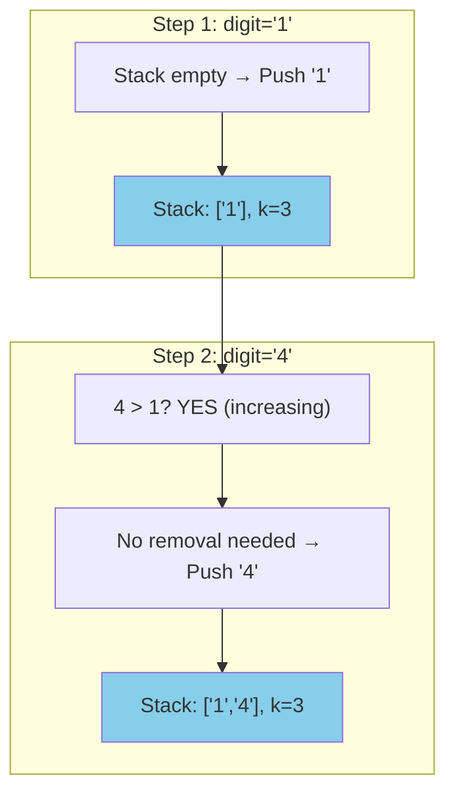
```mermaid
graph TB
    subgraph "Step 1: digit='1'"
        S1["Stack empty → Push '1'"]
        R1["Stack: ['1'], k=3"]
    end

    subgraph "Step 2: digit='4'"
        C2["4 > 1? YES (increasing)"]
        S2["No removal needed → Push '4'"]
        R2["Stack: ['1','4'], k=3"]
    end

    S1 --> R1 --> C2 --> S2 --> R2

    style R1 fill:#87CEEB
    style R2 fill:#87CEEB
```

### Step 3: First Removal

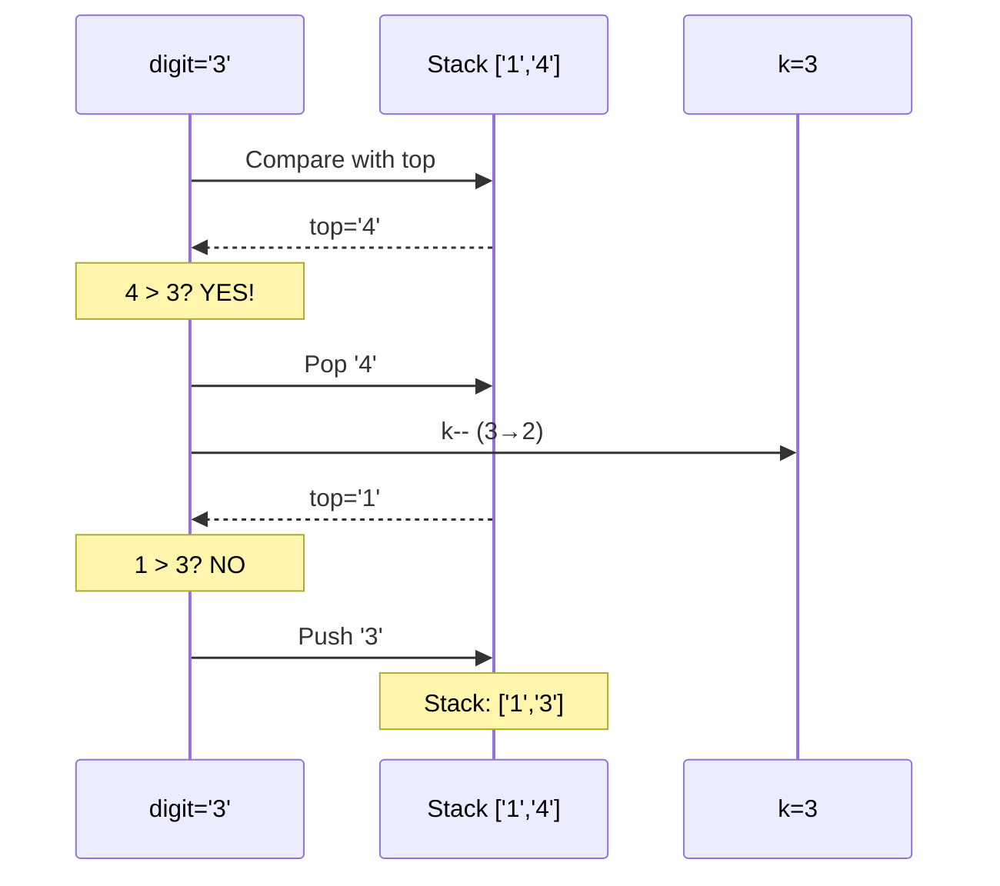
```mermaid
sequenceDiagram
    participant D as digit='3'
    participant S as Stack ['1','4']
    participant K as k=3

    D->>S: Compare with top
    S-->>D: top='4'
    Note over D: 4 > 3? YES!
    D->>S: Pop '4'
    D->>K: k-- (3→2)
    S-->>D: top='1'
    Note over D: 1 > 3? NO
    D->>S: Push '3'
    Note over S: Stack: ['1','3']
```

**Why remove '4'?**
- `14xxxxx` vs `13xxxxx`
- `13xxxxx` is smaller because 3 < 4 in the second position

### Step 4: Chain Removal

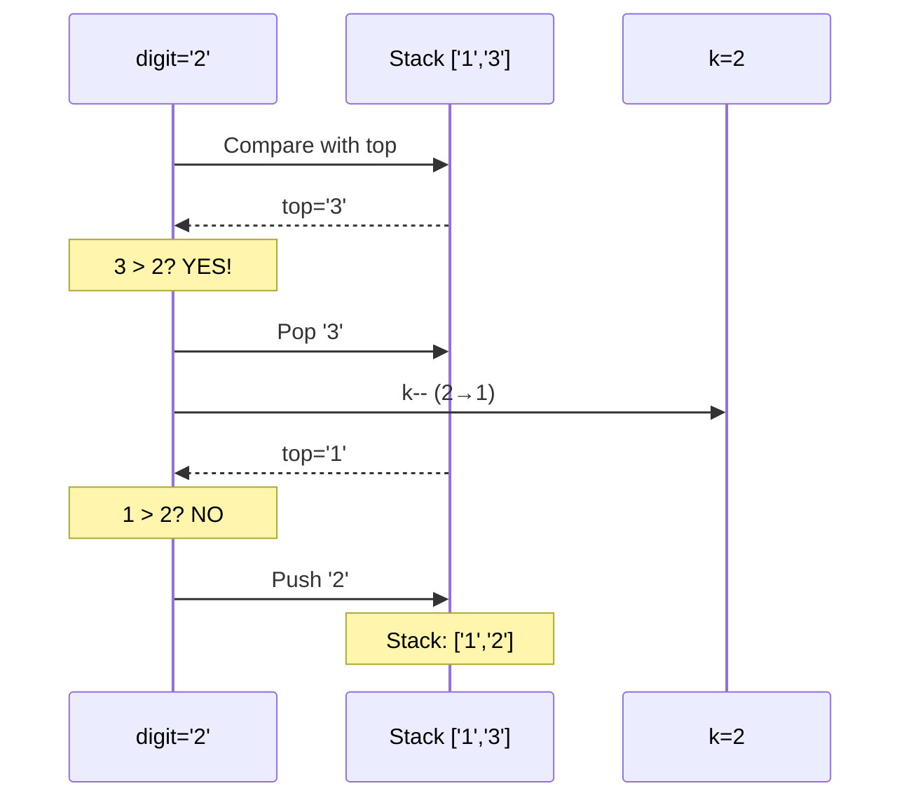
```mermaid
sequenceDiagram
    participant D as digit='2'
    participant S as Stack ['1','3']
    participant K as k=2

    D->>S: Compare with top
    S-->>D: top='3'
    Note over D: 3 > 2? YES!
    D->>S: Pop '3'
    D->>K: k-- (2→1)
    S-->>D: top='1'
    Note over D: 1 > 2? NO
    D->>S: Push '2'
    Note over S: Stack: ['1','2']
```

### Step 6: k Exhausted

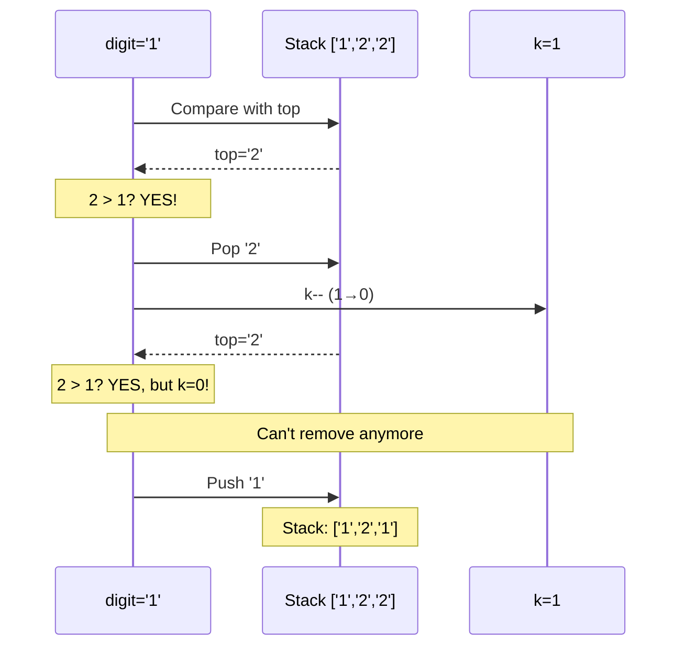
```mermaid
sequenceDiagram
    participant D as digit='1'
    participant S as Stack ['1','2','2']
    participant K as k=1

    D->>S: Compare with top
    S-->>D: top='2'
    Note over D: 2 > 1? YES!
    D->>S: Pop '2'
    D->>K: k-- (1→0)
    S-->>D: top='2'
    Note over D: 2 > 1? YES, but k=0!
    Note over D,K: Can't remove anymore
    D->>S: Push '1'
    Note over S: Stack: ['1','2','1']
```

---

## Handling Edge Cases

### Case 1: Leading Zeros (`"10200", k=1`)

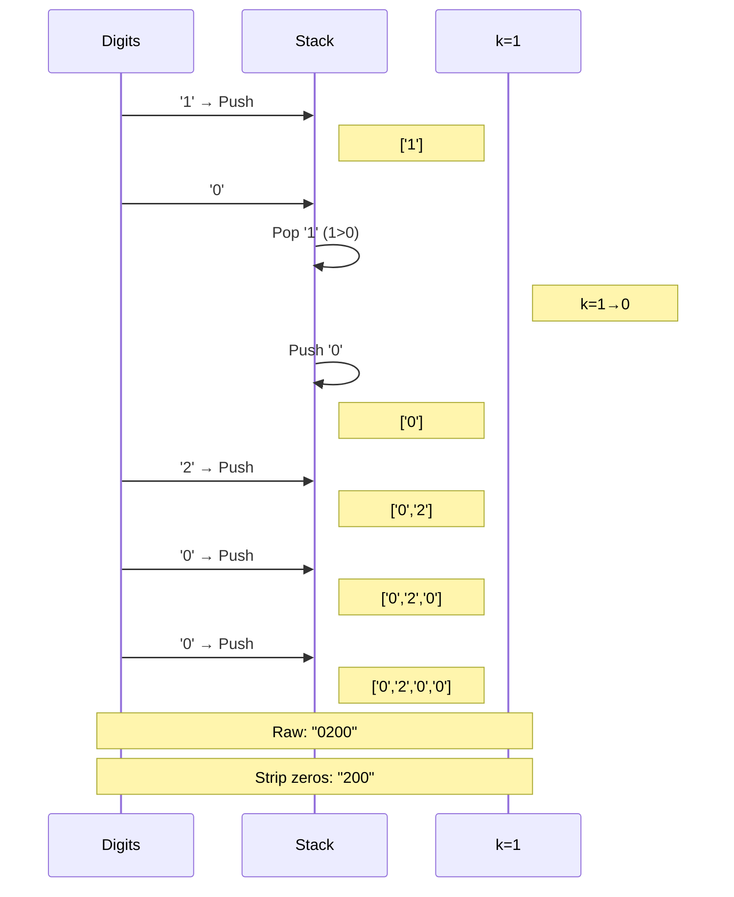
```mermaid
sequenceDiagram
    participant D as Digits
    participant S as Stack
    participant K as k=1

    D->>S: '1' → Push
    Note right of S: ['1']

    D->>S: '0'
    S->>S: Pop '1' (1>0)
    Note right of K: k=1→0
    S->>S: Push '0'
    Note right of S: ['0']

    D->>S: '2' → Push
    Note right of S: ['0','2']

    D->>S: '0' → Push
    Note right of S: ['0','2','0']

    D->>S: '0' → Push
    Note right of S: ['0','2','0','0']

    Note over D,K: Raw: "0200"
    Note over D,K: Strip zeros: "200"
```

**Answer**: `"200"` (not `"0200"`)

### Case 2: Remove All (`"10", k=2`)

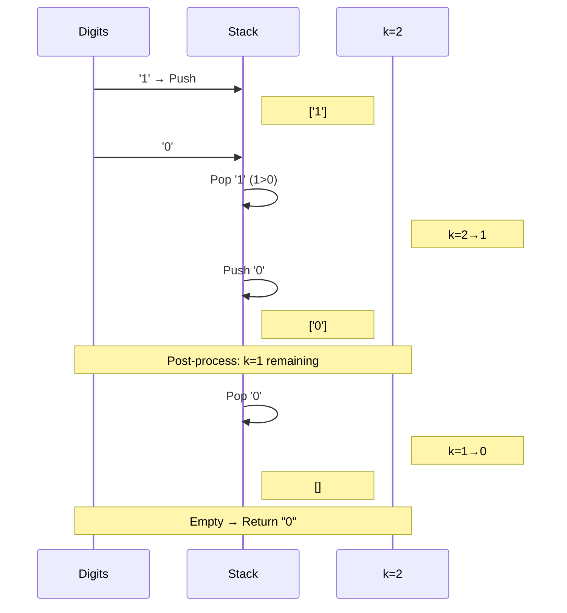
```mermaid
sequenceDiagram
    participant D as Digits
    participant S as Stack
    participant K as k=2

    D->>S: '1' → Push
    Note right of S: ['1']

    D->>S: '0'
    S->>S: Pop '1' (1>0)
    Note right of K: k=2→1
    S->>S: Push '0'
    Note right of S: ['0']

    Note over D,K: Post-process: k=1 remaining
    S->>S: Pop '0'
    Note right of K: k=1→0
    Note right of S: []

    Note over D,K: Empty → Return "0"
```

**Answer**: `"0"` (not empty string)

### Case 3: Already Increasing (`"12345", k=2`)

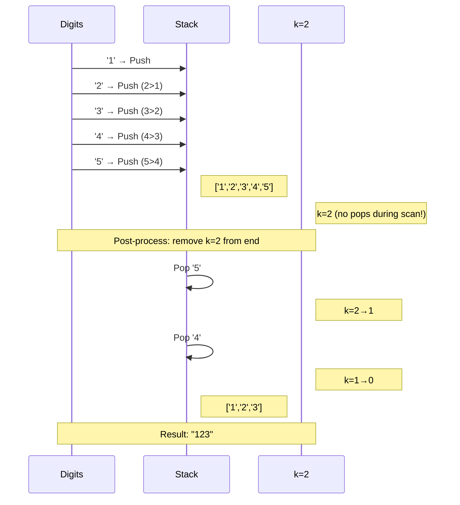
```mermaid
sequenceDiagram
    participant D as Digits
    participant S as Stack
    participant K as k=2

    D->>S: '1' → Push
    D->>S: '2' → Push (2>1)
    D->>S: '3' → Push (3>2)
    D->>S: '4' → Push (4>3)
    D->>S: '5' → Push (5>4)
    Note right of S: ['1','2','3','4','5']
    Note right of K: k=2 (no pops during scan!)

    Note over D,K: Post-process: remove k=2 from end
    S->>S: Pop '5'
    Note right of K: k=2→1
    S->>S: Pop '4'
    Note right of K: k=1→0
    Note right of S: ['1','2','3']

    Note over D,K: Result: "123"
```

**Answer**: `"123"` (remove last k digits)

### Case 4: All Same Digits (`"1111", k=2`)

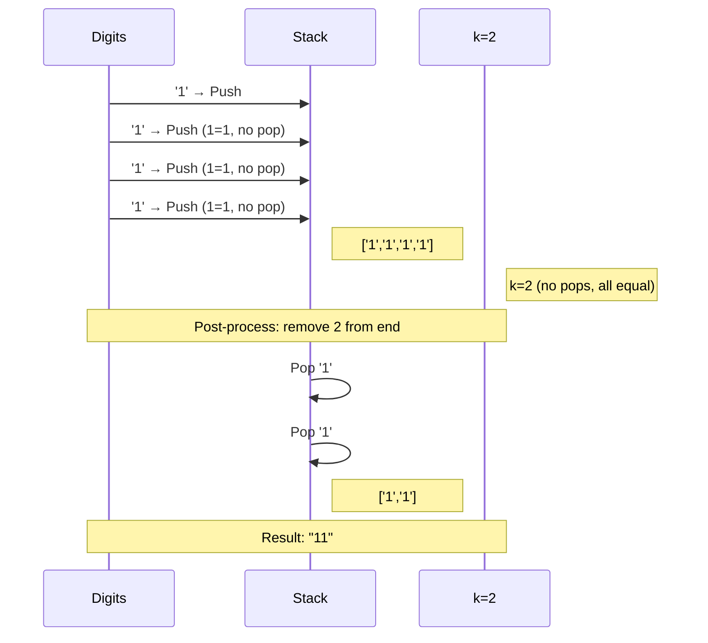
```mermaid
sequenceDiagram
    participant D as Digits
    participant S as Stack
    participant K as k=2

    D->>S: '1' → Push
    D->>S: '1' → Push (1=1, no pop)
    D->>S: '1' → Push (1=1, no pop)
    D->>S: '1' → Push (1=1, no pop)
    Note right of S: ['1','1','1','1']
    Note right of K: k=2 (no pops, all equal)

    Note over D,K: Post-process: remove 2 from end
    S->>S: Pop '1'
    S->>S: Pop '1'
    Note right of S: ['1','1']

    Note over D,K: Result: "11"
```

**Answer**: `"11"`

---

## Decision Flowchart

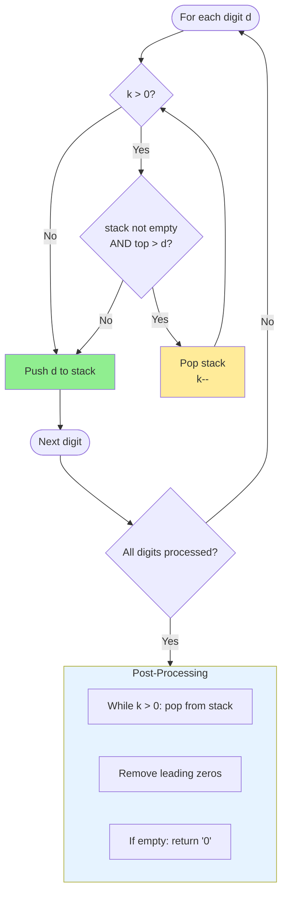
```mermaid
flowchart TD
    Start(["For each digit d"]) --> CheckK{k > 0?}

    CheckK -->|No| Push["Push d to stack"]
    CheckK -->|Yes| CheckTop{stack not empty<br/>AND top > d?}

    CheckTop -->|Yes| Pop["Pop stack<br/>k--"]
    Pop --> CheckK

    CheckTop -->|No| Push

    Push --> Next([Next digit])

    Next --> Done{All digits processed?}
    Done -->|No| Start
    Done -->|Yes| PostProcess

    subgraph PostProcess["Post-Processing"]
        PP1["While k > 0: pop from stack"]
        PP2["Remove leading zeros"]
        PP3["If empty: return '0'"]
    end

    style Pop fill:#ffeb99
    style Push fill:#90EE90
    style PostProcess fill:#e6f3ff
```

---

## Why Monotonic Stack Works Here

### Greedy Proof Intuition

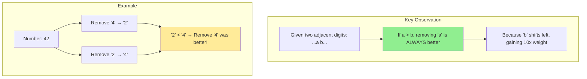
```mermaid
graph TB
    subgraph "Key Observation"
        K1["Given two adjacent digits: ...a b..."]
        K2["If a > b, removing 'a' is ALWAYS better"]
        K3["Because 'b' shifts left, gaining 10x weight"]
    end

    subgraph "Example"
        E1["Number: 42"]
        E2["Remove '4' → '2'"]
        E3["Remove '2' → '4'"]
        E4["'2' < '4' → Remove '4' was better!"]
    end

    K1 --> K2 --> K3
    E1 --> E2 & E3 --> E4

    style K2 fill:#90EE90
    style E4 fill:#ffeb99
```

### The Stack Maintains Our Best Choices

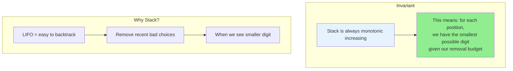
```mermaid
graph TB
    subgraph "Invariant"
        I["Stack is always monotonic increasing"]
        I2["This means: for each position,<br/>we have the smallest possible digit<br/>given our removal budget"]
    end

    subgraph "Why Stack?"
        W1["LIFO = easy to backtrack"]
        W2["Remove recent bad choices"]
        W3["When we see smaller digit"]
    end

    I --> I2
    W1 --> W2 --> W3

    style I fill:#e6f3ff
    style I2 fill:#90EE90
```

---

## Common Mistakes

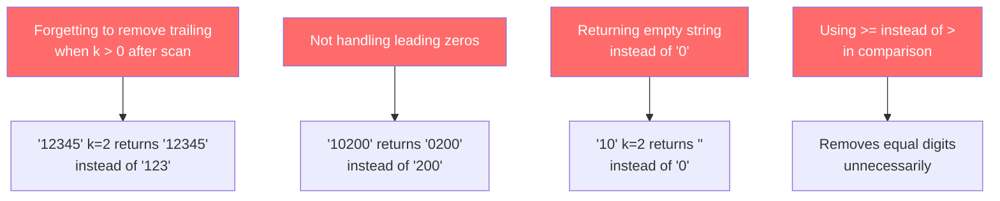
```mermaid
graph TD
    M1["Forgetting to remove trailing<br/>when k > 0 after scan"] --> E1["'12345' k=2 returns '12345'<br/>instead of '123'"]

    M2["Not handling leading zeros"] --> E2["'10200' returns '0200'<br/>instead of '200'"]

    M3["Returning empty string<br/>instead of '0'"] --> E3["'10' k=2 returns ''<br/>instead of '0'"]

    M4["Using >= instead of ><br/>in comparison"] --> E4["Removes equal digits<br/>unnecessarily"]

    style M1 fill:#ff6b6b,color:#fff
    style M2 fill:#ff6b6b,color:#fff
    style M3 fill:#ff6b6b,color:#fff
    style M4 fill:#ff6b6b,color:#fff
```

---

## Algorithm Summary

```mermaid
flowchart TD
    Start([Start]) --> Init["stack = []<br/>k = removals"]
    Init --> Loop{More digits?}

    Loop -->|Yes| Char["d = next digit"]
    Char --> While{k > 0 AND<br/>stack.top() > d?}

    While -->|Yes| Pop["stack.pop()<br/>k--"]
    Pop --> While

    While -->|No| Push["stack.push(d)"]
    Push --> Loop

    Loop -->|No| Trim["While k > 0:<br/>stack.pop(), k--"]
    Trim --> Zeros["Remove leading zeros"]
    Zeros --> Empty{Stack empty?}

    Empty -->|Yes| ReturnZero["Return '0'"]
    Empty -->|No| Return["Return stack.join('')"]

    style Init fill:#e6f3ff
    style Pop fill:#ffeb99
    style Push fill:#90EE90
    style Trim fill:#FFD700
    style Return fill:#99ff99
```

---

## Full Algorithm Execution Timeline

For `"1432219", k=3`:

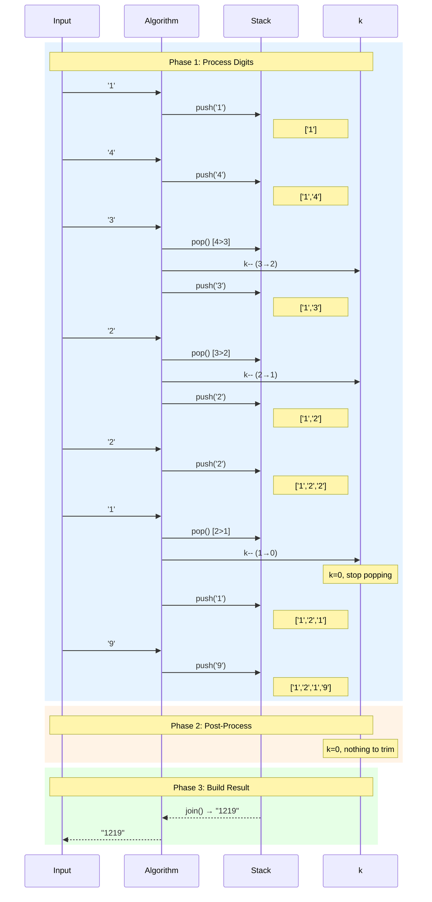
```mermaid
sequenceDiagram
    participant I as Input
    participant A as Algorithm
    participant S as Stack
    participant K as k

    rect rgb(230, 243, 255)
        Note over I,K: Phase 1: Process Digits
        I->>A: '1'
        A->>S: push('1')
        Note right of S: ['1']

        I->>A: '4'
        A->>S: push('4')
        Note right of S: ['1','4']

        I->>A: '3'
        A->>S: pop() [4>3]
        A->>K: k-- (3→2)
        A->>S: push('3')
        Note right of S: ['1','3']

        I->>A: '2'
        A->>S: pop() [3>2]
        A->>K: k-- (2→1)
        A->>S: push('2')
        Note right of S: ['1','2']

        I->>A: '2'
        A->>S: push('2')
        Note right of S: ['1','2','2']

        I->>A: '1'
        A->>S: pop() [2>1]
        A->>K: k-- (1→0)
        Note over K: k=0, stop popping
        A->>S: push('1')
        Note right of S: ['1','2','1']

        I->>A: '9'
        A->>S: push('9')
        Note right of S: ['1','2','1','9']
    end

    rect rgb(255, 243, 230)
        Note over I,K: Phase 2: Post-Process
        Note over K: k=0, nothing to trim
    end

    rect rgb(230, 255, 230)
        Note over I,K: Phase 3: Build Result
        S-->>A: join() → "1219"
        A-->>I: "1219"
    end
```

---

## Complexity

- **Time**: O(n) - each digit pushed and popped at most once
- **Space**: O(n) - stack stores at most n digits

---

## Pattern Recognition

This problem uses the **Monotonic Stack** pattern, which appears in:

```mermaid
graph TB
    subgraph "Related Problems"
        P1["Remove K Digits (402)"]
        P2["Next Greater Element (496, 503)"]
        P3["Daily Temperatures (739)"]
        P4["Largest Rectangle in Histogram (84)"]
        P5["Trapping Rain Water (42)"]
    end

    subgraph "When to Use"
        W1["Finding next greater/smaller"]
        W2["Optimizing based on neighbors"]
        W3["Maintaining sorted order while scanning"]
    end

    style P1 fill:#90EE90,stroke:#333,stroke-width:3px
```

---

## Try It Yourself

Practice with: `num = "1234567890", k = 9`

Click to see solution

```mermaid
sequenceDiagram
    participant D as Digits
    participant S as Stack
    participant K as k=9

    Note over D,K: Digits 1-9: all increasing, no pops
    D->>S: '1','2','3','4','5','6','7','8','9'
    Note right of S: ['1','2','3','4','5','6','7','8','9']
    Note right of K: k=9 (no pops yet)

    D->>S: '0'
    Note over D,K: 0 < everything! Pop 9 times
    loop 9 times
        S->>S: Pop digit
        K->>K: k--
    end
    Note right of K: k=0
    S->>S: Push '0'
    Note right of S: ['0']

    Note over D,K: Result: "0"
```

**Answer**: `"0"`

