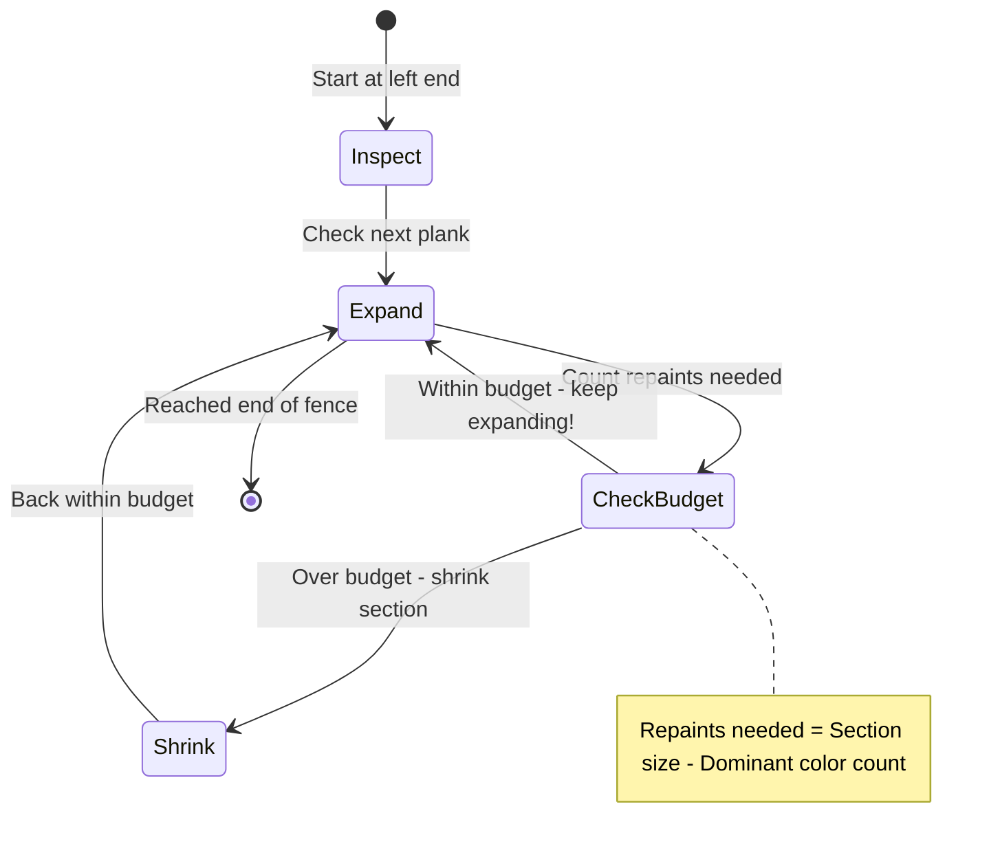
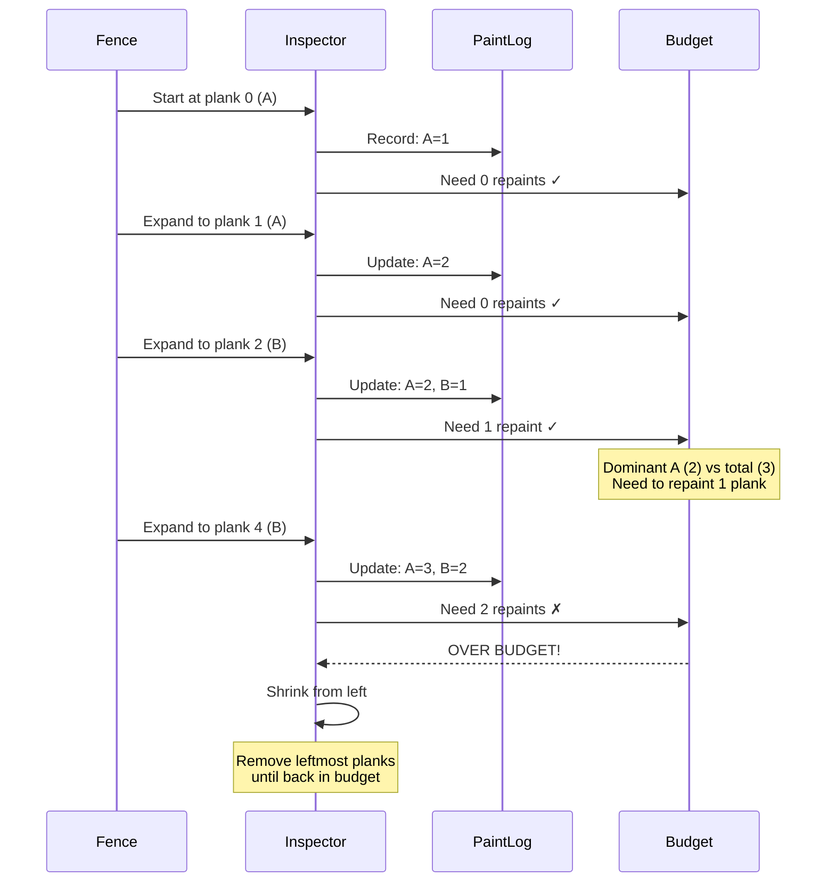

# Longest Repeating Character Replacement - Mental Model

## The Fence Renovation Analogy

Understanding this problem is like being a contractor renovating a long wooden fence where each plank is painted a different color. You have a limited paint budget that lets you repaint exactly `k` planks. Your goal: **find the longest continuous section of fence you can make all one color**.

### Why This Analogy Works

**The core insight:** You want to maximize the fence section by choosing the dominant color and repainting the minority planks to match it.

**Perfect mappings:**
- String `s` → A fence with colored planks (each character = one plank color)
- Integer `k` → Your paint budget (number of planks you can repaint)
- Sliding window → The fence section you're currently examining
- Most frequent character → The dominant plank color in your current section
- Window size - max frequency → Number of planks that need repainting

**Why this analogy and not others:**

The fence renovation analogy is superior because:
- **Natural constraints:** You can only repaint a limited number of planks (k), just like you can only replace k characters
- **Visual clarity:** A fence section is easy to visualize - you can see which planks need repainting
- **The optimization makes sense:** You'd never repaint the majority color; you always repaint minority planks to match the most common color
- **Edge cases are intuitive:** An empty section = no fence, all same color = perfect fence already
- **The sliding window feels natural:** You're literally moving your inspection window along the fence, expanding when budget allows, shrinking when you exceed budget

## Building from the Ground Up

### The Simplest Case: "AAB" with k=1

Imagine a tiny fence with 3 planks:
```
[A] [A] [B]
```

You have budget to repaint 1 plank.

**Let's walk the fence from left to right:**

**Position 0: Looking at plank A**
- Current section: `[A]`
- Plank colors in section: A appears 1 time
- Dominant color: A (appears 1 time)
- Planks needing repaint: 1 (section size) - 1 (dominant) = 0 planks
- Budget needed: 0 ≤ 1 ✓ (within budget!)
- Longest uniform section so far: 1 plank

**Position 1: Expanding to include plank A**
- Current section: `[A] [A]`
- Plank colors: A appears 2 times
- Dominant color: A (appears 2 times)
- Planks needing repaint: 2 - 2 = 0 planks
- Budget needed: 0 ≤ 1 ✓ (within budget!)
- Longest uniform section so far: 2 planks

**Position 2: Expanding to include plank B**
- Current section: `[A] [A] [B]`
- Plank colors: A appears 2 times, B appears 1 time
- Dominant color: A (appears 2 times - the most common)
- Planks needing repaint: 3 - 2 = 1 plank (repaint the B to match A)
- Budget needed: 1 ≤ 1 ✓ (exactly our budget!)
- Longest uniform section so far: 3 planks

**Result:** We can make a 3-plank uniform section by repainting the one B plank to A!



### Adding Complexity: "AABABBA" with k=1

Now imagine a longer fence:
```
[A] [A] [B] [A] [B] [B] [A]
```

You still have budget to repaint only 1 plank. Let's trace through key moments:

| Step | Section           | Planks   | Dominant | Count | Repaints Needed | Budget OK? | Action      | Best Length |
| ---- | ----------------- | -------- | -------- | ----- | --------------- | ---------- | ----------- | ----------- |
| 0    | `[A]`             | A:1      | A        | 1     | 1-1=0           | ✓          | Expand      | 1           |
| 1    | `[A][A]`          | A:2      | A        | 2     | 2-2=0           | ✓          | Expand      | 2           |
| 2    | `[A][A][B]`       | A:2, B:1 | A        | 2     | 3-2=1           | ✓          | Expand      | 3           |
| 3    | `[A][A][B][A]`    | A:3, B:1 | A        | 3     | 4-3=1           | ✓          | Expand      | 4           |
| 4    | `[A][A][B][A][B]` | A:3, B:2 | A        | 3     | 5-3=2           | ✗          | **Shrink!** | 4           |
| 5    | `[A][B][A][B]`    | A:2, B:2 | A or B   | 2     | 4-2=2           | ✗          | **Shrink!** | 4           |
| 6    | `[B][A][B]`       | A:1, B:2 | B        | 2     | 3-2=1           | ✓          | Expand      | 4           |
| 7    | `[B][A][B][B]`    | A:1, B:3 | B        | 3     | 4-3=1           | ✓          | Expand      | **4**       |
| 8    | `[B][A][B][B][A]` | A:2, B:3 | B        | 3     | 5-3=2           | ✗          | Shrink      | 4           |

**What happened at step 4-5?**

When we hit `[A][A][B][A][B]`, we needed to repaint 2 planks (both B's) to match the dominant A color. But our budget only allows 1 repaint!

**The contractor's decision:** Shrink the section from the left until we're back within budget.

**The winning section:** Steps 7 gives us `[B][A][B][B]` - a 4-plank section where we repaint the single A to match the 3 B's!



## What Just Happened?

We discovered the **greedy contractor's strategy**:

1. **Always favor the most common color** - Why repaint 3 planks when you could repaint 2?
2. **Expand greedily** - Keep adding planks to your section as long as your paint budget allows
3. **Shrink reluctantly** - Only when you exceed budget, remove planks from the left
4. **Track the best** - Remember the longest valid section you've seen

The key insight: **You never need to repaint the dominant color**. The math `(section_size - max_frequency)` tells you exactly how many minority planks need repainting.

## Why the Sliding Window Works This Way

### The Paint Budget Formula

```
Planks needing repaint = Total planks in section - Most common plank color count
```

**In fence terms:**
- You're examining a section with 5 planks
- 3 planks are color A, 2 planks are color B
- To make all 5 planks uniform, you paint everything the dominant color (A)
- You need to repaint: 5 - 3 = 2 planks (the B's)

**Why this formula works:**
- The dominant color stays as-is (no repainting needed)
- Every other plank gets repainted to match
- If `planks_to_repaint ≤ k`, you can afford this section!

### Why We Shrink From the Left

Imagine you're over budget at position 7:
```
Section: [A][A][B][A][B][B][X] <- just added this plank
Budget exceeded!
```

**The contractor's logic:**
- The NEW plank on the right is what caused the problem
- But we might still want to KEEP it (it might be the dominant color!)
- Instead, remove old planks from the LEFT side
- This maintains the "sliding" nature - we're moving our focus rightward

**Why not shrink from the right?**
- We just inspected that plank - it might be valuable!
- The leftmost planks are "old news" - we've already considered them
- Sliding left-to-right ensures we examine all possible sections

### The Frequency Tracker (Paint Log)

We keep a logbook of plank colors in our current section:

```typescript
const paintLog = new Map<string, number>();
```

**What it tracks:**
- Key: Plank color (character)
- Value: How many planks of that color in current section

**Why we need it:**
- To quickly find the dominant color (max frequency)
- To update counts as we expand/shrink
- To make smart decisions about repainting

**Example log during inspection:**
```
Section: [A][A][B]
Paint Log: { A: 2, B: 1 }
Dominant: A (frequency = 2)
```

## Common Misconceptions

### ❌ "We need to decide WHICH specific character to convert to"

**Why it's wrong:**

Imagine a fence section `[A][A][B][B]` with k=2. You might think:
- "Should I convert all to A?"
- "Or convert all to B?"

But the algorithm doesn't care! Both strategies need exactly 2 repaints:
- Convert to A: repaint 2 B's
- Convert to B: repaint 2 A's

**The insight:** We only care about the COUNT of the dominant color, not which specific color it is. The formula `section_size - max_frequency` works regardless.

### ✅ "We only track frequencies and use the maximum frequency"

**Why it's right:**

Going back to the fence analogy: if you're renovating a section, you'd naturally pick the most common existing color (to minimize repainting). You don't need to decide upfront - the numbers tell you!

```
Section: [A][A][A][B][C]
Frequencies: A=3, B=1, C=1
Dominant: A (freq=3)
Repaints needed: 5 - 3 = 2
```

Whether you're painting B→A and C→A, or imagining some other color entirely, the math is the same: 2 repaints for a 5-plank section.

### ❌ "When we shrink, we need to find a new dominant color"

**Why it's wrong:**

Imagine you shrink your fence section from `[A][A][B]` to `[A][B]`:
- Old dominant: A (count 2)
- New section: A count drops to 1, B count stays 1

You might think: "Now I need to recalculate which color is dominant!"

But actually, **you only care about the maximum frequency count**. Even if the dominant color changes, the frequency tracker automatically reflects the new state.

### ✅ "The frequency tracker stays accurate as we slide"

**Why it's right:**

```
Adding a plank (expand right):
  paintLog[newPlank] += 1

Removing a plank (shrink left):
  paintLog[oldPlank] -= 1
```

The log always shows the true state of your current section. The dominant color is just `max(all frequencies)` - you recalculate it each time, no special logic needed.

## Try It Yourself

**Scenario:** You're renovating a fence `"AABAABB"` with budget k=2.

Trace through these steps using the fence analogy:

1. Start with section `[A]`
2. Expand to `[A][A]`
3. Expand to `[A][A][B]`
4. Expand to `[A][A][B][A]`
5. Expand to `[A][A][B][A][A]`
6. Expand to `[A][A][B][A][A][B]`
7. Expand to `[A][A][B][A][A][B][B]`

**Questions:**
- At which step do you first exceed budget?
- When you exceed budget, how many planks do you remove from the left?
- What's the longest uniform section you can create?

**Hint:** Use the paint budget formula at each step:
```
Repaints needed = section_size - max_frequency_in_section
```

<details>
<summary>Answer</summary>

**Step-by-step:**

| Step | Section | Paint Log | Dominant Freq | Repaints Needed | Valid? | Best |
|------|---------|-----------|---------------|-----------------|--------|------|
| 1 | [A] | A:1 | 1 | 1-1=0 | ✓ | 1 |
| 2 | [A][A] | A:2 | 2 | 2-2=0 | ✓ | 2 |
| 3 | [A][A][B] | A:2,B:1 | 2 | 3-2=1 | ✓ | 3 |
| 4 | [A][A][B][A] | A:3,B:1 | 3 | 4-3=1 | ✓ | 4 |
| 5 | [A][A][B][A][A] | A:4,B:1 | 4 | 5-4=1 | ✓ | 5 |
| 6 | [A][A][B][A][A][B] | A:4,B:2 | 4 | 6-4=2 | ✓ | **6** |
| 7 | [A][A][B][A][A][B][B] | A:4,B:3 | 4 | 7-4=3 | ✗ | 6 |

**Answer:**
- First exceed budget at step 7 (need 3 repaints, only have k=2)
- Need to shrink by removing leftmost planks until repaints ≤ 2
- Longest uniform section: **6 planks** (step 6, before exceeding budget)

</details>

## The Algorithm in Plain English

**Using our fence renovation framework:**

1. **Start at the left end of the fence** with an empty section
2. **Keep a paint log** tracking plank colors in your current section
3. **For each plank moving right:**
   - Add the plank to your section
   - Update the paint log with this plank's color
   - Calculate the dominant color frequency (most common plank in section)
   - Calculate repaints needed: `section_size - dominant_frequency`

4. **Check your paint budget:**
   - If `repaints_needed ≤ k`: Great! This section is affordable
   - If `repaints_needed > k`: Shrink from the left:
     - Remove the leftmost plank from your section
     - Update paint log (decrease that color's count)
     - Keep shrinking until back within budget

5. **Track the best:** Remember the longest valid section you've seen

6. **Return the longest uniform section length** after inspecting the entire fence

**The key realization:** You're not actually repainting anything - you're just measuring which sections COULD be made uniform within budget!

## Complete Solution

```typescript
function characterReplacement(s: string, k: number): number {
  // Our fence inspection tools
  const paintLog = new Map<string, number>();

  let sectionStart = 0;  // Left edge of current fence section
  let longestUniform = 0;  // Best section we've found
  let dominantColorCount = 0;  // Most common plank color in current section

  // Walk the fence from left to right
  for (let sectionEnd = 0; sectionEnd < s.length; sectionEnd++) {
    const currentPlank = s[sectionEnd];

    // Add this plank to our section and update paint log
    paintLog.set(currentPlank, (paintLog.get(currentPlank) || 0) + 1);

    // Update the dominant color count (most common plank)
    dominantColorCount = Math.max(dominantColorCount, paintLog.get(currentPlank)!);

    // Calculate our paint budget: how many planks need repainting?
    const sectionSize = sectionEnd - sectionStart + 1;
    const repaints = sectionSize - dominantColorCount;

    // If we're over budget, shrink the section from the left
    if (repaints > k) {
      const leftmostPlank = s[sectionStart];
      paintLog.set(leftmostPlank, paintLog.get(leftmostPlank)! - 1);
      sectionStart++;  // Move left edge right (shrink section)
    }

    // Track the longest valid section we've seen
    // (current section size after any necessary shrinking)
    const currentSectionSize = sectionEnd - sectionStart + 1;
    longestUniform = Math.max(longestUniform, currentSectionSize);
  }

  return longestUniform;
}
```

**Tracing the fence analogy:**

```typescript
// Example: s = "AABABBA", k = 1

// Iteration 1: sectionEnd=0, plank='A'
paintLog = { A: 1 }
dominantColorCount = 1
sectionSize = 0-0+1 = 1
repaints = 1-1 = 0 ≤ 1 ✓
longestUniform = 1

// Iteration 2: sectionEnd=1, plank='A'
paintLog = { A: 2 }
dominantColorCount = 2
sectionSize = 1-0+1 = 2
repaints = 2-2 = 0 ≤ 1 ✓
longestUniform = 2

// Iteration 3: sectionEnd=2, plank='B'
paintLog = { A: 2, B: 1 }
dominantColorCount = 2 (A is still dominant)
sectionSize = 2-0+1 = 3
repaints = 3-2 = 1 ≤ 1 ✓
longestUniform = 3

// Iteration 4: sectionEnd=3, plank='A'
paintLog = { A: 3, B: 1 }
dominantColorCount = 3
sectionSize = 3-0+1 = 4
repaints = 4-3 = 1 ≤ 1 ✓
longestUniform = 4  // Best section so far!

// Iteration 5: sectionEnd=4, plank='B'
paintLog = { A: 3, B: 2 }
dominantColorCount = 3
sectionSize = 4-0+1 = 5
repaints = 5-3 = 2 > 1 ✗  // OVER BUDGET!
// Shrink: remove leftmost plank (s[0]='A')
paintLog = { A: 2, B: 2 }
sectionStart = 1
currentSectionSize = 4-1+1 = 4
longestUniform = 4

// Continue until end...
// Final answer: 4
```

**The fence contractor's wisdom:**
- We never actually repaint - we're just measuring possibilities
- The sliding window naturally finds all valid sections
- The dominant color (most common plank) minimizes repainting costs
- When over budget, we shift our focus rightward by shrinking from the left

---

**Complexity:**
- **Time:** O(n) - We visit each plank once with our sliding window
- **Space:** O(26) = O(1) - Paint log tracks at most 26 uppercase letters

**Sources:**
- [Longest Repeating Character Replacement - LeetCode](https://leetcode.com/problems/longest-repeating-character-replacement/)
- [424. Longest Repeating Character Replacement - In-Depth Explanation](https://algo.monster/liteproblems/424)
- [424. Longest Repeating Character Replacement - Solution & Explanation](https://neetcode.io/solutions/longest-repeating-character-replacement)