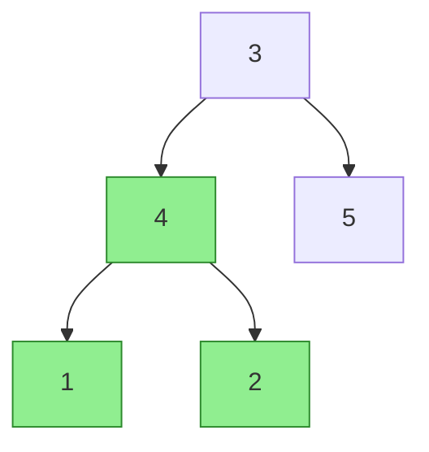
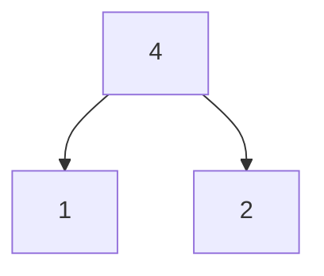

# Subtree of Another Tree - Mental Model

## The Rubber Stamp Analogy

Understanding this problem is like trying to find where a rubber stamp's pattern appears on a large piece of paper.

---

## Understanding the Analogy (No Code Yet!)

### The Setup

You have two things:

- **The stamp** (`subRoot`): a rubber stamp carved with a specific branching pattern. It has a central post (the root value) that splits into left and right branches, which may split further. The stamp's shape never changes — it always stays the same regardless of where you hold it.
- **The paper** (`root`): a large sheet with many branching patterns printed across it, forming a big tree of branches.

Your job: find out if the stamp's pattern appears **anywhere** on the paper as a complete, exact impression.

### Browsing Mode: Only Your Position Changes

The first thing you do is move the stamp across the paper, hovering it over each branch point one at a time. You're not pressing yet — you're just asking: *"Could the stamp's top post align here?"*

While browsing, notice what stays fixed and what changes:
- **Your position on the paper** changes. You move from branch point to branch point.
- **The stamp's shape** never changes. You always hold the same stamp, and you always offer its top post first.

If the top post of the stamp doesn't match the branch point you're hovering over, you don't stop. You keep moving — try the left branch on the paper, try the right branch. You never give up just because one branch point didn't match. The whole paper has to be searched.

### Stamping Mode: Everything Moves Together

When you find a branch point on the paper whose value matches the stamp's top post, you shift into a completely different mode. You **press the stamp down** and check the impression.

Now both the stamp and the paper move together in lockstep:
- Check the top post: match? Good, proceed.
- Check the left branch of the stamp against the left branch of the paper — simultaneously.
- Check the right branch of the stamp against the right branch of the paper — simultaneously.
- Move deeper, always comparing both sides together at every level.

Here's what changes in stamping mode: if **any** detail doesn't match — even a single branch ending too early, or one too late — you immediately **lift the stamp** and declare this position a failure. No trying the left branch. No trying the right. The entire impression is dead the moment any mismatch appears.

### The Critical Difference

The same event — a **mismatch** — produces completely opposite responses depending on which mode you're in:

| Mode         | What you're doing         | Mismatch response                      |
| ------------ | ------------------------- | -------------------------------------- |
| **Browsing** | Moving stamp across paper | Keep going — try the next branch point |
| **Stamping** | Pressing stamp down       | Stop immediately — lift the stamp      |

This is the core reason you need two separate functions. One function cannot return "keep going" and "stop immediately" for the same condition. The moment you write that contradiction down, you know you need to split into two functions.

### Simple Example Through the Analogy

Paper (root):
```
    3
   / \
  4   5
 / \
1   2
```

Stamp (subRoot):
```
  4
 / \
1   2
```

- **Hover at branch point 3**: stamp's top post says 4. Does 3 = 4? No. Keep browsing.
- **Move left, hover at branch point 4**: stamp's top post says 4. Does 4 = 4? Yes. Press the stamp down.
  - Stamp's left branch (1) vs paper's left branch (1): match. Go deeper.
    - Stamp ends here (null). Paper ends here (null). Match.
  - Stamp's right branch (2) vs paper's right branch (2): match. Go deeper.
    - Stamp ends here (null). Paper ends here (null). Match.
  - Every detail matched. The stamp's impression is perfect. **Found it.**

Now you understand HOW to solve the problem. Let's translate this to code.

---

## How I Think Through This

The problem asks whether `subRoot` exists as a complete, exact subtree anywhere inside `root`. The key insight is that answering this requires two separate jobs. The first job, handled by `isSubtree`, is pure wandering: at every node in `root`, you ask "does the stamp fit here?" — and `subRoot` never moves, it stays frozen at its own root every single time you try. If the stamp fits, you're done. If it doesn't, you recurse into `root.left` and `root.right`, always offering the same unchanged `subRoot`. The second job, handled by the helper `stampMatches`, is strict simultaneous verification: both pointers advance together in lockstep, and any single mismatch — including one tree ending while the other continues — returns `false` immediately. The rule that makes this correct: `stampMatches` must confirm that both trees reach `null` at the same moment, not just that their values match where nodes exist.

Take `root = [3, 4, 5, 1, 2]` and `subRoot = [4, 1, 2]`. Start browsing at node 3 in `isSubtree` — try `stampMatches(node3, subRoot)`. Values 3 ≠ 4, immediately return false. Recurse left: now at node 4, try `stampMatches(node4, subRoot)`. Values 4 = 4, proceed. Go left: `stampMatches(node1, subRoot.left)`, values 1 = 1. Go deeper left: both null, return true. Go deeper right: both null, return true. Node 1 fully verified. Go right: `stampMatches(node2, subRoot.right)`, values 2 = 2. Both children are null on both sides — return true. `stampMatches` returns true all the way up. `isSubtree` sees the stamp fit at node 4 and returns true.

---

## Building the Algorithm Step-by-Step

### Step 1: The Stamp's Impression (The Verification Helper)

**In our analogy:** Once the stamp is pressed down, both sides advance together. Any mismatch — including one side ending before the other — lifts the stamp immediately.

**In code:**
```typescript
function stampMatches(stampNode: TreeNode | null, paperNode: TreeNode | null): boolean {
  if (!stampNode && !paperNode) return true;   // Both ended: perfect match
  if (!stampNode || !paperNode) return false;  // One ended early: lift the stamp
  if (stampNode.val !== paperNode.val) return false;  // Values differ: lift the stamp
}
```

**Why:** The three base cases capture all the "lift the stamp" moments. Notice there is no "keep browsing" here — every mismatch returns `false` immediately.

### Step 2: Continue the Stamp Press Deeper

**In our analogy:** If the current post matches, check both sub-branches together in lockstep. Both branches must pass — it's not enough for just the left to match.

**Adding to our code:**
```typescript
function stampMatches(stampNode: TreeNode | null, paperNode: TreeNode | null): boolean {
  if (!stampNode && !paperNode) return true;
  if (!stampNode || !paperNode) return false;
  if (stampNode.val !== paperNode.val) return false;

  return stampMatches(stampNode.left, paperNode.left)
      && stampMatches(stampNode.right, paperNode.right);
}
```

**Why:** The `&&` reflects "lockstep" — both the left branch pair and the right branch pair must match. One bad branch collapses the whole impression.

### Step 3: The Browsing Function

**In our analogy:** Move the stamp across every branch point in the paper. If hovering doesn't find a candidate, keep moving left and right. If pressing finds a match, we're done.

**The complete algorithm:**
```typescript
function stampMatches(stampNode: TreeNode | null, paperNode: TreeNode | null): boolean {
  if (!stampNode && !paperNode) return true;
  if (!stampNode || !paperNode) return false;
  if (stampNode.val !== paperNode.val) return false;
  return stampMatches(stampNode.left, paperNode.left)
      && stampMatches(stampNode.right, paperNode.right);
}

function isSubtree(root: TreeNode | null, subRoot: TreeNode | null): boolean {
  if (!root) return false;                        // Ran out of paper — not found
  if (stampMatches(root, subRoot)) return true;  // Stamp fits here — found it
  return isSubtree(root.left, subRoot)           // Keep browsing left...
      || isSubtree(root.right, subRoot);         // ...or right
}
```

**Why:** Notice `subRoot` never changes inside `isSubtree` — it's always passed unchanged. You're always offering the same stamp. Only your position on the paper (`root`) advances.

---

## Tracing Through an Example

**Paper (root):**


**Stamp (subRoot):**


**Browsing trace:**

| Step | Paper position    | Stamp top | Mode     | Result                      |
| ---- | ----------------- | --------- | -------- | --------------------------- |
| 1    | Node 3            | 4         | Hover    | 3 ≠ 4, keep browsing        |
| 2    | Node 4            | 4         | Hover    | 4 = 4, press stamp          |
| 3    | Node 4 vs Stamp 4 | —         | Stamping | Values match, go deeper     |
| 4    | Node 1 vs Stamp 1 | —         | Stamping | Values match, go deeper     |
| 5    | null vs null      | —         | Stamping | Both ended → true           |
| 6    | null vs null      | —         | Stamping | Both ended → true           |
| 7    | Node 2 vs Stamp 2 | —         | Stamping | Values match, go deeper     |
| 8    | null vs null      | —         | Stamping | Both ended → true           |
| 9    | null vs null      | —         | Stamping | Both ended → true           |
| 10   | —                 | —         | —        | Stamp matched ✓ return true |

---

## Common Misconceptions

### ❌ "I can combine the browsing and stamping into one function"

The browsing function uses `||` — if left doesn't work, try right. The stamping function uses `&&` — left AND right must both work. These are not the same logic and cannot live in the same function without a flag or extra parameter telling you which mode you're in. Two different jobs, two different functions.

### ❌ "I only need to check values, not nulls"

If the paper has a node where the stamp has nothing (or vice versa), the trees don't match. The stamp impression must line up perfectly — including where branches end. `stampMatches(null, node)` must return `false`, not `true`.

### ✅ "subRoot never changes inside isSubtree"

Every recursive call to `isSubtree` passes the original `subRoot`. You're always holding the same stamp. The only thing that changes is which branch point on the paper you're hovering over.

---

## Try It Yourself

**Paper:**
```
    3
   / \
  4   5
 / \
1   2
   /
  0
```
**Stamp:**
```
  4
 / \
1   2
```

Walk through the browsing. When you get to node 4, press the stamp. At what point does the stamp fail? What does `stampMatches` return and why?

*(The stamp presses onto node 4, goes right to node 2, then tries to go left into the paper's node 0 — but the stamp has nothing on its left of node 2. One side continues, the other ended. Mismatch. Lift the stamp.)*
