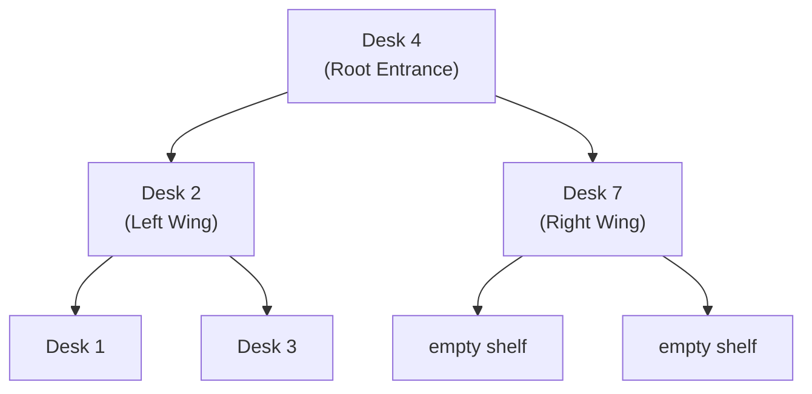
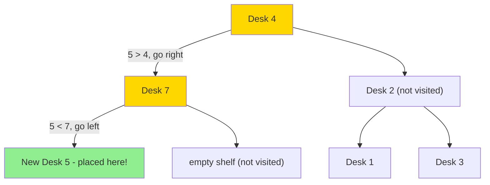

# 701. Insert into a Binary Search Tree — Mental Model

## The Library Shelving System Analogy

Understanding this problem is like being a librarian who must shelve a new book in a perfectly organized library where every book has exactly one correct home — and the library's own structure guides you straight to it.

---

## Understanding the Analogy (No Code Yet!)

### The Setup

Imagine a library organized by catalog number, but not arranged on a single long shelf. Instead, it's a branching network of reference desks. At the entrance sits the head librarian's desk (the root node). Every desk holds exactly one reference catalog number. To the left of each desk is a wing containing all books with **smaller** catalog numbers. To the right is a wing containing all books with **larger** catalog numbers.

This rule is enforced at every single desk, all the way down to the most remote corner of the library. Because of this, the structure tells you everything: you never have to wander randomly or check every desk. You always know which wing holds the correct spot for any given book.

### How It Works

When a new book arrives, you carry it to the entrance desk (root) and compare its catalog number to the reference number there. If the new book's number is smaller, you turn left and walk to the next desk in the left wing. If it's larger, you turn right. At each desk you visit, you repeat this same comparison — one binary decision, no hesitation.

You keep walking deeper into the library, one desk at a time, until you arrive at a spot that has no desk — an empty shelf. That empty shelf is the one and only correct home for this new book. You place a new desk there and the library remains perfectly organized.

The key insight: because the rule is enforced at every desk, there is always exactly one empty shelf where the new book belongs. You don't search for it — the decisions lead you there automatically.

### Why This Approach

The BST property is a guarantee, not just a suggestion. Every time you stand at a desk and decide to go left, you are committing: "the correct slot is somewhere in this left wing — I will never need to come back and check the right." Each decision permanently eliminates half the remaining library from consideration.

This is why the recursion always terminates: every step brings you one desk deeper, and the library has finite depth. An empty shelf must eventually appear, and when it does, that's your spot.

### How I Think Through This

I start at the root and ask one question at every desk: is my new catalog number smaller or larger than this desk's reference number? If smaller, I recurse into `root.left`; if larger, into `root.right`. The base case is the real payoff — if I arrive at `null` (an empty shelf), that is exactly where the new book belongs, so I return a brand-new node holding `val`. Each recursive call returns its result back to the desk above it, which re-attaches it as its left or right child. This threading of return values is the key mechanic: the new node gets linked into the tree through the unwinding of the call stack, not through any explicit pointer-setting at insertion time. The root is returned at the top so the caller always receives back the same tree, now containing the new book.

Take `root = [4,2,7,1,3]`, inserting `val = 5`. At desk 4: `5 > 4`, recurse right to desk 7. At desk 7: `5 < 7`, recurse left — that left child is `null`. Empty shelf found. Return `new TreeNode(5)`. Back at desk 7: `root.left` becomes the new desk 5, desk 7 returns itself. Back at desk 4: `root.right` is still desk 7 (unchanged), desk 4 returns itself. The tree is now `[4,2,7,1,3,5]` and every BST rule is still satisfied.

### Simple Example Through the Analogy

The library holds books with catalog numbers `[4, 2, 7, 1, 3]`. A new book arrives: catalog number `5`.

- **Desk 4 (entrance):** New book 5 > reference 4 → turn right, enter right wing
- **Desk 7 (right wing):** New book 5 < reference 7 → turn left, enter left wing
- **Empty shelf (left of desk 7):** No desk here — this is our spot! Place the new desk here.

The library now has a desk 5 sitting to the left of desk 7. Every desk still obeys the rule: left = smaller, right = larger.

Now you understand HOW to solve the problem. Let's translate this to code.

---

## Building the Algorithm Step-by-Step

### Step 1: Arriving at an Empty Shelf (Base Case)

**In our analogy:** You walk to a spot and there's no desk — this is the correct empty shelf for your new book. Place a new desk here.

**In code:**
```typescript
if (root === null) {
    return new TreeNode(val);  // Place the new book here
}
```

**Why:** Every insertion must eventually reach `null`. When it does, that's the exact slot the BST property guided us to. We create and return a new node.

### Step 2: Navigate Left or Right

**In our analogy:** At each desk, compare the new book's number to the reference. Smaller → left wing, larger → right wing.

**Adding to our code:**
```typescript
if (root === null) {
    return new TreeNode(val);
}

if (val < root.val) {
    root.left = insertIntoBST(root.left, val);   // Walk into left wing
} else {
    root.right = insertIntoBST(root.right, val); // Walk into right wing
}
```

**Why:** We pass the child subtree into a recursive call. When it returns, it hands back either the same child (if it went deeper) or a brand-new node (if it found the empty shelf). We store that return value back into `root.left` or `root.right` — that's how the new desk gets attached to its parent.

### Step 3: Return the Updated Desk

**In our analogy:** After sending a colleague into the wing to shelve the book, the current desk remains in place and reports back to whoever sent you here.

**Complete algorithm:**
```typescript
function insertIntoBST(root: TreeNode | null, val: number): TreeNode | null {
    if (root === null) {
        return new TreeNode(val);  // Found the empty shelf — place the book
    }

    if (val < root.val) {
        root.left = insertIntoBST(root.left, val);   // Recurse into left wing
    } else {
        root.right = insertIntoBST(root.right, val); // Recurse into right wing
    }

    return root;  // This desk is unchanged — pass it back up
}
```

**Why:** `return root` is essential. Every desk on the path must return itself so the chain stays intact. Only the empty shelf returns something new.

---

## Tracing Through an Example

**Inserting `5` into `[4, 2, 7, 1, 3]`**

**The library before insertion:**



**The path catalog #5 takes:**



**Call stack trace:**

| Desk Visited         | New Book # | Decision         | Action                                   |
|----------------------|------------|------------------|------------------------------------------|
| Desk 4 (root)        | 5          | 5 > 4 → right    | recurse right                            |
| Desk 7               | 5          | 5 < 7 → left     | recurse left                             |
| null                 | 5          | empty shelf!     | return new TreeNode(5)                   |
| Desk 7 (unwinding)   | —          | —                | root.left = new Desk 5, return desk 7    |
| Desk 4 (unwinding)   | —          | —                | root.right = desk 7, return desk 4       |

---

## Common Misconceptions

### ❌ "I need to track the parent to set the pointer manually"

A common instinct is to carry a `parent` reference so you can do `parent.left = new TreeNode(val)` when you find the empty shelf. You don't need it. The return value pattern does this automatically — each desk sets its own left or right child to whatever comes back from the recursive call.

### ✅ "The return value threads the new node back up"

When the base case returns `new TreeNode(val)`, the desk above it does `root.left = <that new node>`. Then desk 7 returns itself, and desk 4 does `root.right = desk 7`. The new node propagates back through the unwinding of the call stack — no parent tracking required.

### ❌ "I might need to restructure the tree after inserting"

In a plain BST (not a self-balancing tree like AVL or Red-Black), you never restructure on insert. The BST property guarantees there is exactly one correct empty slot, and inserting there preserves all BST rules automatically. You shelve the book and walk away.

---

## Try It Yourself

**The library holds:** `[40, 20, 60, 10, 30, 50, 70]`
**New book arriving:** catalog number `25`

Walk through it:
1. Desk 40: 25 < 40 → enter which wing?
2. Desk 20: 25 > 20 → enter which wing?
3. Desk 30: 25 < 30 → go left → empty shelf found!
4. New desk 25 is placed as the **left child of desk 30**

**Inorder traversal of the result:** `[10, 20, 25, 30, 40, 50, 60, 70]` — still perfectly sorted!
