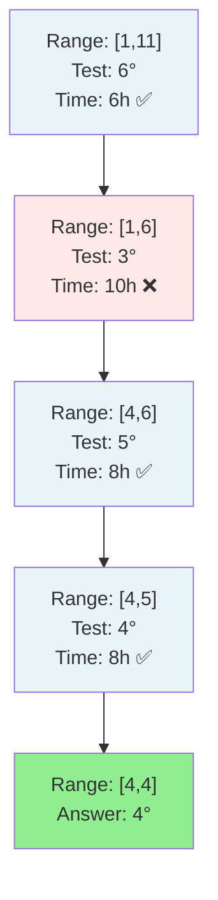

# Koko Eating Bananas - Mental Model

## The Thermostat Testing Analogy

Understanding this problem is like finding the lowest thermostat setting that will heat your home to a comfortable temperature by a deadline.

**How the analogy maps to the problem:**
- **Banana piles** → Rooms of different sizes to heat
- **Eating speed k** → Thermostat temperature setting
- **Hours h** → Time deadline before guests arrive
- **Time to finish one pile** → Time to heat one room at current setting
- **Binary search** → Efficiently testing settings to find minimum

## Understanding the Analogy (No Code Yet!)

### The Setup

Imagine you have a house with several rooms of different sizes, and you have a portable heater with adjustable temperature settings (1°, 2°, 3°, etc.). Guests are arriving in exactly `h` hours, and you need all rooms to be heated to a comfortable temperature by then.

Here's the catch: You can only heat one room at a time. Once you start heating a room, you must fully heat it before moving to the next room. If a room is small and heats up faster than one hour, you still spend the full hour in that room (you can't partially heat the next room).

Your goal: Find the **lowest temperature setting** that will heat all rooms before your guests arrive. Setting it too low means you won't finish in time. Setting it too high works, but wastes energy.

### How It Works

**The Heating Process:**

When you set the heater to a specific temperature setting (let's say setting 4), you work through each room one by one:
- For a **small room** (say, 3 cubic meters): At setting 4, this heats in less than 1 hour, but you still spend the full hour there
- For a **medium room** (say, 7 cubic meters): At setting 4, this takes exactly `ceil(7/4) = 2` hours
- For a **large room** (say, 11 cubic meters): At setting 4, this takes `ceil(11/4) = 3` hours

You add up the time for all rooms. If the total time is ≤ your deadline, this setting works!

**The Search Process:**

Instead of testing every single temperature setting (1°, 2°, 3°, 4°...), you use a smart search strategy:

1. **Set your bounds**: The lowest possible setting is 1° (slowest). The highest you'd ever need is equal to the largest room size (because at that setting, even the biggest room takes exactly 1 hour).

2. **Test the middle**: Pick the temperature setting halfway between your min and max.

3. **Check if it works**: Simulate heating all rooms at this setting. Add up the total hours.

4. **Narrow your search**:
   - If it works (total time ≤ deadline): You might be able to go even lower! Search the lower half.
   - If it doesn't work (total time > deadline): You need a higher setting. Search the upper half.

5. **Repeat**: Keep narrowing until you find the exact minimum setting that works.

**The Key Insight:**

This works because temperature settings are **monotonic**:
- If setting 5 heats all rooms in time, then settings 6, 7, 8... will also work (higher is never worse)
- If setting 3 doesn't heat all rooms in time, then settings 2, 1 won't work either (lower won't help)

This creates a sorted pattern: `[too-low, too-low, just-right, works, works, works...]`

Binary search efficiently finds the first "just-right" setting.

### Why This Approach

**Why not just use the largest room size as your setting?**

Sure, that always works (the biggest room takes 1 hour, all other rooms take 1 hour each). But if you have 4 rooms and an 8-hour deadline, you're only using 4 hours total. You could use a lower setting and still finish on time!

**Why not just divide total room volume by hours?**

That assumes you can split rooms across hours, but you can't. You must fully heat each room before moving to the next. A room's heating time rounds UP (you can't heat 0.3 of a room and move on).

**Why binary search instead of testing every setting?**

Testing 1°, 2°, 3°, 4°... works but is slow. Binary search cuts the search space in half each time, making it much faster (especially when the largest room is huge, like 1,000,000 cubic meters).

### Simple Example Through the Analogy

**Rooms:** [3, 6, 7, 11] cubic meters
**Deadline:** 8 hours

Let's find the minimum thermostat setting:

**Initial bounds:** [1°, 11°] (1 is minimum, 11 is the largest room)

---

**Test setting 6°** (middle of 1 and 11):
- Room 3: `ceil(3/6) = 1` hour
- Room 6: `ceil(6/6) = 1` hour
- Room 7: `ceil(7/6) = 2` hours
- Room 11: `ceil(11/6) = 2` hours
- **Total: 6 hours** ✅ Works! (6 ≤ 8)

Since 6° works, maybe a lower setting also works. New bounds: [1°, 6°]

---

**Test setting 3°** (middle of 1 and 6):
- Room 3: `ceil(3/3) = 1` hour
- Room 6: `ceil(6/3) = 2` hours
- Room 7: `ceil(7/3) = 3` hours
- Room 11: `ceil(11/3) = 4` hours
- **Total: 10 hours** ❌ Too slow! (10 > 8)

Setting 3° doesn't work. New bounds: [4°, 6°]

---

**Test setting 5°** (middle of 4 and 6):
- Room 3: `ceil(3/5) = 1` hour
- Room 6: `ceil(6/5) = 2` hours
- Room 7: `ceil(7/5) = 2` hours
- Room 11: `ceil(11/5) = 3` hours
- **Total: 8 hours** ✅ Works! (8 ≤ 8)

Setting 5° works. New bounds: [4°, 5°]

---

**Test setting 4°** (middle of 4 and 5):
- Room 3: `ceil(3/4) = 1` hour
- Room 6: `ceil(6/4) = 2` hours
- Room 7: `ceil(7/4) = 2` hours
- Room 11: `ceil(11/4) = 3` hours
- **Total: 8 hours** ✅ Works! (8 ≤ 8)

Setting 4° works. New bounds: [4°, 4°]

---

**Answer: 4°** is the minimum thermostat setting that heats all rooms within 8 hours.

Now you understand HOW to solve the problem using the thermostat analogy. Let's translate this mental model into code.

---

## Building the Algorithm Step-by-Step

Now we'll translate each part of our thermostat mental model into code.

### Step 1: Setting the Search Bounds

**In our analogy:** We need to know the range of temperature settings to test—minimum is 1°, maximum is the largest room size.

**In code:**

```typescript
function minEatingSpeed(piles: number[], h: number): number {
    let minSetting = 1;
    let maxSetting = Math.max(...piles);
}
```

**Why:**
- `minSetting = 1`: Lowest possible temperature (like eating 1 banana per hour)
- `maxSetting = Math.max(...piles)`: The largest room sets our upper bound—any higher is wasteful

---

### Step 2: The Testing Function

**In our analogy:** We need a way to simulate: "At this temperature setting, how long does it take to heat all rooms?"

**Adding to our code:**

```typescript
function minEatingSpeed(piles: number[], h: number): number {
    let minSetting = 1;
    let maxSetting = Math.max(...piles);

    const canFinishInTime = (setting: number): boolean => {
        let totalHours = 0;

        for (const roomSize of piles) {
            const hoursForRoom = Math.ceil(roomSize / setting);
            totalHours += hoursForRoom;
        }

        return totalHours <= h;
    };
}
```

**Why:**
- `Math.ceil(roomSize / setting)`: A room of size 7 at setting 3 takes `ceil(7/3) = 3` hours
- We use ceiling because partial hours round up—you can't heat 0.3 of a room
- Loop through all rooms (piles) to get total time
- Return true if we meet the deadline

---

### Step 3: Binary Search Over Settings

**In our analogy:** Test the middle setting, then narrow the search based on whether it works or not.

**The logic:**

```typescript
function minEatingSpeed(piles: number[], h: number): number {
    let minSetting = 1;
    let maxSetting = Math.max(...piles);

    const canFinishInTime = (setting: number): boolean => {
        let totalHours = 0;
        for (const roomSize of piles) {
            totalHours += Math.ceil(roomSize / setting);
        }
        return totalHours <= h;
    };

    while (minSetting < maxSetting) {
        const testSetting = Math.floor((minSetting + maxSetting) / 2);

        if (canFinishInTime(testSetting)) {
            maxSetting = testSetting;  // Works! Try lower
        } else {
            minSetting = testSetting + 1;  // Too slow, go higher
        }
    }
}
```

**Why:**
- `testSetting = Math.floor((minSetting + maxSetting) / 2)`: Test the middle temperature
- If test passes: This setting works, but maybe a lower one also works → `maxSetting = testSetting`
- If test fails: Setting is too low, we need higher → `minSetting = testSetting + 1`
- Loop until `minSetting === maxSetting`—we've found the minimum!

---

### Step 4: Returning the Answer

**In our analogy:** When our search bounds converge to a single value, that's the minimum temperature setting that meets the deadline.

**Complete algorithm:**

```typescript
function minEatingSpeed(piles: number[], h: number): number {
    let minSetting = 1;
    let maxSetting = Math.max(...piles);

    const canFinishInTime = (setting: number): boolean => {
        let totalHours = 0;
        for (const roomSize of piles) {
            totalHours += Math.ceil(roomSize / setting);
        }
        return totalHours <= h;
    };

    while (minSetting < maxSetting) {
        const testSetting = Math.floor((minSetting + maxSetting) / 2);

        if (canFinishInTime(testSetting)) {
            maxSetting = testSetting;
        } else {
            minSetting = testSetting + 1;
        }
    }

    return minSetting;  // Minimum setting that works
}
```

**Why:**
- When the loop exits, `minSetting === maxSetting`
- This is the smallest temperature setting where `canFinishInTime` returns true
- Return it as the answer!

---

## Tracing Through an Example

Let's trace through: **piles = [3, 6, 7, 11], h = 8**

**In analogy terms:** 4 rooms (sizes 3, 6, 7, 11), deadline 8 hours

### Initial State
- **Search range:** [1°, 11°]

### Iteration 1: Test setting 6°

| Room | Size | Hours at 6° | Calculation |
|------|------|-------------|-------------|
| 1    | 3    | 1           | ceil(3/6) = 1 |
| 2    | 6    | 1           | ceil(6/6) = 1 |
| 3    | 7    | 2           | ceil(7/6) = 2 |
| 4    | 11   | 2           | ceil(11/6) = 2 |
| **Total** | | **6 hours** | 6 ≤ 8 ✅ |

**Result:** 6° works! Try lower.
**New range:** [1°, 6°]

---

### Iteration 2: Test setting 3°

| Room | Size | Hours at 3° | Calculation |
|------|------|-------------|-------------|
| 1    | 3    | 1           | ceil(3/3) = 1 |
| 2    | 6    | 2           | ceil(6/3) = 2 |
| 3    | 7    | 3           | ceil(7/3) = 3 |
| 4    | 11   | 4           | ceil(11/3) = 4 |
| **Total** | | **10 hours** | 10 > 8 ❌ |

**Result:** 3° is too low!
**New range:** [4°, 6°]

---

### Iteration 3: Test setting 5°

| Room | Size | Hours at 5° | Calculation |
|------|------|-------------|-------------|
| 1    | 3    | 1           | ceil(3/5) = 1 |
| 2    | 6    | 2           | ceil(6/5) = 2 |
| 3    | 7    | 2           | ceil(7/5) = 2 |
| 4    | 11   | 3           | ceil(11/5) = 3 |
| **Total** | | **8 hours** | 8 ≤ 8 ✅ |

**Result:** 5° works! Try lower.
**New range:** [4°, 5°]

---

### Iteration 4: Test setting 4°

| Room | Size | Hours at 4° | Calculation |
|------|------|-------------|-------------|
| 1    | 3    | 1           | ceil(3/4) = 1 |
| 2    | 6    | 2           | ceil(6/4) = 2 |
| 3    | 7    | 2           | ceil(7/4) = 2 |
| 4    | 11   | 3           | ceil(11/4) = 3 |
| **Total** | | **8 hours** | 8 ≤ 8 ✅ |

**Result:** 4° works!
**New range:** [4°, 4°]

---

### Final Answer
**minSetting === maxSetting === 4**

The minimum thermostat setting is **4°**. Any lower and we exceed the deadline.

**Binary search progression:**



---

## Common Misconceptions

### ❌ "Just divide total volume by hours: sum(piles) / h"

**Why it's wrong in our analogy:**

This assumes you can split rooms across hours—like heating half of one room, then moving to the next. But you can't! You must fully heat each room before moving to the next.

**Example:**
- Rooms: [30, 11, 23, 4, 20], deadline: 5 hours
- Average: (30+11+23+4+20) / 5 = 17.6°

But at setting 17°:
- Room 30: ceil(30/17) = 2 hours
- Room 11: ceil(11/17) = 1 hour
- Room 23: ceil(23/17) = 2 hours
- Room 4: ceil(4/17) = 1 hour
- Room 20: ceil(20/17) = 2 hours
- **Total: 8 hours** (not 5!)

The average doesn't account for the room boundary constraint.

---

### ❌ "Why not just use the max room size as the setting?"

**Why it's wasteful in our analogy:**

Yes, setting the thermostat to the largest room size always works (that room takes 1 hour, all others take ≤1 hour each). But you might have plenty of time!

**Example:**
- Rooms: [3, 6, 7, 11], deadline: 8 hours
- Max room: 11° → works in 4 hours total
- But setting 4° also works in exactly 8 hours → **4° is the minimum**

Using 11° wastes energy. We want the **minimum** setting that meets the deadline.

---

### ✅ "Binary search works because settings are monotonic"

**Why it's right in our analogy:**

If thermostat setting 5° heats all rooms in time, then 6°, 7°, 8°... also will (higher is never worse).

If setting 3° doesn't finish in time, then 2°, 1° won't either (lower won't help).

This creates a sorted answer space: `[fail, fail, fail, success, success, success]`

Binary search finds the first "success"—the minimum setting that works.

---

## Try It Yourself

**Problem:** Rooms = [30, 11, 23, 4, 20], Deadline = 6 hours

1. **What's the search range?**
   - Minimum setting: ?
   - Maximum setting: ?

2. **Test setting 15°:**
   - How many hours for each room?
   - Total hours?
   - Does it meet the deadline?

3. **If 15° fails, what's the next range to test?**

<details>
<summary>Click to reveal answers</summary>

1. **Search range:**
   - Minimum: 1°
   - Maximum: 30° (largest room)

2. **Test setting 15°:**
   - Room 30: ceil(30/15) = 2 hours
   - Room 11: ceil(11/15) = 1 hour
   - Room 23: ceil(23/15) = 2 hours
   - Room 4: ceil(4/15) = 1 hour
   - Room 20: ceil(20/15) = 2 hours
   - **Total: 8 hours** (8 > 6 ❌ Too slow!)

3. **Next range:** [16°, 30°] (need higher setting)

</details>

---

## The Algorithm in Plain English

Using the thermostat testing analogy:

1. **Set up the search range:**
   - Minimum: 1° (slowest setting)
   - Maximum: Largest room size (fastest needed)

2. **Binary search loop:**
   - Test the middle temperature setting
   - Simulate: For each room, calculate hours needed at this setting
   - Sum total hours

3. **Decision:**
   - If we meet deadline: Setting works, try lower (search left)
   - If we miss deadline: Too slow, go higher (search right)

4. **Converge:**
   - When min and max meet, that's the minimum working setting
   - Return it!

---

## Complexity Analysis

**Time Complexity:** O(n log m)
- Binary search: log m iterations (m = max pile/room size)
- Each iteration: Test by checking n piles/rooms → O(n)
- Total: O(n log m)

**In analogy:** log m temperature tests, each test simulates heating n rooms.

**Space Complexity:** O(1)
- Only use a few variables
- No extra data structures

---

## Key Takeaways

1. **Binary search on answer space** - When the answer has a monotonic property (if k works, k+1 works)
2. **Simulation validates candidates** - Build a helper function to test if a setting meets the deadline
3. **Ceiling division handles constraints** - `Math.ceil(pile / k)` respects the "can't split a pile/room" rule
4. **Upper bound optimization** - Max pile/room size is the fastest needed setting

**Remember the thermostat analogy:** Finding the minimum temperature setting that heats all rooms before your deadline. Binary search efficiently finds the lowest setting that still finishes on time!

---

**Sources:**
- [Koko Eating Bananas - LeetCode](https://leetcode.com/problems/koko-eating-bananas/)
- [875. Koko Eating Bananas - In-Depth Explanation](https://algo.monster/liteproblems/875)
- [Koko Eating Bananas - NeetCode](https://neetcode.io/problems/eating-bananas/question)