# Flip String to Monotone Increasing - Mental Model

## The Flag Line Analogy

A monotone binary string always has a split point — everything left of it is 0, everything right is 1. We don't know where that split point should be, so we figure it out as we walk left to right. We keep a running tab (flips) that represents the cheapest cost to make everything behind us valid. When we see a 1, it costs nothing — we just count it. When we see a 0, the cost to fix everything behind us might change, so we recalculate: either flip this 0 into a 1, which adds one to our tab (flips + 1), or throw away our tab and replace it with ones — the cost of flipping every 1 we've counted into 0s instead. Whichever is cheaper becomes our new tab. By the end, the tab holds the answer.

Take "010110". The first 0 triggers a recalculation: flip this 0 costs 0+1=1, or flip all zero 1s we've seen costs 0 — there's nothing to fix yet, tab stays 0. Next is 1, just count it. Next is 0, recalculate: flip this 0 costs 0+1=1, or flip the one 1 we've counted costs 1 — same price, tab becomes 1. Next two are 1s, just count them, three 1s seen now. Last is 0, recalculate: flip this 0 costs 1+1=2, or throw away our tab and flip all three 1s costs 3 — flipping the one 0 is cheaper, tab becomes 2. That's our answer.

---

Understanding this problem is like walking down a row of flags — each either **green (0)** or **red (1)** — and finding the fewest flags to repaint so that all the greens come before all the reds.

**How the analogy maps to the problem:**
- Each **flag** → A character in the binary string
- **Green flag** 🟢 → '0'
- **Red flag** 🔴 → '1'
- **Repainting a flag** → Flipping a bit (costs 1)
- **Walking the row** → Scanning the string left to right
- **"All greens left, all reds right"** → Monotone increasing

## Understanding the Analogy (No Code Yet!)

### The Setup

Picture a fence with a row of flags nailed to it. Each flag is either green or red. The rule is simple: all green flags must be on the left, all red flags on the right. No green flag should appear to the right of any red flag.

```
Flags:  🟢  🔴  🟢  🔴  🔴  🟢
```

This row breaks the rule — there are greens appearing after reds. Some flags need to be repainted. Each repaint costs 1. We want to minimize the total repaints.

### How It Works

You walk the fence from left to right, keeping track of two things:

1. **How many red flags have I passed?** (tracked as `redsSeen`)
2. **What's the cheapest repaint plan so far?** (tracked as `repaints`)

At each flag, one of two things happens:

**You see a red flag:** No issue. Red flags belong on the right side. You just count it — "that's one more red I've passed" — and keep walking. Your repaint plan doesn't change.

**You see a green flag:** This is the problem. A green flag appearing after reds breaks the rule. You have two options:

- **Option A — Repaint this green to red.** One more repaint on top of your current plan. Cost: `repaints + 1`. You're saying "this green joins the red section."

- **Option B — Repaint all previous reds to green.** Throw away your current plan entirely. Instead, just repaint every red you've seen so far to green. Cost: `redsSeen`. You're saying "everything up to here is the green section."

You pick whichever costs less: `repaints = min(repaints + 1, redsSeen)`.

### Why This Approach Works

At every position along the fence, you're answering: "What's the cheapest way to make everything from the start up to here valid?" By the time you reach the last flag, you've answered it for the entire fence.

The key insight is that when you encounter a green flag after reds, only two plans can possibly be cheapest. Either you absorb this one green into the red section (Option A), or you declare everything so far as the green section (Option B). There's no in-between — one of these two will always be optimal.

### Why Option B Works

Option B sounds drastic — "repaint ALL previous reds?" But consider: if `redsSeen` is small (say, 2) and your accumulated plan has gotten expensive (say, `repaints` is already 5), then `redsSeen` (2) is way cheaper than `repaints + 1` (6). It's like saying "forget all that patching — I'll just repaint these two reds to green and call everything up to here the green section." This moves the dividing line forward to the current position.

### Simple Example Through the Analogy

```
Flags:  🟢  🟢  🔴  🔴  🟢
```

Walk the fence:

**Flag 1 (🟢):** No reds seen yet. A green here is perfectly fine. `redsSeen = 0`, `repaints = 0`.

**Flag 2 (🟢):** Still no reds. Green is fine. `redsSeen = 0`, `repaints = 0`.

**Flag 3 (🔴):** A red — count it. `redsSeen = 1`, `repaints = 0`.

**Flag 4 (🔴):** Another red — count it. `redsSeen = 2`, `repaints = 0`.

**Flag 5 (🟢):** Green after two reds — rule broken! Decision:
- Option A: repaint this green to red → `0 + 1 = 1`
- Option B: repaint both reds to green → `2`
- Cheapest: `min(1, 2) = 1`

`repaints = 1`. Repaint the last green to red: `🟢 🟢 🔴 🔴 🔴`.

**Answer: 1 repaint.**

### A Trickier Example

```
Flags:  🟢  🔴  🟢  🔴  🔴  🟢
```

**Flag 1 (🟢):** Fine. `redsSeen = 0`, `repaints = 0`.

**Flag 2 (🔴):** Count it. `redsSeen = 1`, `repaints = 0`.

**Flag 3 (🟢):** Green after a red! Decision:
- Option A: `0 + 1 = 1`
- Option B: `1` (repaint the one red)
- `min(1, 1) = 1`

`repaints = 1`.

**Flag 4 (🔴):** Count it. `redsSeen = 2`, `repaints = 1`.

**Flag 5 (🔴):** Count it. `redsSeen = 3`, `repaints = 1`.

**Flag 6 (🟢):** Green after reds! Decision:
- Option A: `1 + 1 = 2`
- Option B: `3` (repaint all three reds)
- `min(2, 3) = 2`

`repaints = 2`.

**Answer: 2 repaints.**

```mermaid
graph LR
    F1["🟢<br/>reds: 0<br/>repaints: 0"] --> F2["🔴<br/>reds: 1<br/>repaints: 0"]
    F2 --> F3["🟢<br/>reds: 1<br/>repaints: 1"]
    F3 --> F4["🔴<br/>reds: 2<br/>repaints: 1"]
    F4 --> F5["🔴<br/>reds: 3<br/>repaints: 1"]
    F5 --> F6["🟢<br/>reds: 3<br/>repaints: 2"]
```



Now you understand HOW to solve the problem. Let's translate this to code.

---

## Building the Algorithm Step-by-Step

Now we'll translate each part of our flag analogy into code.

### Step 1: Start of the Walk

**In our analogy:** You start at the beginning of the fence — no reds seen, no repaints planned.

**In code:**

```typescript
function minFlipsMonoIncr(s: string): number {
    let redsSeen = 0;
    let repaints = 0;
}
```

**Why:** Before looking at any flag, there's nothing to count and nothing to fix.

### Step 2: Walking the Fence

**In our analogy:** You examine each flag from left to right.

**Adding to our code:**

```typescript
function minFlipsMonoIncr(s: string): number {
    let redsSeen = 0;
    let repaints = 0;

    for (const flag of s) {
        // Look at this flag
    }
}
```

**Why:** We scan the string character by character, just like walking past each flag.

### Step 3: Seeing a Red Flag

**In our analogy:** A red flag is never a problem on its own. Just count it and move on.

**The logic:**

```typescript
function minFlipsMonoIncr(s: string): number {
    let redsSeen = 0;
    let repaints = 0;

    for (const flag of s) {
        if (flag === '1') {
            redsSeen++;  // Count it, keep walking
        }
    }
}
```

**Why:** Red flags ('1') belong on the right. They only matter if a green flag shows up after them.

### Step 4: The Decision at a Green Flag

**In our analogy:** When you see a green after reds, pick the cheaper fix: repaint this green to red (current plan + 1) or repaint all previous reds to green (redsSeen).

**Complete algorithm:**

```typescript
function minFlipsMonoIncr(s: string): number {
    let redsSeen = 0;
    let repaints = 0;

    for (const flag of s) {
        if (flag === '1') {
            redsSeen++;
        } else {
            // Green after reds — pick the cheaper fix
            repaints = Math.min(repaints + 1, redsSeen);
        }
    }

    return repaints;
}
```

**Why:** `repaints + 1` is Option A (repaint this green to red). `redsSeen` is Option B (repaint all reds to green). Take the minimum.

---

## Tracing Through an Example

**Input:** `"00110"`

| Flag | Color | redsSeen | Option A | Option B | repaints |
|------|-------|----------|----------|----------|----------|
| 1 | 🟢 | 0 | 0+1=1 | 0 | min(1,0) = 0 |
| 2 | 🟢 | 0 | 0+1=1 | 0 | min(1,0) = 0 |
| 3 | 🔴 | 1 | — | — | 0 |
| 4 | 🔴 | 2 | — | — | 0 |
| 5 | 🟢 | 2 | 0+1=1 | 2 | min(1,2) = 1 |

**Result:** 1 repaint (last green → red: `🟢 🟢 🔴 🔴 🔴`)

## Tracing a Harder Example

**Input:** `"00011000"`

| Flag | Color | redsSeen | Option A | Option B | repaints |
|------|-------|----------|----------|----------|----------|
| 1 | 🟢 | 0 | 0+1=1 | 0 | min(1,0) = 0 |
| 2 | 🟢 | 0 | 0+1=1 | 0 | min(1,0) = 0 |
| 3 | 🟢 | 0 | 0+1=1 | 0 | min(1,0) = 0 |
| 4 | 🔴 | 1 | — | — | 0 |
| 5 | 🔴 | 2 | — | — | 0 |
| 6 | 🟢 | 2 | 0+1=1 | 2 | min(1,2) = 1 |
| 7 | 🟢 | 2 | 1+1=2 | 2 | min(2,2) = 2 |
| 8 | 🟢 | 2 | 2+1=3 | 2 | min(3,2) = 2 |

**Result:** 2 repaints. At flag 8, Option A would cost 3 (keep repainting greens to red), but Option B costs only 2 (repaint the 2 reds to green). The plan pivots: `🟢 🟢 🟢 🟢 🟢 🟢 🟢 🟢`.

Notice the shift — at first, repainting individual greens to red was cheap. But as more greens piled up after the reds, it became cheaper to just repaint the 2 reds to green and make the whole fence green.

## Common Misconceptions

### "Don't we need to try every possible split point?"

That's the brute force — try every position as the green/red dividing line, count repaints for each, take the minimum. That's O(n²).

The walk does the same thing in one pass. At each green flag, `min(repaints + 1, redsSeen)` implicitly evaluates the best dividing line seen so far.

### "Why don't red flags trigger a decision?"

A red flag is always compatible with being in the red section. It never violates the rule by itself. Only a green flag appearing after reds creates a conflict that needs resolving.

### "What if the row is already valid?"

Then you never hit a green-after-red situation. `repaints` stays 0. No special case needed.

## Try It Yourself

**Input:** `"10011111110"`

Walk the fence:
1. Flag 1 is 🔴 (count it). Flag 2 is 🟢 — decision time with 1 red seen.
2. Keep walking through all those reds in the middle.
3. What happens at the final 🟢? Does Option B become cheaper than Option A?

**Expected output:** 2
