# Understanding Linked Lists: The Two Layers

The key to understanding pointer manipulation is recognizing there are **two separate layers**.

---

## The Two Layers

**Variable Layer:** Labels you can move freely. Moving a label doesn't affect the list.

**Node Layer:** The actual nodes connected together. This is where the linked list lives.

---

## Legend

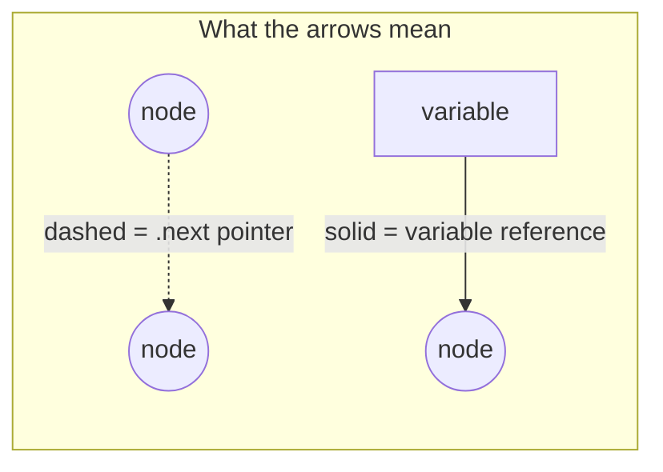

| Symbol | Meaning |
|--------|---------|
| `(( ))` | A node in the linked list |
| `[ ]` | A variable (label) |
| `→` solid arrow | A variable referencing a node (direct code) |
| `⤑` dashed arrow | A node's `.next` property (indirect access) |

---

## Initial State

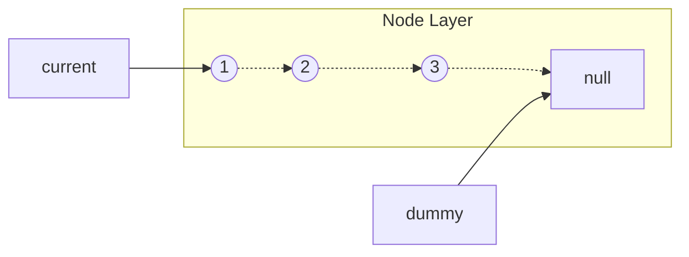

---

## Iteration 1

### Start

### Step 1: `following = current.next`

Save where we want to go.

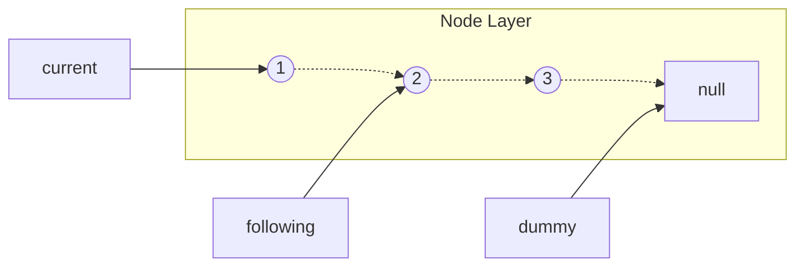

### Step 2: `current.next = dummy`

Detach node 1 from node 2. Point it to what dummy points to (null).

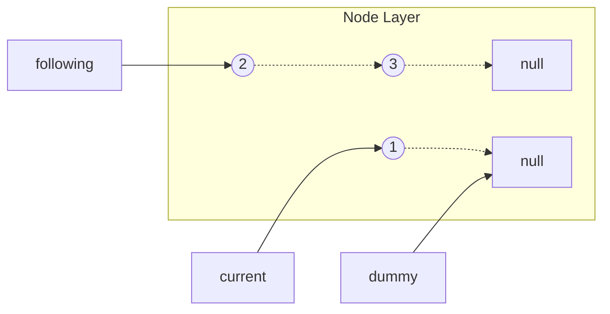

Node 1 is now detached. It points to null. Notice dummy still points to the same null.

### Step 3: `dummy = current`

Move the dummy label to point at node 1.

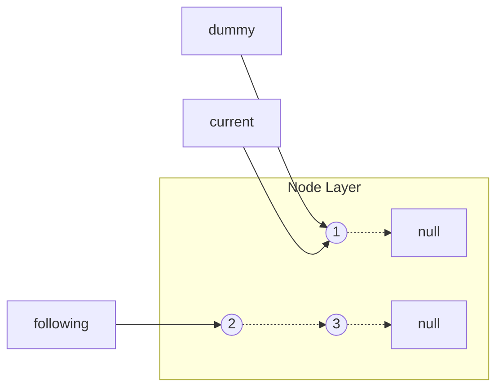

**Did the list change?** No. We just moved a label. Node 1 still points to null.

### Step 4: `current = following`

Move current label forward to node 2.

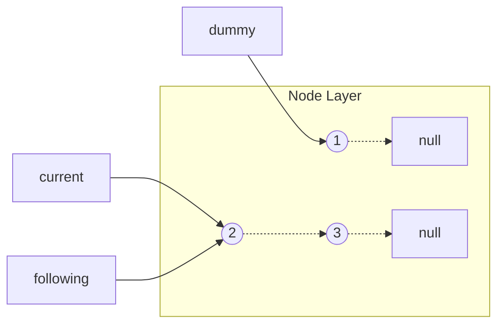

---

## Iteration 2

### Step 1: `following = current.next`

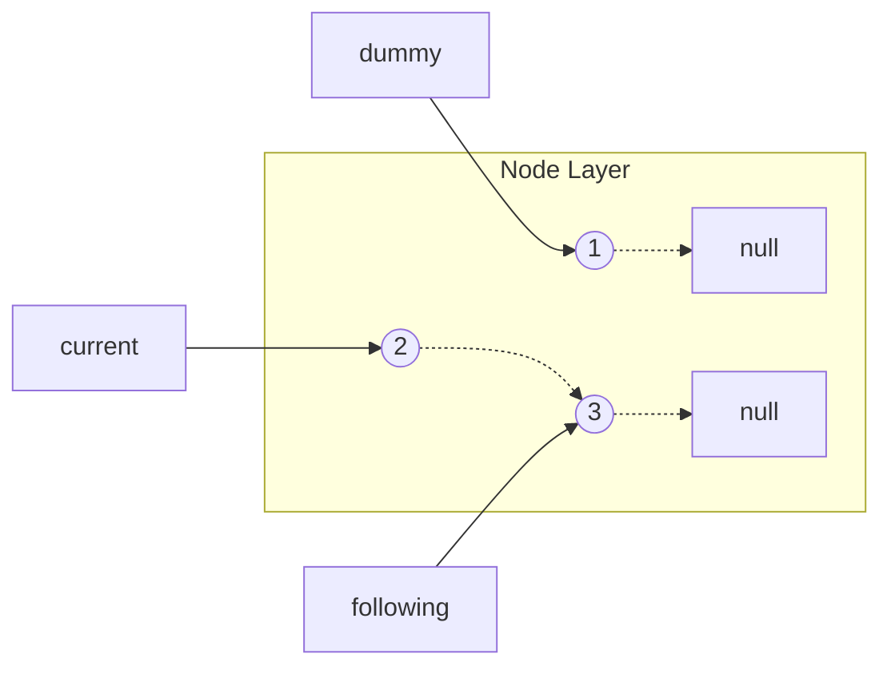

### Step 2: `current.next = dummy`

Detach node 2 from node 3. Point it to what dummy points to (node 1).

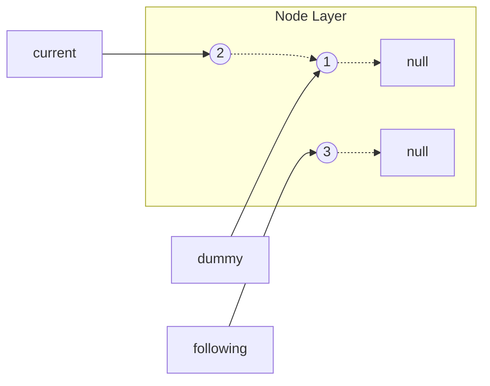

### Step 3: `dummy = current`

Move the dummy label to node 2.

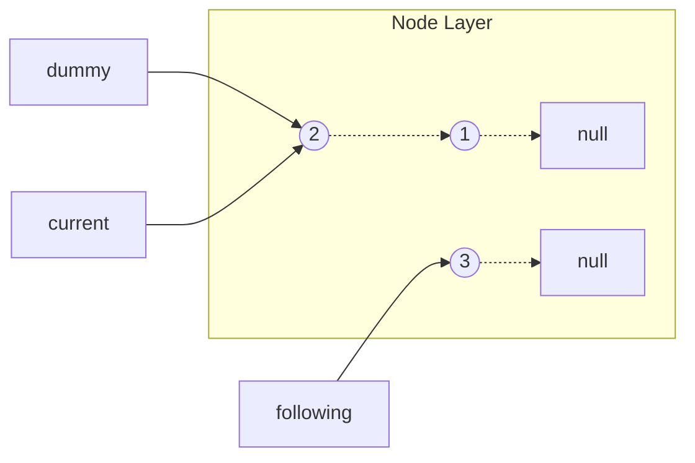

**Did the list change?** No. Just moved a label.

### Step 4: `current = following`

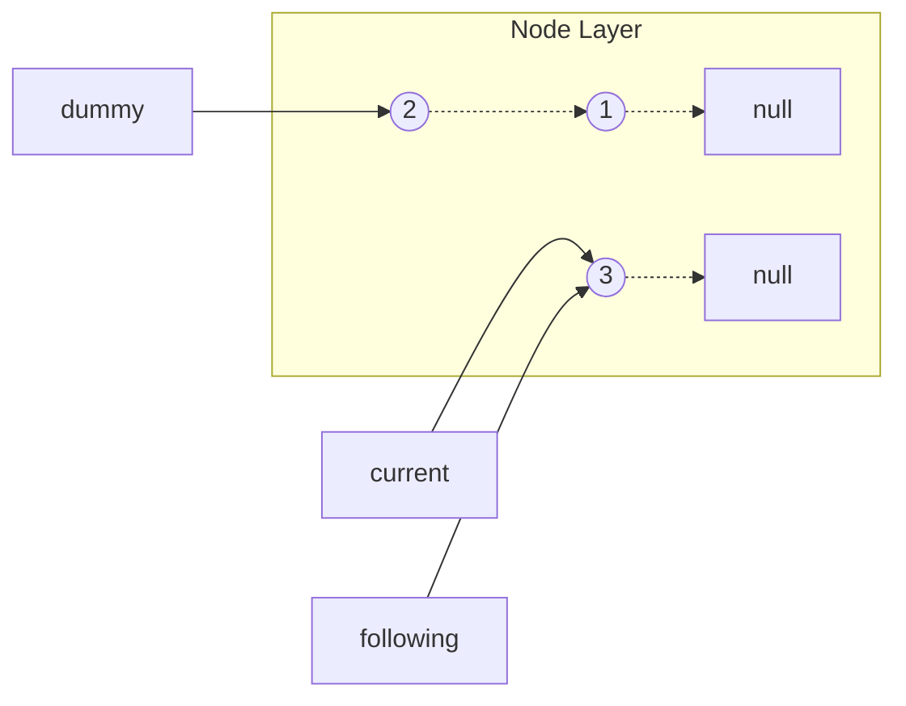

---

## Iteration 3

### Step 1: `following = current.next`

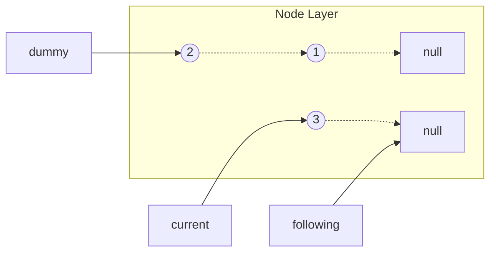

### Step 2: `current.next = dummy`

Detach node 3. Point it to what dummy points to (node 2).

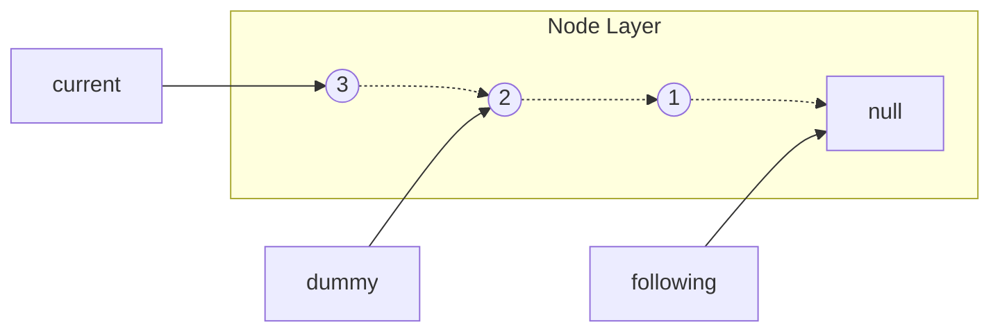

### Step 3: `dummy = current`

Move the dummy label to node 3.

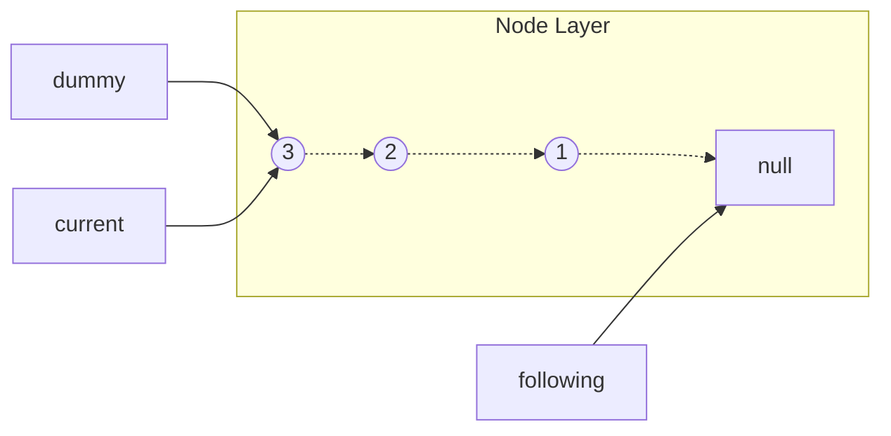

### Step 4: `current = following`

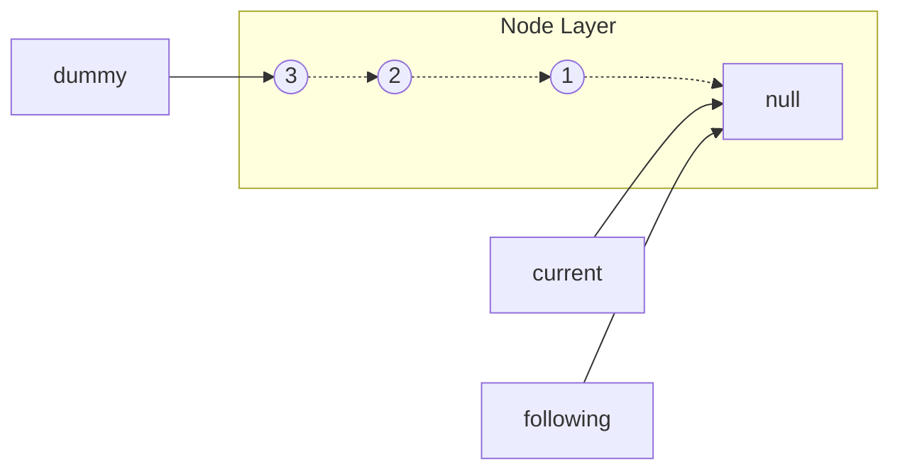

`current` is null. Loop exits.

---

## Final Result

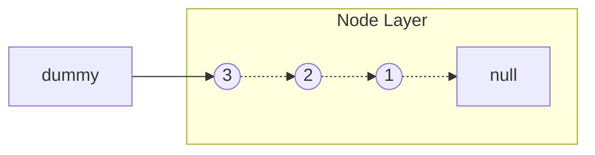

Return `dummy`. The list is reversed: `3 → 2 → 1 → null`

---

## Summary

| Code | What happens | List changes? |
|------|--------------|---------------|
| `x = y` | Move a label | No |
| `x.next = y` | Change where a node points | Yes |

Labels (solid lines) can point anywhere - moving them doesn't affect the list.

The list (dashed arrows) only changes when you modify a node's `.next` property.