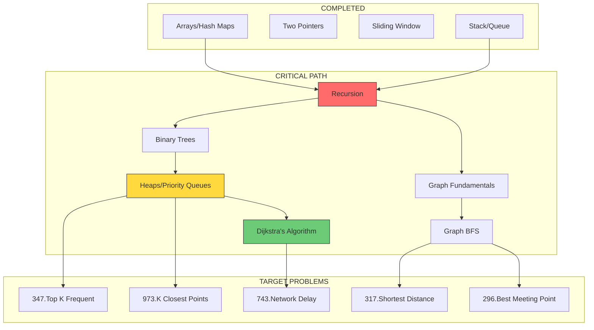

# PHE Redux: Byteboard Interview Preparation

## Overview

This study guide is designed to prepare you for the specific types of problems encountered in the Byteboard-style interview. The interview focused on:

1. **Filtering data** based on multiple criteria
2. **Graph traversal** with Dijkstra's algorithm
3. **Meeting point optimization** for multiple users
4. **Minimizing expensive API calls** through heuristics

---

## Current Position Assessment

```
NOVICE PHASE (Where You Are)
━━━━━━━━━━━━━━━━━━━━━━━━━━━━━━━━━━━━━━━━━━━━━━━
[x] Arrays/Strings
[x] Hash Maps/Sets
[x] Two Pointers
[x] Sliding Window       <-- YOU ARE HERE
[x] Linked Lists
[x] Stack/Queue
[ ] Recursion            <-- CRITICAL BLOCKER
[ ] Binary Search
━━━━━━━━━━━━━━━━━━━━━━━━━━━━━━━━━━━━━━━━━━━━━━━
```

---

## The 5 Target Problems

These problems would have directly prepared you for the interview:

| # | Problem | Core Concept | Gap from Current |
|---|---------|--------------|------------------|
| 1 | [[phe-redux/problems/347-top-k-frequent\|347. Top K Frequent Elements]] | Hash Maps + Heaps | ~3-4 weeks |
| 2 | [[phe-redux/problems/973-k-closest-points\|973. K Closest Points to Origin]] | Distance + Heaps | ~3-4 weeks |
| 3 | [[phe-redux/problems/743-network-delay-time\|743. Network Delay Time]] | Dijkstra's Algorithm | ~6-8 weeks |
| 4 | [[phe-redux/problems/317-shortest-distance-buildings\|317. Shortest Distance from All Buildings]] | Multi-source BFS | ~6-7 weeks |
| 5 | [[phe-redux/problems/296-best-meeting-point\|296. Best Meeting Point]] | BFS + Median Math | ~6-7 weeks |

---

## Dependency Graph



---

## Required DSA Concepts

### From Your Current Path

| Concept | DSA Guide | Required For |
|---------|-----------|--------------|
| Recursion | [[dsa/03-recursion-basics\|03-recursion-basics]] | Everything below |
| Graph Fundamentals | [[dsa/01-graph-fundamentals\|01-graph-fundamentals]] | All graph problems |
| Graph Representation | [[dsa/02-graph-representation\|02-graph-representation]] | Building adjacency lists |
| DFS | [[dsa/04-graph-traversal-dfs\|04-graph-traversal-dfs]] | Cycle detection, path finding |
| BFS | [[dsa/05-graph-traversal-bfs\|05-graph-traversal-bfs]] | Shortest paths, meeting points |
| Dependencies & Ordering | [[dsa/06-dependencies-and-ordering\|06-dependencies-and-ordering]] | Topological concepts |

### Additional Concepts Needed

| Concept | Status | Required For |
|---------|--------|--------------|
| Binary Trees | Not in current path | Heap understanding |
| Heaps/Priority Queues | Not in current path | Dijkstra, Top K problems |
| Dijkstra's Algorithm | Not in current path | Network Delay Time |
| Multi-source BFS | Not in current path | Meeting point problems |

---

## Interview Task Mapping

### Task 1: Filtering Activities
**What it tested**: Array filtering with multiple criteria
**Your readiness**: READY (hash maps, array methods)
**Related problems**: Basic filtering, no specific LeetCode needed

### Task 2: Midpoint Suggestion
**What it tested**: Dijkstra's algorithm + optimization heuristics
**Your readiness**: NOT READY (need graphs + heaps)
**Key problem**: [[phe-redux/problems/743-network-delay-time\|743. Network Delay Time]]

### Task 3: Multi-user Extension
**What it tested**: Multi-source BFS, fairness optimization
**Your readiness**: NOT READY (need BFS mastery)
**Key problems**:
- [[phe-redux/problems/317-shortest-distance-buildings\|317. Shortest Distance from All Buildings]]
- [[phe-redux/problems/296-best-meeting-point\|296. Best Meeting Point]]

---

## 6-Week Sprint Plan

See [[phe-redux/01-weekly-plan\|Weekly Plan]] for the detailed breakdown.

| Week | Focus | Unlocks |
|------|-------|---------|
| 1 | Recursion | Foundation for everything |
| 2 | Binary Trees | Heap understanding |
| 3 | Heaps | Problems 347, 973 |
| 4-5 | Graph BFS | Problems 317, 296 |
| 5-6 | Dijkstra | Problem 743 |

---

## Progress Tracker

### Week 1: Recursion
- [ ] Complete [[dsa/03-recursion-basics\|Recursion Basics]]
- [ ] Solve: Fibonacci (recursive)
- [ ] Solve: Factorial
- [ ] Solve: Reverse string recursively
- [ ] Solve: Generate parentheses
- [ ] Solve: Subsets

### Week 2: Binary Trees
- [ ] Study binary tree fundamentals
- [ ] Solve: Max depth of binary tree
- [ ] Solve: Invert binary tree
- [ ] Solve: Same tree
- [ ] Understand tree traversals (pre/in/post-order)

### Week 3: Heaps/Priority Queues
- [ ] Understand heap data structure
- [ ] Implement a min-heap from scratch
- [ ] Solve: [[phe-redux/problems/347-top-k-frequent\|347. Top K Frequent Elements]]
- [ ] Solve: [[phe-redux/problems/973-k-closest-points\|973. K Closest Points to Origin]]
- [ ] Solve: Kth largest element

### Week 4: Graph BFS
- [ ] Complete [[dsa/05-graph-traversal-bfs\|BFS Guide]]
- [ ] Solve: Number of islands
- [ ] Solve: Rotting oranges
- [ ] Solve: Shortest path in binary matrix
- [ ] Understand multi-source BFS pattern

### Week 5: Meeting Point Problems
- [ ] Solve: [[phe-redux/problems/317-shortest-distance-buildings\|317. Shortest Distance from All Buildings]]
- [ ] Solve: [[phe-redux/problems/296-best-meeting-point\|296. Best Meeting Point]]
- [ ] Understand fairness/median optimization

### Week 6: Dijkstra's Algorithm
- [ ] Learn Dijkstra's algorithm
- [ ] Understand priority queue usage in graphs
- [ ] Solve: [[phe-redux/problems/743-network-delay-time\|743. Network Delay Time]]
- [ ] Solve: Cheapest flights within K stops
- [ ] Practice minimizing expensive operations

---

## Quick Reference

### Master DSA Path
[[dsa/00-complete-dsa-path\|Complete DSA Learning Path]]

### DSA Index
[[dsa/00-index\|Graph & Dependency Learning Path Index]]

---

## After Completing This Guide

You will be able to:
- Implement Dijkstra's algorithm from scratch
- Solve multi-source BFS problems
- Optimize for "fairness" in meeting point problems
- Use heaps for Top K and priority-based problems
- Minimize expensive operations through smart heuristics
