# Reverse Linked List - Step by Step

Starting list: `1 → 2 → 3 → null`

## Initial State

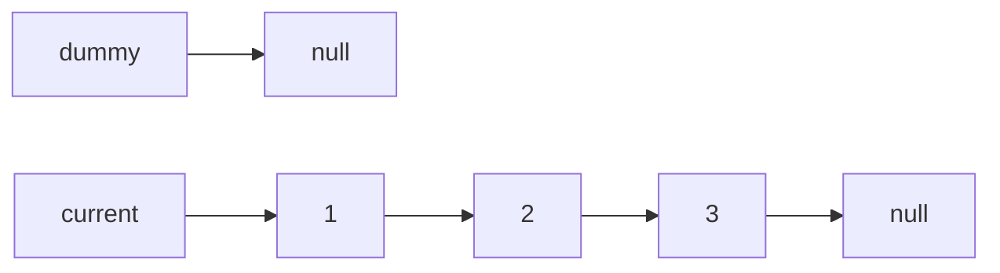

---

## Iteration 1

### Step 1: `let following = current.next`

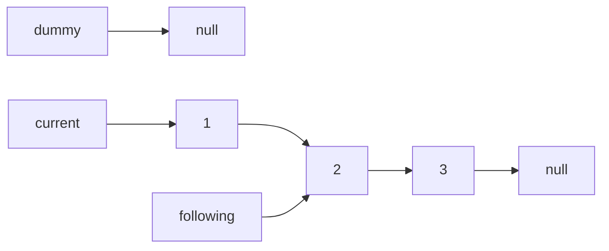

### Step 2: `current.next = dummy`

Node 1's next now points to what dummy points to (null).

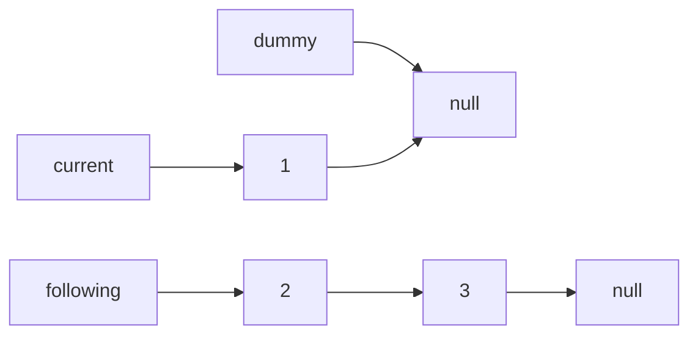

### Step 3: `dummy = current`

The variable `dummy` now points to the same node as `current`. The node itself doesn't change.

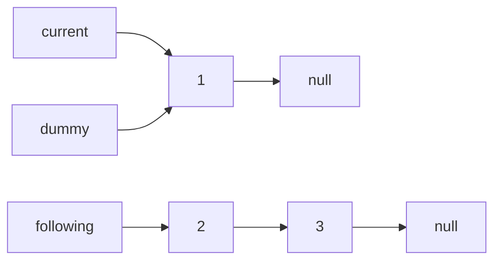

### Step 4: `current = following`

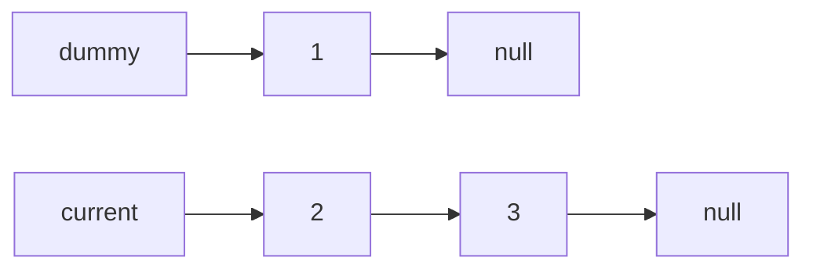

**End of iteration 1:** We now have `1 → null` reversed, and `current` is at `2`.

---

## Iteration 2

### Step 1: `let following = current.next`

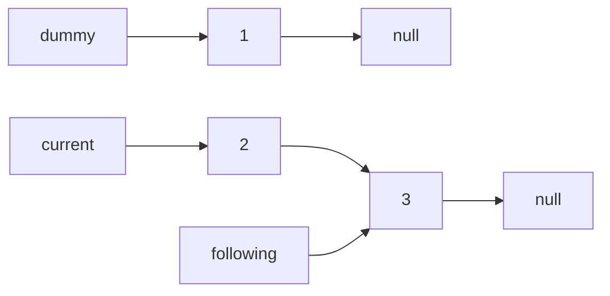

### Step 2: `current.next = dummy`

Node 2's next now points to what dummy points to (node 1).

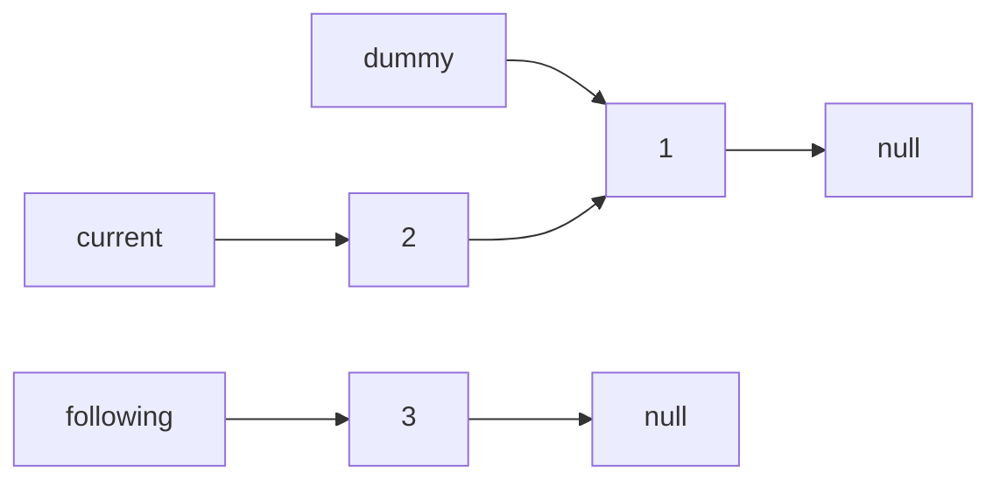

### Step 3: `dummy = current`

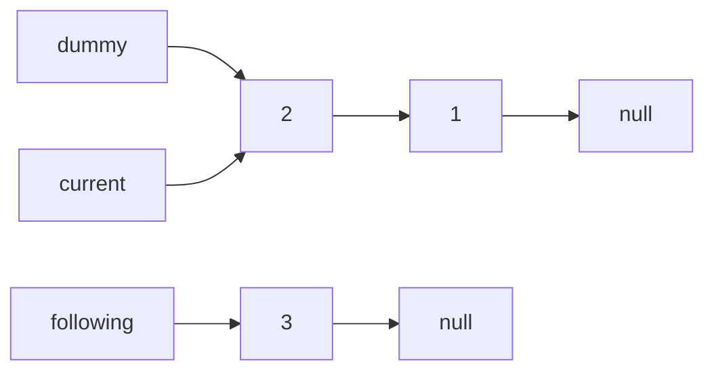

### Step 4: `current = following`

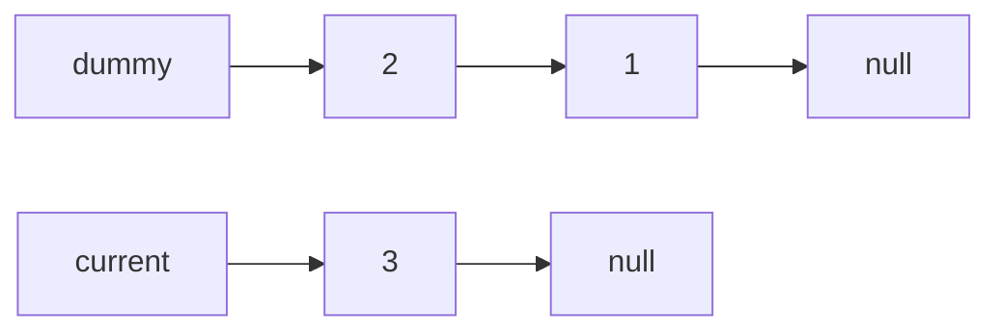

**End of iteration 2:** We now have `2 → 1 → null` reversed, and `current` is at `3`.

---

## Iteration 3

### Step 1: `let following = current.next`

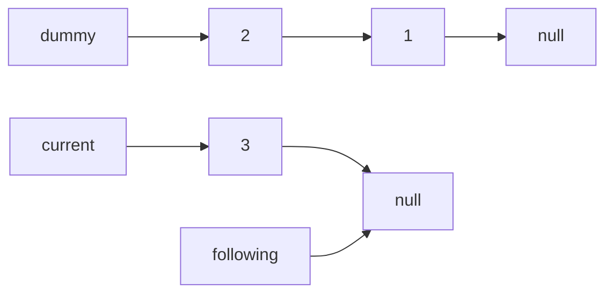

### Step 2: `current.next = dummy`

Node 3's next now points to what dummy points to (node 2).

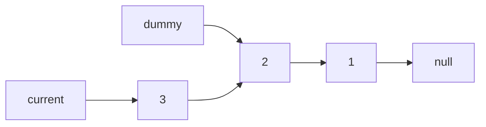

### Step 3: `dummy = current`

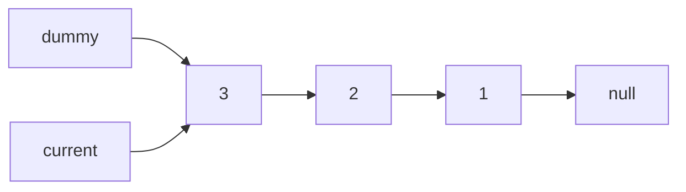

### Step 4: `current = following`

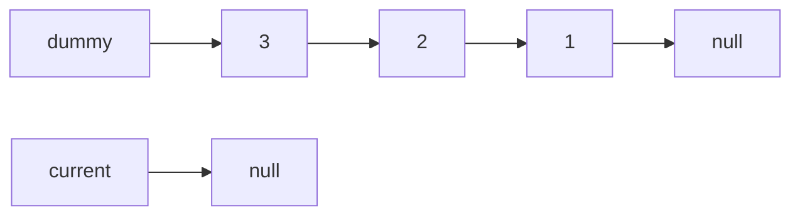

**End of iteration 3:** `current` is null, loop exits.

---

## Final Result

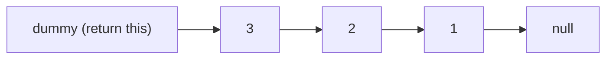

Reversed: `3 → 2 → 1 → null`

---

## The Key Point

Look at **Step 3** in any iteration. When we do `dummy = current`:

- Both variables point to the **same node**
- But that node's `.next` already points **backward** (to the previously reversed portion)
- There is no circle because `.next` points to an older node, not to itself or forward

The "circle" confusion comes from thinking `dummy = current` affects the node. It doesn't. It only changes which node the variable `dummy` refers to.