# Sort Colors - Visual Guide (Dutch National Flag)

## Understanding the Three-Pointer Approach

### The Core Idea

We maintain **four regions** in the array using three pointers (`left`, `i`, `right`):

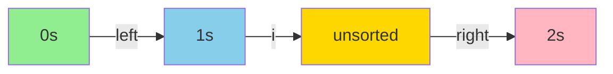

### The Invariants (Rules that are ALWAYS true)

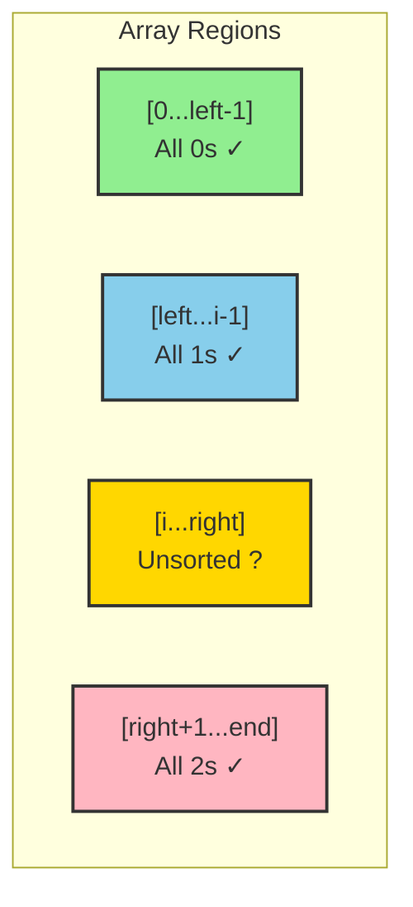

### Why We Need Each Pointer

- **`left`**: Marks where the next 0 should go
- **`i`**: Current element we're examining
- **`right`**: Marks where the next 2 should go

---

## Decision Tree

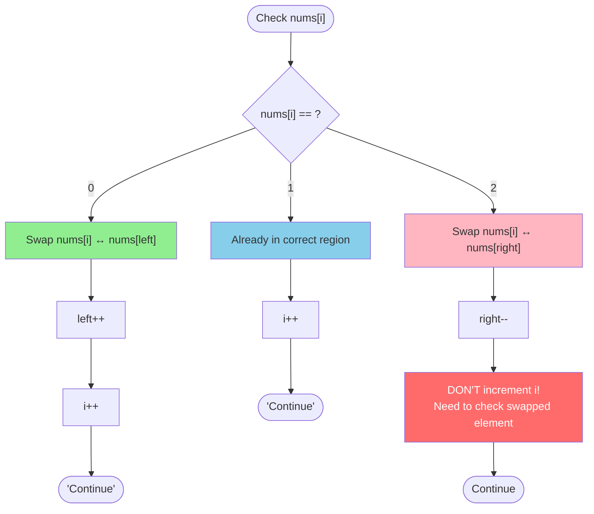

---

## Step-by-Step Visual Example

Let's sort: `[2, 0, 2, 1, 1, 0]`

### Initial State

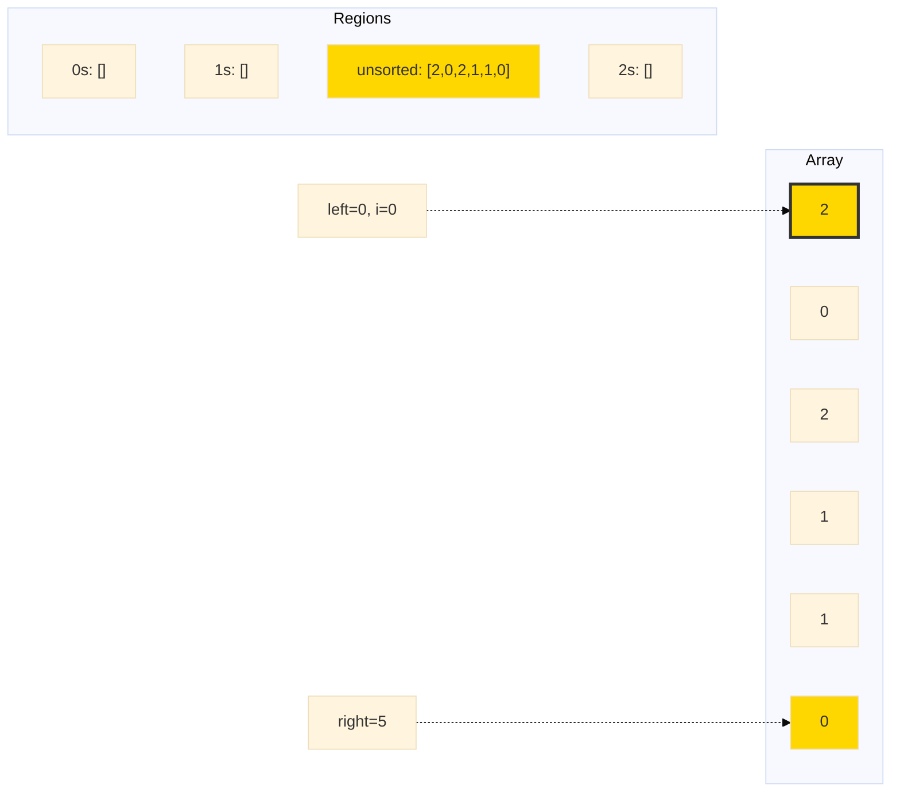

---

### Step 1: i=0, nums[i]=2

**Action**: Found a 2 → Swap with `right`, decrement `right` (DON'T increment i)

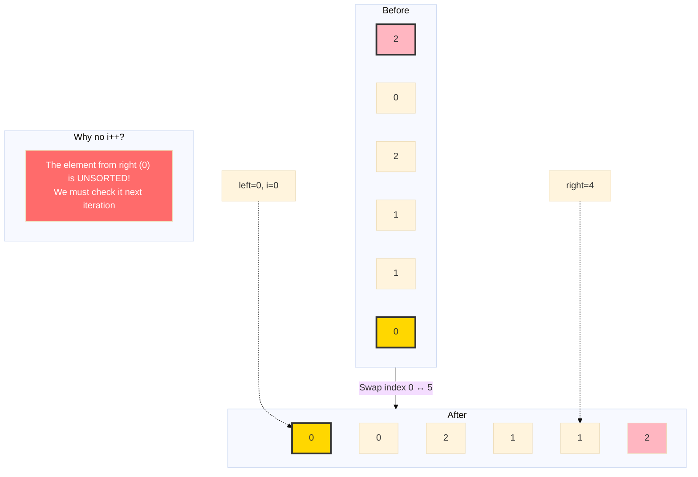

**Regions**: 0s: `[]` | 1s: `[]` | unsorted: `[0,0,2,1,1]` | 2s: `[2]`

---

### Step 2: i=0, nums[i]=0

**Action**: Found a 0 → Swap with `left`, increment BOTH

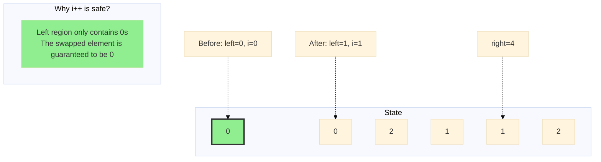

**Regions**: 0s: `[0]` | 1s: `[]` | unsorted: `[0,2,1,1]` | 2s: `[2]`

---

### Step 3: i=1, nums[i]=0

**Action**: Found a 0 → Swap with `left`, increment BOTH

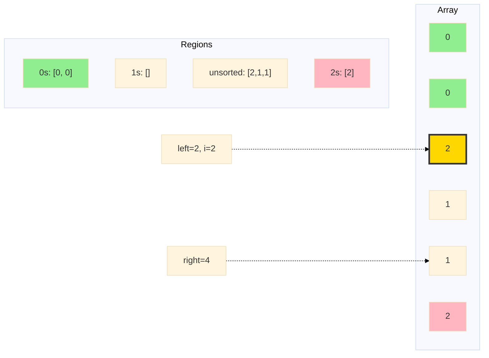

---

### Step 4: i=2, nums[i]=2

**Action**: Found a 2 → Swap with `right`, decrement `right` (DON'T increment i)

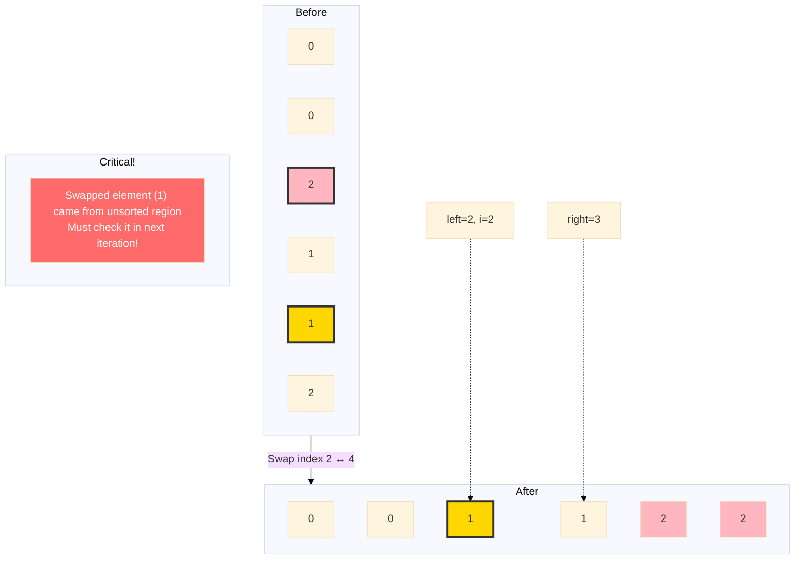

**Regions**: 0s: `[0,0]` | 1s: `[]` | unsorted: `[1,1]` | 2s: `[2,2]`

---

### Step 5: i=2, nums[i]=1

**Action**: Found a 1 → Just increment `i` (already in correct region)

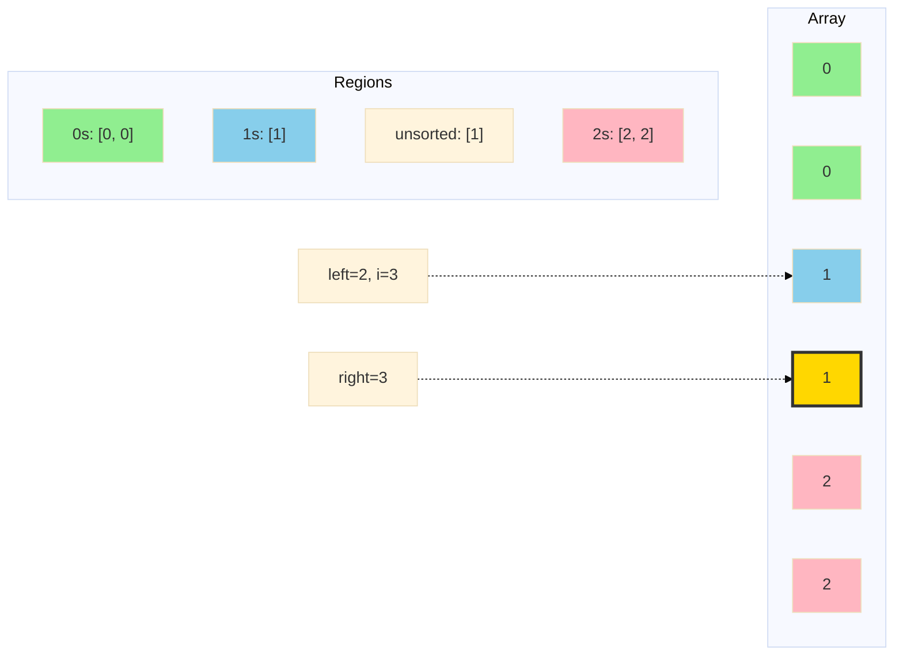

---

### Step 6: i=3, nums[i]=1 (Final)

**Action**: Found a 1 → Increment `i`, now `i > right` → DONE!

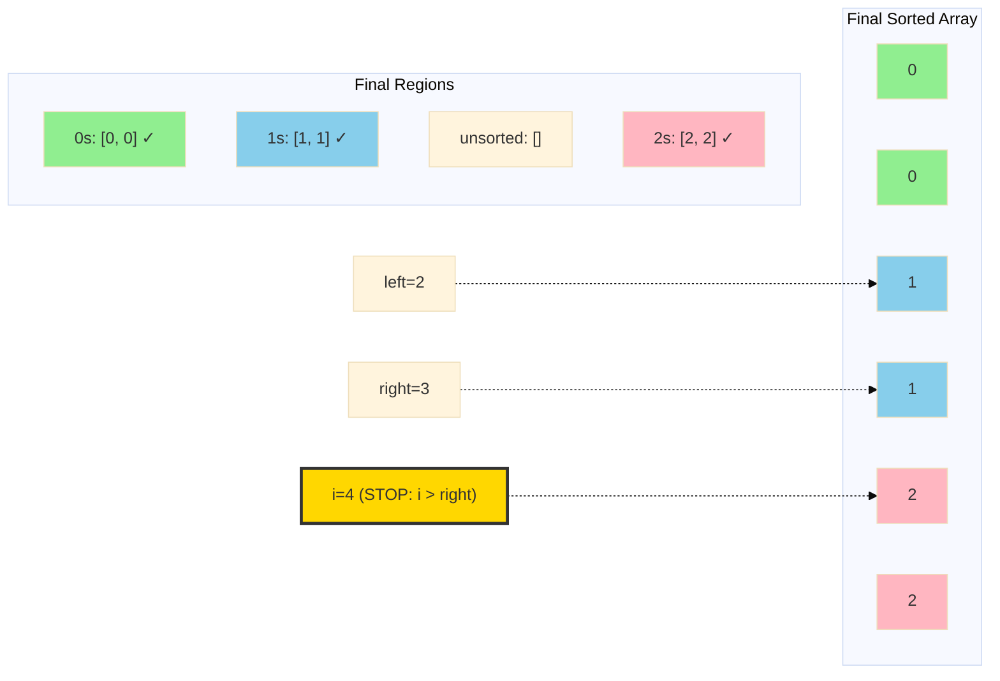

---

## The Key Insight: Why We Don't Increment `i` for 2s

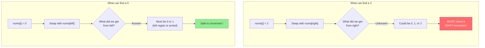

---

## Algorithm Flow

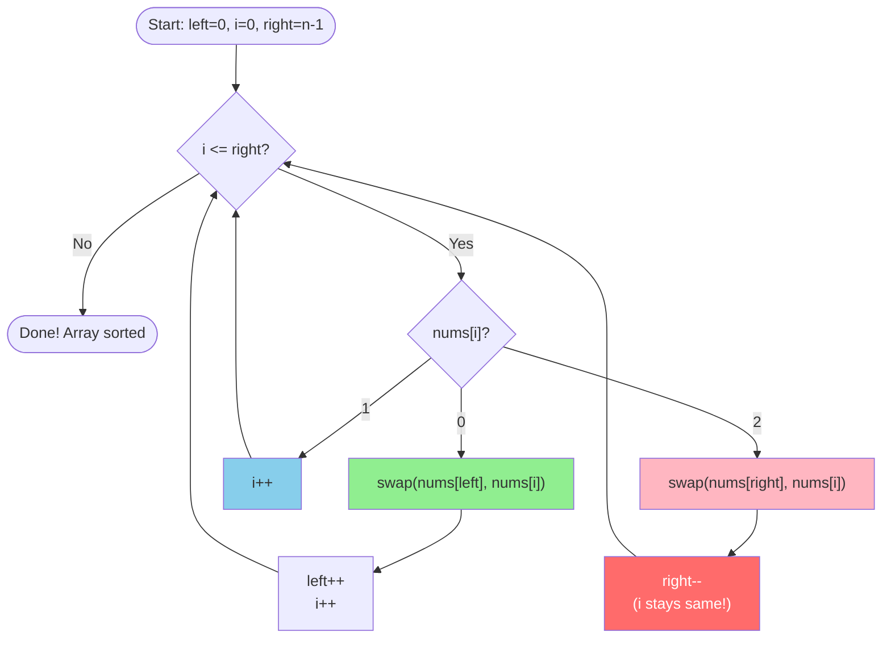

---

## Complexity

- **Time**: O(n) - Single pass through array
- **Space**: O(1) - Only three pointers

---

## Common Mistakes

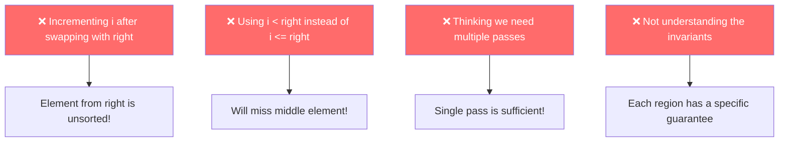

---

## Try It Yourself

Practice with: `[1, 2, 0]`

Click to see solution

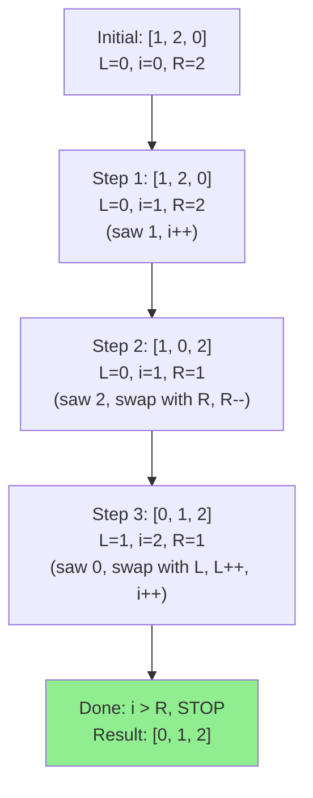

