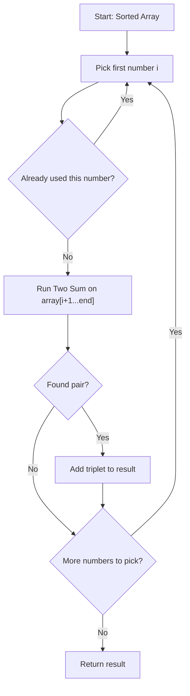
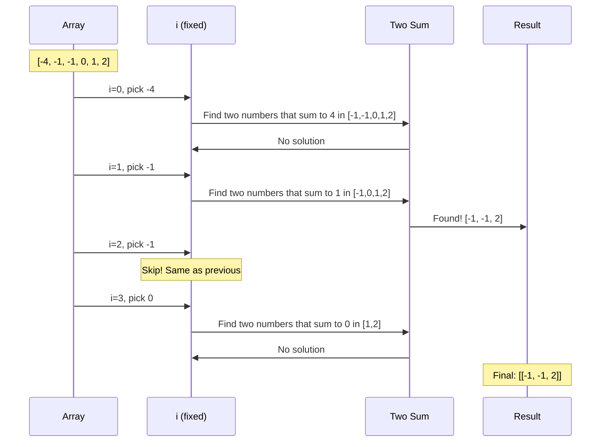
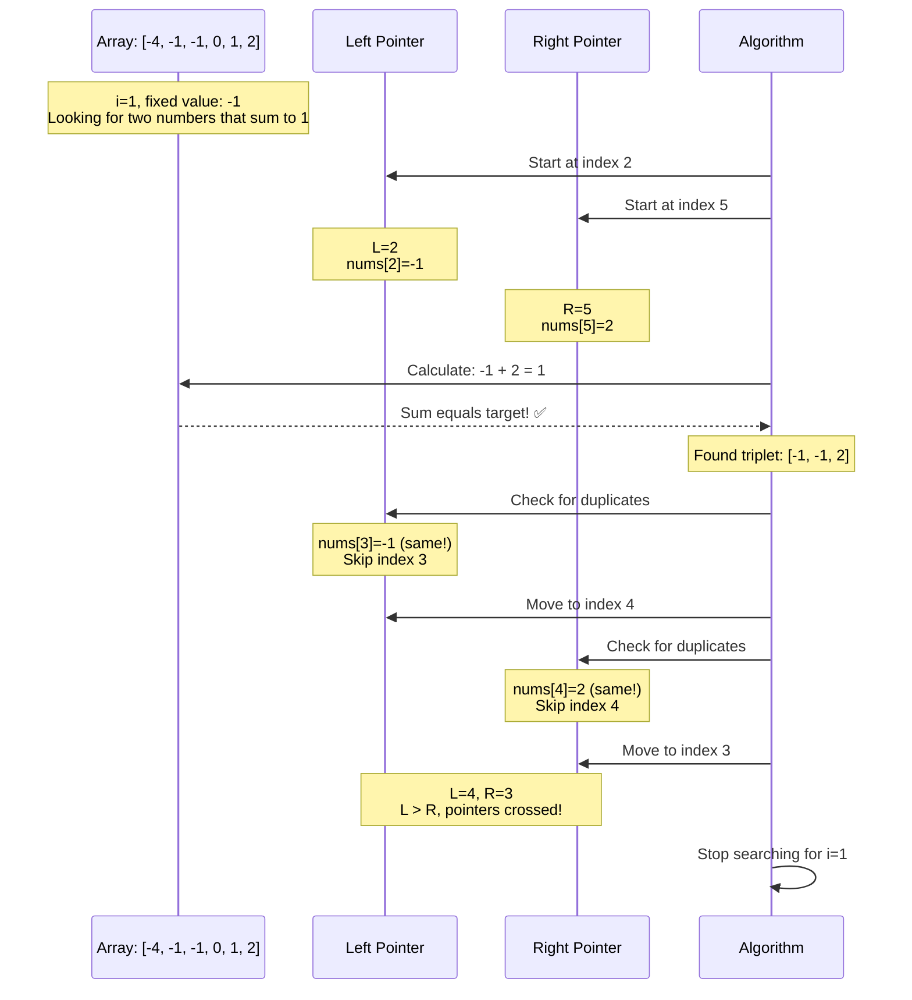
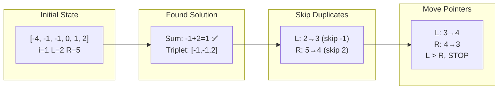
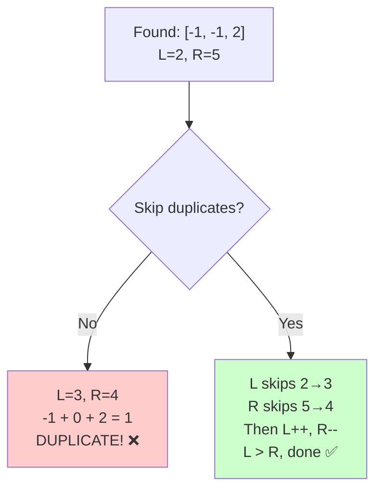

# Three Sum Problem - Visual Guide

## 1. Overall Algorithm Structure



## 2. Step-by-Step Execution

Let's trace through `[-4, -1, -1, 0, 1, 2]`:



## 3. Two-Pointer Movement (i=1 example)

When `i=1`, we pick `-1` and need to find two numbers that sum to `1`:



## 4. Pointer Movement Details

Here's how pointers move when `i=1`:



## 5. Why We Skip Duplicates (Visual)



## Mental Model Summary

**Think of Three Sum as:**
```
For each number in the array:
  └─> Run Two Sum on everything after it
```

**Key Points:**
1. **Sort first** - enables two-pointer technique
2. **Pick a number** (i) - this is your "fixed" first element
3. **Two Sum** - find two more numbers in the rest that sum to `-nums[i]`
4. **Skip duplicates** - avoid processing same number multiple times

## Example Walkthrough

Starting array: `[-1, 0, 1, 2, -1, -4]`

After sorting: `[-4, -1, -1, 0, 1, 2]`

| i | nums[i] | Two Sum Target | Subarray | Result |
|---|---------|----------------|----------|---------|
| 0 | -4 | 4 | [-1,-1,0,1,2] | None found |
| 1 | -1 | 1 | [-1,0,1,2] | [-1,-1,2] ✅ |
| 2 | -1 | 1 | [0,1,2] | **SKIP** (duplicate) |
| 3 | 0 | 0 | [1,2] | None found |
| 4 | Stop (only 2 elements left) | | | |