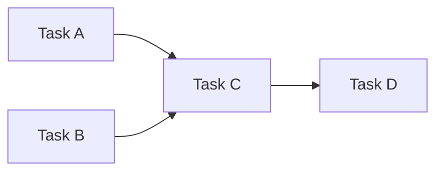
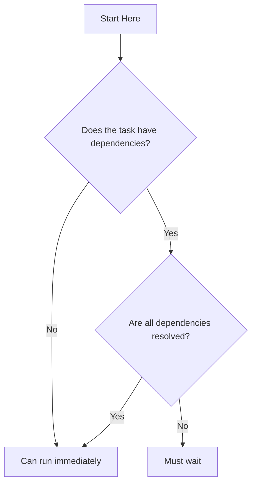
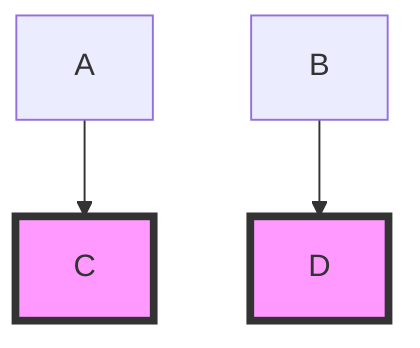
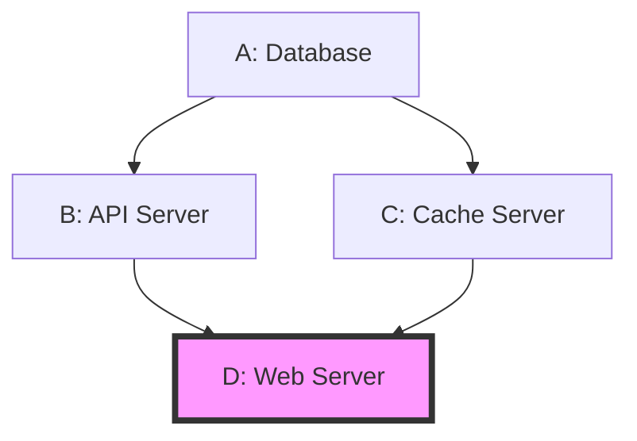
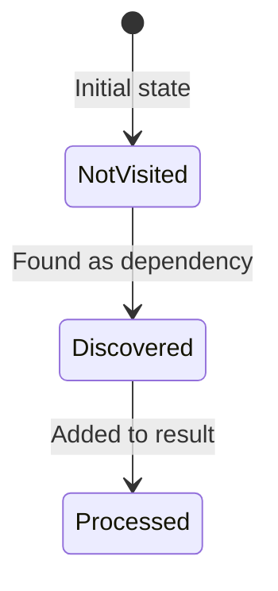
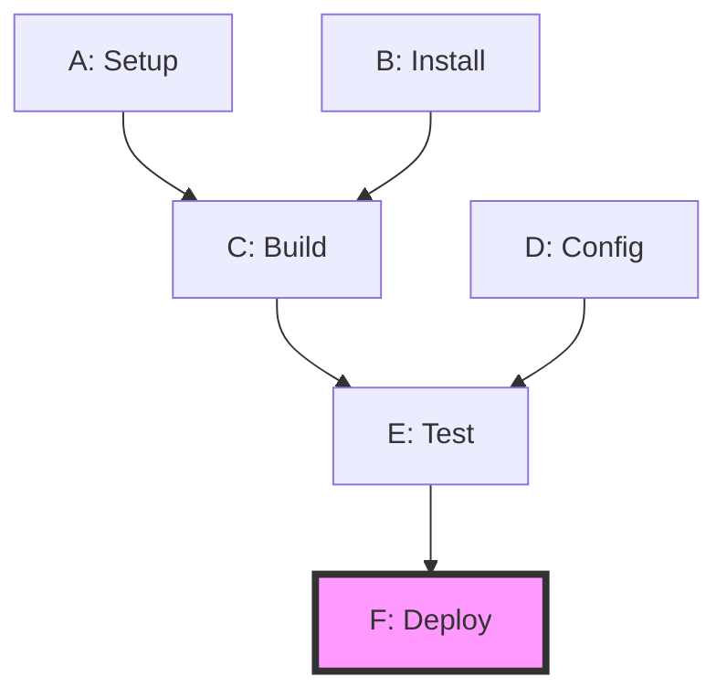
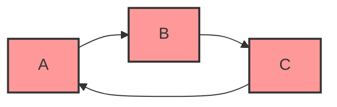
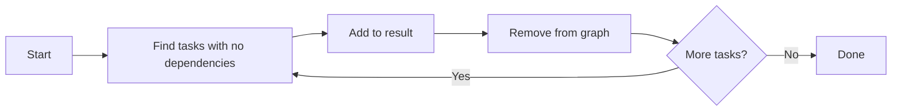
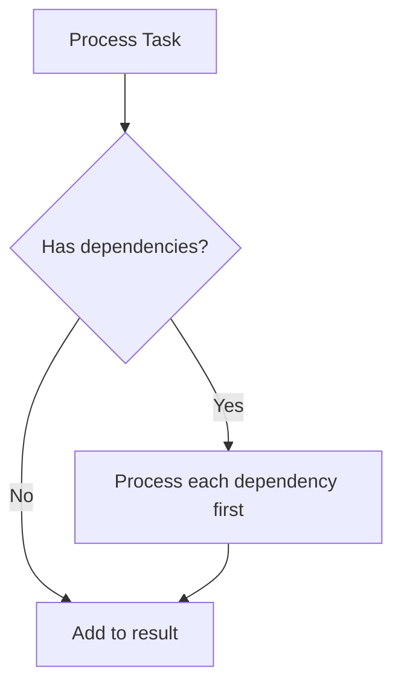

# Topological Sort Study Guide

## Understanding the Problem

This problem asks you to determine the order in which tasks should be executed, given that some tasks depend on others. Think of it like getting dressed in the morning - you need to put on your socks before your shoes.

## Core Mental Models

### 1. Directed Graph Representation

Think of tasks as nodes in a graph, where arrows represent dependencies. An arrow from A to B means "B depends on A" (A must come before B).

In the above graph:
- C depends on both A and B
- D depends on C
- A and B have no dependencies

### 2. Dependency Resolution Order

The fundamental question: **How do we order tasks so that every task comes after all its dependencies?**

### 3. The Transitive Dependency Problem

When you request a task, you need ALL of its dependencies - not just direct ones.

If you request Task D (highlighted), you actually need: A → B → C → D

### 4. Multiple Entry Points

When multiple tasks are requested, you need to gather ALL their dependency trees.

Requested: C and D → Need: A, B, C, D (in valid order)

### 5. The Diamond Problem

Multiple paths to the same dependency - but only include it once!

Requested: D → Need: A, then B and C (either order), then D

Notice: A appears in both paths but should only run once.

## Key Insights to Consider

### Insight 1: Two-Phase Approach
Think about solving this in two distinct phases:
1. **Discovery Phase**: Find all tasks that need to run
2. **Ordering Phase**: Put them in the correct sequence

### Insight 2: Think Backwards
When finding dependencies, working backwards from requested tasks can be intuitive:
- Start with what you want
- Find what it needs
- Find what those need
- Continue until you reach tasks with no dependencies

### Insight 3: Think Forwards
When determining order, working forwards can be intuitive:
- Start with tasks that have no dependencies
- Then tasks whose dependencies are satisfied
- Continue until all tasks are ordered

### Insight 4: Tracking State
You'll need to track different states for tasks:

### Insight 5: Graph Properties
Consider these properties:
- **In-degree**: Number of dependencies a task has
- **Out-degree**: Number of tasks that depend on this task
- **Root nodes**: Tasks with no dependencies (in-degree = 0)
- **Leaf nodes**: Tasks nothing depends on (out-degree = 0)

## Visualization of Complete Example

Requested: F (Deploy)

**Think through:**
1. What does F depend on?
2. What do those dependencies depend on?
3. How do you ensure nothing runs before its dependencies?
4. What's a valid ordering? Is there more than one?

## Common Pitfalls to Avoid

### Pitfall 1: Duplicate Tasks
Remember: Each task should appear exactly once in the output, even if multiple paths lead to it.

### Pitfall 2: Incorrect Order
The order must satisfy ALL dependency constraints. A before B means A's index < B's index in the result.

### Pitfall 3: Missing Dependencies
Don't forget transitive dependencies - dependencies of dependencies!

### Pitfall 4: Circular Dependencies
While not in the test cases, real-world systems might have cycles. How would you detect them?

## Performance Considerations

Think about complexity:
- How many tasks might you have? (N tasks)
- How many dependencies? (E edges)
- What's the time complexity of your approach?
- What data structures would be efficient?

**Goal**: Solution should scale to large graphs (thousands of tasks)

## Questions to Guide Your Thinking

1. How do you find all tasks that need to run?
2. How do you ensure you visit each task only once during discovery?
3. How do you determine the correct ordering?
4. What data structures help you track dependencies?
5. How do you handle tasks with no dependencies?
6. How do you know when a task's dependencies are all satisfied?

## Algorithm Families to Consider

There are two main approaches to this classic problem:

### Approach A: Removal-Based
Think about repeatedly finding and removing tasks that are "ready" to run.

### Approach B: Recursion-Based
Think about recursively processing dependencies before processing a task.

Both approaches can work - consider the tradeoffs!

## Next Steps

Once you understand these concepts:
1. Start with the discovery phase - how to find all tasks needed
2. Then tackle the ordering phase - how to sequence them correctly
3. Think about what data structures you'll need
4. Consider how to avoid processing the same task multiple times

Remember: The goal is correct ordering that respects all dependencies, with good performance on large graphs.