# Unique Paths in a Grid - Visual Guide

## Understanding the Problem

### The Core Idea

Given an `n x m` grid, count all unique paths from top-left `(0,0)` to bottom-right `(n-1, m-1)`. You can only move **right** or **down**.

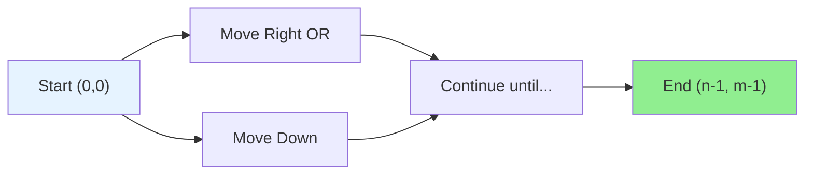

### Grid Visualization

```
     0   1   2   3
   +---+---+---+---+
 0 | S | → | → | → |
   +---+---+---+---+
 1 | ↓ |   |   | ↓ |
   +---+---+---+---+
 2 | ↓ | → | → | E |
   +---+---+---+---+

S = Start (0,0)
E = End (2,3)
```

---

## Key Insight: The Recurrence

At any cell `(i, j)`, you can only arrive from:
- **Above**: cell `(i-1, j)`
- **Left**: cell `(i, j-1)`

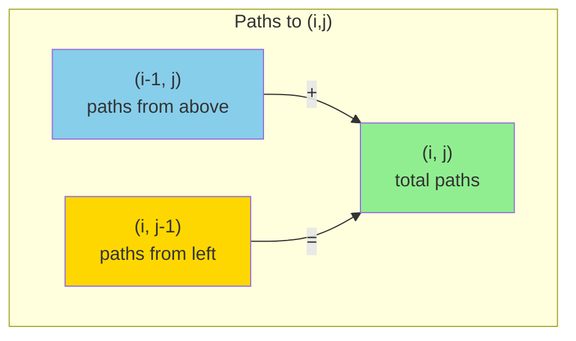

**Formula**: `dp[i][j] = dp[i-1][j] + dp[i][j-1]`

---

## Base Cases

### First Row: Only One Way

Can only come from the left (no cells above).

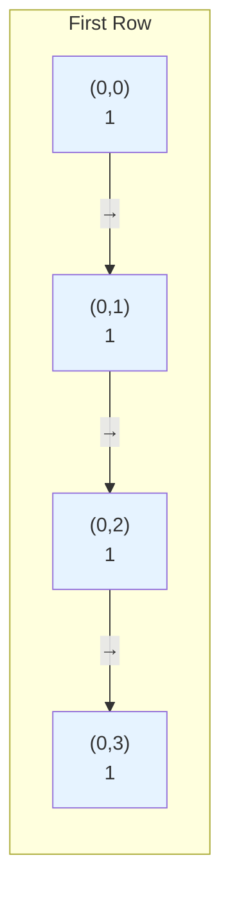

### First Column: Only One Way

Can only come from above (no cells to the left).

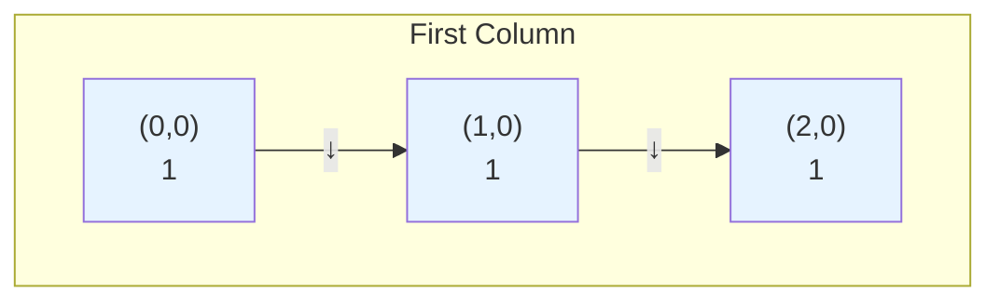

---

## Step-by-Step Example: 3x4 Grid

### Initial State

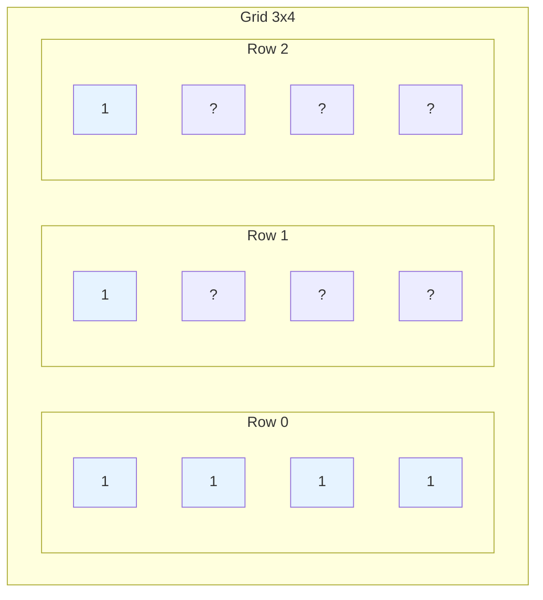

Base cases filled: first row = 1, first column = 1.

---

### Step 1: Fill (1,1)


**Grid state:**
```
  1   1   1   1
  1  [2]  ?   ?
  1   ?   ?   ?
```

---

### Step 2: Fill (1,2)

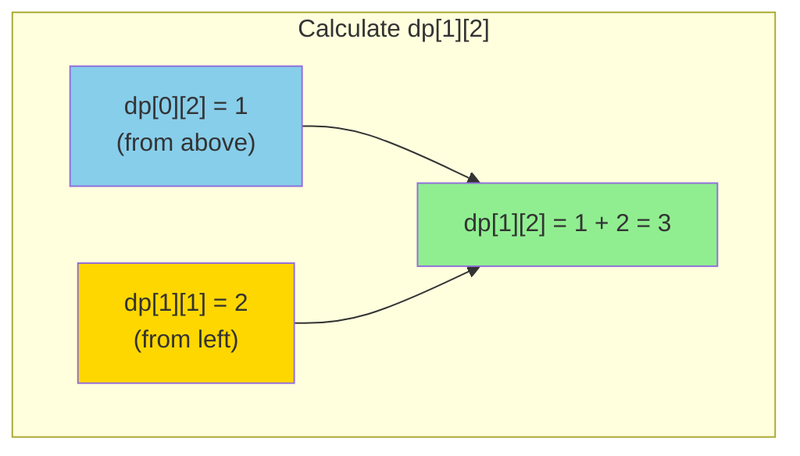

**Grid state:**
```
  1   1   1   1
  1   2  [3]  ?
  1   ?   ?   ?
```

---

### Step 3: Fill (1,3)


**Grid state:**
```
  1   1   1   1
  1   2   3  [4]
  1   ?   ?   ?
```

---

### Step 4: Fill Row 2

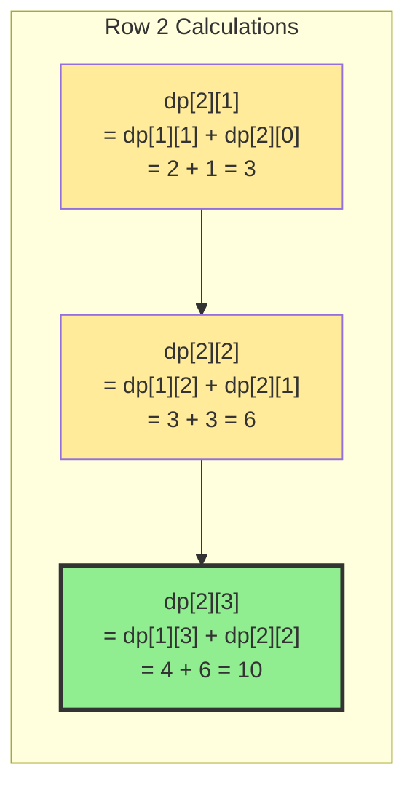

---

### Final Grid

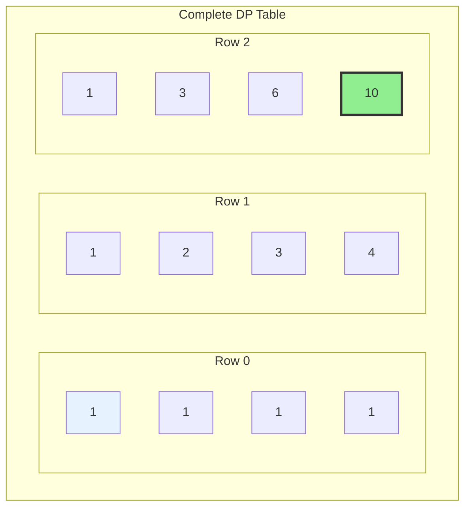

**Answer: 10 unique paths**

---

## Visualization of All 10 Paths

For a 3x3 grid (6 paths), the paths look like:

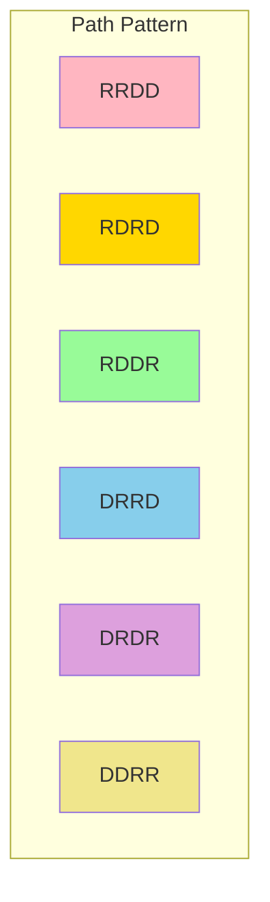

Each path is a sequence of R (right) and D (down) moves.

---

## Why Dynamic Programming Works

### Optimal Substructure

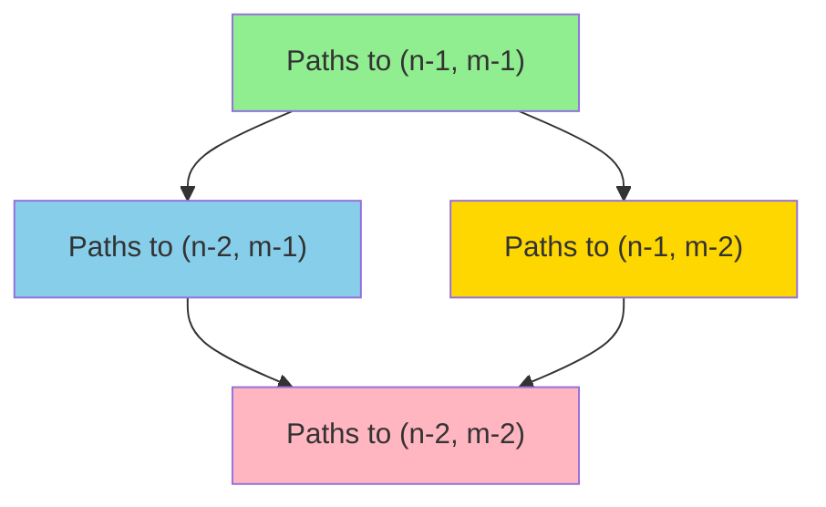

The solution to the main problem depends on solutions to smaller subproblems.

### Overlapping Subproblems

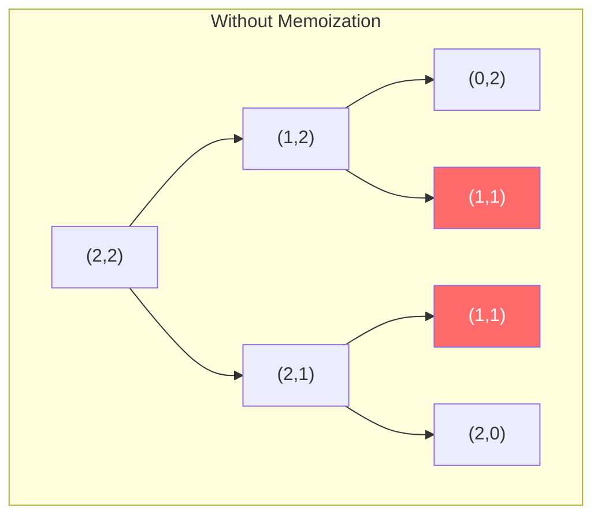

**Problem**: `(1,1)` computed twice! With larger grids, this explodes exponentially.

---

## The Mathematical Insight

### Combinatorics Approach

To reach `(n-1, m-1)` from `(0,0)`:
- Need exactly `(n-1)` down moves
- Need exactly `(m-1)` right moves
- Total moves: `(n-1) + (m-1) = n + m - 2`

**Question**: How many ways to arrange these moves?

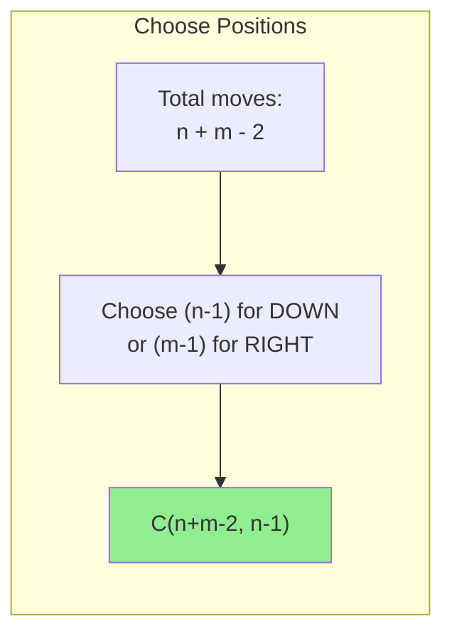

**Formula**:
$$\binom{n+m-2}{n-1} = \frac{(n+m-2)!}{(n-1)!(m-1)!}$$

---

## Approach Comparison

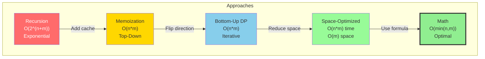

---

## Space Optimization Insight

### Why One Row is Enough

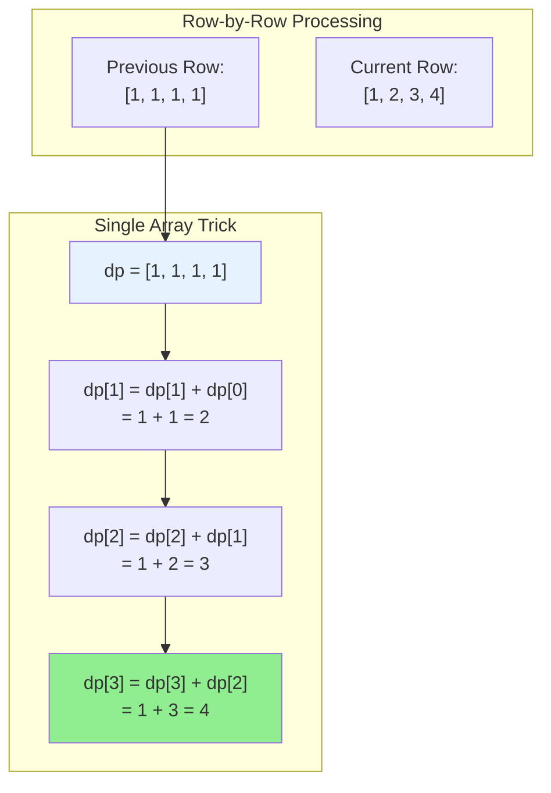

**Key**: When updating `dp[j]`:
- `dp[j]` still has value from previous row (from above)
- `dp[j-1]` already updated for current row (from left)

---

## Decision Tree

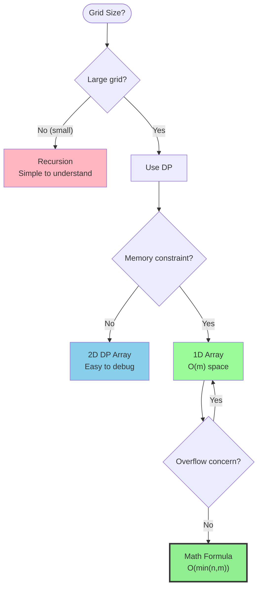

---

## Common Patterns to Remember

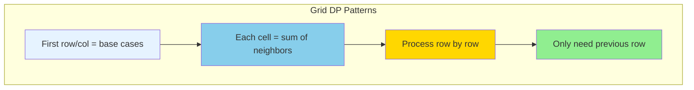

---

## Edge Cases

### 1x1 Grid

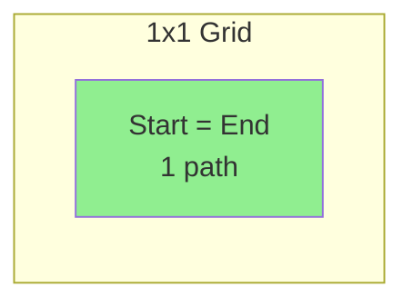

### 1xN or Nx1 Grid

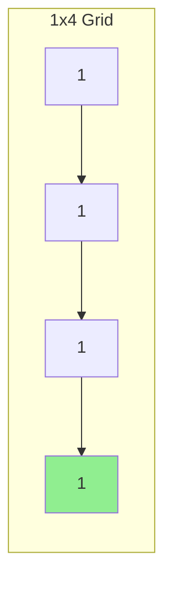

Only one path: all right (or all down).

---

## Try It Yourself

Calculate paths for a 4x3 grid.

<details>
<summary>Click to see solution</summary>

```
Fill row by row:

Row 0: [1, 1, 1]
Row 1: [1, 2, 3]
Row 2: [1, 3, 6]
Row 3: [1, 4, 10]

Answer: 10 unique paths
```

**Verification with math:**
- n=4, m=3
- Total moves = 4-1 + 3-1 = 5
- Choose 3 down moves from 5 total
- C(5,3) = 5!/(3!*2!) = 10

</details>
