# Complete System Design Learning Path: Novice → Expert

> 📌 **Part of the [Master Interview Preparation Guide](00-master-interview-guide.md)**
>
> This is the **System Design-focused** component of your interview prep. For the complete picture including DSA, Behavioral prep, and job search strategy, see the [Master Guide](00-master-interview-guide.md).

---

## Philosophy

This curriculum is designed with **progressive complexity** in mind:

- **Early topics** build mental models of system components and basic architectures
- **Middle topics** introduce real-world systems and scaling patterns
- **Late topics** combine everything into distributed systems and advanced architectures

Each phase has a purpose beyond just "learning a system."

---

## ⏱️ Timeline Assumptions

**Integrated Study Approach**: This System Design path is meant to be studied alongside [DSA](../dsa/00-complete-dsa-path.md).

**Time Allocation**:
- **Full-time**: 12-16 hours/week on System Design (40% of total study time)
- **Part-time**: 6-8 hours/week on System Design (40% of total study time)
- **Remaining time**: Dedicated to DSA study

System design is more conceptual than DSA, requiring:
- ✅ Reading case studies and engineering blogs
- ✅ Drawing diagrams and thinking through trade-offs
- ✅ Less "grinding problems," more "understanding patterns and components"
- 💡 Building mental models of how real systems work
- 📊 Following the integrated schedule in the [Master Interview Guide](00-master-interview-guide.md)

---

## 📍 The Three Phases

```mermaid
graph LR
    Novice[🌱 Fundamentals<br/>Core Components<br/>4-6 weeks] --> Intermediate[📚 Intermediate<br/>Common Systems<br/>6-8 weeks]
    Intermediate --> Advanced[🎯 Advanced<br/>Distributed Systems<br/>Ongoing]

    style Novice fill:#e1f5ff
    style Intermediate fill:#fff4e1
    style Advanced fill:#e1ffe1
```



**Total time to "Intermediate" level: 10-14 weeks (2.5-3.5 months)**

---

## 🌱 Phase 1: Fundamentals (4-6 weeks)

**Goal**: Understand the building blocks of all systems and basic architectural patterns.

**Timeline at full-time pace**:
- Basic components: 1-2 weeks
- Capacity estimation: 3-5 days
- Basic architectural patterns: 2-3 weeks
- Total: 4-6 weeks

### Why Start Here?

- You need to understand components (servers, databases, caches) before combining them
- Capacity estimation teaches you to think in terms of scale
- Simple systems build intuition for trade-offs
- Low cognitive overhead - focus on _understanding components_ not _complex interactions_

---

### Week 1-2: Core Components & Building Blocks

**Duration**: 1-2 weeks

**What You Learn**:

- Client-server model
- Load balancers (L4 vs L7)
- Application servers
- Databases (SQL vs NoSQL)
- Caching (layers, strategies)
- CDN (Content Delivery Networks)
- Message queues
- Blob storage

**Key Concepts**:

- [ ] What is a load balancer and why do we need it?
- [ ] Database types: RDBMS (PostgreSQL, MySQL) vs NoSQL (MongoDB, Cassandra, Redis)
- [ ] CAP theorem basics
- [ ] Caching strategies: Cache-aside, Write-through, Write-back
- [ ] When to use CDN
- [ ] Message queue use cases (decoupling, async processing)

**Study Activities**:

- Draw a simple client-server architecture
- Compare SQL vs NoSQL for different use cases
- Understand cache eviction policies (LRU, LFU, FIFO)
- Learn basic load balancing algorithms (Round Robin, Least Connections)

**Why First**: These are the Lego blocks. Every system uses these components.

---

### Week 2: Capacity Estimation & Back-of-Envelope Calculations

**Duration**: 3-5 days

**What You Learn**:

- Traffic estimation (DAU, QPS, Peak QPS)
- Storage estimation
- Bandwidth estimation
- Memory calculations
- Powers of 2 table (KB, MB, GB, TB)

**Key Concepts**:

- [ ] How to estimate read/write QPS
- [ ] Storage per user/post/photo
- [ ] Bandwidth needs for video streaming
- [ ] Memory for caching

**Practice Problems**:

- Estimate storage for 1 billion tweets
- Calculate QPS for Instagram photo uploads
- Memory needed for caching top 20% of content

**Why Now**: You'll use this in EVERY system design interview. Master it early.

---

### Week 3: Networking Basics

**Duration**: 3-5 days

**What You Learn**:

- TCP vs UDP
- HTTP vs HTTPS
- WebSockets vs HTTP polling vs Server-Sent Events
- REST vs GraphQL vs gRPC
- DNS lookup
- IP addressing basics

**Key Concepts**:

- [ ] When to use TCP vs UDP
- [ ] REST API design principles
- [ ] Real-time communication patterns
- [ ] How DNS resolution works
- [ ] HTTP status codes and methods

**Why Now**: Understanding how services communicate is fundamental before designing multi-service systems.

---

### Week 3-4: Database Deep Dive

**Duration**: 1-1.5 weeks

**What You Learn**:

- ACID properties
- Database indexing (B-trees, hash indexes)
- Database sharding strategies
- Database replication (master-slave, master-master)
- Partitioning vs Sharding
- SQL query optimization basics

**Key Concepts**:

- [ ] What is database indexing and trade-offs
- [ ] Vertical vs horizontal scaling for databases
- [ ] Sharding keys and how to choose them
- [ ] Replication lag and consistency issues
- [ ] When to denormalize

**Study Activities**:

- Design a sharding strategy for a user database
- Understand read replicas and when to use them
- Learn about database connection pooling

**Why Now**: Databases are often the bottleneck. Understanding them deeply is critical.

---

### Week 4-5: Caching Strategies & Patterns

**Duration**: 5-7 days

**What You Learn**:

- Cache-aside (lazy loading)
- Write-through cache
- Write-back cache
- Cache invalidation strategies
- Distributed caching (Redis, Memcached)
- Cache eviction policies

**Key Concepts**:

- [ ] When to use each caching pattern
- [ ] Cache stampede problem
- [ ] Cache warming
- [ ] TTL (Time To Live) strategies
- [ ] Handling cache consistency

**Study Activities**:

- Design a caching layer for a news feed
- Solve the thundering herd problem
- Implement LRU cache (coding exercise)

**Why Now**: Caching is used everywhere to reduce latency and database load.

---

### Week 5-6: API Design & Rate Limiting

**Duration**: 5-7 days

**What You Learn**:

- RESTful API design principles
- API versioning strategies
- Rate limiting algorithms (Token bucket, Leaky bucket, Fixed window, Sliding window)
- Authentication (JWT, OAuth, API keys)
- Idempotency

**Key Concepts**:

- [ ] Designing clean REST endpoints
- [ ] Rate limiting: Token bucket vs Leaky bucket
- [ ] Distributed rate limiting
- [ ] API security best practices
- [ ] Idempotent operations (PUT, DELETE)

**Study Activities**:

- Design a RESTful API for a blog platform
- Implement token bucket rate limiter
- Understand OAuth 2.0 flow

**Why Now**: APIs are how services communicate. Rate limiting is a common interview question.

---

## 🎓 Checkpoint: Fundamentals → Intermediate

**You should now be able to**:
✅ Explain core system components (LB, DB, cache, queue)
✅ Perform back-of-envelope calculations
✅ Design simple REST APIs
✅ Understand basic database scaling (replication, sharding)
✅ Implement basic caching strategies
✅ Explain rate limiting algorithms

**Time invested**: 4-6 weeks of focused study

---

## 📚 Phase 2: Intermediate (6-8 weeks)

**Goal**: Design common real-world systems using the building blocks. Understand scaling patterns.

**Timeline at full-time pace**:
- Simple system designs: 2-3 weeks
- Scaling patterns: 2-3 weeks
- Complex system designs: 2-3 weeks
- Total: 6-8 weeks

### Why This Phase?

- You now have the components, time to combine them into real systems
- Each system teaches different patterns and trade-offs
- Repetition builds pattern recognition
- You start seeing common themes across different systems

---

### Week 7-8: Simple System Designs

**Duration**: 1-2 weeks

**Systems to Design**:

- [ ] URL Shortener (like bit.ly)
- [ ] Pastebin
- [ ] Key-Value Store
- [ ] Parking Lot System
- [ ] Rate Limiter

**What You Learn**:

- Hash functions and collision handling
- Database schema design
- Read-heavy vs write-heavy systems
- Handling unique ID generation

**Study Method**:

For each system:
1. Understand functional requirements
2. Estimate capacity (QPS, storage)
3. Design high-level architecture
4. Design database schema
5. Discuss API endpoints
6. Identify bottlenecks and optimize

**Why Now**: These are simple enough to not overwhelm, but teach real design thinking.

---

### Week 8-9: Social Media Systems

**Duration**: 1-2 weeks

**Systems to Design**:

- [ ] Twitter
- [ ] Instagram
- [ ] Facebook News Feed
- [ ] TikTok

**What You Learn**:

- Fan-out on write vs fan-out on read
- Timeline generation
- Feed ranking algorithms
- Image/video storage and delivery
- Follow/follower relationships
- Notifications at scale

**Key Patterns**:

- Push vs Pull for news feed
- CDN for media content
- Graph database for social connections
- Hot/cold data separation

**Why Now**: Social media systems introduce complex read patterns and real-time updates.

---

### Week 9-10: Messaging & Communication Systems

**Duration**: 5-7 days

**Systems to Design**:

- [ ] WhatsApp / Facebook Messenger
- [ ] Slack
- [ ] Notification System
- [ ] Email System

**What You Learn**:

- Real-time messaging (WebSockets)
- Message delivery guarantees (at-least-once, at-most-once, exactly-once)
- Read receipts and presence indicators
- Push notifications (APNS, FCM)
- Message queues for reliability

**Key Patterns**:

- WebSocket connections for real-time
- Message queue for offline users
- Database for message persistence
- Delivery status tracking

**Why Now**: Teaches real-time communication and reliability patterns.

---

### Week 10-11: Search & Discovery Systems

**Duration**: 5-7 days

**Systems to Design**:

- [ ] Search autocomplete (Typeahead)
- [ ] Google Search
- [ ] Yelp / Nearby places
- [ ] Recommendation System

**What You Learn**:

- Trie data structure for autocomplete
- Inverted index for search
- Geospatial indexing (QuadTree, Geohash)
- Ranking algorithms
- Personalization

**Key Patterns**:

- Elasticsearch / Solr for full-text search
- Redis for autocomplete cache
- Machine learning for recommendations
- A/B testing infrastructure

**Why Now**: Search is a common feature and introduces specialized data structures.

---

### Week 11-12: Video & Media Systems

**Duration**: 5-7 days

**Systems to Design**:

- [ ] YouTube
- [ ] Netflix
- [ ] Spotify
- [ ] Live Streaming (Twitch)

**What You Learn**:

- Video encoding and transcoding
- Adaptive bitrate streaming (HLS, DASH)
- CDN optimization
- Video metadata and search
- DRM (Digital Rights Management)

**Key Patterns**:

- Blob storage (S3) for raw videos
- Transcoding pipeline with queues
- CDN for video delivery
- Caching popular content
- Recommendation engine

**Why Now**: Media systems teach large-scale storage and delivery optimization.

---

### Week 12-13: E-commerce & Payment Systems

**Duration**: 5-7 days

**Systems to Design**:

- [ ] Amazon / E-commerce platform
- [ ] Payment System
- [ ] Stock Exchange
- [ ] Hotel Booking System

**What You Learn**:

- Inventory management
- Transaction handling (ACID)
- Distributed transactions
- Payment gateway integration
- Double-entry bookkeeping
- Idempotency in payments

**Key Patterns**:

- Database transactions for consistency
- Message queue for order processing
- Saga pattern for distributed transactions
- Event sourcing for audit logs

**Why Now**: Introduces strong consistency requirements and financial system design.

---

### Week 13-14: Infrastructure & Monitoring

**Duration**: 5-7 days

**Systems to Design**:

- [ ] Distributed Cache (Redis)
- [ ] Rate Limiter (API Gateway)
- [ ] Monitoring System (Prometheus, Grafana)
- [ ] Log Aggregation (ELK Stack)

**What You Learn**:

- Consistent hashing
- Time-series databases
- Metrics collection and aggregation
- Log shipping and indexing
- Alerting systems

**Key Patterns**:

- Pull vs push for metrics
- Sampling and aggregation
- Retention policies
- Distributed tracing

**Why Now**: Understanding infrastructure helps you design observable and reliable systems.

---

## 🎓 Checkpoint: Intermediate → Advanced

**You should now be able to**:
✅ Design 10+ common systems from scratch
✅ Choose appropriate technologies for requirements
✅ Estimate capacity for any system
✅ Identify and optimize bottlenecks
✅ Handle trade-offs between consistency, availability, and latency
✅ Design APIs and data models for complex systems

**Time invested**: Additional 6-8 weeks (total: 10-14 weeks / 2.5-3.5 months)

---

## 🎯 Phase 3: Advanced (Ongoing)

**Goal**: Master distributed systems concepts and handle complex architectural challenges.

### Week 15+: Distributed Systems Fundamentals

**Duration**: 2-3 weeks

**What You Learn**:

- CAP theorem (deep dive)
- Consistency models (strong, eventual, causal)
- Consensus algorithms (Paxos, Raft)
- Distributed transactions (2PC, 3PC, Saga)
- Event sourcing and CQRS
- Distributed locks

**Key Concepts**:

- [ ] Understanding partition tolerance
- [ ] Quorum-based systems
- [ ] Vector clocks and conflict resolution
- [ ] Distributed consensus
- [ ] Idempotency and exactly-once delivery

**Study Activities**:

- Read papers: Google Spanner, Amazon Dynamo, Google Bigtable
- Understand how distributed databases work
- Learn Raft consensus algorithm

---

### Advanced System Designs

**Complex Systems**:

- [ ] Google Drive / Dropbox
- [ ] Uber / Lyft
- [ ] Google Maps
- [ ] Ticketmaster (high-traffic event ticketing)
- [ ] Distributed Database (Cassandra, DynamoDB)

**What You Learn**:

- File synchronization across devices
- Geospatial matching algorithms
- Map rendering and routing
- Handling traffic spikes
- Database internals

---

### Scaling Patterns

**Patterns to Master**:

- [ ] Microservices architecture
- [ ] Service mesh (Istio, Linkerd)
- [ ] Circuit breakers and bulkheads
- [ ] Blue-green deployments
- [ ] Canary releases
- [ ] Database migration strategies
- [ ] Data center failover

**What You Learn**:

- Service decomposition
- Inter-service communication
- Fault tolerance patterns
- Zero-downtime deployments
- Disaster recovery

---

### Advanced Topics

**Specialized Knowledge**:

- [ ] Content delivery optimization
- [ ] Real-time analytics (Lambda architecture, Kappa architecture)
- [ ] Machine learning systems
- [ ] Security architecture (DDoS protection, WAF, encryption)
- [ ] Compliance and data governance (GDPR, data residency)
- [ ] Multi-region deployment
- [ ] Cost optimization

---

## 📊 Summary Roadmap

```mermaid
graph TB
    Start[Start: Complete Beginner]

    subgraph "🌱 FUNDAMENTALS: 4-6 weeks"
        A1[Components<br/>1-2 weeks]
        A2[Capacity Estimation<br/>3-5 days]
        A3[Networking<br/>3-5 days]
        A4[Database Deep Dive<br/>1-1.5 weeks]
        A5[Caching<br/>5-7 days]
        A6[API Design & Rate Limiting<br/>5-7 days]

        A1 --> A2 --> A3 --> A4 --> A5 --> A6
    end

    subgraph "📚 INTERMEDIATE: 6-8 weeks"
        B1[Simple Systems<br/>1-2 weeks]
        B2[Social Media<br/>1-2 weeks]
        B3[Messaging<br/>5-7 days]
        B4[Search & Discovery<br/>5-7 days]
        B5[Video & Media<br/>5-7 days]
        B6[E-commerce<br/>5-7 days]
        B7[Infrastructure<br/>5-7 days]

        B1 --> B2 --> B3 --> B4 --> B5 --> B6 --> B7
    end

    subgraph "🎯 ADVANCED: Ongoing"
        C1[Distributed Systems]
        C2[Complex Systems]
        C3[Scaling Patterns]
        C4[Specialized Topics]

        C1 --> C2 --> C3 --> C4
    end

    Start --> A1
    A6 --> B1
    B7 --> C1

    style Start fill:#e1f5ff
    style A6 fill:#90EE90
    style B7 fill:#FFD700
    style C4 fill:#ff6b6b
```



---

## 🎯 Milestones & Expectations

| Phase            | Duration (Full-time) | Duration (Part-time) | Systems Designed | Interview Ready     |
| ---------------- | -------------------- | -------------------- | ---------------- | ------------------- |
| **Fundamentals** | 4-6 weeks            | 8-12 weeks           | 0-2              | Junior roles        |
| **Intermediate** | 6-8 weeks            | 12-16 weeks          | 10-15            | Mid-level roles     |
| **Advanced**     | Ongoing              | Ongoing              | 20+              | Senior/Staff roles  |

**At 4-6 hours/day**, you can reach "Intermediate" level in **2.5-3.5 months** vs 5-7 months part-time.

---

## 💡 Key Principles

### 1. **Draw Everything**

System design is visual. Always draw:
- High-level architecture
- Data flow diagrams
- Database schemas
- API request/response flows

### 2. **Think in Terms of Trade-offs**

There's no single "right" answer. Everything is a trade-off:
- Consistency vs Availability
- Latency vs Throughput
- Cost vs Performance
- Simplicity vs Flexibility

### 3. **Start Simple, Then Optimize**

Always start with the simplest solution that works:
1. Design for current scale
2. Identify bottlenecks
3. Optimize specific components
4. Don't over-engineer for hypothetical scale

### 4. **Numbers Matter**

Always do back-of-envelope calculations:
- What's the QPS?
- How much storage?
- How much bandwidth?
- Can this fit in memory?

### 5. **Use Real Examples**

Study how real companies solved problems:
- Read engineering blogs (Netflix, Uber, Airbnb, Meta)
- Watch tech talks on YouTube
- Study open-source system architectures

### 6. **Practice Explaining**

System design is about communication:
- Explain your design choices
- Justify trade-offs
- Ask clarifying questions
- Discuss alternatives

---

## 📖 How to Use This Guide

1. **Follow the order**: Each phase builds on previous knowledge
2. **Spend time on fundamentals**: Weak foundations = shaky designs
3. **Design systems multiple times**: Your first design won't be your best
4. **Get feedback**: Share designs with peers, mentors, or online communities
5. **Build projects**: Actually implement simplified versions
6. **Read case studies**: Learn from real-world implementations
7. **Use the `/leet-mental` skill**: Generate mental model study guides for each topic
8. **Track progress**: Create a tracking file similar to `/memory/dsa-progress.md`

---

## 🛠️ Generating Study Guides

For each topic or system, you can use the `/leet-mental` skill to generate detailed study guides:

```
/leet-mental for "Design Twitter" focusing on:
- Fan-out patterns
- Timeline generation
- Database schema for followers
```

```
/leet-mental for "Rate Limiting Algorithms" focusing on:
- Token bucket vs Leaky bucket
- Distributed rate limiting
- Implementation in Redis
```

This will generate detailed mental models with analogies to help you understand and remember concepts.

---

## 📚 Recommended Resources

### Books
- **Designing Data-Intensive Applications** by Martin Kleppmann
- **System Design Interview** by Alex Xu (Volumes 1 & 2)
- **Web Scalability for Startup Engineers** by Artur Ejsmont

### Websites & Blogs
- **High Scalability** (highscalability.com)
- **Engineering blogs**: Netflix, Uber, Airbnb, Meta, LinkedIn
- **System Design Primer** (GitHub)

### YouTube Channels
- **Gaurav Sen** - System Design tutorials
- **Tech Dummies Narendra L** - System design interviews
- **codeKarle** - System design explanations

### Practice Platforms
- **Pramp** - Mock interviews
- **Exponent** - System design practice
- **LeetCode** - System design questions

---

## 🔄 Study Pattern for Each System

When studying any system, follow this structure:

### 1. **Requirements Clarification** (5 mins)
- Functional requirements
- Non-functional requirements (scale, latency, availability)
- Assumptions

### 2. **Capacity Estimation** (5 mins)
- DAU, QPS, Storage, Bandwidth

### 3. **High-Level Design** (10 mins)
- Draw basic architecture
- Identify major components
- Explain data flow

### 4. **Database Design** (5 mins)
- Schema design
- Indexing strategy
- Partitioning/Sharding

### 5. **API Design** (5 mins)
- Core endpoints
- Request/response formats

### 6. **Deep Dives** (15 mins)
- Focus on 2-3 critical components
- Discuss alternatives
- Explain trade-offs

### 7. **Bottlenecks & Optimization** (5 mins)
- Identify single points of failure
- Discuss caching strategies
- Talk about monitoring

**Total time: ~45-60 minutes per system**

---

## 🎓 Final Thought

System design is different from DSA:

✅ **Less about memorization**, more about understanding patterns
✅ **Less about speed**, more about thoughtful trade-offs
✅ **Less about perfect solutions**, more about practical engineering
✅ **Less about isolated problems**, more about combining components

You're not just learning to design systems - you're learning to think like an engineer who builds real products at scale.

**Start with the fundamentals. Draw diagrams. Build intuition. You'll get there.** 🚀
