# Load Balancer: The Traffic Cop of Your System

> **Big Picture**: Load balancers are the first line of defense in making your system scalable and highly available. They distribute incoming traffic across multiple servers, preventing any single server from becoming overwhelmed.

---

## The Restaurant Host Analogy

Imagine a busy restaurant with multiple identical dining rooms, each with their own waitstaff:

- **Without a host (no load balancer)**: Customers rush through random doors. One room gets packed while others sit empty. Service suffers, customers leave.
- **With a host (load balancer)**: The host greets everyone at the entrance and seats them in the least busy room. Everyone gets served efficiently.

The **host doesn't cook or serve** - they just make smart decisions about distribution. Similarly, a load balancer doesn't process requests, it just routes them intelligently.

---

## Why Do We Need Load Balancers?

### Problem Without Load Balancer

```mermaid
graph LR
    U1[User 1] --> S1[Single Server]
    U2[User 2] --> S1
    U3[User 3] --> S1
    U4[User 4] --> S1
    U5[User 5] --> S1

    S1 -.->|OVERLOADED!| X[💥]

    style S1 fill:#ff6b6b
    style X fill:#ff0000
```



**Issues**:
- Single point of failure
- Limited capacity
- No way to scale horizontally
- One server crash = entire system down

### Solution With Load Balancer


**Benefits**:
- Distributes traffic evenly
- High availability (if one server dies, others continue)
- Horizontal scalability (add more servers as needed)
- No downtime during deployments

---

## Load Balancing Algorithms

### 1. Round Robin

**Analogy**: Like dealing cards in a poker game - one card to each player in sequence.


**When to use**: When all servers have equal capacity and all requests take similar time.

**Limitation**: Doesn't account for server load or request complexity.

---

### 2. Least Connections

**Analogy**: Choosing the shortest line at the grocery store.


**When to use**: When requests have varying processing times (some quick, some slow).

**Best for**: Chat applications, long-polling requests, WebSocket connections.

---

### 3. Weighted Round Robin

**Analogy**: In a group project, you assign more work to the most capable person.

```typescript
const servers = [
  { id: 'S1', weight: 5 },  // Powerful server
  { id: 'S2', weight: 3 },  // Medium server
  { id: 'S3', weight: 2 }   // Weaker server
];

// S1 gets 5/10 = 50% of traffic
// S2 gets 3/10 = 30% of traffic
// S3 gets 2/10 = 20% of traffic
```

**When to use**: When servers have different capacities (different CPU, RAM, etc.).

---

### 4. Sticky Sessions (Session Affinity)

Before we dive into IP Hash, let's understand the problem sticky sessions solve.

#### The Problem: Stateful Servers

**Scenario**: User logs into a shopping website.

```mermaid
sequenceDiagram
    participant User
    participant LB as Load Balancer
    participant S1 as Server 1
    participant S2 as Server 2

    User->>LB: 1. POST /login (username, password)
    LB->>S1: Route to Server 1
    Note over S1: Validates credentials<br/>Creates session in memory<br/>session = {userId: 123, cart: []}
    S1-->>User: Set-Cookie: sessionId=abc123

    User->>LB: 2. POST /cart/add (item: iPhone)
    LB->>S2: Route to Server 2 (Round Robin)
    Note over S2: Looks for session "abc123"<br/>❌ NOT FOUND!<br/>(Session is on Server 1)
    S2-->>User: 401 Unauthorized - Please login again

    Note over User: User is frustrated 😞
```



**The core issue**: Each server stores session data in its own memory. When requests bounce between servers, the session is lost.

---

#### What Are Sticky Sessions?

**Sticky Sessions** = Ensuring all requests from the same user go to the same server.

**Analogy**: Always going back to the same barber who knows your haircut preferences. If you went to a different barber each time, you'd have to re-explain everything.


---

#### Method 1: IP Hash (Source IP Hash)

**How it works**: Hash the user's IP address to consistently pick the same server.

```typescript
function selectServer(clientIP: string, servers: Server[]): Server {
  // Hash the IP address
  const hash = hashFunction(clientIP); // e.g., 192.168.1.10 → 12345678

  // Use modulo to select server
  const serverIndex = hash % servers.length;

  return servers[serverIndex];
}

// Example:
// User IP: 192.168.1.10 → hash: 12345678 → 12345678 % 3 = 0 → Server 0
// User IP: 192.168.1.20 → hash: 87654321 → 87654321 % 3 = 2 → Server 2

// Same IP always gets same server ✓
```

**Visual representation**:


**Pros**:
- ✅ Simple to implement
- ✅ No cookies required
- ✅ Works for non-HTTP protocols

**Cons**:
- ❌ Users behind NAT/corporate network share same IP → all go to same server
- ❌ Mobile users changing networks (WiFi → 4G) get new IP → new server → session lost
- ❌ When server crashes, all its users lose sessions
- ❌ Adding/removing servers changes hash → redistributes users

**Real-world example**: User at Starbucks

```
User's phone on WiFi: IP 203.0.113.45 → Server 1
User leaves, switches to 4G: IP 198.51.100.23 → Server 2 ❌
User's session is lost
```

---

#### Method 2: Cookie-Based Sticky Sessions (Better)

**How it works**: Load balancer sets a cookie indicating which server to use.

```mermaid
sequenceDiagram
    participant User
    participant LB as Load Balancer
    participant S1 as Server 1

    User->>LB: 1. First request (no cookie)
    Note over LB: Picks Server 1 (round robin)
    LB->>S1: Forward request
    S1-->>LB: Response
    Note over LB: Add sticky cookie
    LB-->>User: Set-Cookie: SERVERID=server1

    User->>LB: 2. Second request<br/>Cookie: SERVERID=server1
    Note over LB: Read cookie → route to Server 1
    LB->>S1: Forward request
    S1-->>LB: Response
    LB-->>User: Response
```



**Code example**:

```typescript
// NGINX configuration for cookie-based stickiness
upstream backend {
  server backend1.example.com;
  server backend2.example.com;
  server backend3.example.com;

  sticky cookie srv_id expires=1h domain=.example.com path=/;
}

// AWS ALB configuration
const targetGroup = {
  stickiness: {
    enabled: true,
    type: 'lb_cookie',
    durationSeconds: 3600 // 1 hour
  }
};
```

**Pros**:
- ✅ Works across IP changes (mobile users switching networks)
- ✅ More reliable than IP hash
- ✅ Can set expiration (stickiness timeout)

**Cons**:
- ❌ Requires cookies (privacy concerns, some users block)
- ❌ HTTP/HTTPS only
- ❌ Still loses session if server crashes

---

#### Method 3: Application Session ID in Cookie (Hybrid)

**How it works**: Application sets session cookie, load balancer uses it for routing.

```typescript
// Application sets session cookie
app.post('/login', (req, res) => {
  const sessionId = generateSessionId(); // abc123

  // Store session in server memory
  sessions[sessionId] = { userId: req.body.userId, cart: [] };

  // Send cookie to client
  res.cookie('sessionId', sessionId, { httpOnly: true });
  res.json({ success: true });
});

// Load balancer routes based on sessionId hash
// hash('abc123') % 3 = 1 → Server 1
// All requests with sessionId='abc123' go to Server 1
```

**Pros**:
- ✅ Application controls session ID
- ✅ Works across networks

**Cons**:
- ❌ Same issues if server crashes

---

#### The Fundamental Problem with Sticky Sessions

```mermaid
graph TB
    Users[1000 Users]
    LB[Load Balancer]
    S1[Server 1<br/>500 users stuck here<br/>90% CPU]
    S2[Server 2<br/>300 users<br/>50% CPU]
    S3[Server 3<br/>200 users<br/>30% CPU]

    Users --> LB
    LB --> S1
    LB --> S2
    LB --> S3

    Note1[⚠️ Uneven distribution<br/>Can't balance mid-session]
    Note2[⚠️ If S1 crashes,<br/>500 users lose sessions]

    style S1 fill:#ff6b6b
    style S2 fill:#FFD700
    style S3 fill:#90EE90
```



**Issues**:
1. **Uneven load**: Can't rebalance traffic once users are stuck
2. **Reduced availability**: Server crash = all its users lose sessions
3. **Scaling problems**: Can't easily add/remove servers
4. **Waste resources**: Some servers idle while others overloaded

---

### The Modern Solution: Stateless Architecture (No Sticky Sessions)

**Key principle**: Don't store session data on individual servers. Store it in a shared location.

#### Option 1: Centralized Session Store (Redis)


**Code example**:

```typescript
import Redis from 'ioredis';
const redis = new Redis();

// Login - store session in Redis (not server memory)
app.post('/login', async (req, res) => {
  const user = await validateCredentials(req.body);
  const sessionId = generateSessionId();

  // Store session in Redis (accessible by ALL servers)
  await redis.setex(
    `session:${sessionId}`,
    3600, // 1 hour TTL
    JSON.stringify({
      userId: user.id,
      email: user.email,
      cart: []
    })
  );

  res.cookie('sessionId', sessionId, { httpOnly: true });
  res.json({ success: true });
});

// Any subsequent request (can be handled by ANY server)
app.get('/profile', async (req, res) => {
  const sessionId = req.cookies.sessionId;

  // Get session from Redis
  const sessionData = await redis.get(`session:${sessionId}`);

  if (!sessionData) {
    return res.status(401).json({ error: 'Not authenticated' });
  }

  const session = JSON.parse(sessionData);
  res.json({ userId: session.userId, email: session.email });
});

// Add to cart
app.post('/cart/add', async (req, res) => {
  const sessionId = req.cookies.sessionId;

  // Get session
  const sessionData = await redis.get(`session:${sessionId}`);
  const session = JSON.parse(sessionData);

  // Update cart
  session.cart.push(req.body.item);

  // Save back to Redis
  await redis.setex(
    `session:${sessionId}`,
    3600,
    JSON.stringify(session)
  );

  res.json({ cart: session.cart });
});
```

**Flow with Redis**:


**Pros**:
- ✅ **True load balancing**: Every request can go to any server
- ✅ **High availability**: Server crashes don't lose sessions
- ✅ **Easy scaling**: Add/remove servers anytime
- ✅ **Even distribution**: Load balancer uses any algorithm
- ✅ **Better resource utilization**: No idle servers

**Cons**:
- ❌ Extra network hop to Redis (~1-2ms)
- ❌ Redis becomes single point of failure (mitigate with Redis cluster)
- ❌ More complex architecture

---

#### Option 2: Database Session Store

```typescript
// Store sessions in PostgreSQL
app.post('/login', async (req, res) => {
  const user = await validateCredentials(req.body);
  const sessionId = generateSessionId();

  await db.sessions.create({
    id: sessionId,
    userId: user.id,
    data: { cart: [] },
    expiresAt: new Date(Date.now() + 3600000) // 1 hour
  });

  res.cookie('sessionId', sessionId);
  res.json({ success: true });
});

// Retrieve session
app.use(async (req, res, next) => {
  const sessionId = req.cookies.sessionId;

  const session = await db.sessions.findOne({
    where: { id: sessionId, expiresAt: { $gt: new Date() } }
  });

  if (session) {
    req.session = session.data;
    req.userId = session.userId;
  }

  next();
});
```

**Pros**: Persistent, durable
**Cons**: Slower than Redis (50-100ms vs 1-2ms)

---

#### Option 3: JWT Tokens (No Server-Side Storage)

```typescript
import jwt from 'jsonwebtoken';

// Login - create JWT (stored client-side only)
app.post('/login', async (req, res) => {
  const user = await validateCredentials(req.body);

  // Create JWT with user data
  const token = jwt.sign(
    {
      userId: user.id,
      email: user.email
      // Don't put cart in JWT - it's mutable
    },
    process.env.JWT_SECRET,
    { expiresIn: '1h' }
  );

  res.cookie('token', token, { httpOnly: true });
  res.json({ success: true });
});

// Verify JWT on each request
app.use((req, res, next) => {
  const token = req.cookies.token;

  try {
    const decoded = jwt.verify(token, process.env.JWT_SECRET);
    req.userId = decoded.userId;
    next();
  } catch (err) {
    res.status(401).json({ error: 'Invalid token' });
  }
});

// Cart stored in database, not session
app.post('/cart/add', async (req, res) => {
  await db.cart.create({
    userId: req.userId, // From JWT
    itemId: req.body.itemId
  });

  res.json({ success: true });
});
```

**Pros**:
- ✅ No server-side storage needed
- ✅ Fully stateless
- ✅ Scales infinitely

**Cons**:
- ❌ Can't invalidate tokens before expiry
- ❌ Token size grows with data
- ❌ Security concerns if not implemented properly

---

### Comparison Table

| Approach | Stickiness | Pros | Cons | Use Case |
|----------|-----------|------|------|----------|
| **IP Hash** | Yes | Simple, no cookies | Breaks with IP changes, uneven load | Legacy apps, non-HTTP |
| **Cookie Sticky** | Yes | Works across IPs | Uneven load, crashes lose sessions | Quick migration from single server |
| **Redis Sessions** | No | True load balancing, HA | Extra hop, Redis dependency | **Recommended for most apps** |
| **DB Sessions** | No | Durable, persistent | Slower than Redis | Apps needing session history |
| **JWT** | No | Fully stateless | Can't revoke, size limits | Microservices, APIs |

---

### Real-World Scenarios

#### Scenario 1: Legacy PHP App (Use IP Hash)

```
Problem: Old PHP app stores sessions in files on each server
Can't easily refactor to use Redis

Solution: IP Hash sticky sessions
- Quick to implement
- Buys time to properly refactor
- Accept the trade-offs (uneven load, crashes)
```

---

#### Scenario 2: Modern Node.js App (Use Redis)

```typescript
// Recommended architecture
const express = require('express');
const session = require('express-session');
const RedisStore = require('connect-redis')(session);
const redis = require('redis');

const redisClient = redis.createClient({
  host: 'redis.internal',
  port: 6379
});

app.use(session({
  store: new RedisStore({ client: redisClient }),
  secret: process.env.SESSION_SECRET,
  resave: false,
  saveUninitialized: false,
  cookie: {
    secure: true, // HTTPS only
    httpOnly: true,
    maxAge: 3600000 // 1 hour
  }
}));

// Now sessions work across all servers automatically
app.post('/login', (req, res) => {
  req.session.userId = user.id; // Stored in Redis
  res.json({ success: true });
});
```

---

#### Scenario 3: Microservices (Use JWT)

```typescript
// API Gateway creates JWT
app.post('/login', async (req, res) => {
  const user = await validateCredentials(req.body);

  const token = jwt.sign(
    { userId: user.id, role: user.role },
    JWT_SECRET,
    { expiresIn: '1h' }
  );

  res.json({ token });
});

// Microservices validate JWT (no shared state needed)
// User Service
app.get('/users/:id', authenticateJWT, (req, res) => {
  // req.userId from JWT
  res.json(getUserData(req.userId));
});

// Order Service (different server/codebase)
app.post('/orders', authenticateJWT, (req, res) => {
  // req.userId from same JWT
  createOrder(req.userId, req.body);
});

// No session storage needed across services ✓
```

---

### Migration Path: From Sticky to Stateless

If you're stuck with sticky sessions and want to modernize:


**Phase 1**: Current state (sticky sessions)
**Phase 2**: Write to both local memory AND Redis
**Phase 3**: Remove sticky sessions, read only from Redis

---

### Interview Answer Template

**Q: "How would you handle user sessions in a load-balanced environment?"**

**A**:
```
"I'd use a centralized session store with Redis rather than sticky sessions.

Why NOT sticky sessions:
- Uneven load distribution
- Server failures lose sessions
- Can't easily scale up/down
- IP hash breaks with mobile users

Why Redis:
- Any server can handle any request (true load balancing)
- High availability with Redis Cluster
- Fast (1-2ms latency)
- Sessions persist across server crashes

Implementation:
- Use express-session with connect-redis
- Store session ID in HTTP-only cookie
- Session data in Redis with TTL
- Enable Redis persistence for durability

For a simpler MVP or migration scenario, I might start with
cookie-based sticky sessions, but would plan to migrate to
Redis as the system matures."
```

This shows you understand:
- ✅ The problems with sticky sessions
- ✅ Modern best practices
- ✅ Trade-offs
- ✅ Migration strategies

---

## Layer 4 vs Layer 7 Load Balancing

This is one of the most important distinctions in load balancing. To understand it, we need to know what the "layers" mean.

### Understanding the OSI Model (Simplified)

The OSI model describes how data travels through a network in 7 layers. Think of it like mailing a package:


**Key insight**: Higher layers can see everything lower layers see, but not vice versa.

- **Layer 4 (Transport)**: Sees IP addresses, ports, TCP/UDP - like seeing the envelope
- **Layer 7 (Application)**: Sees everything including HTTP headers, URLs, cookies - like reading the letter inside

---

### Layer 4 Load Balancing - "The Blind Sorter"

**Analogy**: A mail sorter at the post office who only looks at the ZIP code on the envelope, doesn't open it to read the letter.

```mermaid
graph TB
    subgraph "What Layer 4 Sees"
        Packet[Network Packet]
        Packet --> IP[Source IP: 192.168.1.100<br/>Dest IP: 10.0.0.50]
        Packet --> Port[Source Port: 54321<br/>Dest Port: 443]
        Packet --> Proto[Protocol: TCP]
        Packet --> Payload[Encrypted Payload<br/>❌ Can't see inside]
    end

    style Payload fill:#ff6b6b
    style IP fill:#90EE90
    style Port fill:#90EE90
    style Proto fill:#90EE90
```



**What Layer 4 load balancer does**:

```typescript
// Pseudo-code for L4 load balancing decision
function routeRequest(packet) {
  const sourceIP = packet.sourceIP;        // ✅ Can see
  const destPort = packet.destinationPort;  // ✅ Can see
  const protocol = packet.protocol;         // ✅ Can see (TCP/UDP)

  // ❌ CANNOT see:
  // - HTTP method (GET/POST)
  // - URL path (/api/users)
  // - Headers (User-Agent, Cookie)
  // - Request body

  // Route based ONLY on IP + Port
  const server = selectServer(sourceIP, destPort);
  return server;
}
```

**Real-world example**: AWS Network Load Balancer (NLB)

```
Client: 203.0.113.45:54321 → NLB:443
NLB sees: "TCP connection to port 443 from 203.0.113.45"
NLB routes to: Server 2 (using round-robin or least connections)
NLB forwards: The encrypted packet as-is (doesn't decrypt)
```

**Characteristics**:

✅ **Pros**:
- **Extremely fast** (microseconds) - no packet inspection
- **Low latency** (sub-millisecond)
- **High throughput** (millions of requests/sec)
- **Low CPU usage**
- **Preserves source IP** (can use NAT or DSR)
- **Protocol agnostic** (works with any TCP/UDP traffic)

❌ **Cons**:
- **No content-based routing** (can't route /api vs /images to different servers)
- **No SSL termination** (servers must handle SSL)
- **Limited logging** (can't log URLs, user agents)
- **No request modification** (can't add headers, rewrite URLs)

**When to use Layer 4**:
- Extreme performance requirements (gaming, trading platforms)
- Non-HTTP protocols (databases, SMTP, custom protocols)
- When you want servers to handle SSL (for security/compliance)
- Simple routing needs (just distribute traffic evenly)

---

### Layer 7 Load Balancing - "The Smart Reader"

**Analogy**: A receptionist who opens your letter, reads it, and sends you to the right department based on what you're asking for.

```mermaid
graph TB
    subgraph "What Layer 7 Sees"
        Request[HTTP Request]
        Request --> Method[Method: POST]
        Request --> URL[URL: /api/users/123]
        Request --> Headers[Headers:<br/>Cookie: session=abc<br/>User-Agent: Mobile<br/>Content-Type: application/json]
        Request --> Body[Body: {...}]
        Request --> PLUS[✅ Plus all Layer 4 info<br/>IP, Port, Protocol]
    end

    style Request fill:#FFD700
    style Method fill:#90EE90
    style URL fill:#90EE90
    style Headers fill:#90EE90
    style Body fill:#90EE90
```

**What Layer 7 load balancer does**:

```typescript
// Pseudo-code for L7 load balancing decision
function routeRequest(httpRequest) {
  // ✅ Can see EVERYTHING
  const method = httpRequest.method;              // GET, POST, etc.
  const path = httpRequest.url.pathname;          // /api/users
  const cookies = httpRequest.headers.cookie;     // session=abc123
  const userAgent = httpRequest.headers['user-agent'];
  const body = httpRequest.body;

  // Make intelligent routing decisions
  if (path.startsWith('/api/')) {
    return apiServers.selectOne();
  } else if (path.startsWith('/images/')) {
    return imageServers.selectOne();
  } else if (cookies.includes('premium=true')) {
    return premiumServers.selectOne();
  } else if (userAgent.includes('Mobile')) {
    return mobileServers.selectOne();
  }

  // Can also modify the request
  httpRequest.headers['X-Forwarded-For'] = clientIP;
  httpRequest.headers['X-Request-ID'] = generateID();

  return defaultServers.selectOne();
}
```

**Real-world example**: AWS Application Load Balancer (ALB)

```
Client: HTTPS POST to /api/checkout
ALB decrypts SSL and sees:
  - URL: /api/checkout
  - Method: POST
  - Headers: Cookie: user=premium; Authorization: Bearer xyz
  - Body: { "productId": "123", "quantity": 2 }

ALB makes smart decision:
  - Path /api/* → Route to API server cluster
  - Premium user → Route to faster servers
  - Add header: X-Request-ID: abc123
  - Forward to Server 3
```

**Characteristics**:

✅ **Pros**:
- **Content-based routing** (/api → API servers, /images → CDN)
- **SSL termination** (LB handles encryption, servers get plain HTTP)
- **Request manipulation** (add/remove headers, rewrite URLs)
- **Advanced features**:
  - Authentication/authorization checks
  - Rate limiting per user
  - A/B testing (10% to new version)
  - Geo-based routing
- **Rich logging** (URLs, user agents, response codes)
- **WAF integration** (Web Application Firewall)

❌ **Cons**:
- **Higher latency** (milliseconds vs microseconds)
- **Lower throughput** (thousands vs millions of req/sec)
- **More CPU intensive** (parsing HTTP)
- **More expensive** (AWS ALB costs 10x more than NLB)

**When to use Layer 7**:
- Web applications (HTTP/HTTPS)
- Need content-based routing (microservices)
- Want to terminate SSL at load balancer
- Need advanced features (authentication, rate limiting)
- Want detailed logging and observability

---

### Side-by-Side Comparison


| Feature | Layer 4 (NLB) | Layer 7 (ALB) |
|---------|---------------|---------------|
| **What it sees** | IP, Port, Protocol | Everything (HTTP headers, URL, body) |
| **Routing** | IP/Port only | URL, headers, cookies, method |
| **Speed** | Microseconds | Milliseconds |
| **Throughput** | Millions req/sec | Thousands req/sec |
| **SSL Termination** | No (pass-through) | Yes |
| **Can modify request** | No | Yes (add headers, rewrite) |
| **Protocol support** | Any TCP/UDP | HTTP/HTTPS only |
| **Cost (AWS)** | $0.0225/hour | $0.0225/hour + $0.008/LCU |
| **Use case** | Gaming, databases, raw speed | Web apps, microservices, APIs |

---

### Real-World Scenarios

#### Scenario 1: E-commerce Site (Use Layer 7)

```typescript
// ALB configuration for e-commerce
const rules = [
  {
    condition: { path: '/api/*' },
    action: { target: 'api-servers' }
  },
  {
    condition: { path: '/images/*' },
    action: { target: 'cdn-origin-servers' }
  },
  {
    condition: { path: '/checkout/*' },
    action: { target: 'secure-payment-servers' }
  },
  {
    condition: { header: 'User-Agent', contains: 'Mobile' },
    action: { target: 'mobile-optimized-servers' }
  },
  {
    // A/B testing: 10% to new version
    condition: { random: 0.1 },
    action: { target: 'beta-servers' }
  }
];
```

**Why Layer 7**: Need intelligent routing, SSL termination, and content-based decisions.

---

#### Scenario 2: Multiplayer Game (Use Layer 4)

```
Game client connects via TCP on port 7777
- Need ultra-low latency (every millisecond counts)
- Custom binary protocol (not HTTP)
- Don't need content inspection
- Volume: 100K concurrent connections

Solution: Layer 4 NLB
- Routes purely on IP + Port
- Forwards packets with minimal overhead
- Preserves source IP for anti-cheat
```

**Why Layer 4**: Speed is critical, no need for HTTP features.

---

#### Scenario 3: Hybrid Architecture (Use Both!)

Many companies use both layers:


**Real example: Slack**
- Layer 7 ALB for HTTP API calls (sending messages, loading channels)
- Layer 4 NLB for WebSocket connections (real-time messaging)

---

### SSL/TLS Handling: The Critical Difference

**Layer 4 (SSL Pass-Through)**:


**Layer 7 (SSL Termination)**:


**SSL Termination Benefits**:
- ✅ Servers don't need SSL certificates (easier management)
- ✅ Reduced CPU load on servers (no encryption/decryption)
- ✅ LB can inspect and log HTTP content
- ✅ Enable HTTP/2, compression at LB level

**SSL Pass-Through Benefits**:
- ✅ End-to-end encryption (more secure)
- ✅ Compliance requirements (PCI-DSS sometimes requires it)
- ✅ Lower latency at LB (no decrypt/encrypt overhead)

---

### Performance Numbers (Real AWS Data)

**Layer 4 (NLB)**:
- Latency: ~0.1ms (sub-millisecond)
- Throughput: 10M+ requests/sec per LB
- Max connections: Millions
- Cost: ~$20/month for most apps

**Layer 7 (ALB)**:
- Latency: ~1-5ms
- Throughput: 100K requests/sec (with auto-scaling)
- Max connections: Hundreds of thousands
- Cost: ~$30-50/month for most apps (depends on traffic)

---

### Decision Tree


---

### Interview Pro Tip

When asked "Which load balancer would you use?", structure your answer:

```
"I'd use a Layer 7 Application Load Balancer because:
1. It's an HTTP-based web application
2. I need content-based routing (/api → API servers, /static → CDN)
3. SSL termination simplifies certificate management
4. I want detailed logging of URLs and user agents
5. Traffic volume is moderate (thousands req/sec, not millions)

If this were a gaming backend or database proxy needing
ultra-low latency and millions of connections, I'd use Layer 4 instead."
```

This shows you understand:
- ✅ The difference between L4 and L7
- ✅ When to use each
- ✅ Trade-offs
- ✅ Real-world applicability

---

## Real-World Load Balancer Architecture

```mermaid
graph TB
    Users[Users] --> DNS[DNS]
    DNS --> LB1[Load Balancer 1<br/>Primary]
    DNS -.->|Failover| LB2[Load Balancer 2<br/>Backup]

    LB1 --> AS1[App Server 1]
    LB1 --> AS2[App Server 2]
    LB1 --> AS3[App Server 3]

    AS1 --> DB[(Database)]
    AS2 --> DB
    AS3 --> DB

    AS1 --> Cache[(Redis Cache)]
    AS2 --> Cache
    AS3 --> Cache

    style LB1 fill:#90EE90
    style LB2 fill:#fff4e1
    style DNS fill:#e1f5ff
```

**Key Points**:
- DNS can point to multiple load balancers for redundancy
- Load balancers are often deployed in pairs (Active-Passive or Active-Active)
- Servers behind load balancer share the same cache and database

---

## Interview Scenarios

### Scenario 1: "Design a system for 10M users"

**What to say about load balancers**:
```
"I'll place an L7 load balancer in front of our application servers to:
1. Distribute traffic across multiple servers
2. Enable horizontal scaling as we grow
3. Provide high availability - if a server fails, LB redirects traffic
4. Allow zero-downtime deployments"
```

### Scenario 2: "How would you handle sticky sessions?"

**Answer**:
```typescript
// Option 1: IP Hash at load balancer
// - Simple but users with dynamic IPs may switch servers

// Option 2: Cookie-based routing
// Load balancer sets a cookie with server ID
Set-Cookie: SERVER_ID=server-2; Path=/

// Option 3: External session store (BETTER)
// Store sessions in Redis - any server can access
interface Session {
  userId: string;
  data: Record<string, any>;
}
// Stored in Redis with key: `session:{sessionId}`
```

**What to say**:
"Instead of sticky sessions, I'd use a shared session store like Redis. This way, any server can handle any request, giving us better load distribution and fault tolerance."

---

## Health Checks

**Analogy**: A manager checking if employees are ready to work before assigning them tasks.

```mermaid
sequenceDiagram
    participant LB as Load Balancer
    participant S1 as Server 1
    participant S2 as Server 2 (Down)

    loop Every 10 seconds
        LB->>S1: GET /health
        S1-->>LB: 200 OK ✓

        LB->>S2: GET /health
        S2-->>LB: Timeout ✗
    end

    Note over LB: Removes S2 from pool
    Note over LB: Only routes to S1
```

**Health check types**:
1. **Passive**: Remove server after failed requests
2. **Active**: Periodically ping `/health` endpoint

```typescript
// Example health check endpoint
app.get('/health', (req, res) => {
  // Check database connection
  if (!db.isConnected()) {
    return res.status(503).send('Database unavailable');
  }

  // Check Redis connection
  if (!redis.ping()) {
    return res.status(503).send('Cache unavailable');
  }

  res.status(200).send('OK');
});
```

---

## Common Interview Questions

### Q: What happens if the load balancer fails?

**A**: Deploy load balancers in pairs:
- **Active-Passive**: Backup LB takes over if primary fails (using heartbeat)
- **Active-Active**: Both handle traffic, DNS round-robins between them
- Use DNS failover with low TTL to quickly switch to backup

### Q: How do you handle WebSocket connections?

**A**:
- Use L4 load balancing (TCP) OR
- Use L7 with sticky sessions to keep WebSocket on same server OR
- Better: Use a message broker (Redis Pub/Sub) so any server can handle any client

### Q: Load balancer vs Reverse Proxy - what's the difference?

**A**:
- **Reverse Proxy**: Single server, hides backend, adds security/caching
- **Load Balancer**: Multiple servers, distributes traffic
- **In practice**: Modern LBs like NGINX do both

---

## The Big Picture: Where Load Balancers Fit

```mermaid
graph TB
    Client[Client] --> CDN[CDN<br/>Static content]
    Client --> DNS[DNS]
    DNS --> LB[Load Balancer<br/>YOU ARE HERE]
    LB --> API[API Servers]
    API --> Cache[(Cache)]
    API --> DB[(Database)]
    API --> Queue[Message Queue]

    style LB fill:#FFD700
```

**Load balancer is the gateway to your application layer**:
- Sits between clients and your servers
- Often paired with CDN for static content
- Works with auto-scaling to add/remove servers dynamically

---

## Key Takeaways for Interviews

1. **Always mention load balancers** when designing systems that need to scale beyond a single server
2. **Explain the algorithm choice**: Round robin for simple cases, least connections for varying request times
3. **Discuss high availability**: Load balancers should be redundant too
4. **Consider session management**: Prefer stateless servers + external session store over sticky sessions
5. **Health checks are critical**: LB needs to know which servers are healthy

---

## Practice Questions

1. You're designing Instagram. Where do you use load balancers?
2. A gaming company has 1000 concurrent WebSocket connections. How would you load balance?
3. During Black Friday, traffic spikes 10x. How does your load balancer help?

**Answers**:
1. Multiple layers: L7 for API routing, L4 for WebSocket servers, geo-distributed LBs
2. L4 with sticky sessions OR connection pooling + Redis pub/sub for cross-server messaging
3. Auto-scaling adds more servers, LB automatically includes them in rotation via health checks

---

## Next Steps

- Read: [02-database-types.md](02-database-types.md) - Understanding data storage choices
- Practice: Design a URL shortener with load balancing
- Deep dive: How AWS ELB, ALB, and NLB differ
