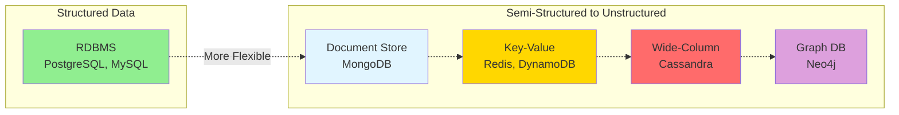
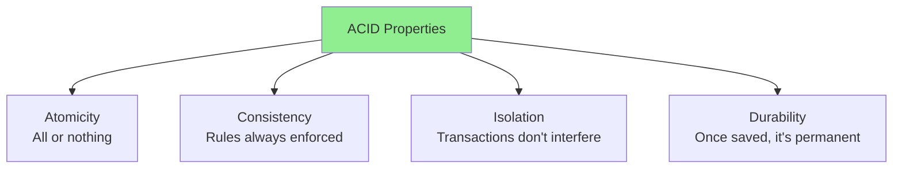
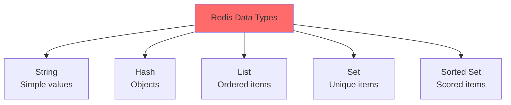
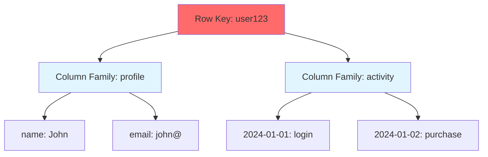
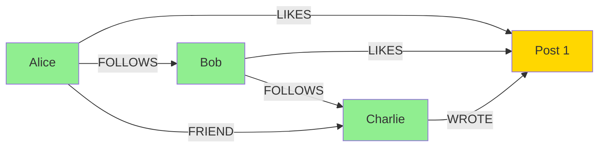
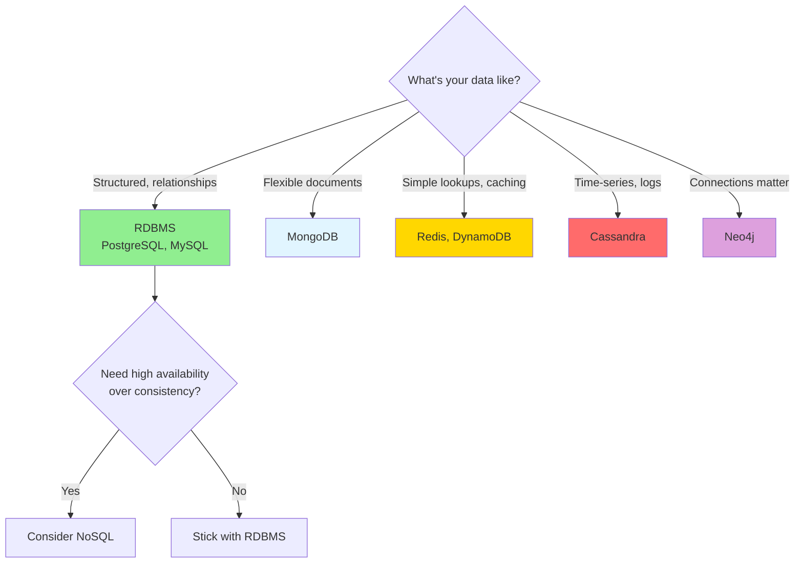
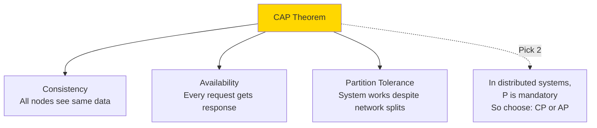
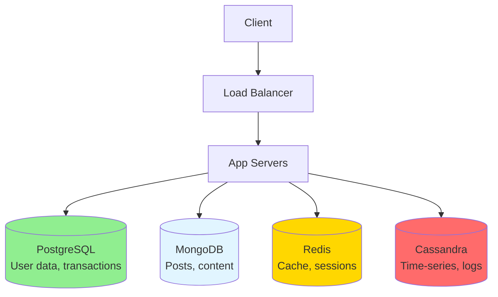

# Database Types: The Storage Decision Matrix

> **Big Picture**: Choosing the right database is one of the most critical decisions in system design. It affects performance, scalability, consistency, and how easy your system is to maintain. There's no "best" database - only the best database for your specific use case.

---

## The Library vs Filing Cabinet Analogy

**RDBMS (SQL)** = A well-organized library with a strict card catalog system
- Everything has a specific place
- Relationships are clear (this book is by that author)
- You can ask complex questions ("Find all mystery books by authors born before 1950")
- Changing the organization system is difficult (renovating the library)

**NoSQL** = A flexible filing system with different storage strategies
- Some things in folders (documents), some on index cards (key-value), some in a web of connections (graph)
- Easy to add new types of items without reorganizing everything
- Super fast for simple lookups
- Complex questions across different file types are harder

---

## The Spectrum of Database Types



---

## RDBMS (Relational Databases)

### Mental Model: Spreadsheet on Steroids

Think of Excel spreadsheets where you can:
- Link data across sheets using formulas
- Ensure data follows rules (phone numbers must be 10 digits)
- Ask complex questions combining multiple sheets

### Key Characteristics



### Example: E-commerce Order System

```typescript
// Users Table
interface User {
  id: number;           // Primary Key
  email: string;
  name: string;
  created_at: Date;
}

// Orders Table
interface Order {
  id: number;           // Primary Key
  user_id: number;      // Foreign Key -> User.id
  total: number;
  status: 'pending' | 'paid' | 'shipped';
  created_at: Date;
}

// Order_Items Table (many-to-many relationship)
interface OrderItem {
  id: number;
  order_id: number;     // Foreign Key -> Order.id
  product_id: number;   // Foreign Key -> Product.id
  quantity: number;
  price: number;
}
```

**SQL Query Power**:
```sql
-- Find all users who bought iPhone in the last 30 days
SELECT u.name, u.email, SUM(oi.price * oi.quantity) as total_spent
FROM users u
JOIN orders o ON u.id = o.user_id
JOIN order_items oi ON o.id = oi.order_id
JOIN products p ON oi.product_id = p.id
WHERE p.name = 'iPhone'
  AND o.created_at > NOW() - INTERVAL '30 days'
GROUP BY u.id, u.name, u.email
ORDER BY total_spent DESC;
```

### When to Use RDBMS

✅ **Perfect for**:
- Complex relationships (users, orders, products)
- Financial transactions (need ACID guarantees)
- Data integrity is critical
- Complex queries across multiple entities
- Structured data with known schema

❌ **Not ideal for**:
- Massive scale (billions of rows, thousands of writes/sec)
- Highly flexible schema (data structure changes frequently)
- High availability > consistency
- Simple key-value lookups

---

## NoSQL: Document Stores (MongoDB)

### Mental Model: JSON File Cabinet

Imagine storing complete documents in folders:
- Each document contains all its information
- Easy to grab a whole document
- Hard to query across documents

### Structure

```typescript
// MongoDB Collection: posts
interface Post {
  _id: ObjectId;
  title: string;
  content: string;
  author: {              // Embedded document
    id: string;
    name: string;
    avatar_url: string;
  };
  comments: Array<{      // Embedded array
    user_id: string;
    text: string;
    created_at: Date;
  }>;
  tags: string[];
  likes: number;
  created_at: Date;
}

// Example document
const post = {
  _id: ObjectId("507f1f77bcf86cd799439011"),
  title: "Why I Love MongoDB",
  content: "...",
  author: {
    id: "user123",
    name: "John Doe",
    avatar_url: "https://..."
  },
  comments: [
    { user_id: "user456", text: "Great post!", created_at: new Date() }
  ],
  tags: ["database", "nosql"],
  likes: 42,
  created_at: new Date()
};
```

### When to Use Document Stores

✅ **Perfect for**:
- Content management systems (blogs, articles)
- User profiles with varying fields
- Product catalogs with different attributes
- Real-time analytics
- Rapid prototyping (schema can evolve)

❌ **Not ideal for**:
- Complex multi-document transactions
- Many-to-many relationships
- Strict data integrity requirements

### Interview Insight: Embedding vs Referencing

```typescript
// OPTION 1: Embedding (MongoDB way)
// Good: One query to get everything
// Bad: Document size grows, data duplication
{
  _id: "post123",
  title: "Post title",
  author: { id: "user1", name: "John" },  // Embedded
  comments: [...]  // Embedded
}

// OPTION 2: Referencing (SQL way)
// Good: No duplication, updates are easy
// Bad: Multiple queries or $lookup (slow)
{
  _id: "post123",
  title: "Post title",
  author_id: "user1",  // Reference
  comment_ids: ["c1", "c2", "c3"]  // References
}
```

**In interviews, explain the trade-off**:
"I'd embed comments in the post document for fast reads, but reference the author to avoid data duplication. If a user changes their name, we don't want to update every post."

---

## NoSQL: Key-Value Stores (Redis, DynamoDB)

### Mental Model: A Giant HashMap

```typescript
// Redis - ultra-fast in-memory key-value store
const cache = new Map<string, string>();

// Simple operations
cache.set('user:1000:session', '{"userId":1000,"loginAt":"..."}');
cache.get('user:1000:session');

// With TTL (Time To Live)
cache.set('otp:phone:5551234', '123456', { EX: 300 }); // Expires in 5 min
```

### Data Structures in Redis



### Real-World Use Cases

```typescript
// 1. SESSION STORAGE
interface UserSession {
  userId: string;
  email: string;
  loginAt: Date;
}

await redis.set(
  `session:${sessionId}`,
  JSON.stringify(session),
  { EX: 3600 }  // 1 hour
);

// 2. RATE LIMITING (with sorted sets)
const rateLimitKey = `ratelimit:${userId}:${endpoint}`;
const now = Date.now();
const window = 60000; // 1 minute

// Add current request timestamp
await redis.zadd(rateLimitKey, now, `${now}-${Math.random()}`);

// Remove requests outside the time window
await redis.zremrangebyscore(rateLimitKey, 0, now - window);

// Count requests in current window
const requestCount = await redis.zcard(rateLimitKey);

if (requestCount > 100) {
  throw new Error('Rate limit exceeded');
}

// 3. LEADERBOARD (sorted set)
await redis.zadd('game:leaderboard', score, userId);
const topPlayers = await redis.zrevrange('game:leaderboard', 0, 9); // Top 10
```

### When to Use Key-Value Stores

✅ **Perfect for**:
- Caching
- Session storage
- Real-time analytics counters
- Rate limiting
- Leaderboards
- Pub/Sub messaging

❌ **Not ideal for**:
- Complex queries
- Data with relationships
- Long-term persistent storage (Redis is in-memory)

---

## NoSQL: Wide-Column Stores (Cassandra, HBase)

### Mental Model: Sparse Multi-Dimensional Table

Imagine a spreadsheet where:
- Rows can have different columns
- Optimized for writing massive amounts of data
- Reading requires knowing the row key



### When to Use Wide-Column Stores

✅ **Perfect for**:
- Time-series data (logs, sensor data, metrics)
- Write-heavy workloads
- Need for high availability over consistency
- Massive scale (petabytes)

**Examples**:
- Apple uses Cassandra for 75+ petabytes of data
- Netflix uses Cassandra for streaming metadata

---

## NoSQL: Graph Databases (Neo4j)

### Mental Model: Social Network Map

Instead of tables, think of nodes and edges:



### Query Example (Cypher - Neo4j's query language)

```cypher
// Find friends of friends who like the same posts as me
MATCH (me:User {id: 'alice'})-[:FRIEND]->(friend)-[:FRIEND]->(fof)
WHERE (me)-[:LIKES]->(:Post)<-[:LIKES]-(fof)
AND NOT (me)-[:FRIEND]->(fof)
RETURN fof.name, COUNT(*) as common_likes
ORDER BY common_likes DESC
LIMIT 10
```

### When to Use Graph Databases

✅ **Perfect for**:
- Social networks (followers, friends)
- Recommendation engines
- Fraud detection (pattern analysis)
- Network and IT operations
- Knowledge graphs

---

## The Decision Matrix



---

## Real Interview Scenarios

### Scenario 1: Design Twitter

**Interviewer**: What database would you use?

**Answer**:
```
"I'd use a polyglot persistence approach:

1. PostgreSQL for user accounts, authentication
   - Need ACID for signup/login transactions
   - Structured data with clear schema

2. Cassandra for tweets and timelines
   - Write-heavy (millions of tweets/sec)
   - Time-series data
   - High availability preferred (CAP theorem - AP over CP)

3. Redis for:
   - Timeline caching (hot tweets)
   - Rate limiting (API quotas)
   - Session storage

4. Neo4j or in-memory graph for follower relationships
   - Fast follower lookups
   - Friend suggestions
"
```

### Scenario 2: Design Instagram

**Key database considerations**:

```typescript
// User profiles: PostgreSQL
interface User {
  id: string;
  username: string;
  email: string;
  password_hash: string;
}

// Posts: MongoDB (flexible schema)
interface Post {
  id: string;
  user_id: string;
  image_url: string;
  caption: string;
  filters_applied: string[];
  location?: {
    lat: number;
    lng: number;
    name: string;
  };
  likes_count: number;
  created_at: Date;
}

// Likes: Cassandra (time-series, write-heavy)
// Partition key: post_id, Clustering key: timestamp
interface Like {
  post_id: string;
  user_id: string;
  created_at: Date;
}

// Comments: Cassandra
interface Comment {
  post_id: string;
  comment_id: string;
  user_id: string;
  text: string;
  created_at: Date;
}

// Feed cache: Redis
// Key: `feed:{user_id}`, Value: list of post IDs
```

---

## CAP Theorem Preview

Understanding which database to choose often comes down to CAP theorem:



- **RDBMS (PostgreSQL)**: CP - Consistency + Partition Tolerance
- **Cassandra**: AP - Availability + Partition Tolerance
- **MongoDB**: Tunable (can configure for CP or AP)

*See [03-cap-theorem.md](03-cap-theorem.md) for deep dive*

---

## Common Interview Questions

### Q: Why not just use one database for everything?

**A**:
"Different data access patterns have different requirements. User authentication needs strong consistency (RDBMS), but a news feed can tolerate slight delays for better availability (Cassandra). Using the right tool for each job optimizes performance and cost."

### Q: How do you keep multiple databases in sync?

**A**:
```typescript
// Option 1: Dual writes (not recommended - can fail)
await postgres.createUser(user);
await mongodb.createUserProfile(user); // What if this fails?

// Option 2: Event-driven (recommended)
// Write to primary source of truth
await postgres.createUser(user);

// Publish event
await eventBus.publish('user.created', { userId: user.id });

// Consumers update other databases
eventBus.subscribe('user.created', async (event) => {
  await mongodb.createUserProfile(event.userId);
  await redis.set(`user:${event.userId}`, JSON.stringify(user));
});
```

### Q: When would you choose MongoDB over PostgreSQL?

**A**:
"Choose MongoDB when:
- Schema is evolving rapidly (startup, prototyping)
- Documents have varying structures (product catalog with different attributes)
- Horizontal scaling is immediate priority
- Eventual consistency is acceptable

Stick with PostgreSQL when:
- Data integrity is critical (financial transactions)
- Complex joins are common
- ACID guarantees are required
- Team has strong SQL expertise"

---

## The Big Picture



**Most real-world systems use multiple database types (polyglot persistence)**

---

## Key Takeaways for Interviews

1. **No single best database** - explain trade-offs for your use case
2. **Start with the data access pattern**: read-heavy? write-heavy? complex queries?
3. **Consider consistency requirements**: money = RDBMS, social feed = NoSQL
4. **Mention specific technologies**: "I'd use PostgreSQL for..." sounds better than "I'd use SQL..."
5. **Discuss scaling strategy**: How will this database handle growth?

---

## Quick Reference Table

| Use Case | Database | Why |
|----------|----------|-----|
| User accounts, auth | PostgreSQL | ACID, relationships |
| Blog posts, CMS | MongoDB | Flexible schema, fast reads |
| Session storage | Redis | In-memory, fast, TTL |
| Product catalog | MongoDB | Varying attributes |
| Financial transactions | PostgreSQL | ACID guarantees |
| Social feed | Cassandra | Write-heavy, time-series |
| Friend relationships | Neo4j | Graph queries |
| Leaderboards | Redis (Sorted Sets) | Fast sorted queries |
| Metrics, logs | Cassandra | Time-series, massive scale |
| Shopping cart | Redis | Session-based, fast |

---

## Next Steps

- Read: [03-cap-theorem.md](03-cap-theorem.md) - Understanding distributed system trade-offs
- Practice: Design Uber's database architecture
- Deep dive: Study PostgreSQL indexing and MongoDB sharding strategies
