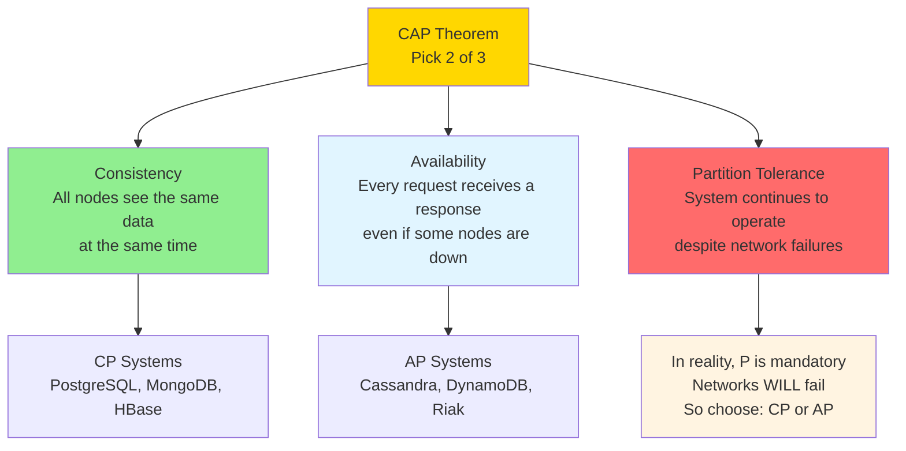
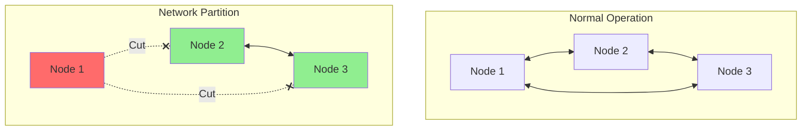
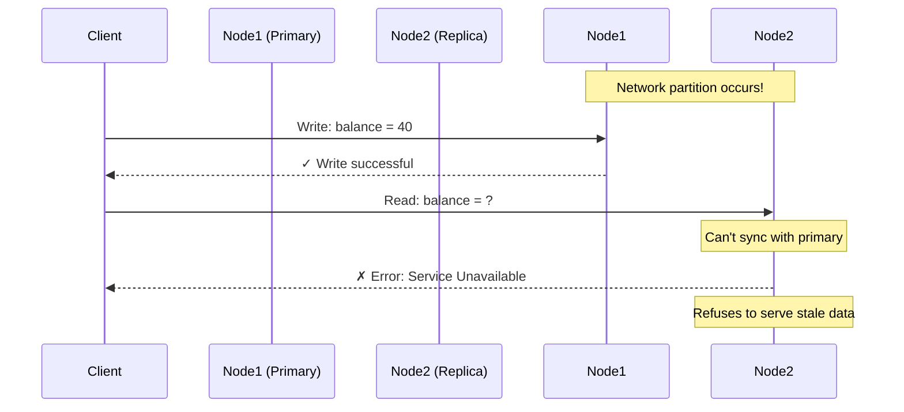
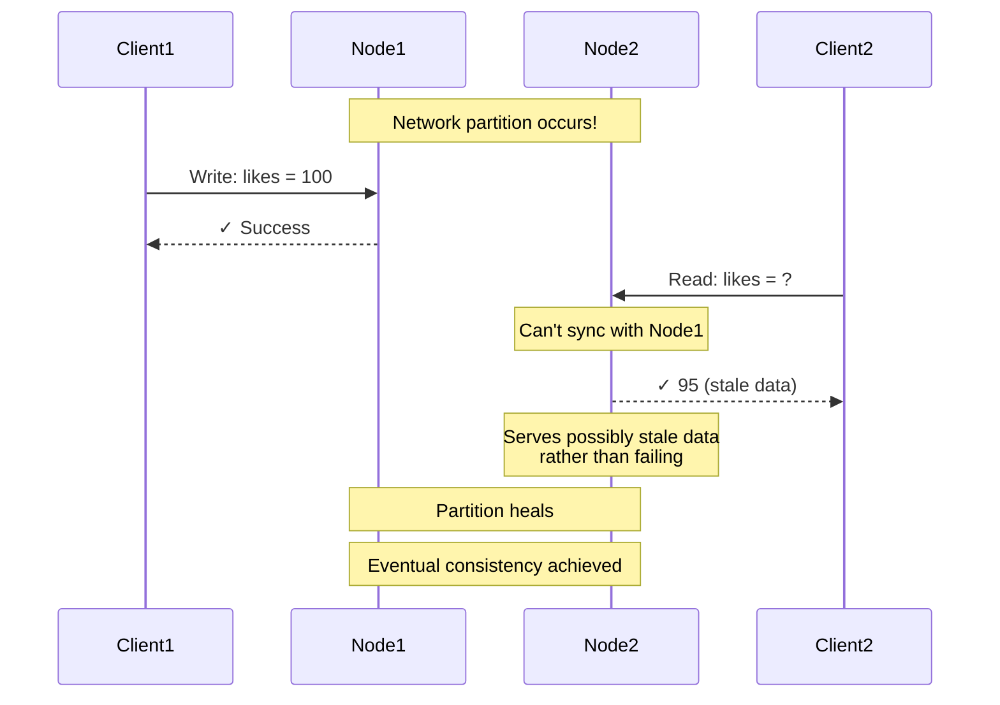
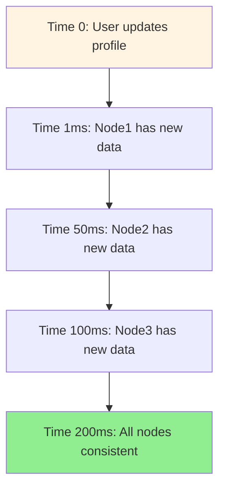
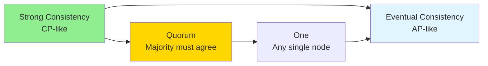
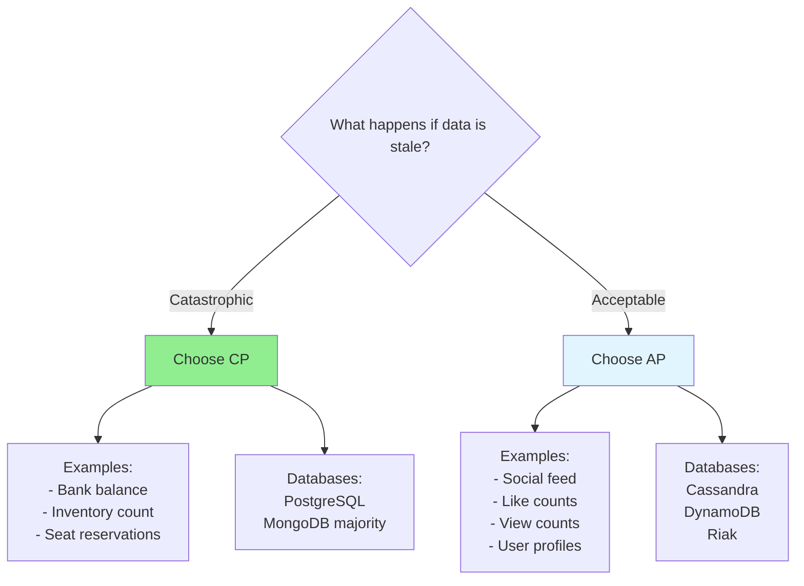
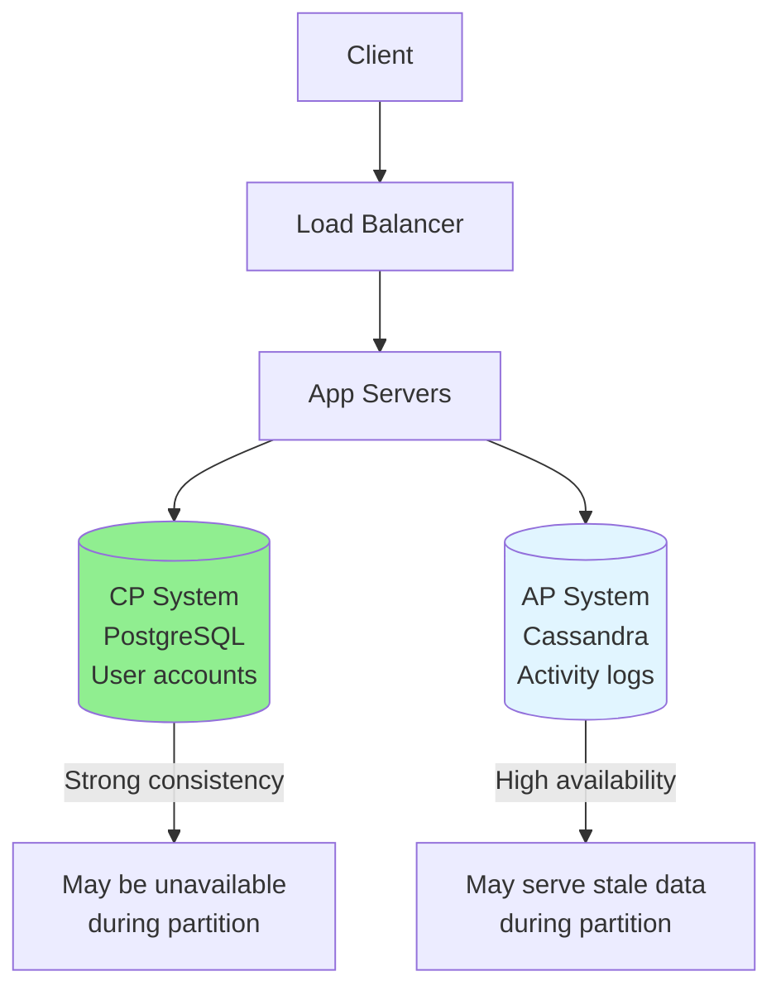

# CAP Theorem: The Impossible Triangle

> **Big Picture**: CAP theorem is the fundamental trade-off in distributed systems. It explains why you can't have everything - you must choose what matters most for your specific use case. Understanding CAP helps you make intelligent database and architecture decisions.

---

## The Restaurant Analogy

Imagine you own a restaurant chain with three locations:

**Consistency**: All locations have the same menu at the same time
- If one restaurant runs out of pasta, all restaurants instantly know and stop serving pasta

**Availability**: Every restaurant always serves customers (never closes)
- Even if they can't communicate with other locations, they keep serving

**Partition Tolerance**: Restaurants can operate even when phone lines are down
- When communication fails between locations, the system still works

### The Impossible Choice

```
You get a huge snowstorm (network partition):
- Option 1 (CP): Close restaurants that can't communicate to ensure consistency
- Option 2 (AP): Keep all restaurants open, accept menus might differ
- Option 3 (CA): Only works if snowstorms never happen (single location = not distributed)
```

**CAP theorem says: Pick 2 of 3, and in distributed systems, partitions WILL happen, so really it's: Choose CP or AP**

---

## The CAP Theorem Visualized



---

## Breaking Down Each Component

### Consistency (C)

**Definition**: All clients see the same data at the same time, no matter which node they connect to.

**Bank Account Analogy**:
```
Your bank account has $100

Scenario: You withdraw $60 at ATM-A
- With Consistency: ATM-B instantly shows $40
- Without Consistency: ATM-B might still show $100 (stale data)
```

**In Code**:
```typescript
// CONSISTENT SYSTEM (PostgreSQL)
// Write to primary
await db.users.update({ id: 1 }, { balance: 40 });

// Immediately read from replica
const user = await db.users.findOne({ id: 1 });
console.log(user.balance); // GUARANTEED to be 40

// System waits for all replicas to sync before confirming write
```

---

### Availability (A)

**Definition**: Every request receives a response (success or failure), even if some nodes are down.

**Emergency Room Analogy**:
```
Hospital ER promises to ALWAYS see patients:
- Even if the record system is down
- Even if they can't access your medical history
- They'll treat you with incomplete info rather than turn you away
```

**In Code**:
```typescript
// AVAILABLE SYSTEM (Cassandra)
// Write succeeds even if some nodes are down
try {
  await cassandra.insert({
    userId: 1,
    action: 'purchase',
    timestamp: Date.now()
  }, { consistency: 'ONE' }); // Only needs 1 node to ack

  // Returns success immediately
  res.status(200).send('Purchase recorded');
} catch (err) {
  // Almost never happens - very highly available
}

// Different nodes might have different data temporarily
// But the system never refuses to serve requests
```

---

### Partition Tolerance (P)

**Definition**: System continues to work even when network messages are lost or delayed between nodes.

**Island Chain Analogy**:
```
3 islands (servers) normally communicate by radio:
- Hurricane hits (network partition)
- Islands can't talk to each other
- Partition Tolerant system: Each island keeps functioning independently
- Not Partition Tolerant: Whole system shuts down
```



**Reality**: In distributed systems, network partitions WILL occur. You must handle them.

---

## CP Systems: Consistency + Partition Tolerance

**Trade-off**: Sacrifice availability during network partitions to maintain consistency.

### When Partition Happens



### Real Example: MongoDB (Configurable)

```typescript
// MongoDB with majority write concern (CP)
await db.collection('accounts').updateOne(
  { userId: 1 },
  { $set: { balance: 40 } },
  { writeConcern: { w: 'majority' } } // Wait for majority of nodes
);

// If partition prevents majority, write FAILS
// Better to reject the write than accept inconsistent data
```

### Use Cases for CP

✅ **Choose CP when**:
- Financial transactions (banking, payments)
- Inventory management (can't oversell products)
- Booking systems (hotel rooms, flight seats)
- Any system where stale data causes problems

**Examples**:
- Bank account balances
- Stock trading platforms
- Ticketing systems (concerts, flights)

**Mental Model**: "I'd rather show an error than show wrong information"

---

## AP Systems: Availability + Partition Tolerance

**Trade-off**: Sacrifice consistency during network partitions to maintain availability.

### When Partition Happens



### Real Example: Cassandra (AP)

```typescript
// Cassandra with low consistency level (AP)
await cassandra.execute(
  'UPDATE posts SET likes = likes + 1 WHERE post_id = ?',
  [postId],
  { consistency: 'ONE' } // Only needs 1 node to ack
);

// Returns immediately, might not be replicated yet
// Different nodes might have different like counts temporarily
// Eventually, all nodes will have the correct count
```

### Use Cases for AP

✅ **Choose AP when**:
- Social media feeds (slight delay is OK)
- Shopping cart (can reconcile later)
- User profiles (updates can propagate slowly)
- Analytics and metrics (approximate is fine)
- DNS (eventual consistency is acceptable)

**Examples**:
- Facebook likes/comments
- Twitter follower counts
- Amazon shopping cart
- View counts on YouTube

**Mental Model**: "Always be available, accuracy can catch up later"

---

## Eventual Consistency

**Analogy**: Wikipedia edits
- You edit a Wikipedia page
- Different servers around the world have different versions for a few seconds
- Eventually (usually within seconds), all servers have the same version



**In practice**: Most AP systems achieve consistency in milliseconds to seconds, not hours.

---

## Real-World System Design Decisions

### Scenario 1: Design Instagram

```typescript
// Instagram's Likely Approach (Hybrid)

// USER ACCOUNTS - CP (PostgreSQL)
// Can't have duplicate usernames, need consistency
interface User {
  id: string;
  username: string; // UNIQUE constraint
  email: string;
  password_hash: string;
}

// POSTS - AP (Cassandra)
// Availability is more important, eventual consistency OK
interface Post {
  post_id: string;
  user_id: string;
  image_url: string;
  caption: string;
  created_at: Date;
}

// LIKES - AP (Cassandra)
// Like counts can be slightly off, no problem
interface Like {
  post_id: string;
  user_id: string;
  created_at: Date;
}

// FEED CACHE - AP (Redis)
// If cache is slightly stale, no big deal
```

**Interview Answer**:
```
"For Instagram, I'd use a hybrid approach:

CP for user registration/login:
- Username must be unique globally
- Can't have two users with same username
- PostgreSQL with strong consistency

AP for likes/comments:
- If like count is off by a few for 100ms, no problem
- High availability is crucial (users expect it to work)
- Cassandra for high write throughput

The key is matching consistency requirements to business needs."
```

---

### Scenario 2: Design Uber

```typescript
// RIDER/DRIVER MATCHING - CP
// Can't assign same driver to two riders
interface RideRequest {
  rider_id: string;
  driver_id: string | null;
  status: 'pending' | 'matched' | 'in_progress' | 'completed';
}

// DRIVER LOCATION - AP
// If driver location is 1-2 seconds stale, acceptable
// High availability is critical
interface DriverLocation {
  driver_id: string;
  lat: number;
  lng: number;
  timestamp: Date;
}

// PAYMENT - CP
// Money must be handled with strong consistency
interface Payment {
  ride_id: string;
  amount: number;
  status: 'pending' | 'completed' | 'failed';
}
```

---

## The Spectrum: Tunable Consistency

Modern databases often let you choose your consistency level per operation:



### Cassandra Example

```typescript
// CRITICAL OPERATION - Use Quorum (CP-like)
await cassandra.execute(
  'UPDATE inventory SET quantity = quantity - 1 WHERE product_id = ?',
  [productId],
  { consistency: 'QUORUM' } // Wait for majority of replicas
);

// NON-CRITICAL OPERATION - Use One (AP-like)
await cassandra.execute(
  'INSERT INTO page_views (user_id, page, timestamp) VALUES (?, ?, ?)',
  [userId, page, Date.now()],
  { consistency: 'ONE' } // Any one node is enough
);
```

---

## Common Misconceptions

### ❌ Misconception 1: "CAP means pick 2"

**Reality**: In distributed systems, partitions WILL happen. So it's really:
- When there's NO partition: You get both C and A
- When there IS a partition: Choose C or A

### ❌ Misconception 2: "NoSQL = AP, SQL = CP"

**Reality**:
- PostgreSQL with synchronous replication = CP
- PostgreSQL with asynchronous replication = more like AP
- MongoDB = tunable (can be CP or AP)
- Cassandra = AP
- Google Spanner = claims to be CA (with very expensive clocks)

### ❌ Misconception 3: "AP systems are always inconsistent"

**Reality**:
- AP systems are "eventually consistent"
- "Eventually" often means milliseconds in practice
- Only inconsistent during partitions

---

## Interview Framework

When asked about CAP in interviews:

### Step 1: Identify the data

```
"Let me break down different types of data in this system..."
```

### Step 2: Classify by importance

```
"User authentication requires strong consistency (CP)
But user profile views can tolerate eventual consistency (AP)"
```

### Step 3: Choose databases accordingly

```
"I'd use PostgreSQL for auth (CP) and Cassandra for activity logs (AP)"
```

### Step 4: Explain the trade-offs

```
"During a network partition:
- Auth service might show errors (maintaining consistency)
- Activity logs keep accepting writes (maintaining availability)
This matches business priorities: can't risk duplicate accounts,
but can accept slightly delayed activity data."
```

---

## Visual Decision Tree



---

## The Big Picture



---

## Common Interview Questions

### Q: Can you have all three (C, A, P)?

**A**: "Not in a distributed system. Google Spanner gets close by using atomic clocks and GPS for time synchronization, making partitions extremely rare. But for most systems, we must choose CP or AP based on business requirements."

### Q: Is AWS DynamoDB CP or AP?

**A**: "DynamoDB is primarily AP - it prioritizes availability. However, it offers eventual consistency by default and strongly consistent reads as an option, giving you tunable consistency per operation."

### Q: How do banks handle CAP theorem?

**A**: "Banks choose CP. They use distributed transactions (2-phase commit) and would rather show an error than show incorrect balance. During partitions, some operations might fail, but consistency is never compromised. This is why sometimes ATMs go offline - they're maintaining consistency."

---

## Key Takeaways for Interviews

1. **CAP is about trade-offs, not absolutes**: No right answer, only right answer for YOUR use case
2. **Different data, different needs**: Use CP for critical data, AP for less critical data
3. **Know the vocabulary**: Strong consistency, eventual consistency, quorum
4. **Real-world is hybrid**: Most systems use multiple databases with different CAP profiles
5. **Always explain the business impact**: "Likes can be eventually consistent because..."

---

## Practice Questions

1. You're designing Twitter. For each feature, choose CP or AP:
   - User login
   - Tweet likes
   - Follower count
   - Direct messages
   - Trending topics

2. Design a hotel booking system. Why must it be CP?

3. Design Facebook News Feed. Why can it be AP?

**Answers**:
1.
   - User login: **CP** (can't have duplicate logins, security critical)
   - Tweet likes: **AP** (count can be slightly off)
   - Follower count: **AP** (approximate is fine)
   - Direct messages: **CP** (can't lose messages)
   - Trending topics: **AP** (approximation is fine)

2. Hotel booking must be CP because:
   - Can't double-book the same room
   - Consistency is critical (money involved)
   - Better to show "room unavailable" than accept two bookings for one room

3. Facebook Feed can be AP because:
   - Users accept seeing posts from 1-2 seconds ago
   - High availability is crucial (users expect instant access)
   - Eventual consistency is acceptable for social content

---

## Next Steps

- Read: [04-caching-strategies.md](04-caching-strategies.md) - Improving performance with caching
- Practice: Classify data in systems you use daily as CP or AP
- Deep dive: Study how Amazon's Dynamo paper influenced AP systems
