# Caching Strategies: The Speed Multiplier

> **Big Picture**: Caching is the single most impactful optimization you can make to a system. It reduces database load, decreases latency, and can transform a slow system into a fast one. Understanding when and how to cache is essential for every system design interview.

---

## The Library Analogy

**Without Cache (Going to Library Every Time)**:
- You need to reference a book
- Walk 10 minutes to the library
- Find the book on the shelf
- Read the relevant page
- Walk 10 minutes back
- **Total time: 20+ minutes per lookup**

**With Cache (Keeping Book on Your Desk)**:
- You need the same book repeatedly
- Keep a copy on your desk
- Instant access
- **Total time: 10 seconds per lookup**

**Trade-offs**:
- Desk space is limited (cache has limited memory)
- Book might be outdated (cache can be stale)
- Must decide which books to keep (eviction policy)

---

## Why Caching Matters


**Real impact**:
- **Latency**: Database query: 50ms → Redis cache: 1ms (50x faster)
- **Throughput**: Database: 1K QPS → Redis: 100K+ QPS (100x more)
- **Cost**: Fewer database servers needed

---

## Where to Cache: The Caching Layers


1. **Browser cache**: HTML, CSS, JS, images (controlled by headers)
2. **CDN cache**: Static assets close to users geographically
3. **Application cache**: In-memory cache in each server (e.g., Node.js Map)
4. **Distributed cache**: Redis/Memcached (shared across all servers)
5. **Database cache**: Query result cache (InnoDB buffer pool)

**Most common in interviews**: Distributed cache (Redis) between app and database

---

## Three Core Caching Strategies

### 1. Cache-Aside (Lazy Loading)

**Analogy**: Looking in your fridge before going to the grocery store.


**Code Example**:
```typescript
async function getUser(userId: string): Promise<User> {
  const cacheKey = `user:${userId}`;

  // 1. Try cache first
  const cached = await redis.get(cacheKey);
  if (cached) {
    console.log('Cache HIT');
    return JSON.parse(cached);
  }

  console.log('Cache MISS');

  // 2. Query database
  const user = await db.users.findOne({ id: userId });

  // 3. Store in cache for 1 hour
  await redis.setex(cacheKey, 3600, JSON.stringify(user));

  return user;
}
```

**Pros**:
- ✅ Simple to implement
- ✅ Cache only what's actually requested (no wasted memory)
- ✅ Cache failures don't break the system (fallback to DB)

**Cons**:
- ❌ First request is always slow (cache miss)
- ❌ Cache and DB can get out of sync

**When to use**:
- Read-heavy workloads
- Data that doesn't change often
- Most common pattern for interviews

---

### 2. Write-Through Cache

**Analogy**: Writing in both your personal diary AND a shared family calendar at the same time.


**Code Example**:
```typescript
async function updateUser(userId: string, updates: Partial<User>): Promise<void> {
  const cacheKey = `user:${userId}`;

  // 1. Write to database
  await db.users.update({ id: userId }, updates);

  // 2. Update cache immediately
  const user = await db.users.findOne({ id: userId });
  await redis.setex(cacheKey, 3600, JSON.stringify(user));

  // Cache is always consistent with DB
}
```

**Pros**:
- ✅ Cache is always consistent with database
- ✅ Read performance is always fast (no cache misses after writes)

**Cons**:
- ❌ Write latency is higher (two writes)
- ❌ Might cache data that's never read (wasted memory)
- ❌ If cache fails, write fails too

**When to use**:
- When data must be immediately consistent
- When you read data immediately after writing it
- When write performance is not critical

---

### 3. Write-Back (Write-Behind) Cache

**Analogy**: Taking notes in a notebook, then copying to the textbook only once an hour.


**Code Example**:
```typescript
// Write-back pattern (simplified)
async function incrementPageView(pageId: string): Promise<void> {
  const cacheKey = `page:${pageId}:views`;

  // 1. Increment in cache immediately
  await redis.incr(cacheKey);

  // 2. Add to write-back queue
  await redis.lpush('writebackQueue', JSON.stringify({
    type: 'pageView',
    pageId,
    timestamp: Date.now()
  }));

  // Fast response to client
}

// Background worker flushes to DB periodically
setInterval(async () => {
  const items = await redis.lrange('writebackQueue', 0, 99);

  // Batch write to database
  const updates = items.map(item => JSON.parse(item));
  await db.pageViews.insertMany(updates);

  // Remove from queue
  await redis.ltrim('writebackQueue', 100, -1);
}, 5000); // Every 5 seconds
```

**Pros**:
- ✅ Extremely fast writes (cache speed)
- ✅ Batching reduces database load
- ✅ Great for write-heavy workloads

**Cons**:
- ❌ Risk of data loss if cache crashes before DB write
- ❌ Complex to implement
- ❌ Eventually consistent (DB lags behind cache)

**When to use**:
- Write-heavy analytics (page views, metrics)
- When some data loss is acceptable
- When write performance is critical

---

## Cache Eviction Policies

**Problem**: Cache is full. Which item do you remove to make space?


---

### LRU (Least Recently Used)

**Analogy**: Clothes in your closet - push recently worn items to the front, donate items you haven't worn in a year.

```typescript
// LRU Cache Implementation (simplified)
class LRUCache<K, V> {
  private cache = new Map<K, V>();
  private maxSize: number;

  constructor(maxSize: number) {
    this.maxSize = maxSize;
  }

  get(key: K): V | undefined {
    const value = this.cache.get(key);
    if (value !== undefined) {
      // Move to end (most recently used)
      this.cache.delete(key);
      this.cache.set(key, value);
    }
    return value;
  }

  set(key: K, value: V): void {
    // If exists, remove old position
    if (this.cache.has(key)) {
      this.cache.delete(key);
    }

    // Add to end
    this.cache.set(key, value);

    // Evict LRU if over capacity
    if (this.cache.size > this.maxSize) {
      const firstKey = this.cache.keys().next().value;
      this.cache.delete(firstKey);
    }
  }
}

// Redis has LRU built-in
await redis.config('SET', 'maxmemory-policy', 'allkeys-lru');
```

**When to use**: General-purpose caching (most common)

---

### TTL (Time To Live)

**Analogy**: Milk in your fridge - throw it out after the expiration date, regardless of how recently you used it.

```typescript
// Set cache with TTL
await redis.setex('session:abc123', 3600, sessionData); // Expires in 1 hour

// Set different TTLs for different data types
await redis.setex('user:profile:123', 86400, userData);     // 24 hours
await redis.setex('trending:posts', 300, trendingPosts);    // 5 minutes
await redis.setex('api:ratelimit:user123', 60, '100');      // 1 minute
```

**When to use**: Data with natural expiration (sessions, temporary data)

---

## Cache Invalidation: The Hard Problem

> "There are only two hard things in Computer Science: cache invalidation and naming things." - Phil Karlton

### Problem: Stale Data


---

### Strategy 1: TTL-Based Invalidation

**Simplest approach**: Let cache expire automatically.

```typescript
// Cache with short TTL
await redis.setex('user:123', 300, JSON.stringify(user)); // 5 min

// Trade-off: May serve stale data for up to 5 minutes
// Benefit: Simple, works for most use cases
```

**When to use**: Data where slight staleness is acceptable

---

### Strategy 2: Active Invalidation

**Approach**: Delete cache when data changes.

```typescript
async function updateUser(userId: string, updates: Partial<User>): Promise<void> {
  // 1. Update database
  await db.users.update({ id: userId }, updates);

  // 2. Invalidate cache
  await redis.del(`user:${userId}`);

  // Next read will be cache miss, will fetch fresh data
}
```

**Pros**: Always fresh data
**Cons**: Every update invalidates cache, causing cache misses

---

### Strategy 3: Write-Through (Update Cache on Write)

```typescript
async function updateUser(userId: string, updates: Partial<User>): Promise<void> {
  // 1. Update database
  await db.users.update({ id: userId }, updates);

  // 2. Update cache with new data
  const user = await db.users.findOne({ id: userId });
  await redis.setex(`user:${userId}`, 3600, JSON.stringify(user));
}
```

**Pros**: Cache is always up-to-date
**Cons**: Extra database query on every write

---

### Strategy 4: Event-Driven Invalidation

```typescript
// On write, publish event
async function updateUser(userId: string, updates: Partial<User>): Promise<void> {
  await db.users.update({ id: userId }, updates);

  // Publish invalidation event
  await eventBus.publish('user.updated', { userId });
}

// All app servers subscribe and invalidate their caches
eventBus.subscribe('user.updated', async ({ userId }) => {
  await redis.del(`user:${userId}`);
  await localCache.delete(userId); // If using in-memory cache
});
```

**Pros**: Works across multiple cache layers
**Cons**: More complex infrastructure

---

## Common Caching Patterns

### Pattern 1: Cache Popular Items (Pareto Principle)

**Insight**: 20% of data accounts for 80% of traffic.

```typescript
// Automatically cache hot items
async function getProduct(productId: string): Promise<Product> {
  const cacheKey = `product:${productId}`;

  // Try cache
  const cached = await redis.get(cacheKey);
  if (cached) return JSON.parse(cached);

  // Cache miss - get from DB
  const product = await db.products.findOne({ id: productId });

  // Only cache if this product is being accessed frequently
  const accessCount = await redis.incr(`access:${productId}`);

  if (accessCount > 10) {
    // This is a hot item, cache it
    await redis.setex(cacheKey, 3600, JSON.stringify(product));
  }

  return product;
}
```

---

### Pattern 2: Caching Computed Results

**Use case**: Expensive calculations, aggregations

```typescript
// Dashboard showing user stats
async function getUserDashboard(userId: string): Promise<Dashboard> {
  const cacheKey = `dashboard:${userId}`;

  const cached = await redis.get(cacheKey);
  if (cached) return JSON.parse(cached);

  // Expensive queries
  const [totalPosts, totalLikes, followers, following] = await Promise.all([
    db.posts.countDocuments({ userId }),
    db.likes.countDocuments({ userId }),
    db.follows.countDocuments({ followee: userId }),
    db.follows.countDocuments({ follower: userId })
  ]);

  const dashboard = { totalPosts, totalLikes, followers, following };

  // Cache for 5 minutes (these stats don't need real-time accuracy)
  await redis.setex(cacheKey, 300, JSON.stringify(dashboard));

  return dashboard;
}
```

---

### Pattern 3: Cache Aside for Lists/Feeds

```typescript
// User's news feed
async function getNewsFeed(userId: string, page: number = 1): Promise<Post[]> {
  const cacheKey = `feed:${userId}:${page}`;

  const cached = await redis.get(cacheKey);
  if (cached) return JSON.parse(cached);

  // Generate feed (expensive operation)
  const feed = await generateFeed(userId, page);

  // Cache for 1 minute (feed updates frequently)
  await redis.setex(cacheKey, 60, JSON.stringify(feed));

  return feed;
}

// Invalidate when new post is created
async function createPost(userId: string, content: string): Promise<void> {
  await db.posts.insert({ userId, content });

  // Invalidate feeds of all followers
  const followers = await db.follows.find({ followee: userId });

  await Promise.all(
    followers.map(f => redis.del(`feed:${f.follower}:1`)) // Clear first page
  );
}
```

---

## Cache Stampede (Thundering Herd)

**Problem**: Cache expires, 1000 requests hit database simultaneously.

```mermaid
sequenceDiagram
    participant R1 as Request 1
    participant R2 as Request 2
    participant RN as Request N
    participant Cache
    participant DB

    Note over Cache: popular:item expires

    R1->>Cache: Get popular:item
    Cache-->>R1: MISS
    R2->>Cache: Get popular:item
    Cache-->>R2: MISS
    RN->>Cache: Get popular:item
    Cache-->>RN: MISS

    R1->>DB: Query
    R2->>DB: Query
    RN->>DB: Query

    Note over DB: Database overloaded! 💥
```



### Solution 1: Lock/Semaphore

```typescript
async function getPopularItem(itemId: string): Promise<Item> {
  const cacheKey = `item:${itemId}`;
  const lockKey = `lock:${itemId}`;

  // Try cache
  const cached = await redis.get(cacheKey);
  if (cached) return JSON.parse(cached);

  // Try to acquire lock
  const lockAcquired = await redis.set(lockKey, '1', 'EX', 10, 'NX');

  if (lockAcquired) {
    // This request will query the DB
    const item = await db.items.findOne({ id: itemId });
    await redis.setex(cacheKey, 3600, JSON.stringify(item));
    await redis.del(lockKey);
    return item;
  } else {
    // Another request is already fetching, wait and retry
    await new Promise(resolve => setTimeout(resolve, 100));
    return getPopularItem(itemId); // Retry
  }
}
```

### Solution 2: Probabilistic Early Expiration

```typescript
async function getWithEarlyExpiration(key: string): Promise<any> {
  const cached = await redis.get(key);
  const ttl = await redis.ttl(key);

  // If TTL < 10% of original, probabilistically refresh
  if (ttl > 0 && ttl < 360 && Math.random() < 0.1) { // 10% original TTL
    // Refresh cache in background
    refreshCache(key);
  }

  return cached ? JSON.parse(cached) : fetchFromDB(key);
}
```

---

## Interview Scenarios

### Scenario 1: Design Twitter

**Q**: Where would you use caching?

**A**:
```
"I'd cache at multiple levels:

1. User profiles - Cache-aside with Redis
   - TTL: 24 hours
   - Invalidate on profile update

2. Timelines - Cache-aside
   - TTL: 1 minute (feeds update frequently)
   - Store list of tweet IDs, not full tweets

3. Tweet content - Cache-aside
   - TTL: Infinite (tweets don't change)
   - Invalidate only if deleted

4. Trending topics - Write-back
   - Update counts in Redis every second
   - Flush to DB every 5 minutes

5. CDN for images/videos
   - Static content at edge locations
"
```

### Scenario 2: E-commerce Site

**Q**: How do you cache product prices that change frequently?

**A**:
```typescript
// Short TTL + invalidation on price change
async function getProduct(productId: string): Promise<Product> {
  const cached = await redis.get(`product:${productId}`);
  if (cached) return JSON.parse(cached);

  const product = await db.products.findOne({ id: productId });

  // Short TTL: 5 minutes
  await redis.setex(`product:${productId}`, 300, JSON.stringify(product));

  return product;
}

// When price changes, invalidate immediately
async function updatePrice(productId: string, newPrice: number): Promise<void> {
  await db.products.update({ id: productId }, { price: newPrice });
  await redis.del(`product:${productId}`);

  // Also invalidate any cached search results
  await redis.del('search:*'); // Wildcard delete
}
```

---

## The Big Picture


---

## Key Takeaways for Interviews

1. **Always mention caching** in system design interviews
2. **Cache-aside is the default** - mention it first
3. **Explain TTL choices**: "I'd cache user profiles for 1 hour because..."
4. **Discuss invalidation**: Don't forget to mention how you'll keep cache fresh
5. **Numbers matter**: "Redis can handle 100K QPS vs DB at 1K QPS"
6. **Cache stampede awareness**: Shows you think about edge cases

---

## Quick Reference

| Data Type | Pattern | TTL | Why |
|-----------|---------|-----|-----|
| User profile | Cache-aside | 1-24 hours | Doesn't change often |
| Session | Cache-aside | Session duration | Temporary by nature |
| News feed | Cache-aside | 1-5 minutes | Updates frequently |
| Analytics | Write-back | N/A | Write-heavy, eventual consistency OK |
| Product catalog | Cache-aside | 1 hour | Changes moderately |
| Static content | CDN | Days/Weeks | Never changes |

---

## Next Steps

- Read: [05-cdn.md](05-cdn.md) - Caching static content at the edge
- Practice: Design Instagram's caching strategy
- Deep dive: Study Redis data structures and use cases
