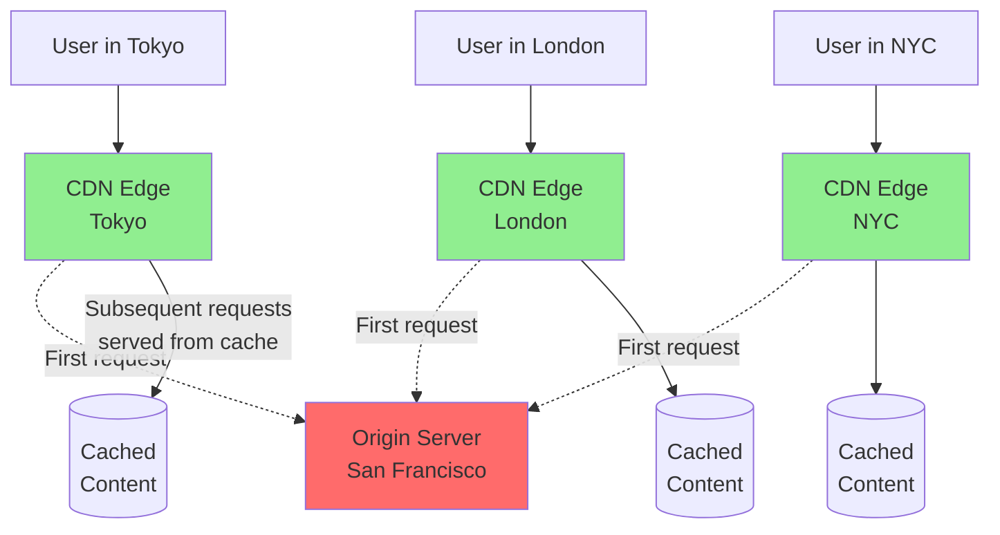
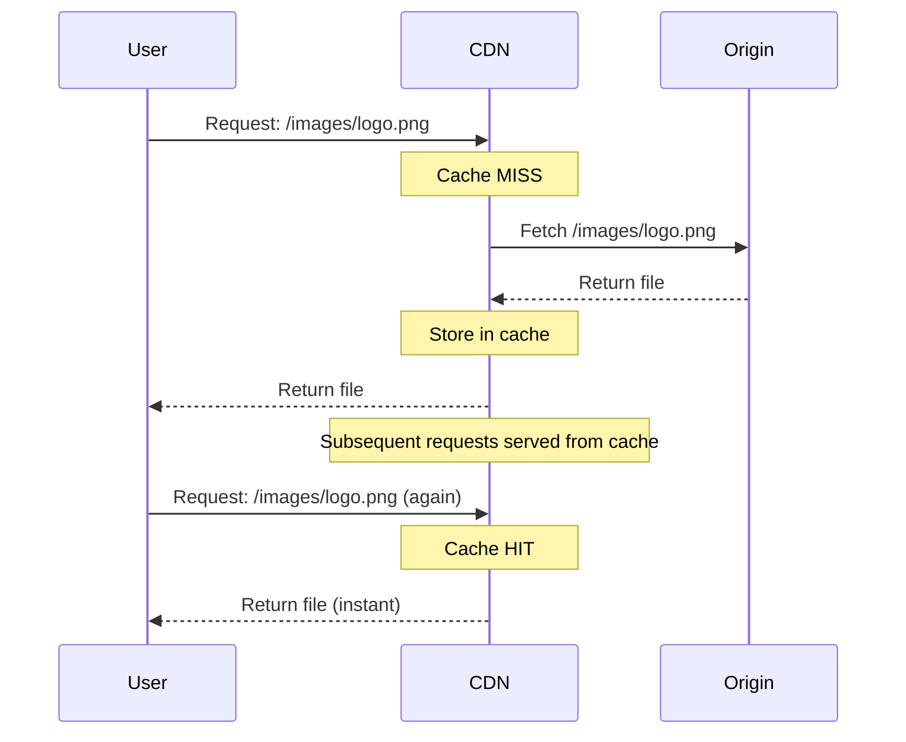
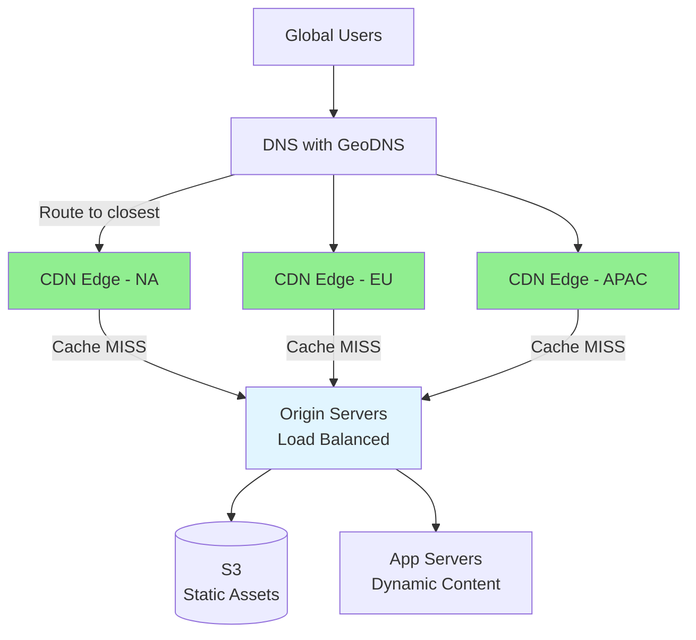
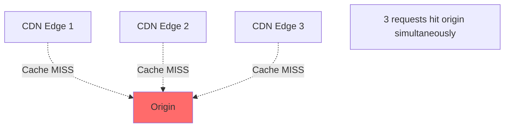
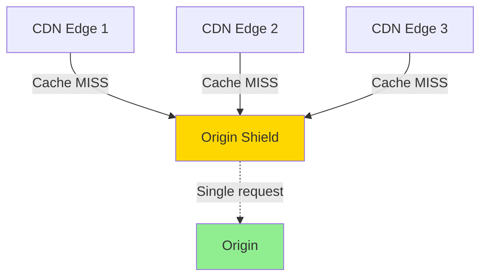
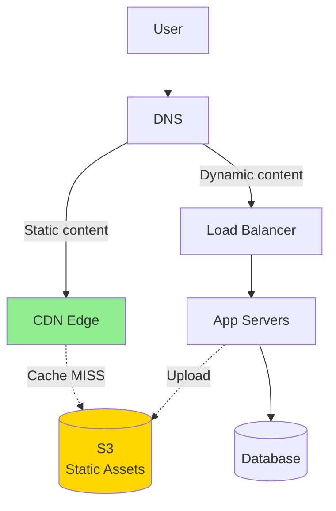

# CDN (Content Delivery Network): Caching at the Edge

> **Big Picture**: CDNs bring your content physically closer to users by caching it in data centers around the world. This dramatically reduces latency for static content (images, videos, CSS, JS) and reduces load on your origin servers. CDNs are essential for global applications serving millions of users.

---

## The Pizza Delivery Analogy

**Without CDN (Central Kitchen Only)**:
- One pizza kitchen in New York
- Customer in Tokyo orders pizza
- Pizza travels 7,000 miles
- Arrives cold after 20 hours
- Kitchen is overwhelmed with global orders

**With CDN (Local Franchises)**:
- Pizza franchises in every major city
- Customer in Tokyo orders from Tokyo franchise
- Pizza travels 2 miles
- Arrives hot in 30 minutes
- Each franchise handles local demand

**CDN = Franchise model for web content**

---

## How CDN Works



**Key Concept**: First request to each edge location fetches from origin, subsequent requests are served from cache.

---

## Latency: The Critical Difference

### Without CDN


**Latency breakdown**:
- DNS lookup: 20ms
- TCP handshake: 150ms (light travels around the world)
- TLS handshake: 150ms
- HTTP request/response: 100ms
- **Total: ~420ms for a single image**

### With CDN


**Latency breakdown**:
- DNS lookup: 5ms
- TCP handshake: 5ms (CDN is nearby)
- TLS handshake: 5ms
- HTTP request/response: 5ms
- **Total: ~20ms for the same image**

**Result: 20x faster! 🚀**

---

## What to Cache on CDN

### ✅ Perfect for CDN

```typescript
// Static assets (never change)
const staticAssets = [
  '/css/styles.css',
  '/js/app.bundle.js',
  '/images/logo.png',
  '/fonts/roboto.woff2',
  '/favicon.ico'
];

// Media files
const mediaFiles = [
  '/uploads/user-avatar-123.jpg',
  '/videos/product-demo.mp4',
  '/audio/podcast-ep-001.mp3'
];

// Static HTML (if not personalized)
const staticPages = [
  '/about',
  '/pricing',
  '/terms-of-service'
];
```

### ❌ Don't Cache on CDN

```typescript
// Personalized content
const personalizedContent = [
  '/api/user/profile',        // Different for each user
  '/api/cart',                 // User-specific
  '/dashboard'                 // Authenticated content
];

// Dynamic API responses
const dynamicAPIs = [
  '/api/search?q=...',         // Query-dependent
  '/api/posts?page=1',         // Changes frequently
  '/api/real-time-stock-price' // Real-time data
];

// Sensitive data
const sensitiveData = [
  '/admin/*',
  '/api/payment/*',
  '/api/private/*'
];
```

---

## CDN Cache Behaviors

### Pull CDN (Most Common)

**How it works**: CDN pulls content from your origin server when first requested.



**Configuration** (via HTTP headers):

```typescript
// Express.js example
app.get('/images/*', (req, res) => {
  res.setHeader('Cache-Control', 'public, max-age=31536000'); // 1 year
  res.setHeader('CDN-Cache-Control', 'max-age=31536000');
  res.sendFile(filePath);
});

app.get('/api/posts', (req, res) => {
  res.setHeader('Cache-Control', 'public, max-age=60'); // 1 minute
  res.json(posts);
});

app.get('/api/user/profile', (req, res) => {
  res.setHeader('Cache-Control', 'private, no-cache'); // Don't cache
  res.json(userProfile);
});
```

---

### Push CDN (Less Common)

**How it works**: You proactively upload content to CDN.

```typescript
// Upload to CDN when content is created
async function uploadVideo(videoFile: File): Promise<string> {
  // 1. Upload to origin storage
  const s3Url = await s3.upload(videoFile);

  // 2. Push to CDN
  await cdn.upload(videoFile, {
    path: `/videos/${videoFile.name}`,
    ttl: 86400 // 24 hours
  });

  return cdnUrl;
}
```

**When to use**:
- Large files you know will be popular
- Content you update infrequently
- More control over what's cached

---

## Cache Invalidation Strategies

### Strategy 1: Versioned URLs (Recommended)

**Approach**: Change the URL when content changes.

```typescript
// Build process generates versioned filenames
const assets = {
  'styles.css': 'styles.a3f2b1.css',     // Hash-based versioning
  'app.js': 'app.7d8e9f.js'
};

// HTML references versioned URLs
<link rel="stylesheet" href="/css/styles.a3f2b1.css">
<script src="/js/app.7d8e9f.js"></script>

// Can cache indefinitely (new version = new URL)
Cache-Control: public, max-age=31536000, immutable
```

**Pros**:
- ✅ No cache invalidation needed
- ✅ Old and new versions coexist
- ✅ Instant cache busting
- ✅ No CDN API calls

**Cons**:
- ❌ Requires build tooling

---

### Strategy 2: Cache Purge/Invalidation

**Approach**: Tell CDN to delete cached content.

```typescript
// CloudFront example
await cloudfront.createInvalidation({
  DistributionId: 'E1234567890ABC',
  InvalidationBatch: {
    Paths: {
      Quantity: 2,
      Items: [
        '/images/logo.png',
        '/css/*'
      ]
    },
    CallerReference: Date.now().toString()
  }
});

// Cloudflare example
await cloudflare.zones.purgeCache({
  files: [
    'https://example.com/images/logo.png',
    'https://example.com/css/styles.css'
  ]
});
```

**Pros**:
- ✅ Works without versioning
- ✅ Immediate effect

**Cons**:
- ❌ Costs money (AWS charges per invalidation)
- ❌ Takes time to propagate (5-15 minutes)
- ❌ Race conditions (some users get old, some get new)

---

### Strategy 3: Short TTL

**Approach**: Let cache expire naturally.

```typescript
// Cache for short duration
res.setHeader('Cache-Control', 'public, max-age=300'); // 5 minutes

// Trade-off: More origin requests, but fresher content
```

**When to use**:
- Content that changes frequently but not in real-time
- News articles, blog posts
- Product listings

---

## Real-World CDN Architecture



---

## CDN for Dynamic Content

Modern CDNs can also accelerate dynamic content:

### Technique 1: Edge Computing

**Run code at CDN edge** (Cloudflare Workers, Lambda@Edge)

```typescript
// Cloudflare Worker
addEventListener('fetch', event => {
  event.respondWith(handleRequest(event.request));
});

async function handleRequest(request: Request): Promise<Response> {
  // Check if user is logged in (from cookie)
  const sessionId = getCookie(request, 'session');

  if (!sessionId) {
    // Serve cached static page
    return fetch(request);
  }

  // Fetch personalized content from origin
  const response = await fetch(request, {
    headers: { 'X-Session': sessionId }
  });

  return response;
}
```

**Use cases**:
- A/B testing at the edge
- Geolocation-based redirects
- Authentication checks
- Bot protection

---

### Technique 2: Smart Caching Headers

```typescript
// Vary cache by specific headers
res.setHeader('Vary', 'Accept-Language, Accept-Encoding');

// Cache different versions for different languages
// /api/posts cached separately for:
// - Accept-Language: en
// - Accept-Language: es
// - Accept-Language: fr
```

---

## CDN Providers Comparison

| Provider | Best For | Key Feature |
|----------|----------|-------------|
| **Cloudflare** | General purpose, DDoS protection | Free tier, edge workers |
| **AWS CloudFront** | AWS ecosystem | Deep AWS integration |
| **Fastly** | Real-time purging, edge computing | Instant cache purge |
| **Akamai** | Enterprise, high traffic | Largest network |
| **CloudCDN (GCP)** | Google Cloud users | GCP integration |

---

## Interview Scenarios

### Scenario 1: Design YouTube

**Q**: How do you use CDN for video delivery?

**A**:
```
"I'd use a multi-tiered CDN approach:

1. Video Storage: S3/GCS (origin)
   - Raw uploaded videos
   - Transcoded versions (different qualities)

2. CDN Caching:
   - Popular videos cached at edge locations
   - Less popular videos fetched from origin
   - Cache based on popularity score

3. Adaptive Bitrate Streaming:
   - HLS/DASH manifests cached on CDN
   - Video segments (10-second chunks) cached separately
   - Different qualities cached independently

4. Geographic Distribution:
   - Viral videos replicated to all edge locations
   - Regional content cached in specific regions
   - Use Origin Shield to reduce origin load

Cache TTL:
- Video files: 1 year (immutable)
- Thumbnails: 1 week
- Manifests: 1 hour (can change if re-encoded)
"
```

---

### Scenario 2: Design Instagram

**Q**: How do you serve images to millions of users?

**A**:
```typescript
// Image upload flow
async function uploadImage(image: File, userId: string): Promise<string> {
  const imageId = generateId();

  // 1. Upload to S3
  const s3Key = `images/${userId}/${imageId}.jpg`;
  await s3.upload(image, s3Key);

  // 2. Generate thumbnails
  const sizes = ['small', 'medium', 'large'];
  await Promise.all(
    sizes.map(size => generateThumbnail(s3Key, size))
  );

  // 3. URL uses CDN domain
  const cdnUrl = `https://cdn.instagram.com/${s3Key}`;

  // First request to CDN will pull from S3 and cache
  return cdnUrl;
}

// Serve image
app.get('/images/:userId/:imageId', (req, res) => {
  // CDN handles this, but if it reaches origin:
  res.setHeader('Cache-Control', 'public, max-age=31536000'); // 1 year
  res.setHeader('Content-Type', 'image/jpeg');
  res.sendFile(imagePath);
});
```

**Additional optimizations**:
```
- Image formats: Serve WebP to supported browsers, JPEG as fallback
- Lazy loading: Load images as user scrolls
- Responsive images: Serve different sizes based on device
- Compression: Optimize images before upload
```

---

### Scenario 3: Global News Website

**Q**: How do you balance fresh content with CDN caching?

**A**:
```typescript
// Homepage - short TTL
app.get('/', (req, res) => {
  res.setHeader('Cache-Control', 'public, max-age=60'); // 1 minute
  res.render('homepage', { articles: getLatestArticles() });
});

// Article pages - longer TTL
app.get('/articles/:slug', (req, res) => {
  res.setHeader('Cache-Control', 'public, max-age=3600'); // 1 hour
  res.render('article', { article: getArticle(slug) });
});

// Breaking news - bypass cache
app.get('/breaking', (req, res) => {
  res.setHeader('Cache-Control', 'no-cache, no-store');
  res.render('breaking', { news: getBreakingNews() });
});

// Static assets - long TTL
app.get('/static/*', (req, res) => {
  res.setHeader('Cache-Control', 'public, max-age=31536000');
  res.sendFile(filePath);
});
```

---

## Advanced CDN Features

### 1. Origin Shield

**Problem**: Multiple edge locations requesting same content from origin.



**Solution**: Add intermediate caching layer.



**Benefit**: Reduces origin load by 90%+

---

### 2. Cache Key Normalization

**Problem**: Similar URLs create different cache entries.

```
/images/logo.png
/images/logo.png?v=1
/images/logo.png?utm_source=twitter
/images/logo.png?ref=email
```

**Solution**: Normalize cache keys.

```typescript
// CloudFront Cache Policy
{
  "QueryStringsConfig": {
    "QueryStringBehavior": "whitelist",
    "QueryStrings": {
      "Items": ["v"] // Only "v" parameter affects cache
    }
  }
}

// Now all these cache as one:
// /images/logo.png?utm_source=twitter
// /images/logo.png?ref=email
// -> Cached as: /images/logo.png
```

---

### 3. Geo-Blocking / Geo-Restriction

```typescript
// Cloudflare Worker - block/allow by country
addEventListener('fetch', event => {
  const country = event.request.cf.country;

  if (country === 'CN') {
    event.respondWith(new Response('Access denied', { status: 403 }));
    return;
  }

  event.respondWith(fetch(event.request));
});
```

**Use cases**:
- Content licensing (Netflix regions)
- Compliance (GDPR, data residency)
- Security (block attack origins)

---

## The Big Picture: CDN in System Architecture



**Traffic flow**:
1. Static assets (`/images/*`, `/css/*`) → CDN
2. API calls (`/api/*`) → Load Balancer → App Servers
3. User uploads → App Servers → S3 → CDN picks up for delivery

---

## Common Interview Questions

### Q: How does CDN know which edge server to route the user to?

**A**:
"CDN uses GeoDNS (Geography-based DNS). When a user requests `cdn.example.com`:
1. DNS resolver checks user's IP location
2. Returns IP of nearest CDN edge location
3. User connects to nearby server

This is called 'Anycast' routing - same IP announced from multiple locations, routing finds the closest."

---

### Q: What's the difference between CDN and caching in Redis?

**A**:
```
CDN:
- Caches static files (images, CSS, JS, videos)
- Distributed globally (hundreds of locations)
- Reduces latency by proximity
- Reduces bandwidth costs

Redis:
- Caches database query results
- Usually in same data center as app
- Reduces database load
- Reduces query latency

Different purposes, often used together.
```

---

### Q: How do you prevent users from seeing stale content after deployment?

**A**:
"Use versioned URLs (cache busting):

```html
<!-- Build generates unique hash -->
<script src="/js/app.a3f2b1c.js"></script>

<!-- When you deploy new code: -->
<script src="/js/app.d4e5f6.js"></script>
```

The CDN sees this as a completely new file, so there's no cache to invalidate. Old version can remain cached - users on old pages won't break."

---

## Key Takeaways for Interviews

1. **Always mention CDN** for global applications with static content
2. **Explain the "why"**: Reduced latency, reduced origin load, reduced bandwidth costs
3. **Discuss cache strategies**: Versioned URLs vs. TTL vs. purging
4. **Know what to cache**: Static assets yes, personalized content no
5. **Mention specific providers**: CloudFront, Cloudflare (shows real-world knowledge)
6. **Explain invalidation**: "I'd use versioned URLs to avoid cache invalidation problems"

---

## Quick Reference: Cache-Control Headers

```typescript
// Immutable static assets (versioned URLs)
'Cache-Control': 'public, max-age=31536000, immutable'

// Frequently changing content
'Cache-Control': 'public, max-age=60' // 1 minute

// User-specific content
'Cache-Control': 'private, max-age=3600' // 1 hour, only browser cache

// Never cache
'Cache-Control': 'no-store, no-cache, must-revalidate'

// Cache but always revalidate
'Cache-Control': 'public, max-age=0, must-revalidate'
```

---

## Performance Impact

| Metric | Without CDN | With CDN | Improvement |
|--------|-------------|----------|-------------|
| Image load time (global user) | 800ms | 50ms | **16x faster** |
| Page load time | 3.5s | 0.8s | **4.4x faster** |
| Origin bandwidth | 500 GB/day | 50 GB/day | **90% reduction** |
| Origin requests | 10M/day | 1M/day | **90% reduction** |

---

## Next Steps

- Read: [06-message-queues.md](06-message-queues.md) - Asynchronous processing and decoupling
- Practice: Design a global video streaming platform's CDN strategy
- Deep dive: Study how Netflix uses CDN for video delivery (Open Connect)
