```mermaid
sequenceDiagram
    participant User
    participant API
    participant EmailService

    User->>API: POST /signup
    API->>API: Create user account (100ms)
    API->>EmailService: Send welcome email (3000ms)
    EmailService-->>API: Done
    API-->>User: Response (3100ms total)

    Note over User: User waits 3+ seconds 😞
```

```mermaid
graph TB
    Spike[Black Friday Traffic Spike<br/>10,000 req/sec]
    Spike --> Server[Server<br/>Can handle 100 req/sec]
    Server --> Crash[💥 Server Crashes]

    style Crash fill:#ff6b6b
```

# Message Queues: The Asynchronous Backbone

> **Big Picture**: Message queues enable asynchronous communication between services, allowing systems to scale independently, handle traffic spikes, and recover from failures gracefully. They're the secret weapon for building resilient, decoupled architectures.

---

## The Restaurant Kitchen Analogy

**Without Message Queue (Synchronous)**:
- Waiter takes order
- Waiter goes to kitchen and waits while chef cooks
- Waiter stands idle for 15 minutes
- Waiter brings food to table
- Only then can waiter take the next order
- **Result**: One waiter can serve 4 tables/hour

**With Message Queue (Asynchronous)**:
- Waiter takes order
- Pins order to kitchen board (message queue)
- Immediately returns to take next order
- Chef picks up orders from board when ready
- Different person (food runner) delivers completed food
- **Result**: One waiter can serve 20 tables/hour

**Key insight**: Waiter (request handler) and chef (worker) operate independently at their own pace.

---

## The Core Concept


**Components**:
1. **Producer**: Service that creates tasks/messages
2. **Queue**: Storage for pending tasks
3. **Consumer/Worker**: Service that processes tasks

---

## Why Message Queues?

### Problem 1: Slow Operations Block the User

**Without Queue**:


**With Queue**:


**Code Example**:

```typescript
// WITHOUT QUEUE - blocking
app.post('/signup', async (req, res) => {
  const user = await db.users.create(req.body);

  // This blocks the response!
  await emailService.sendWelcomeEmail(user.email); // 3 seconds

  res.status(201).json({ userId: user.id });
});

// WITH QUEUE - non-blocking
app.post('/signup', async (req, res) => {
  const user = await db.users.create(req.body);

  // Enqueue job and return immediately
  await queue.publish('emails', {
    type: 'welcome',
    email: user.email,
    userId: user.id
  });

  res.status(201).json({ userId: user.id }); // Instant response!
});

// Worker processes jobs asynchronously
queue.subscribe('emails', async (message) => {
  await emailService.sendWelcomeEmail(message.email);
});
```

---

### Problem 2: Traffic Spikes Overwhelm the System

**Without Queue**:


**With Queue**:


**Key Benefit**: Queue acts as a buffer, smoothing out spikes.

```typescript
// Orders come in bursts
app.post('/orders', async (req, res) => {
  // Accept order instantly
  const order = await db.orders.create(req.body);

  // Enqueue for processing
  await queue.publish('order-processing', {
    orderId: order.id
  });

  res.status(202).json({ orderId: order.id }); // 202 Accepted
});

// Workers process at manageable rate
// Can scale workers independently
for (let i = 0; i < 10; i++) {
  queue.subscribe('order-processing', async (message) => {
    await processOrder(message.orderId);
    await sendConfirmationEmail(message.orderId);
    await updateInventory(message.orderId);
  });
}
```

---

### Problem 3: Service Failures Create Cascading Failures

**Without Queue**:


**With Queue**:


**With retries and dead letter queues**:
```typescript
queue.subscribe('inventory-updates', async (message) => {
  try {
    await inventoryService.update(message.productId, message.quantity);
  } catch (error) {
    // Retry up to 3 times
    if (message.retryCount < 3) {
      await queue.publish('inventory-updates', {
        ...message,
        retryCount: (message.retryCount || 0) + 1
      }, { delay: 5000 }); // Retry after 5 seconds
    } else {
      // Move to dead letter queue for manual review
      await queue.publish('inventory-updates-failed', message);
      await alertOps('Inventory update failed', message);
    }
  }
});
```

---

## Message Queue Patterns

### Pattern 1: Task Queue (Work Queue)

**Use case**: Distribute work across multiple workers.


**Example: Image Processing**

```typescript
// Producer: User uploads image
app.post('/upload', async (req, res) => {
  const imageId = await saveImage(req.file);

  // Enqueue processing job
  await queue.publish('image-processing', {
    imageId,
    tasks: ['resize', 'watermark', 'thumbnail']
  });

  res.status(202).json({ imageId, status: 'processing' });
});

// Consumer: Multiple workers process jobs
queue.subscribe('image-processing', async (job) => {
  console.log(`Worker ${process.pid} processing ${job.imageId}`);

  const image = await loadImage(job.imageId);

  for (const task of job.tasks) {
    switch (task) {
      case 'resize':
        await resizeImage(image, 1920, 1080);
        break;
      case 'watermark':
        await addWatermark(image);
        break;
      case 'thumbnail':
        await generateThumbnail(image);
        break;
    }
  }

  await markImageAsReady(job.imageId);
});
```

---

### Pattern 2: Pub/Sub (Fan-Out)

**Use case**: One event triggers multiple independent actions.


**Example: User Signup Event**

```typescript
// Publisher: API emits event
app.post('/signup', async (req, res) => {
  const user = await db.users.create(req.body);

  // Publish event (multiple subscribers will receive it)
  await pubsub.publish('user.created', {
    userId: user.id,
    email: user.email,
    name: user.name,
    timestamp: Date.now()
  });

  res.status(201).json({ userId: user.id });
});

// Subscriber 1: Email Service
pubsub.subscribe('user.created', async (event) => {
  await emailService.sendWelcomeEmail(event.email);
});

// Subscriber 2: Analytics
pubsub.subscribe('user.created', async (event) => {
  await analytics.track('signup', {
    userId: event.userId,
    timestamp: event.timestamp
  });
});

// Subscriber 3: CRM
pubsub.subscribe('user.created', async (event) => {
  await crm.createContact({
    email: event.email,
    name: event.name
  });
});

// Subscriber 4: Slack notification (for team)
pubsub.subscribe('user.created', async (event) => {
  await slack.send(`New signup: ${event.email}`);
});
```

**Key difference from Task Queue**: Each subscriber gets a COPY of the message.

---

### Pattern 3: Priority Queue

**Use case**: Process critical tasks first.


**Example: Email Queue with Priority**

```typescript
// Critical: Password reset (process immediately)
await queue.publish('emails', {
  type: 'password-reset',
  email: user.email,
  token: resetToken
}, { priority: 10 });

// High: Order confirmation (process soon)
await queue.publish('emails', {
  type: 'order-confirmation',
  orderId: order.id
}, { priority: 5 });

// Low: Marketing newsletter (process when idle)
await queue.publish('emails', {
  type: 'newsletter',
  recipients: allUsers
}, { priority: 1 });

// Worker processes high-priority jobs first
queue.subscribe('emails', async (job) => {
  await sendEmail(job);
}, { priority: true });
```

---

## Message Delivery Guarantees


### At-Most-Once (Fire and Forget)

```typescript
// Send and forget - no confirmation
await queue.publish('logs', logEntry);
// If queue is down, message is lost
```

**Use case**: Non-critical data (logs, metrics where some loss is OK)

---

### At-Least-Once (Most Common)

```typescript
// Message stays in queue until acknowledged
queue.subscribe('orders', async (message) => {
  await processOrder(message.orderId);
  await message.ack(); // Only now is message removed
});

// If worker crashes before ack, message is redelivered
// IMPORTANT: Handler must be idempotent!
```

**Idempotency is critical**:
```typescript
// BAD - not idempotent
async function processOrder(orderId) {
  await db.inventory.decrement({ productId }, { quantity: 1 });
  // If this runs twice, quantity is decremented twice!
}

// GOOD - idempotent
async function processOrder(orderId) {
  const order = await db.orders.findOne({ id: orderId });

  if (order.status === 'processed') {
    return; // Already processed, skip
  }

  await db.inventory.decrement({ productId }, { quantity: 1 });
  await db.orders.update({ id: orderId }, { status: 'processed' });
}
```

---

### Exactly-Once (Complex, Expensive)

**Requires**: Distributed transactions or deduplication.

```typescript
// Using unique message ID for deduplication
queue.subscribe('payments', async (message) => {
  const messageId = message.id;

  // Check if already processed
  const exists = await redis.get(`processed:${messageId}`);
  if (exists) {
    console.log('Already processed, skipping');
    return;
  }

  // Process payment
  await chargeCard(message.amount, message.cardToken);

  // Mark as processed (with TTL)
  await redis.setex(`processed:${messageId}`, 86400, '1');
});
```

---

## Popular Message Queue Technologies

### 1. Redis (with Bull/BullMQ)

**Best for**: Simple job queues, background tasks

```typescript
import Queue from 'bull';

const emailQueue = new Queue('emails', {
  redis: { host: 'localhost', port: 6379 }
});

// Add job
await emailQueue.add({
  to: 'user@example.com',
  subject: 'Welcome!',
  body: 'Thanks for signing up'
}, {
  attempts: 3,
  backoff: { type: 'exponential', delay: 2000 }
});

// Process jobs
emailQueue.process(async (job) => {
  await sendEmail(job.data);
});
```

**Pros**: Fast, simple, great for small to medium scale
**Cons**: No built-in durability (if Redis crashes, messages in RAM are lost)

---

### 2. RabbitMQ

**Best for**: Complex routing, pub/sub patterns

```typescript
// Pub/Sub with RabbitMQ
const exchange = 'user_events';
const queue = 'email_notifications';

// Publisher
await channel.assertExchange(exchange, 'fanout');
channel.publish(exchange, '', Buffer.from(JSON.stringify({
  userId: 123,
  event: 'signup'
})));

// Subscriber
await channel.assertQueue(queue);
await channel.bindQueue(queue, exchange, '');
channel.consume(queue, (msg) => {
  const event = JSON.parse(msg.content.toString());
  console.log('Received:', event);
  channel.ack(msg);
});
```

**Pros**: Flexible routing, reliable, mature
**Cons**: Operationally complex, needs management

---

### 3. Apache Kafka

**Best for**: Event streaming, high throughput, event sourcing

```typescript
// Kafka producer
await producer.send({
  topic: 'user-events',
  messages: [
    {
      key: userId,
      value: JSON.stringify({
        type: 'signup',
        userId,
        timestamp: Date.now()
      })
    }
  ]
});

// Kafka consumer
await consumer.subscribe({ topic: 'user-events' });
await consumer.run({
  eachMessage: async ({ message }) => {
    const event = JSON.parse(message.value.toString());
    await handleEvent(event);
  }
});
```

**Pros**: Massive throughput (millions/sec), event replay, durability
**Cons**: Complex setup, overkill for simple use cases

---

### 4. AWS SQS/SNS

**Best for**: AWS ecosystem, serverless

```typescript
// SQS - Task Queue
await sqs.sendMessage({
  QueueUrl: 'https://sqs.us-east-1.amazonaws.com/123/my-queue',
  MessageBody: JSON.stringify({ orderId: 123 })
});

// SNS - Pub/Sub
await sns.publish({
  TopicArn: 'arn:aws:sns:us-east-1:123:user-events',
  Message: JSON.stringify({ userId: 123, event: 'signup' })
});
```

**Pros**: Managed, scales automatically, integrates with Lambda
**Cons**: AWS lock-in, limited features vs. Kafka

---

## Interview Scenarios

### Scenario 1: Design Instagram

**Q**: How do you use message queues?

**A**:
```
"I'd use queues for several async operations:

1. Post Upload:
   - User uploads photo → API responds immediately
   - Queue: Image processing (resize, filters, thumbnails)
   - Workers: Process images in background

2. Feed Generation:
   - User posts photo → Publish event
   - Queue: Fan-out to followers' feeds
   - Workers: Insert into each follower's feed

3. Notifications:
   - Someone likes your post → Publish event
   - Queue: Send push notifications
   - Workers: Send to mobile devices

4. Analytics:
   - All user actions → Kafka for event streaming
   - Real-time dashboards consume from Kafka

Technology choices:
- Bull (Redis) for image processing (simple jobs)
- RabbitMQ for notifications (pub/sub)
- Kafka for analytics (high throughput, replay capability)
"
```

---

### Scenario 2: Design Uber

**Q**: How do you match riders with drivers?

**A**:
```typescript
// Rider requests ride
app.post('/rides', async (req, res) => {
  const ride = await db.rides.create({
    riderId: req.user.id,
    pickup: req.body.pickup,
    destination: req.body.destination,
    status: 'pending'
  });

  // Publish to matching queue with location
  await queue.publish('ride-matching', {
    rideId: ride.id,
    location: req.body.pickup,
    priority: calculatePriority(req.user) // Premium users get priority
  }, { priority: calculatePriority(req.user) });

  res.status(202).json({ rideId: ride.id });
});

// Matching worker finds nearest available driver
queue.subscribe('ride-matching', async (job) => {
  const nearbyDrivers = await findNearbyDrivers(job.location, radius = 5);

  for (const driver of nearbyDrivers) {
    const accepted = await offerRide(driver.id, job.rideId);
    if (accepted) {
      await db.rides.update({ id: job.rideId }, {
        driverId: driver.id,
        status: 'matched'
      });
      return; // Match found
    }
  }

  // No driver found, retry with larger radius
  if (radius < 20) {
    await queue.publish('ride-matching', {
      ...job,
      radius: radius + 5
    }, { delay: 10000 }); // Retry in 10 seconds
  }
});
```

---

## Common Pitfalls and Solutions

### Pitfall 1: Not Making Handlers Idempotent

```typescript
// BAD
async function handler(job) {
  await db.balance.increment({ userId: job.userId }, { amount: 100 });
  // If this runs twice, user gets $200!
}

// GOOD
async function handler(job) {
  const alreadyProcessed = await db.transactions.findOne({ id: job.transactionId });
  if (alreadyProcessed) return;

  await db.balance.increment({ userId: job.userId }, { amount: 100 });
  await db.transactions.create({ id: job.transactionId, amount: 100 });
}
```

---

### Pitfall 2: Poison Messages (Jobs That Always Fail)

```typescript
queue.subscribe('jobs', async (job) => {
  try {
    await processJob(job);
  } catch (error) {
    if (job.attemptsMade >= 3) {
      // Move to dead letter queue after 3 failures
      await deadLetterQueue.add(job);
      console.error('Job moved to DLQ:', job.id);
      return; // Don't retry
    }
    throw error; // Will be retried
  }
});
```

---

### Pitfall 3: Memory Leaks in Long-Running Workers

```typescript
// BAD - keeps growing
const cache = new Map();
queue.subscribe('jobs', async (job) => {
  cache.set(job.id, processJob(job)); // Never cleaned up!
});

// GOOD - bounded cache
const LRU = require('lru-cache');
const cache = new LRU({ max: 1000 });

queue.subscribe('jobs', async (job) => {
  cache.set(job.id, await processJob(job));
});
```

---

## The Big Picture


---

## Key Takeaways for Interviews

1. **Explain the "why"**: Queues enable async processing, decouple services, handle spikes
2. **Mention specific technologies**: Redis/Bull for simple, Kafka for streaming, RabbitMQ for complex routing
3. **Discuss guarantees**: At-least-once with idempotency is most common
4. **Pattern recognition**: Task queue vs Pub/Sub vs Priority queue
5. **Error handling**: Retries, dead letter queues, monitoring
6. **Idempotency**: Always design handlers to be safely re-run

---

## Quick Decision Tree


---

## Next Steps

- Practice: Design notification system for Facebook using message queues
- Deep dive: Study how Uber uses Kafka for real-time data processing
- Implement: Build a simple job queue with Redis and Bull
- Learn: Event-driven architecture and event sourcing patterns
