# Facebook Live Comments: Real-Time System Design

> **Interview Difficulty**: Senior / Staff level
> **Topics Covered**: WebSockets, fan-out at scale, message queues, eventual consistency, pub/sub, real-time delivery

---

## How I Should Think About This

When someone types a comment during a live stream, that comment hits a **Comment Service** that immediately validates the user, checks a **rate limiter** (so one person can't spam the feed), writes the comment to a **Cassandra** database for durability, and publishes it to a **Kafka** topic partitioned by video ID. The commenter gets an instant 200 OK — they don't wait for the comment to reach anyone else. That write path is fast and fire-and-forget. Meanwhile, Kafka holds the comment in a queue and hands it off asynchronously to a **Fan-out Service** and a **Moderation Service** running in parallel. The fan-out service is responsible for getting that comment to every viewer, and the moderation service is responsible for silently hiding it if ML scoring flags it as toxic.

The delivery side is where the real complexity lives. The fan-out service pushes comments to a cluster of **WebSocket servers**, each holding hundreds of thousands of open connections — this works well up to a few million viewers. But at 10M+ concurrent viewers, you can't realistically push to every individual connection in real time, so the overflow goes through **CDN edge nodes** using **Server-Sent Events (SSE)**, which are one-way HTTP streams that CDNs can broadcast efficiently at massive scale. Viewers who are actively commenting use WebSocket (bidirectional), while passive viewers use SSE (receive only). When a new viewer joins mid-stream, they don't wait for Kafka replay — they get the last 100 comments instantly from a **Redis list** that the fan-out service keeps warm, then transition to the live stream of new comments. The whole system accepts **eventual consistency**: comments arrive in Kafka partition order (close enough to chronological), not global strict order, because strict ordering across 50K writes per second across distributed servers is physically impractical.

---

## Whiteboard View (Start Here in the Interview)

Draw this first. It's the core skeleton the interviewer expects before you go deeper.

```mermaid
graph TB
    Commenter[Commenter Client]
    Viewer[Viewer Client]

    LB[Load Balancer\nLayer 7]

    CMS["Comment Management Service
    - validate user
    - persist comment
    - publish to pub/sub"]

    DB[("Comments DB
    (DynamoDB)
    ─────────────
    commentId
    videoId  ← PK
    content
    author
    createdAt")]

    subgraph PubSub["Redis Pub/Sub  —  one topic per videoId"]
        V1[v1]
        V2[v2]
        V3[v3]
        V4[v4]
        V5[v5]
    end

    subgraph RMS["Realtime Messaging Service  (multiple instances)"]
        RMS1[instance]
        RMS2[instance]
        RMS3[instance]
    end

    Commenter -->|"HTTPS  /create"| LB
    Viewer -->|"SSE  subscribe by LiveVideoId"| LB

    LB -->|"routes /create"| CMS
    LB -->|"L7 routes by videoId\nso same video → same instance"| RMS1
    LB --> RMS2
    LB --> RMS3

    CMS --> DB
    CMS -->|publish new comment| V1
    CMS -->|publish new comment| V2

    RMS1 -->|"subscribes to topics\nfor videos its clients watch"| V1
    RMS2 --> V2
    RMS3 --> V3

    RMS1 -->|SSE push| Viewer

    style CMS fill:#fff4e1
    style DB fill:#e1f5ff
    style PubSub fill:#FFD700
    style RMS fill:#90EE90
```



**Three things to say out loud when drawing this:**

1. **Write path**: Commenter → LB → Comment Management → DynamoDB (persist) + Redis Pub/Sub (broadcast). Commenter gets `200 OK` immediately.
2. **Pub/Sub partitioning**: One Redis topic per `videoId` (`v1`, `v2`...). Comment Management publishes to the right topic. Realtime Messaging instances only subscribe to topics for videos their clients are watching — not everything.
3. **L7 routing trick**: The Layer 7 LB routes viewer SSE connections by `videoId`, so all viewers of the same video land on the same Realtime Messaging instance. That instance holds their SSE connections and pushes new comments the moment it receives them from Redis.

---

## Step 1: Requirements Clarification

> In an interview, always start here. Drive the conversation.

### Functional Requirements

- Users can post comments on a live video
- All viewers watching the same live video see comments in near real-time (< 2 seconds)
- Comments are displayed in chronological order
- Comments persist after the live stream ends (VOD replay)
- Basic moderation: users can report/hide comments

### Non-Functional Requirements

- **Scale**: A popular stream can have 10M+ concurrent viewers
- **Write throughput**: 50,000+ comments/second during peak
- **Latency**: Comments delivered within 1–2 seconds of being posted
- **Availability**: 99.99% uptime (live streaming is time-sensitive)
- **Ordering**: Best-effort ordering (not strict global order — impractical at this scale)
- **Durability**: Comments must not be lost

### Out of Scope (for this interview)

- Reactions (likes on comments)
- Reply threads
- Emoji reactions on the video itself
- Video streaming infrastructure

---

## Step 2: Capacity Estimation

```
Viewers per stream (peak):    10,000,000 concurrent
Comment rate (peak):          50,000 comments/second
Avg comment size:             200 bytes (text + metadata)
Comment storage/day:          50,000 × 86,400 = 4.3B comments
Storage/day:                  4.3B × 200 bytes ≈ 860 GB/day

Read fan-out per comment:     10,000,000 viewers × 1 delivery = 10M messages/comment
Peak message throughput:      50,000 × 10M = 500 BILLION deliveries/second (naive)

👆 This is why you CANNOT push every comment to every viewer directly.
   You need smart fan-out with sampling + batching.
```

**Key insight**: At 10M viewers and 50K comments/sec, a naive push model is physically impossible. This forces us into a **pull-based** or **batched push** model for viewers.

---

## Step 3: High-Level Architecture


---

## Step 4: Component Deep Dives

### 4.1 Comment Write Path


**Why return 200 before full fan-out?**
Users expect instant confirmation. The actual delivery to viewers is async — this is acceptable eventual consistency.

---

### 4.2 Fan-out Service: The Hard Problem

The fan-out service is where the system design gets interesting. With 10M viewers, you cannot push one-by-one.

```mermaid
graph TB
    K[(Kafka Topic<br/>live-comments:video123)]

    K --> FW1[Fan-out Worker 1]
    K --> FW2[Fan-out Worker 2]
    K --> FW3[Fan-out Worker 3]

    FW1 -->|Shard A–F| WS1[WebSocket Server 1<br/>500K connections]
    FW2 -->|Shard G–M| WS2[WebSocket Server 2<br/>500K connections]
    FW3 -->|Shard N–Z| WS3[WebSocket Server 3<br/>500K connections]

    WS1 -->|Push batch| Viewers1[Viewers 1-500K]
    WS2 -->|Push batch| Viewers2[Viewers 500K-1M]
    WS3 -->|Push batch| Viewers3[Viewers 1M-1.5M]

    K --> CDN[CDN Edge Fan-out<br/>For 1M+ viewers]
    CDN -->|SSE broadcast| LargeAudience[Viewers 1.5M–10M]

    style CDN fill:#e1f5ff
    style K fill:#FFD700
```



**Two-tier fan-out strategy**:

| Tier | Mechanism | Viewers | Latency |
|------|-----------|---------|---------|
| Tier 1 | WebSocket push via WS servers | Up to ~1.5M | < 500ms |
| Tier 2 | CDN-based SSE broadcast | 1.5M–10M | < 1.5s |

> **Interview insight**: For truly massive audiences (Superbowl-level), you lean heavily on CDN edge broadcasting. Not every viewer needs WebSocket — one-way SSE is enough for consumers.

---

### 4.3 Viewer Connection: WebSocket vs SSE


**Why not WebSocket for everyone?**

- WebSockets are stateful — each connection is pinned to one server
- At 10M connections, you need 10M open TCP sockets
- SSE is cheaper (HTTP/2 multiplexed, CDN-friendly)
- Most viewers are passive — they don't need to write comments

---

### 4.4 Comment Storage: Cassandra Schema

Why Cassandra?
- Write-heavy workload (50K writes/sec)
- Natural time-series partitioning by `video_id`
- Linear horizontal scaling
- Tunable consistency (eventual OK for comments)

```
Table: live_comments

Partition Key:  video_id          (all comments for a stream)
Clustering Key: bucket + created_at DESC  (time-ordered within partition)

Columns:
  video_id     UUID
  bucket       INT     -- Time bucket (e.g., unix_minute) for wide-row protection
  created_at   TIMESTAMP
  comment_id   UUID
  user_id      UUID
  username     TEXT
  text         TEXT    -- Sanitized
  is_pinned    BOOL
  is_deleted   BOOL
```

**Why time bucketing?**
Cassandra partitions can become "hot" if unlimited rows accumulate. Bucketing by minute keeps each partition bounded.


---

### 4.5 Hot Comments Cache (Redis)

For the first page of comments a new viewer sees, reading Cassandra for every new connection is wasteful.


**Redis data structure**:
```
Key:   live:comments:{video_id}
Type:  List (LPUSH new, LTRIM to 100)
TTL:   stream duration + 1 hour
```

New viewers get the last 100 comments instantly from Redis. After joining, they receive real-time updates via WebSocket/SSE.

---

## Step 5: API Design

### Write a comment

```
POST /api/v1/videos/{videoId}/comments
Authorization: Bearer {token}

Body:
{
  "text": "This is amazing!",
  "client_timestamp": 1700000000000
}

Response 200:
{
  "comment_id": "uuid",
  "video_id": "uuid",
  "user": { "id": "uuid", "username": "john" },
  "text": "This is amazing!",
  "server_timestamp": 1700000000123,
  "status": "pending_moderation"
}
```

### Fetch recent comments (initial load / polling fallback)

```
GET /api/v1/videos/{videoId}/comments?limit=50&before={timestamp}

Response 200:
{
  "comments": [...],
  "cursor": "next_page_token",
  "has_more": true
}
```

### WebSocket connection

```
WS wss://live.facebook.com/ws/v1
→ Client sends:  { "action": "subscribe", "video_id": "abc123" }
← Server sends:  { "type": "comment_batch", "comments": [...] }
← Server sends:  { "type": "comment", "comment": {...} }
← Server sends:  { "type": "heartbeat" }  (every 30s)
```

---

## Step 6: Handling Key Challenges

### Challenge 1: Comment Ordering

At 50K comments/second across multiple servers, **strict global ordering is impossible** without a bottleneck.

```mermaid
graph LR
    S1[Server A<br/>Comment at T=100ms]
    S2[Server B<br/>Comment at T=101ms]
    S3[Server C<br/>Comment at T=99ms]

    Viewer[Viewer receives<br/>in arrival order:<br/>100, 101, 99 ← out of order?]

    S1 --> Kafka
    S2 --> Kafka
    S3 --> Kafka
    Kafka --> Viewer

    style Kafka fill:#FFD700
```



**Solution**: Use **Kafka partition ordering** within a `video_id` partition. All comments for the same video go through the same partition → FIFO order maintained **per video**.

> **Interview answer**: "We accept near-ordering — comments within a partition arrive in order, but cross-partition skew can cause ~100ms reordering. For a live comment feed, this is indistinguishable to the human eye."

---

### Challenge 2: Rate Limiting Commenters

Without rate limiting, a single bad actor can flood the stream.


```
Redis key: rate:comment:{userId}
Type: Token bucket / sliding window counter
Limit: 5 comments per 10 seconds per user
Global limit: 50,000 comments/second (enforced at Kafka ingestion)
```

---

### Challenge 3: Moderation at Scale

50K comments/second means ~4.3 billion comments/day — impossible to human-moderate synchronously.

```mermaid
graph LR
    Kafka[(Kafka<br/>live-comments)]
    Mod[ML Moderation Service<br/>Async]
    DB[(Cassandra)]

    Kafka --> Mod
    Mod -->|Toxic score < 0.8| Publish[Mark: visible]
    Mod -->|Toxic score ≥ 0.8| Hide[Mark: hidden, queue for review]

    Publish --> DB
    Hide --> DB
    Hide --> ReviewQ[Human Review Queue]

    style Mod fill:#e1f5ff
    style Hide fill:#ff6b6b
    style Publish fill:#90EE90
```



**Strategy**:
- Comments are **optimistically shown** to the commenter immediately
- Async ML scoring within ~200ms
- If flagged: hidden from all other viewers, queued for human review
- Explicit viewer reports bubble up to review queue

---

### Challenge 4: Late Joiners

A viewer who joins 30 minutes into a 2-hour stream needs recent context.


Late joiners never get the full history (that's for VOD replay). They get context (last 100 comments) and then stream forward.

---

## Step 7: Full System Diagram


---

## Step 8: Scaling Decisions Summary

| Decision | Choice | Why |
|----------|--------|-----|
| Comment persistence | Cassandra | Write-heavy, time-series, horizontal scale |
| Fan-out mechanism | Kafka + Fan-out workers | Decouples write from delivery |
| Viewer delivery | WebSocket + SSE hybrid | WS for commenters, SSE for passive viewers |
| Ordering | Per-partition FIFO (Kafka) | Strong enough; global ordering impractical |
| Hot cache | Redis list (last 100) | Fast initial load for late joiners |
| Rate limiting | Redis token bucket | Distributed, in-memory, low latency |
| Moderation | Async ML + human review | Synchronous moderation can't keep up |
| Global scale | CDN edge broadcasting | Push to CDN, let CDN fan-out to millions |

---

## Step 9: Trade-offs to Discuss in Interview

### Consistency vs Latency

```
Option A: Strong consistency
- Write to Cassandra, confirm, then fan-out
- Pros: No lost comments
- Cons: +200ms latency

Option B: Optimistic publish (our choice)
- Write to Kafka immediately, Cassandra async
- Pros: < 100ms delivery
- Cons: Very rare comment loss if Kafka fails before write
```

### WebSocket vs SSE vs Long Polling

| | WebSocket | SSE | Long Poll |
|--|-----------|-----|-----------|
| Direction | Bidirectional | Server → Client | Server → Client |
| Connection | Persistent TCP | HTTP/2 stream | Per-request |
| CDN-friendly | ❌ No | ✅ Yes | ✅ Yes |
| Fallback | Harder | Easy | Universal |
| Best for | Commenters | Passive viewers | Old browsers |

### Fan-out on Write vs Fan-out on Read

- **Fan-out on write** (our choice): Push comment to all connected viewers immediately
  - Pros: Low read latency for viewers
  - Cons: Expensive if many viewers, but Kafka handles this
- **Fan-out on read**: Viewers poll for new comments
  - Pros: Simple, no push infrastructure
  - Cons: High read load, higher latency

> At Facebook Live scale, pure fan-out on write is impossible. **We use a hybrid**: Kafka fans out to WebSocket server shards (fan-out on write), but very large audiences use CDN SSE (effectively fan-out on read per CDN pull).

---

## Step 10: Interview Walkthrough Template

Use this 45-minute structure in your interview:

```
1. Requirements (5 min)
   - Clarify: How many concurrent viewers? Comment latency SLA?
   - Functional: post, view, moderate, persist
   - Non-functional: 10M viewers, 50K writes/sec, < 2s delivery

2. Capacity Estimation (5 min)
   - 50K comments/sec × 200 bytes = 10MB/sec writes
   - Why naive fan-out fails (10M × 50K = impossible)
   - Storage: ~860GB/day

3. High-Level Architecture (10 min)
   - Draw: Clients → LB → Comment Service → Kafka → Fan-out → WS → Viewers
   - Highlight: Write path vs Read/delivery path are separate

4. Deep Dives (20 min)
   - Fan-out strategy (this is the crux — WebSocket + CDN tier)
   - Comment ordering (Kafka partitions per video)
   - Late joiner experience (Redis cache)
   - Rate limiting + moderation

5. Trade-offs (5 min)
   - WebSocket vs SSE
   - Cassandra choice
   - Eventual consistency on ordering
```

---

## Key Takeaways

1. **Separate write and read paths** — comment ingestion is independent from delivery
2. **Kafka is the backbone** — decouples producers (commenters) from consumers (viewers)
3. **Fan-out is the hard problem** — naive push to 10M users is impossible; use tiered delivery
4. **Accept eventual consistency** — global strict ordering is impractical; per-partition ordering is sufficient
5. **CDN is your friend for massive audiences** — WebSocket doesn't scale to millions; SSE over CDN does
6. **Rate limiting is non-negotiable** — without it, a single user can take down the stream

---

## Related Topics

- [06-message-queues.md](06-message-queues.md) — Kafka deep dive
- [04-caching-strategies.md](04-caching-strategies.md) — Redis patterns used here
- [01-load-balancer.md](01-load-balancer.md) — L4 vs L7 for WebSocket routing
