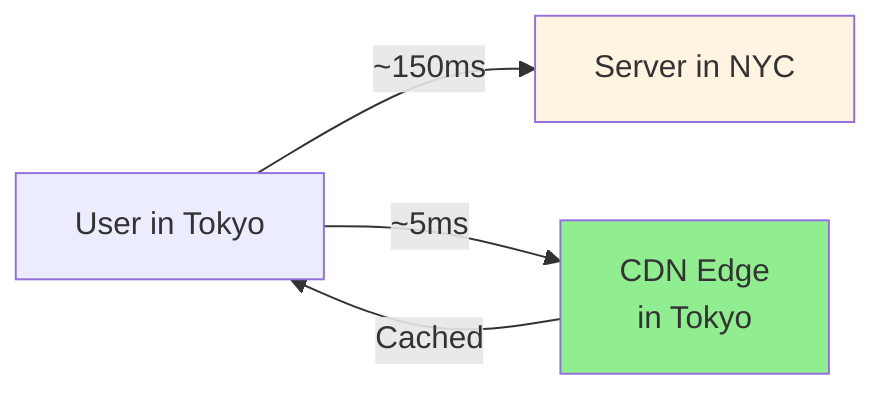
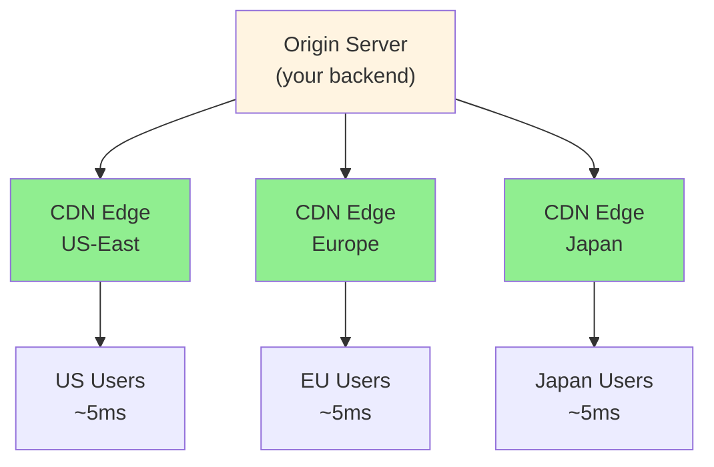

# Networking Essentials

> **Mental model**: The speed of light is a real constraint. Geography = latency. Design around it.

---

## The Core Idea

Every network request travels through physical cables and fiber. Distance adds latency — and you can't engineer your way around physics. What you *can* do is move data closer to users before they ask for it.

---

## Latency by Distance (Numbers to Know)

| Hop | Typical Latency |
|-----|----------------|
| Same data center (same rack) | < 1ms |
| Same region (cross AZ) | ~1–5ms |
| Cross-continent (US → EU) | ~80–100ms |
| Cross-world (US → Asia) | ~150–200ms |

> In interviews: **assume ~100ms for cross-region**. It signals you understand geography matters.

---

## Key Protocols and When They Matter

**TCP** — reliable, ordered delivery. Slower handshake. Use for anything where correctness matters (HTTP, database calls, file transfers).

**UDP** — fire and forget. Faster, no guarantee. Use when speed > correctness (video streaming, gaming, DNS lookups).

**HTTP/1.1** → one request per connection. **HTTP/2** → multiple requests multiplexed over one connection (default for modern apps). **HTTP/3** → runs over UDP (QUIC), better for mobile/lossy networks.

**WebSocket** — persistent bidirectional connection. Upgrade from HTTP. Use when the server needs to push data to clients in real time.

**SSE (Server-Sent Events)** — persistent one-way stream from server to client over HTTP. Simpler than WebSocket when the client doesn't need to send data back.

---

## CDN: Move the Data First

A CDN (Content Delivery Network) is a globally distributed set of servers that cache content at the edge — close to users.

**Use CDN for**: static files (JS, CSS, images), video segments, any content that doesn't change per-user.

**Don't use CDN for**: personalized API responses, write operations, anything requiring auth per-request.

---

## DNS

DNS translates `facebook.com` → `31.13.65.36`. It's a distributed lookup system with caching at every layer (browser, OS, ISP, root servers).

**TTL matters**: Low TTL = faster failover when IPs change, but more DNS lookups. High TTL = cached longer, faster for users.

**In system design**: DNS can do basic geographic routing (route users to nearest data center). But it's slow to change — not good for instant failover.

---

## Interview Signals

- Mention latency numbers when discussing cross-region traffic
- Propose CDN early when the problem involves static content or global users
- Know the difference between WebSocket and SSE and when each is appropriate
- For real-time features: ask "does the client need to send data back?" — if no, SSE is simpler
