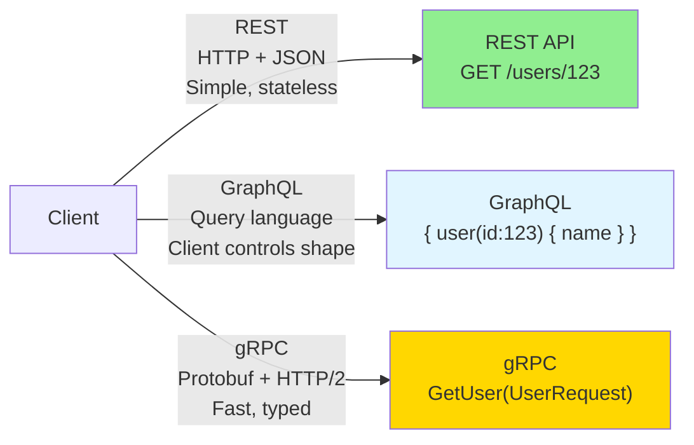
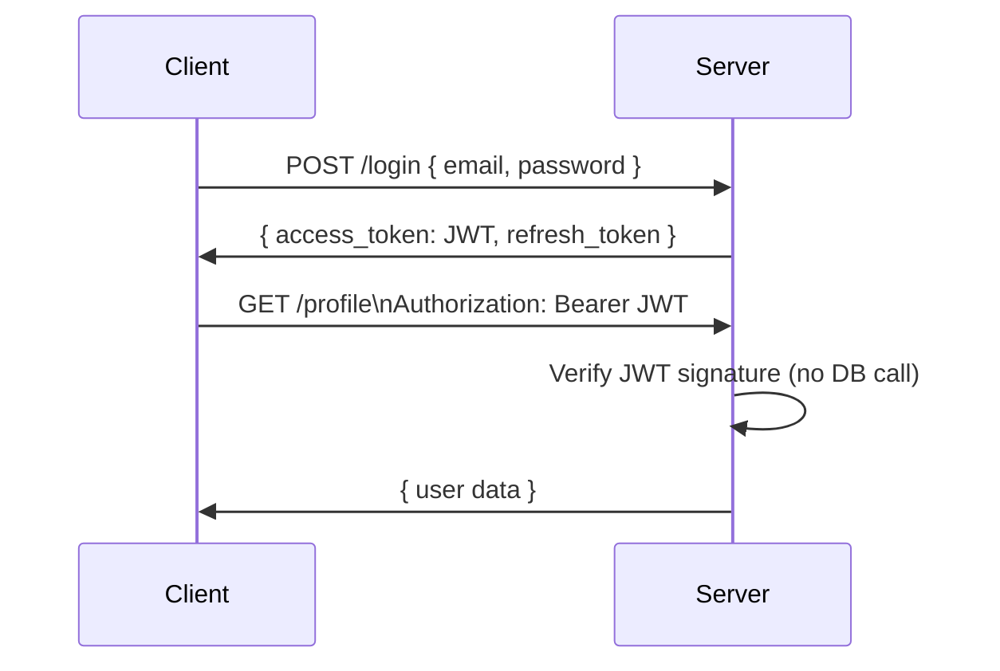

# API Design

> **Mental model**: APIs are contracts. A bad contract forces bad architecture everywhere downstream.

---

## The Core Idea

APIs define how clients talk to your system. Getting this right early matters because every downstream decision — caching strategy, database schema, service boundaries — flows from the shape of your API.

In an interview, sketch the API before the architecture. It forces clarity about what the system actually needs to do.

---

## REST vs GraphQL vs gRPC



| | REST | GraphQL | gRPC |
|--|------|---------|------|
| **Best for** | Public APIs, simple CRUD | Complex queries, mobile clients | Internal microservices |
| **Format** | JSON | JSON | Binary (Protobuf) |
| **Speed** | Medium | Medium | Fast |
| **Flexibility** | Fixed shape | Client picks fields | Fixed schema |

> Default to **REST** in interviews unless there's a clear reason not to.

---

## Pagination

Never return unbounded lists. Always paginate. Two common approaches:

**Offset Pagination** — simple, but breaks on large datasets and real-time data.
```
GET /posts?offset=100&limit=20
```
Problem: If items are inserted while paginating, you get duplicates or skip items.

**Cursor Pagination** — stable, works well with real-time data. Use a pointer (usually the last item's ID or timestamp).
```
GET /posts?cursor=eyJpZCI6MTIzfQ&limit=20
```
Returns: `{ data: [...], next_cursor: "eyJpZCI6MTQzfQ" }`

> Use cursor pagination for feeds, timelines, or anything that updates frequently.

---

## Authentication

**API Keys** — simple string passed in headers. Good for server-to-server. Not great for user-facing (can't expire easily, no identity).

**JWT (JSON Web Token)** — signed token containing user claims. Stateless — server doesn't need to look anything up. Expires via TTL. Can't be revoked without a blocklist.

**OAuth 2.0** — delegation protocol. "Log in with Google" = OAuth. Good when you don't want to own credentials.



> In interviews: use **JWT** for user auth, **API keys** for service-to-service. Mention refresh tokens.

---

## Rate Limiting

Prevents a single client from overwhelming your API. Implemented at the load balancer or API gateway layer.

**Token Bucket** — each user gets N tokens per second. Requests cost tokens. Unused tokens accumulate up to a max. Allows short bursts.

**Fixed Window** — count requests in each 1-second window. Simple but allows double-rate at window boundary.

**Sliding Window** — smoother version of fixed window. More accurate, slightly more complex.

```
Response headers when rate limited:
HTTP 429 Too Many Requests
Retry-After: 30
X-RateLimit-Limit: 100
X-RateLimit-Remaining: 0
X-RateLimit-Reset: 1700000060
```

---

## Interview Signals

- Sketch API endpoints before drawing the architecture diagram
- Always mention pagination for list endpoints — never return unbounded results
- Know the difference between JWT (stateless) and session tokens (stateful/Redis)
- Mention rate limiting early for any public-facing API
- Ask: "Is this a public API or internal?" — changes auth and rate limit decisions significantly
