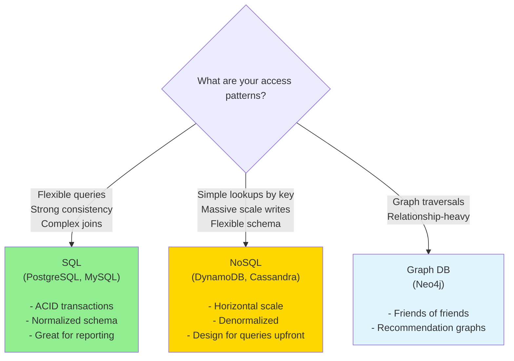

# Data Modeling

> **Mental model**: Your data model is not just a schema — it's a bet on which queries will be fast. Make the wrong bet and no amount of caching fixes it.

---

## The Core Idea

Data modeling sounds like a backend detail. It isn't. The shape of your data determines:
- Which queries are fast vs slow
- Whether you need joins or can avoid them
- How you shard or replicate
- How you version and migrate

In an interview, sketching a schema forces you to think concretely about what the system actually stores.

---

## SQL vs NoSQL: The Real Decision

This isn't about which is "better" — it's about access patterns.



**Rule of thumb**: If you know all your queries upfront → NoSQL. If queries are unpredictable → SQL.

---

## Normalization vs Denormalization

**Normalized** — data stored once, referenced by ID. Less duplication, more joins.
```
Users: { id, name, email }
Posts: { id, userId, content }  ← userId is a foreign key
```
Good for: write-heavy, consistency-critical, relational data.

**Denormalized** — data duplicated to avoid joins.
```
Posts: { id, userId, userName, userAvatar, content }
```
Good for: read-heavy, high-scale, when you know the query shape.

> NoSQL forces denormalization. At scale, the join you avoid is the bottleneck you never get.

---

## Choosing a Primary Key

In distributed databases (DynamoDB, Cassandra), your **partition key** determines which node stores the data — and which queries are fast.

```
❌ Bad: partition key = userId
   → All of a user's data on one node. "Hot" users overload that node.

✅ Better: partition key = (userId, date)
   → Spreads writes across time. Queries by user + time range are fast.

✅ Good for fan-out: partition key = videoId
   → All comments for a video together. Fast reads. Known hot keys.
```

**Hot key problem**: If one partition key gets disproportionate traffic (a celebrity's post, a viral video), that node becomes a bottleneck. Solutions: add random suffix to key, or use a separate hot-key cache layer.

---

## Schema Design Example: Twitter-like Posts

```
Table: posts
─────────────────────────────────────
post_id        UUID       (unique)
user_id        UUID       (FK to users)
content        TEXT
created_at     TIMESTAMP
media_url      TEXT?
reply_to       UUID?      (self-referential for threads)

Indexes:
  - PRIMARY KEY: post_id
  - INDEX: user_id, created_at DESC   ← for "my posts" timeline
  - INDEX: created_at DESC             ← for global feed
```

---

## Interview Signals

- Always sketch a schema when asked to design a system — even a rough one
- State access patterns first: "The main reads are X. The main writes are Y."
- Mention indexes: "We'd need an index on `user_id + created_at` for the user timeline"
- Call out the tradeoff between normalization (consistent) and denormalization (fast)
- For NoSQL: "We'd denormalize the author's name into the post so we don't need a join at read time"
