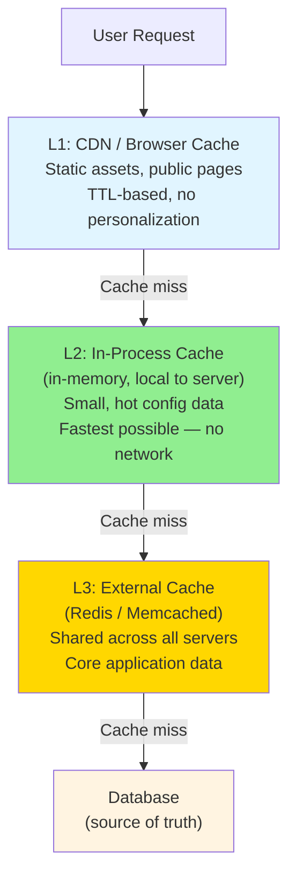

# Caching

> **Mental model**: Caching is paying upfront with memory and complexity to avoid paying repeatedly with latency.

---

## The Core Idea

Every cache answers the same question: *"Can I store this result somewhere closer/faster so I don't have to compute it again?"*

There are three layers where caching lives, and each has a different job.



---

## The Three Cache Layers

**CDN Cache** — for static content (images, JS, CSS) and public pages. Lives at the edge, closest to users. Controlled by `Cache-Control` headers. Never use for personalized data.

**In-Process Cache** — a hash map inside your running server. Zero network latency. Good for config, feature flags, rarely-changing lookup tables. Problem: each server has its own copy — stale data can vary across instances.

**External Cache (Redis)** — shared across all servers. Slightly more latency than in-process (~1ms) but consistent. The go-to for session data, computed feeds, rate limit counters, pub/sub. Treat it as an expensive read-through layer in front of your database.

---

## Cache Strategies

**Cache-Aside (Lazy Loading)** — most common. App checks cache first. On miss, reads DB and populates cache.
```
read(key):
  value = cache.get(key)
  if value is None:
    value = db.get(key)
    cache.set(key, value, ttl=300)
  return value
```
Pros: Only caches what's actually read. Cons: First request always slow (cold cache).

**Write-Through** — on every write, update cache and DB together. Cache is always warm but you cache data that may never be read.

**Write-Back (Write-Behind)** — write to cache only, flush to DB asynchronously. Very fast writes, but risk of data loss if cache goes down before flush.

---

## Cache Invalidation

*"There are only two hard things in computer science: cache invalidation and naming things."*

**TTL (Time to Live)** — simplest approach. Cache expires after N seconds. Works when slight staleness is acceptable.

**Explicit Invalidation** — when data changes, delete/update the cache key. Requires cache to be updated on every write path.

**Event-Driven** — publish a "data changed" event. Cache consumers react and invalidate. More complex but decoupled.

> In interviews: TTL is always a valid starting answer. Mention explicit invalidation if consistency matters.

---

## Cache Pitfalls to Mention

**Cache Stampede (Thundering Herd)** — a popular key expires, and 10,000 requests all hit the DB simultaneously trying to repopulate it. Fix: use a lock/mutex, or stagger TTLs with random jitter.

**Cache Penetration** — requests for keys that don't exist in the DB bypass the cache every time. Fix: cache negative results (store `null` for misses).

**Hot Keys** — one key gets read millions of times per second. Saturates a single Redis node. Fix: local in-process replica of hot keys, or shard the key across multiple entries.

---

## Interview Signals

- Propose caching early for read-heavy systems — "we'd add a Redis cache in front of the DB"
- Always specify the layer: CDN for static, Redis for application data
- Mention TTL as your default invalidation strategy, then explain tradeoffs
- Call out thundering herd if the system has high traffic and popular content (news feed, trending posts)
- Know that Redis is not just a cache — it's also used for pub/sub, rate limiting, sorted sets (leaderboards), and distributed locks
