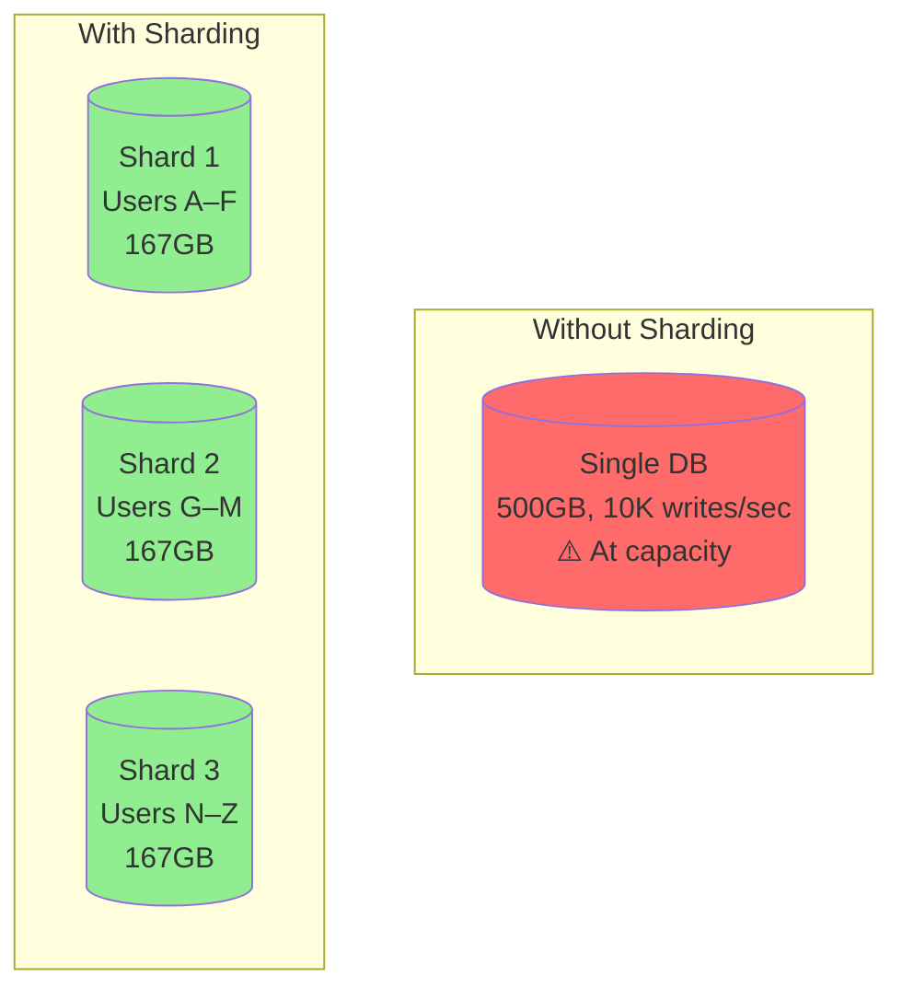
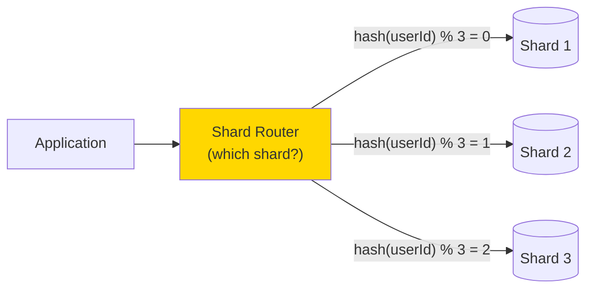

# Sharding

> **Mental model**: Sharding is horizontal scaling for databases. When one machine can't hold the data or handle the writes, split it across many.

---

## The Core Idea

A single database server has limits: disk space, RAM, CPU, and write throughput. When you hit those limits, you have two options:

- **Vertical scaling** — buy a bigger machine. Has a ceiling. Expensive.
- **Horizontal scaling (sharding)** — split data across multiple machines. No ceiling. Adds complexity.



---

## Sharding Strategies

**Range-Based Sharding** — split by value ranges (A–F, G–M, N–Z). Simple but creates hot spots if one range has more traffic.

**Hash-Based Sharding** — apply a hash function to the shard key. Distributes data evenly. Harder to do range queries.

**Directory-Based Sharding** — a lookup table maps keys to shards. Flexible but the directory itself becomes a bottleneck and single point of failure.



---

## Choosing a Shard Key

The shard key is the most important decision. A bad shard key creates **hot shards** — one node gets all the traffic while others sit idle.

```
❌ Bad shard key: created_at (timestamp)
   → All new writes go to the "latest" shard. Hot shard.

❌ Bad shard key: country (if 80% of users are in the US)
   → US shard overwhelmed. Others idle.

✅ Good shard key: userId (high cardinality, random distribution)
   → Writes spread evenly. Each user's data is on one shard.

✅ Good shard key: (userId + date) composite
   → Spreads by user AND time. Enables time-range queries per user.
```

---

## The Problems Sharding Creates

**Cross-shard queries** — "give me all orders over $100" requires querying all shards and merging results. Slow and expensive. Solution: avoid or denormalize.

**Cross-shard transactions** — updating two rows on different shards atomically is hard. Requires distributed transaction (2PC) or eventual consistency via Saga pattern.

**Resharding** — when you add shards, you need to move data around. With naive hash-based sharding (`hash % N`), adding one shard reshuffles almost all data. Solution: **consistent hashing** (see next topic).

**Joins** — you can't join across shards. Solution: denormalize or use an application-level join (slow).

---

## When to Shard (Interview Trigger Words)

- "10 billion rows in the database"
- "500 million users"
- "500,000 writes per second"
- "Storage exceeds what any single machine can hold"
- "We've already maxed out vertical scaling"

---

## Interview Signals

- Don't reach for sharding until you've exhausted vertical scaling and read replicas
- Name your shard key explicitly and explain why it avoids hot spots
- Acknowledge the tradeoffs: cross-shard queries, no cross-shard transactions, resharding pain
- Lead into consistent hashing as the solution to resharding pain
