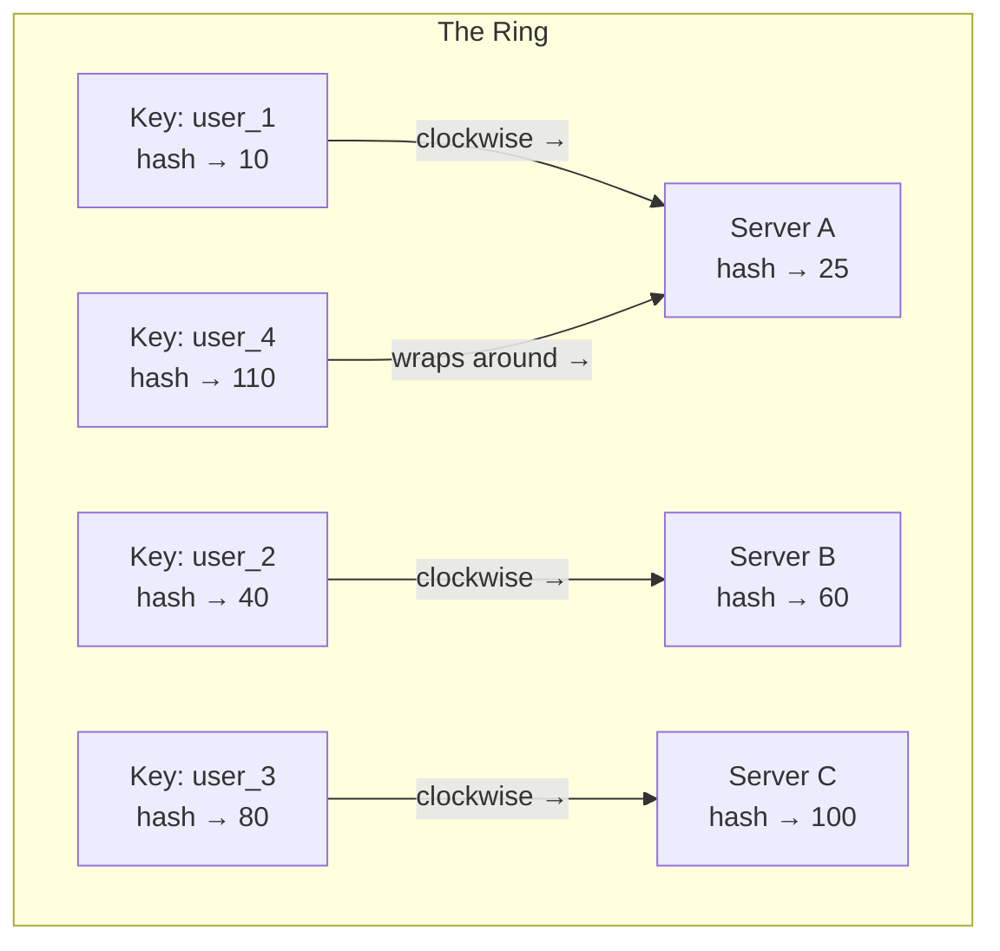

# Consistent Hashing

> **Mental model**: A clock face where servers sit at positions. Data goes to the nearest server clockwise. Adding/removing a server only moves its immediate neighbors' data — not everyone's.

---

## The Problem It Solves

Naive sharding with `hash(key) % N` breaks when N changes:

```
3 servers: hash("user_99") % 3 = 0  → Server A
Add 4th:  hash("user_99") % 4 = 3  → Server D  ← different!
```

Adding one server reshuffles ~75% of all keys. This is catastrophic for a cache (instant cache miss storm) or a live database (massive data migration required).

**Consistent hashing reduces reshuffling to only `1/N` of keys** when a node is added or removed.

---

## How It Works

Imagine a ring (0 to 2³²). Servers are placed on the ring by hashing their name/IP. Data is placed on the ring by hashing its key. Each key is stored on the first server you encounter going clockwise.



**Adding a new server** between A and B? Only keys that were going to B but now pass through the new server move. Everything else stays put.

**Removing a server**? Its keys shift to the next server clockwise. Only that server absorbs the load.

---

## Virtual Nodes

A problem with basic consistent hashing: servers land unevenly on the ring. One server might get 40% of keys, another 10%.

**Fix: Virtual nodes** — each physical server gets multiple positions on the ring (e.g., 100–150 virtual nodes each). Data distributes evenly because each server covers many small arc segments.

```
Physical: Server A → Virtual: A-1 at 10, A-2 at 45, A-3 at 200, A-4 at 310
Physical: Server B → Virtual: B-1 at 30, B-2 at 90, B-3 at 180, B-4 at 270
```

This is how Cassandra, DynamoDB, and most distributed databases handle data distribution.

---

## Where It's Used

| System | Use |
|--------|-----|
| **Redis Cluster** | Distributes keys across nodes |
| **Cassandra** | Partitions data via consistent hashing + virtual nodes |
| **CDNs** | Routes requests to nearest edge node |
| **Load balancers** | Sticky sessions without centralized session store |
| **Distributed caches** | Memcached clients use it client-side |

---

## Interview Signals

- Bring up consistent hashing when sharding or distributed caching comes up
- Use the clock face analogy — it's visual and clear to interviewers
- Mention virtual nodes when asked "what if servers aren't evenly distributed?"
- It's the mechanism that lets Cassandra/DynamoDB scale without major reshuffling
- The key insight: **only your neighbors are affected when you join or leave**
