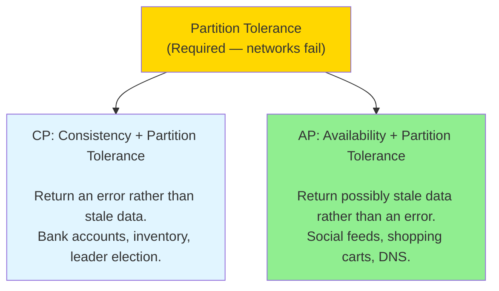
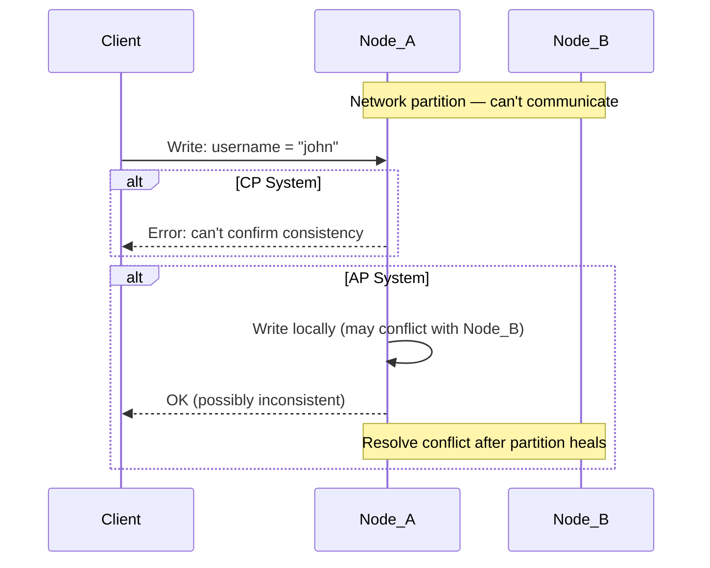

# CAP Theorem

> **Mental model**: When your network splits (and it will), you must choose: do nodes stay consistent with each other, or do they stay available to users?

---

## The Core Idea

CAP stands for **Consistency**, **Availability**, and **Partition Tolerance**. The theorem says: *in a distributed system, you can only guarantee two of the three at any time.*

But here's the thing — **partition tolerance is not optional**. Networks fail. Packets drop. Datacenters get split. Any distributed system must handle this. So the real choice is:

> **During a network partition: do you choose Consistency or Availability?**

---

## What Each Means

**Consistency (C)** — every read returns the most recent write, or an error. All nodes see the same data at the same time. Strong consistency. No stale reads.

**Availability (A)** — every request gets a response (not necessarily the latest data). The system is always up, even if it might return slightly stale data.

**Partition Tolerance (P)** — the system continues operating even when some nodes can't communicate with others.

---

## CP vs AP in Practice

**CP systems** refuse to answer during a partition rather than risk giving wrong data.

*Example*: You're transferring $1000 from checking to savings. During a network split, the database refuses the transaction rather than risking a double-spend. You get an error. That's correct behavior for a bank.

**AP systems** respond during a partition with whatever data they have, even if it's stale.

*Example*: You check your Twitter feed during a network split. You see tweets from 30 seconds ago instead of right now. You still get a response. The system stays up.

---

## Real Database Choices

| Database | Type | Why |
|----------|------|-----|
| PostgreSQL, MySQL | CP | Strong consistency, ACID transactions |
| HBase | CP | Consistent, sacrifices availability |
| Cassandra | AP | Available, eventually consistent |
| DynamoDB | AP (tunable) | Default eventual, can configure stronger |
| MongoDB | CP (default) | Single master writes |
| Redis | CP (cluster mode) | Prioritizes consistency |

---

## Eventual Consistency

Most AP systems use **eventual consistency**: given enough time with no new writes, all nodes will converge to the same value. For most social/consumer apps this is fine — seeing a like count that's 1 second stale is not a problem.

**Conflict resolution** (when nodes diverge):
- **Last write wins** — the write with the latest timestamp survives (simple, can lose data)
- **Vector clocks** — track causality to detect conflicts (complex, used by DynamoDB)
- **Application-level merge** — the app decides (shopping cart merges items from both versions)

---

## Interview Signals

- State your consistency requirement early: "This is financial data — we need CP"
- For social/consumer features: "We can accept eventual consistency here — AP is fine"
- Cassandra: use when you need AP + high write throughput
- PostgreSQL: use when you need CP + complex queries + ACID
- Know that "strong consistency" has a latency cost — every write must be confirmed by a quorum
