# Database Indexing

> **Mental model**: An index is a sorted copy of a column (or columns) that lets the database skip straight to what you're looking for — like a book's index vs reading every page.

---

## The Core Idea

Without an index, a query scans every row in the table (**full table scan**). With an index, the database jumps directly to the relevant rows using a pre-sorted structure.

**The tradeoff**: Indexes make reads faster but writes slower (the index must be updated on every insert/update/delete) and use additional storage.

```mermaid
graph LR
    subgraph "No Index"
        Q1["SELECT * WHERE email = 'a@b.com'"]
        Q1 -->|"Scan all 1M rows"| T1["😰 O(n)"]
    end

    subgraph "With Index on email"
        Q2["SELECT * WHERE email = 'a@b.com'"]
        Q2 -->|"B-tree lookup"| T2["⚡ O(log n)"]
    end

    style T1 fill:#ff6b6b
    style T2 fill:#90EE90
```



---

## How B-Tree Indexes Work

The default index type in most databases (PostgreSQL, MySQL) is a **B-tree** (Balanced Tree). It keeps values in sorted order and allows:

- Exact match: `WHERE id = 123`
- Range queries: `WHERE created_at > '2024-01-01'`
- Prefix match: `WHERE name LIKE 'John%'`
- Sorting: `ORDER BY created_at DESC`

It does **not** help with: suffix match (`LIKE '%john'`), arbitrary text search, or unindexed columns in WHERE clauses.

---

## Types of Indexes

**Single-column index** — index on one column.
```sql
CREATE INDEX idx_users_email ON users(email);
-- Fast: WHERE email = 'a@b.com'
```

**Composite index** — index on multiple columns. Column order matters.
```sql
CREATE INDEX idx_posts_user_date ON posts(user_id, created_at DESC);
-- Fast: WHERE user_id = 123 ORDER BY created_at DESC   ← uses both
-- Fast: WHERE user_id = 123                             ← uses first column
-- Slow: WHERE created_at > '2024-01-01'                ← skips first column
```

**Rule**: A composite index can be used left-to-right. You can skip the right columns but not the left ones.

**Unique index** — enforces uniqueness + speeds up lookups.
```sql
CREATE UNIQUE INDEX idx_users_email ON users(email);
```

**Partial index** — index only a subset of rows. Smaller and faster for filtered queries.
```sql
CREATE INDEX idx_active_users ON users(email) WHERE is_active = true;
```

---

## When to Add an Index

```
Add an index when:
✅ The column appears in WHERE, JOIN ON, or ORDER BY clauses frequently
✅ The column has high cardinality (many distinct values)
✅ The table has many rows and queries are slow

Don't add an index when:
❌ The table is small (full scan is fine)
❌ The column is written to constantly (index maintenance overhead)
❌ The column has low cardinality (e.g., boolean — index rarely helps)
❌ You already have too many indexes on a write-heavy table
```

---

## Index Pitfalls

**Index not being used** — the query planner might skip your index if:
- The query uses a function on the column: `WHERE LOWER(email) = 'a@b.com'` (use a functional index instead)
- The result set is too large (> ~20% of rows — full scan is cheaper)
- Statistics are stale: `ANALYZE` your tables

**Index bloat** — deleted rows leave dead entries. Indexes grow over time. Solution: `REINDEX` or `VACUUM` in PostgreSQL.

**Write amplification** — every insert/update must update all indexes on that table. A table with 10 indexes pays 10x the write cost. Don't over-index.

---

## Interview Signals

- "We'd add an index on `user_id + created_at` for the user timeline query" shows you think in access patterns
- Explain *why* the index helps: "This lets us jump to a specific user's rows sorted by time, without scanning the whole table"
- Mention composite index column order when discussing multi-column queries
- Acknowledge the write cost: "Adding an index slows down inserts — important for high-write tables"
- For full-text search (searching inside text content), indexes alone aren't enough — mention Elasticsearch or PostgreSQL's `tsvector` full-text search
