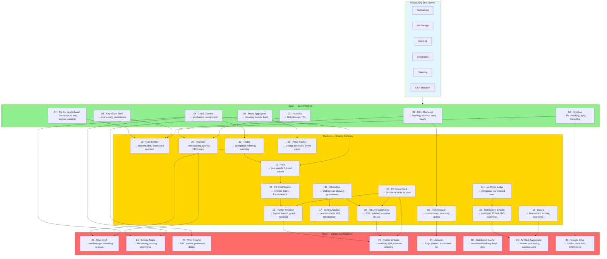
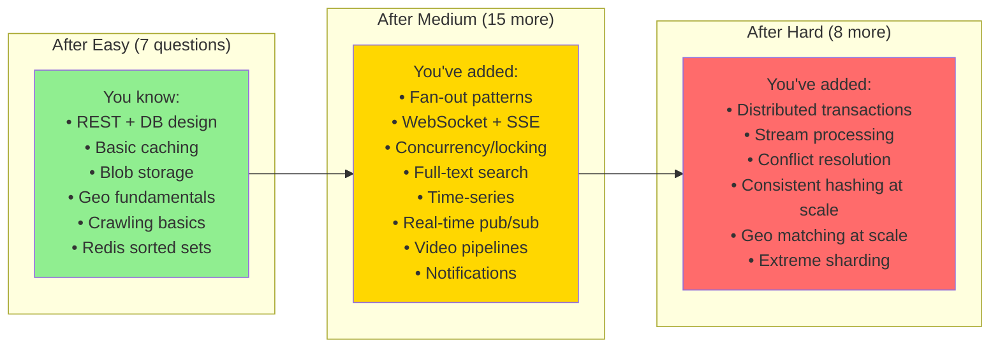

# System Design 30 — Curriculum Map

> The NeetCode approach applied to system design.
> Each question introduces new concepts and reinforces old ones. Do them in order.

---

## How to Use This

1. **Read the concept cards first** (`in-a-hurry/`) — they're your vocabulary
2. **Do each question in order** — every question explicitly tells you what it builds on
3. **Draw the diagram before reading** — treat each question like a practice interview
4. **Track what's new vs what's reinforced** — that's how the mental model compounds

---

## The Concept Dependency Graph

This shows how concepts introduced in early questions become the foundation for harder ones. Each tier's questions depend on the tier above it.



---

## The 30 Questions

### Easy — Core Patterns

| # | Question | New Concepts | Reinforces |
|---|----------|-------------|------------|
| 01 | [URL Shortener](easy/01-url-shortener.md) | Hash function, base62, 301 vs 302 redirect, read-heavy DB | REST API, Load Balancer, Cache |
| 02 | [Pastebin](easy/02-pastebin.md) | Blob storage (S3), TTL expiry, content-addressed storage | Caching, basic CRUD |
| 03 | [Key-Value Store](easy/03-key-value-store.md) | In-memory hash map, write-ahead log, replication basics | Caching, CAP Theorem |
| 04 | [Dropbox](easy/04-dropbox.md) | File chunking, delta sync, metadata DB + blob storage split | Blob storage, hashing |
| 05 | [News Aggregator](easy/05-news-aggregator.md) | Polling vs push, RSS/crawling, deduplication, simple feed | DB design, caching |
| 06 | [Local Delivery Service](easy/06-local-delivery.md) | Geolocation, driver/order matching, basic geo queries | REST API, DB |
| 07 | [Top K / Leaderboard](easy/07-leaderboard.md) | Redis sorted sets, approximate vs exact counting, time windows | Redis, caching |

### Medium — Scaling Patterns

| # | Question | New Concepts | Reinforces |
|---|----------|-------------|------------|
| 08 | [Rate Limiter](medium/08-rate-limiter.md) | Token bucket, sliding window, distributed counters | Redis, API Design |
| 09 | [Ticketmaster](medium/09-ticketmaster.md) | Inventory + concurrency, optimistic locking, traffic spikes, waiting room queue | Caching, DB |
| 10 | [FB News Feed](medium/10-fb-news-feed.md) | Fan-out on write vs read, celebrity problem, feed ranking | Caching, DB design |
| 11 | [WhatsApp](medium/11-whatsapp.md) | WebSocket, message delivery guarantees, presence, offline queue | Message queues, API |
| 12 | [Tinder](medium/12-tinder.md) | Geospatial indexing (GeoHash/QuadTree), recommendation queue | Geo basics, caching |
| 13 | [Yelp](medium/13-yelp.md) | Geospatial search, full-text search intro, review aggregation | Geo, search |
| 14 | [LeetCode Judge](medium/14-leetcode-judge.md) | Job queue, sandboxed code execution, async result polling | Message queues, rate limiting |
| 15 | [Strava](medium/15-strava.md) | Time-series data, activity segments, leaderboard at scale | Geo, sorted sets |
| 16 | [FB Live Comments](medium/16-fb-live-comments.md) | SSE, Redis pub/sub, massive fan-out (millions of viewers) | WebSocket, fan-out |
| 17 | [Online Auction](medium/17-online-auction.md) | Real-time bidding via WebSocket, bid ordering, consistency under contention | WebSocket, concurrency |
| 18 | [FB Post Search](medium/18-fb-post-search.md) | Inverted index, Elasticsearch, query parsing, ranking | Search basics, DB indexing |
| 19 | [Twitter Timeline](medium/19-twitter-timeline.md) | Hybrid fan-out (write for normals, read for celebrities), social graph | Fan-out, sharding |
| 20 | [YouTube](medium/20-youtube.md) | Transcoding pipeline, adaptive bitrate (HLS), CDN for video | Blob storage, CDN, message queues |
| 21 | [Price Tracker](medium/21-price-tracker.md) | Change detection, event-driven notifications, scraping + dedup | Crawling, notifications |
| 22 | [Notification System](medium/22-notification-system.md) | Push (FCM/APNS) vs pull, batching, user preferences, fan-out | Message queues, fan-out |

### Hard — Distributed Systems

| # | Question | New Concepts | Reinforces |
|---|----------|-------------|------------|
| 23 | [Uber / Lyft](hard/23-uber.md) | Real-time location at 10s intervals, geospatial matching at scale, surge pricing | Geo indexing, WebSocket, sharding |
| 24 | [Google Maps](hard/24-google-maps.md) | Map tile serving, routing algorithms (Dijkstra/A*), geo data at petabyte scale | CDN, geo, graph traversal |
| 25 | [Web Crawler](hard/25-web-crawler.md) | Distributed URL frontier, politeness/robots.txt, dedup at scale | Crawling, message queues, consistent hashing |
| 26 | [Twitter at Scale](hard/26-twitter-at-scale.md) | Extreme celebrity fan-out split, social graph sharding, hot key handling | Twitter Timeline, sharding |
| 27 | [Amazon / E-commerce](hard/27-amazon.md) | Inventory reservation, Saga pattern (distributed transactions), cart + order | Concurrency, consistency, message queues |
| 28 | [Distributed Cache](hard/28-distributed-cache.md) | Consistent hashing deep dive, cache cluster replication, eviction at scale | Caching, consistent hashing |
| 29 | [Ad Click Aggregator](hard/29-ad-click-aggregator.md) | Stream processing (Kafka), Lambda vs Kappa architecture, approximate counting (HyperLogLog) | Message queues, time-series |
| 30 | [Google Drive (Sync)](hard/30-google-drive.md) | Conflict resolution strategies, CRDT basics, sync protocol, operational transforms | Dropbox, distributed consistency |

---

## Concept Reinforcement Map

This shows how many times each concept appears across the 30 questions. High frequency = most important to internalize first.

| Concept | Frequency | First Appears | Key Questions |
|---------|-----------|---------------|---------------|
| Caching (Redis) | ★★★★★ | Q01 | 01, 07, 08, 09, 10, 12, 16 |
| Database Design | ★★★★★ | Q01 | 01, 02, 04, 05, 09, 10 |
| Message Queues (Kafka) | ★★★★☆ | Q05 | 11, 14, 20, 22, 25, 29 |
| Fan-out Pattern | ★★★★☆ | Q10 | 10, 12, 16, 19, 22, 26 |
| Geo / Spatial | ★★★☆☆ | Q06 | 06, 12, 13, 15, 23, 24 |
| WebSocket / Real-time | ★★★☆☆ | Q11 | 11, 16, 17, 23 |
| Sharding | ★★★☆☆ | Q03 | 03, 19, 23, 26, 28 |
| Search / Inverted Index | ★★☆☆☆ | Q13 | 13, 18, 25 |
| Blob Storage (S3) | ★★☆☆☆ | Q02 | 02, 04, 20, 30 |
| Distributed Transactions | ★★☆☆☆ | Q09 | 09, 17, 27, 30 |

---

## How Concepts Accumulate Per Tier



---

## Question File Format

Every question file follows the same structure so your brain builds a consistent pattern for interviews:

```
1. Difficulty + what it teaches + prerequisites
2. "How I should think about this" (2-paragraph mental model)
3. Whiteboard diagram (the diagram you'd draw first in an interview)
4. Key decisions (the 2-3 tradeoffs that matter)
5. Concepts introduced (what's new to add to your mental model)
6. What to study next
```
