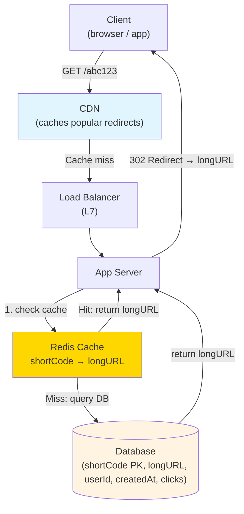
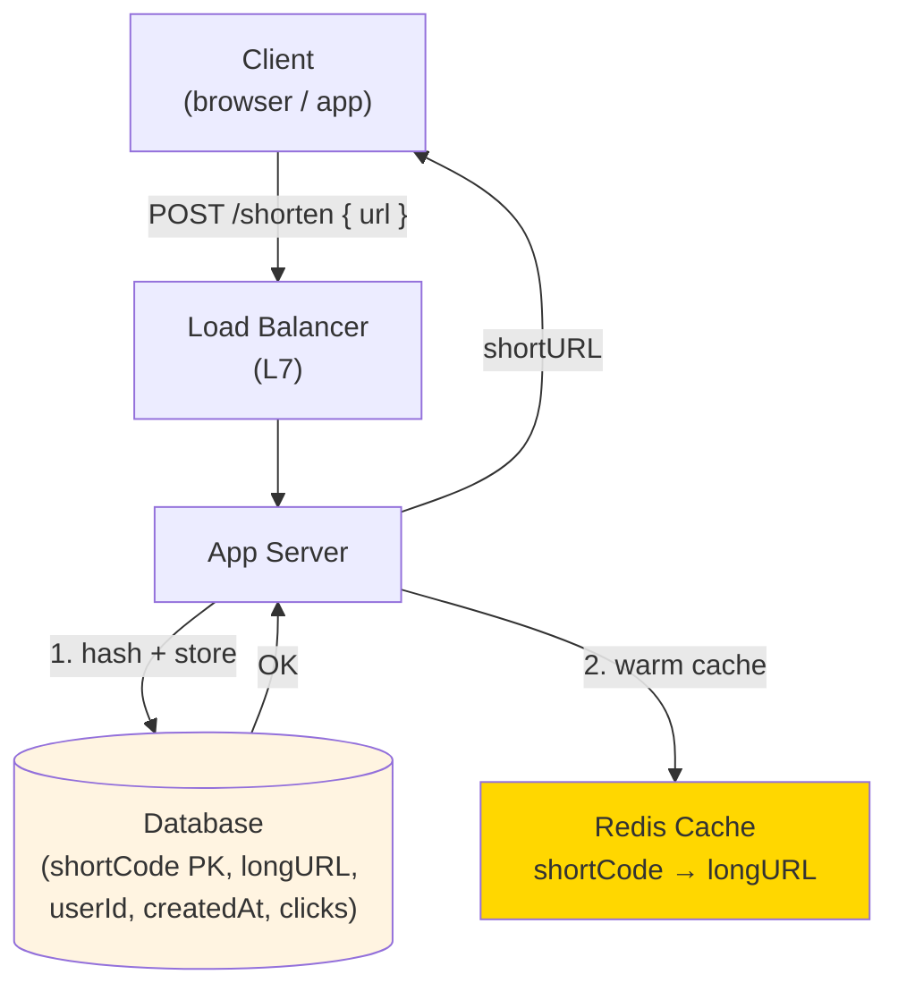
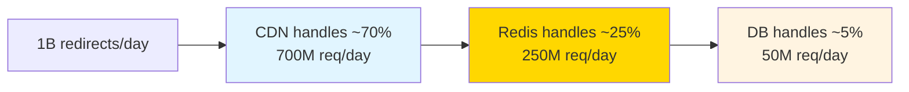

# 01 · URL Shortener (Bit.ly)

> **Difficulty**: Easy
> **Introduces**: hash function, base62 encoding, 301 vs 302 redirect, read-heavy optimization
> **Prerequisites**: [Networking](../../in-a-hurry/01-networking.md) · [API Design](../../in-a-hurry/02-api-design.md) · [Caching](../../in-a-hurry/04-caching.md)

---

## How I Should Think About This

A URL shortener has exactly two operations: shorten a URL and redirect from a short code to the original. The interesting design challenge isn't either of those in isolation — it's that **reads massively outnumber writes** (billions of redirects per day vs millions of new URLs created). That ratio drives every decision: you cache aggressively, you design your database schema for single-key lookups, and you push the hot path through a CDN so most redirects never even hit your servers.

The encoding problem sounds algorithmic but resolves quickly: hash the long URL or generate a random ID, then encode it in base62 (a-z, A-Z, 0-9) to get a short 6-8 character code. The non-obvious choice is **301 vs 302**: a 301 (permanent redirect) lets browsers cache the redirect, which reduces your traffic but means you lose click analytics. A 302 (temporary redirect) forces every click through your servers so you can count it. Bit.ly uses 302 for this reason. Pick one and justify it.

---

## Whiteboard Diagram

**Flow 1 — Redirect (read path)**



**Flow 2 — Shorten (write path)**



---

## Key Decisions

**1. How do you generate the short code?**

- **Option A: Hash the long URL** (MD5 → take first 6 chars). Fast, deterministic — same URL always gets same code. Problem: collisions, and you can't support custom aliases.
- **Option B: Auto-increment ID + base62 encode**. `1 → "1"`, `62 → "10"`, `3.5B → "5vXrrX"`. Simple, no collisions, predictable length. Downside: IDs are guessable/sequential.
- **Option C: Random 6-char base62**. 62⁶ = 56 billion possibilities. Use this. Check for collisions on insert (rare).

> Default answer in interviews: **random base62 with collision check on insert**.

**2. 301 (permanent) vs 302 (temporary) redirect?**

| | 301 Permanent | 302 Temporary |
|--|--------------|--------------|
| Browser caches redirect | ✅ Yes | ❌ No |
| Your server handles each click | ❌ No (browser handles) | ✅ Yes |
| Can track analytics | ❌ No | ✅ Yes |
| Load on your system | Lower | Higher |

> If analytics matter (most real products): **use 302**.

**3. How do you handle the read-heavy load?**

Layer the caching:
1. **CDN** caches popular short codes at the edge — most traffic never hits your origin
2. **Redis** caches the shortCode → longURL mapping with a TTL (most URLs stay hot for days after creation, then go cold)
3. **Database** is the source of truth but rarely hit for popular links



---

## Capacity Estimation

```
Write QPS:  100M URLs/day ÷ 86,400 ≈ 1,200 writes/sec
Read QPS:   10:1 read ratio → 12,000 reads/sec (peak: ~3x → 36,000 RPS)

Storage per URL: 500 bytes (longURL + metadata)
Storage per day: 100M × 500B = 50 GB/day
Storage for 5 years: 50GB × 365 × 5 ≈ 90 TB → needs sharding eventually
```

---

## Concepts Introduced

After this question, add these to your mental model:

- **Base62 encoding** — converts numbers to compact alphanumeric strings. You'll see this pattern again in any system generating unique short IDs (Pastebin, ticket IDs, order IDs).
- **301 vs 302** — the redirect choice has real product implications. Now you know to ask "do we need analytics?" before picking.
- **Read-heavy caching cascade** — CDN → in-memory → DB. This layered pattern repeats in almost every read-heavy system (news feeds, video metadata, product pages).
- **Collision handling** — when generating random IDs, always check for uniqueness on insert. Collisions are rare but must be handled.

---

## What to Study Next

➜ **[02 · Pastebin](02-pastebin.md)** — same CRUD pattern but introduces blob storage and TTL expiry. Reinforces the read-heavy caching model you just learned.
