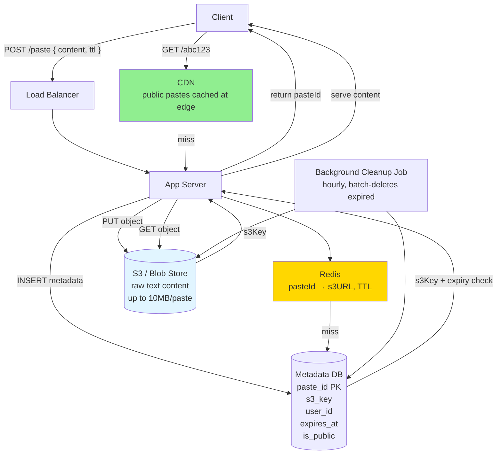

# 02 · Pastebin

> **Difficulty**: Easy
> **Introduces**: blob storage (S3), TTL expiry, metadata + blob split
> **Builds on**: [01 · URL Shortener](01-url-shortener.md) — same short-code generation, adds content storage

---

## How I Should Think About This

Pastebin is URL Shortener with one key difference: instead of redirecting to an external URL, you're storing and serving the actual content. The short-code generation is identical — base62 encoded ID, same as Q01. What's new is deciding *where* the content lives. Large text blobs don't belong in a relational database row; they belong in **object storage (S3)**. The database holds only metadata (who created it, when it expires, the S3 key), and the actual content lives in the blob store. This metadata-plus-blob split is a pattern you'll use again in Dropbox, YouTube, and Google Drive.

The second new concept is **TTL expiry**. Pastes expire after N minutes/hours/days — or never. This introduces a cleanup problem: how do you purge millions of expired pastes without slowing down your reads? The naive approach is checking `expiresAt` on every read. The better approach is a **background cleanup job** that runs hourly and deletes expired rows in batches. Redis TTL handles the cache layer automatically. Most pastes follow a hot-then-cold read pattern — read heavily right after creation, then almost never again — so caching the first wave is what actually matters.

---

## Whiteboard Diagram



---

## Key Decisions

**1. Why not store content in the database?**

```
❌ Content in DB row:
   - Rows become large and slow down table scans
   - DB not optimized for streaming large blobs
   - Expensive to replicate large rows
   - Hard to serve via CDN

✅ Metadata in DB + content in S3:
   - DB rows stay tiny (~200 bytes)
   - S3 handles any content size
   - S3 URLs can be served directly via CDN
   - Clean separation: structured data vs unstructured blobs
```

This is the foundational pattern for any storage system. Whenever you see "users upload content," split it: DB for metadata, S3 for the actual content.

**2. How to handle TTL expiry?**

| Approach | Tradeoff |
|----------|----------|
| Check `expiresAt` on every read | Simple but dead pastes still consume storage |
| Background cleanup job (hourly) | Slight delay before deletion, keeps DB lean |
| Redis TTL on cache key | Cache auto-expires; combine with DB cleanup |

> Best answer: **Redis TTL for the cache + hourly background job for DB/S3 cleanup.**

**3. Public vs private pastes**

Public pastes can be cached at the CDN — everyone gets the same content. Private pastes (with auth) must bypass CDN and be served with a signed S3 URL that expires after a short window.

```
Public:  CDN → cache forever (or until TTL)
Private: App server → generate signed S3 URL (expires in 15 min) → redirect
```

---

## Capacity Estimation

```
Writes:  1M pastes/day → ~12 writes/sec
Reads:   10:1 ratio → 120 reads/sec average (peaks around creation time)

Avg paste size: 10 KB
Storage/day:    1M × 10 KB = 10 GB/day
Storage/year:   ~3.5 TB → single S3 bucket handles this trivially

DB rows: 1M/day × 200 bytes = 200 MB/day → trivial
```

---

## Concepts Introduced

- **Blob storage (S3)** — unstructured content lives here, not in a DB. Reappears in: Dropbox (Q04), YouTube (Q20), Google Drive (Q30).
- **Metadata + blob split** — the universal pattern for file/content storage. DB = structured index. S3 = raw bytes.
- **TTL-based expiry with background cleanup** — a scheduled job keeping DB lean rather than deleting on write. Reappears in: sessions, reservation timers (Q09), cache eviction.
- **Signed URLs** — time-limited access tokens to private S3 objects. Reappears in: Dropbox, Google Drive.

---

## What to Study Next

➜ **[03 · Key-Value Store](03-key-value-store.md)** — you've used Redis as a cache in Q01 and Q02. Now design Redis itself: what makes an in-memory store work, how it persists, how it replicates.
