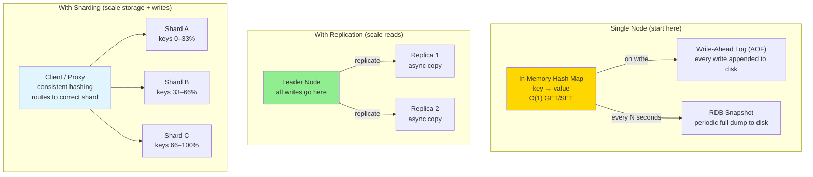
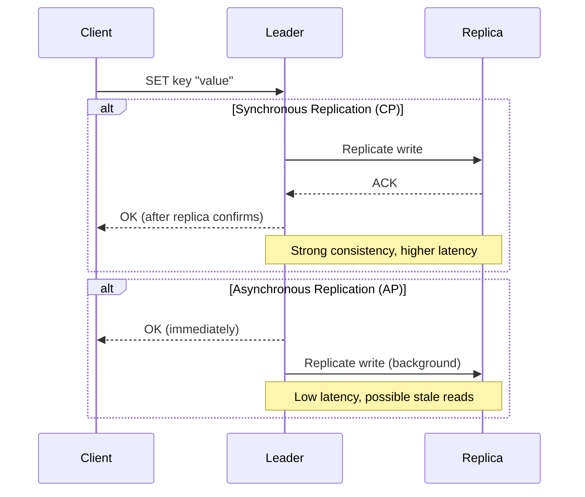

# 03 · Key-Value Store

> **Difficulty**: Easy
> **Introduces**: in-memory hash map, write-ahead log (WAL), replication basics, CAP in practice
> **Builds on**: [Caching](../../in-a-hurry/04-caching.md) · [CAP Theorem](../../in-a-hurry/07-cap-theorem.md) · [Sharding](../../in-a-hurry/05-sharding.md)

---

## How I Should Think About This

Designing a key-value store is designing Redis from scratch. The core is just a **hash map in memory** — O(1) get and set. What makes it interesting is everything around the edges: how do you survive a server restart (persistence), how do you serve more reads than one machine can handle (replication), and how do you store more data than one machine can hold (sharding). These three problems — persistence, replication, sharding — come up in almost every distributed system you'll design. This question forces you to understand them at their most fundamental level.

The key insight is that memory is fast but volatile, and disk is slow but durable. Redis solves this tension with two persistence strategies: **RDB snapshots** (periodic full dumps, fast recovery but can lose recent writes) and **AOF (Append-Only File)** (log every write command, slower but near-zero data loss). In practice, most production deployments use both. On the scaling side, you handle reads with read replicas (each replica is an async copy of the leader) and you handle storage limits with sharding via consistent hashing — the same pattern you'll see in Cassandra, DynamoDB, and every large-scale database.

---

## Whiteboard Diagram



---

## Key Decisions

**1. Persistence: RDB vs AOF vs both**

| Strategy | How | Data Loss Risk | Recovery Speed |
|----------|-----|----------------|----------------|
| **RDB Snapshot** | Full dump every N minutes | Up to N minutes of writes | Fast (load one file) |
| **AOF Log** | Append every write command | Near-zero (last fsync) | Slower (replay all commands) |
| **Both** | RDB for fast recovery + AOF for durability | Near-zero | Fast (RDB base + recent AOF) |

> Default answer: **use both** in production. RDB gives you fast restarts; AOF fills in the gap.

**2. Replication: sync vs async**



> Redis uses **async replication** by default — prioritizes availability over strict consistency. This is the CAP theorem in practice.

**3. Sharding strategy: consistent hashing**

Naive `hash(key) % N` breaks when you add nodes — almost all keys remap. Consistent hashing puts nodes on a ring so only the affected segment's keys move. You covered this in the vocabulary card — this is where it becomes concrete.

```
Adding a 4th shard:
  Naive hashing:      ~75% of keys remap → massive data migration
  Consistent hashing: ~25% of keys remap → only adjacent shard affected
```

---

## Capacity Estimation

```
Single node limits:
  Memory:    64 GB RAM → ~500M keys at 128 bytes/key
  Throughput: ~100,000 ops/sec single-threaded (Redis is single-threaded)

When to scale:
  > 64 GB data → add shards
  > 100K ops/sec → add read replicas or shard
```

---

## Concepts Introduced

- **WAL (Write-Ahead Log)** — log writes to disk before acknowledging them. Any system that needs crash recovery uses this pattern (databases, Kafka, filesystems). Reappears in: Distributed Cache (Q28).
- **Leader-replica replication** — one node accepts writes, others replicate async. Reappears everywhere: PostgreSQL read replicas, Cassandra, DynamoDB.
- **Async vs sync replication tradeoff** — async = low latency + possible stale reads. Sync = consistent + higher latency. This is CAP theorem made tangible.
- **Consistent hashing for sharding** — adding/removing nodes only affects adjacent keys. Reappears in: Distributed Cache (Q28), Web Crawler (Q25).

---

## What to Study Next

➜ **[04 · Dropbox](04-dropbox.md)** — builds on the blob storage from Q02 and the replication concepts from Q03. Adds file chunking and the sync protocol problem.
