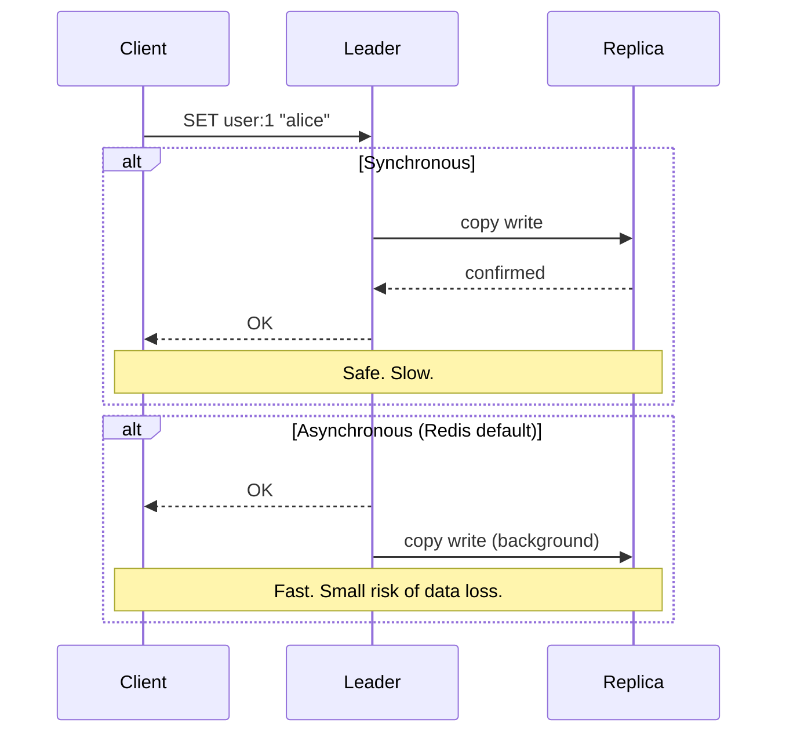
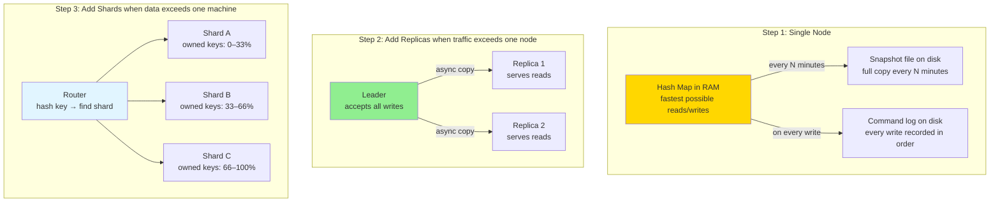

# 03 · Key-Value Store

> **Difficulty**: Easy
> **Introduces**: in-memory hash map, persistence (RDB + AOF), replication, sharding
> **Builds on**: [Caching](../../in-a-hurry/04-caching.md) · [CAP Theorem](../../in-a-hurry/07-cap-theorem.md) · [Sharding](../../in-a-hurry/05-sharding.md)

---

## Start Here: What Is a Key-Value Store?

It's a dictionary. You give it a key, it gives you back a value.

```
SET  user:1   "alice"    →  store it
GET  user:1              →  "alice"
DEL  user:1              →  gone
```

That's it. No tables, no joins, no schemas. Just keys and values. Redis is the most famous example — it's what most companies use as a fast cache or session store.

Under the hood, a key-value store is just a **hash map in RAM**. That's why it's so fast — O(1) GET and SET, no disk involved.

---

## The One Problem That Drives Everything

**RAM is fast but temporary. When the power goes out, everything in RAM disappears.**

Every design decision in this problem — RDB, AOF, WAL, replication, sharding — is a response to that one fact. Keep that in mind as you read through each concept.

---

## Concept 1 · Persistence — Surviving a Crash

If your data only lives in RAM, a server restart wipes everything. Persistence means: *write a copy to disk so you can recover after a crash.*

But writing to disk is slow (microseconds vs nanoseconds for RAM), so we need to be clever about when and how we do it.

There are two strategies. Here's what they each are:

---

### Strategy A: RDB — Take a Snapshot

**RDB stands for Redis Database Backup.** Forget the acronym — the mental model is a photograph.

Every few minutes, Redis takes a **complete photograph of everything in memory** and saves it as a single file on disk (`dump.rdb`). If the server crashes, you reload the photo and you're back — minus whatever happened after the last photo was taken.

```
Time 0:00  →  Snapshot saved  (100 keys)
Time 0:01  →  50 new writes
Time 0:02  →  50 new writes
Time 0:03  →  50 new writes
Time 0:04  →  SERVER CRASH

On restart:  load snapshot from 0:00
             → recover 100 keys
             → lose 150 writes that happened between 0:00 and 0:04
```

**The tradeoff:** Fast to recover (load one file), but you always risk losing data since the last snapshot.

**How Redis takes the snapshot without blocking:** Redis uses a Unix trick called `fork()` — it creates a copy of itself (a child process) that does the snapshot in the background while the parent keeps serving requests. You don't notice it happening.

**When you'd choose RDB:**
- Caches where losing a few minutes of data is acceptable
- You need fast restarts (single file to load)
- Hourly or daily backups

---

### Strategy B: AOF — Keep a Journal

**AOF stands for Append-Only File.** The mental model is a paper journal.

Instead of taking snapshots, Redis writes every single command to a log file *as it happens*. Every `SET`, every `DEL`, every `EXPIRE` — appended to the file in order.

```
Contents of appendonly.aof:
  SET user:1 "alice"
  SET user:2 "bob"
  DEL user:1
  SET session:xyz "logged_in"
  EXPIRE session:xyz 3600
  ...
```

If the server crashes, Redis reads the journal from line 1, replays every command in order, and rebuilds the exact state it had before the crash.

**The tradeoff:** Near-zero data loss (you only lose commands since the last flush — usually under 1 second), but recovery is slower because you replay every command. Also the file grows forever (Redis compacts it periodically).

**Why "append-only" matters:** You never go back and change an old line — you only ever add to the end. This is crucial for two reasons:
1. Appending to the end of a file is the *fastest* disk operation (sequential write)
2. If the server crashes mid-write, the partial entry is at the end and can be discarded safely — earlier entries are untouched

**This pattern shows up everywhere:**
- Kafka is literally an append-only log
- Git commits are append-only
- PostgreSQL and MySQL both use this pattern internally
- Your bank's transaction ledger is append-only

---

### The WAL Pattern — Why "Write Before You Do"

AOF is an implementation of a broader pattern called a **Write-Ahead Log (WAL)**. The rule is: *write your intent to disk before you act on it.*

Mental model: a surgeon narrating every action into a recorder before doing it. If something goes wrong mid-surgery, the recording shows exactly what was done and where things stand. You can recover.

WAL is how databases guarantee crash safety. If the system dies mid-operation, on restart you check the log: "did we finish this operation?" If not, either redo it or undo it. Without a log, you'd have no idea what state things were left in.

**Why this matters for interviews:** WAL is one of the most important patterns in distributed systems. Any time an interviewer asks "how does your system handle crashes?" — knowing WAL signals that you understand database internals.

---

### Persistence Decision Table

|                        | RDB Snapshot                                  | AOF Log                                |
| ---------------------- | --------------------------------------------- | -------------------------------------- |
| **How**                | Full photo of all data, saved every N minutes | Every write command appended to a file |
| **Data loss on crash** | Up to N minutes of writes                     | Less than 1 second                     |
| **Recovery speed**     | Fast — load one file                          | Slow — replay every command            |
| **File size**          | Small (compressed binary)                     | Grows over time (text commands)        |
| **Best for**           | Caches, backups, fast restarts                | Anything that can't afford data loss   |

> **Default production answer: use both.** RDB for fast restarts, AOF to fill in the gap since the last snapshot. Redis supports this natively.

---

## Concept 2 · Replication — Surviving High Traffic

You've solved crashes. New problem: **one node handles ~100,000 requests/second.** Your app needs 500,000 reads/second. You can't make one machine go faster. So you make copies.

**Replication** = run multiple identical copies of the store. One node is the **Leader** (takes all writes). The rest are **Replicas** (serve reads, stay in sync with the leader).

```
              ┌──────────────┐
Client writes ──▶  LEADER    │──── Client reads
              │  (all writes)│
              └──────┬───────┘
                     │  copy
              ┌──────▼───────┐
              │  REPLICA 1   │──── Client reads
              └──────────────┘
                     │  copy
              ┌──────▼───────┐
              │  REPLICA 2   │──── Client reads
              └──────────────┘
```

This is the same pattern as PostgreSQL read replicas, MySQL replicas, and DynamoDB global tables.

---

### Synchronous vs Asynchronous Replication

Here's the question: after the Leader receives a write, when does it say "OK" to the client?

**Option A — Synchronous:** Leader waits until the Replica confirms it got the write, *then* tells the client OK.
- Pro: If the Leader dies immediately after, the Replica definitely has the data. No data loss.
- Con: Every write is now as slow as your network round-trip to the Replica. If the Replica is slow or down, your writes stall.

**Option B — Asynchronous (Redis default):** Leader tells the client "OK" immediately, then copies to Replicas in the background.
- Pro: Writes are as fast as the Leader alone. Replicas being slow doesn't affect write speed.
- Con: If the Leader crashes before replication happens, that write is gone. Also, Replicas may be slightly behind — a read from a Replica might see old data.


```mermaid
sequenceDiagram
    participant C as Client
    participant L as Leader
    participant R as Replica

    C->>L: SET user:1 "alice"

    alt Synchronous
        L->>R: copy write
        R-->>L: confirmed
        L-->>C: OK
        Note over C,R: Safe. Slow.
    end

    alt Asynchronous (Redis default)
        L-->>C: OK
        L->>R: copy write (background)
        Note over C,R: Fast. Small risk of data loss.
    end
```

**The hidden problem with async: Replication Lag**

The Replica is always slightly behind — milliseconds usually, seconds if the network is busy. This causes **stale reads**: you write something to the Leader, immediately read from a Replica, and get the old value.

This is the CAP theorem made real. You're choosing between:
- **Consistency** (sync replication: every read sees the latest write) vs.
- **Availability** (async replication: reads always return *something*, even if slightly stale)

For most caches, stale reads for a few milliseconds are fine. For financial transactions or distributed locks — use sync.

---

## Concept 3 · Sharding — Surviving Data That Won't Fit

New problem: **your dataset is 500GB and you only have 64GB of RAM.** Replication doesn't help — every replica is a full copy of the data.

**Sharding** = split the data across multiple machines. Each machine owns a *subset* of keys.

```
Machine A owns keys starting with "user:1..." through "user:5..."
Machine B owns keys starting with "user:5..." through "user:8..."
Machine C owns keys starting with "user:8..." through "user:z..."
```

A router (or the client library itself) figures out which machine holds a given key and sends the request there.

---

### Why Simple Sharding Breaks: The Modulo Problem

The obvious approach: `which machine = hash(key) % number_of_machines`

```
3 machines:  hash("user:1") % 3  →  machine 1
             hash("user:2") % 3  →  machine 0
             hash("user:3") % 3  →  machine 2
```

This works fine — until you add a 4th machine:

```
4 machines:  hash("user:1") % 4  →  machine 1   (same, lucky)
             hash("user:2") % 4  →  machine 2   ← MOVED from machine 0
             hash("user:3") % 4  →  machine 3   ← MOVED from machine 2
```

Roughly **75% of all keys** now map to different machines. Every cache miss. Every database hit. Your system melts.

---

### Consistent Hashing — The Fix

Instead of `% N`, imagine a clock with positions 0 → 4 billion.

Each machine gets assigned a position on the clock. A key's position is `hash(key)` — and it belongs to whichever machine is closest *clockwise* from that position.

```
          12 (0)
        /        \
  Node C          Node A
   (9)              (3)
        \        /
          Node B
           (6)

hash("user:1") = 4  →  nearest clockwise = Node B
hash("user:2") = 7  →  nearest clockwise = Node C
hash("user:3") = 2  →  nearest clockwise = Node A
```

Now add a 4th node at position 8 (between B and C):

```
Only keys between positions 6 and 8 move (from C to the new node).
Everything else stays put.
Result: ~25% of keys migrate instead of ~75%.
```

**The rule:** Adding or removing 1 node from a ring of N nodes moves only `1/N` of the keys. Modulo hashing moves `(N-1)/N` of them.

---

## Putting It All Together


```mermaid
graph TB
    subgraph "Step 1: Single Node"
        KV["Hash Map in RAM\nfastest possible reads/writes"]
        RDB["Snapshot file on disk\nfull copy every N minutes"]
        AOF["Command log on disk\nevery write recorded in order"]
        KV -->|"every N minutes"| RDB
        KV -->|"on every write"| AOF
    end

    subgraph "Step 2: Add Replicas when traffic exceeds one node"
        Leader["Leader\naccepts all writes"]
        R1["Replica 1\nserves reads"]
        R2["Replica 2\nserves reads"]
        Leader -->|"async copy"| R1
        Leader -->|"async copy"| R2
    end

    subgraph "Step 3: Add Shards when data exceeds one machine"
        Router["Router\nhash key → find shard"]
        S1["Shard A\nowned keys: 0–33%"]
        S2["Shard B\nowned keys: 33–66%"]
        S3["Shard C\nowned keys: 66–100%"]
        Router --> S1
        Router --> S2
        Router --> S3
    end

    style KV fill:#FFD700
    style Leader fill:#90EE90
    style Router fill:#e1f5ff
```

Each step solves a specific problem:

| Problem | Solution | Mechanism |
|---|---|---|
| Crash wipes memory | Persistence | RDB snapshot + AOF log |
| Too many reads for one node | Replication | Leader + async replicas |
| Too much data for one node | Sharding | Consistent hashing ring |

---

## The Interview Walk-Through

Say this out loud, in this order:

```
"I'll start with a single node: an in-memory hash map. O(1) GET/SET."

"For persistence — data lives in RAM so a crash wipes everything.
 I'd use two strategies together: RDB snapshots every few minutes for fast
 recovery, and an AOF log for every write so I don't lose data between
 snapshots. That's the production Redis default."

"For reads — if traffic exceeds ~100K ops/sec, I'd add read replicas.
 Leader takes writes, replicas serve reads. I'd use async replication
 by default, which means I need to call out replication lag — replicas
 may be slightly stale. Acceptable for a cache. Not acceptable for
 financial data."

"For storage — if the dataset outgrows one machine's RAM, I'd shard
 with consistent hashing. Keys map to positions on a ring. Each shard
 owns a segment. Adding a shard only moves ~1/N keys."
```

---

## Concept Glossary

| Term | Plain English |
|------|--------------|
| **Hash map** | A data structure where you look up a value by key in O(1) — like a dictionary |
| **RAM / in-memory** | Data stored in working memory — extremely fast, but erased on power loss |
| **Persistence** | Writing data to disk so it survives restarts |
| **RDB Snapshot** | A complete photograph of all data in memory, saved to a single file periodically |
| **AOF (Append-Only File)** | A running journal of every write command, appended to a file on disk |
| **WAL (Write-Ahead Log)** | The pattern of recording intent to disk before executing — enables crash recovery |
| **Replication** | Running multiple copies of the store; one leader writes, replicas serve reads |
| **Replication lag** | The delay (usually milliseconds) between a write hitting the leader and appearing on replicas |
| **Sharding** | Splitting data across multiple machines; each machine owns a subset of keys |
| **Consistent hashing** | A ring-based sharding strategy where adding/removing nodes only moves ~1/N keys |

---

## What to Study Next

➜ **[04 · Dropbox](04-dropbox.md)** — builds on replication concepts from Q03. Adds file chunking and the sync protocol problem.
