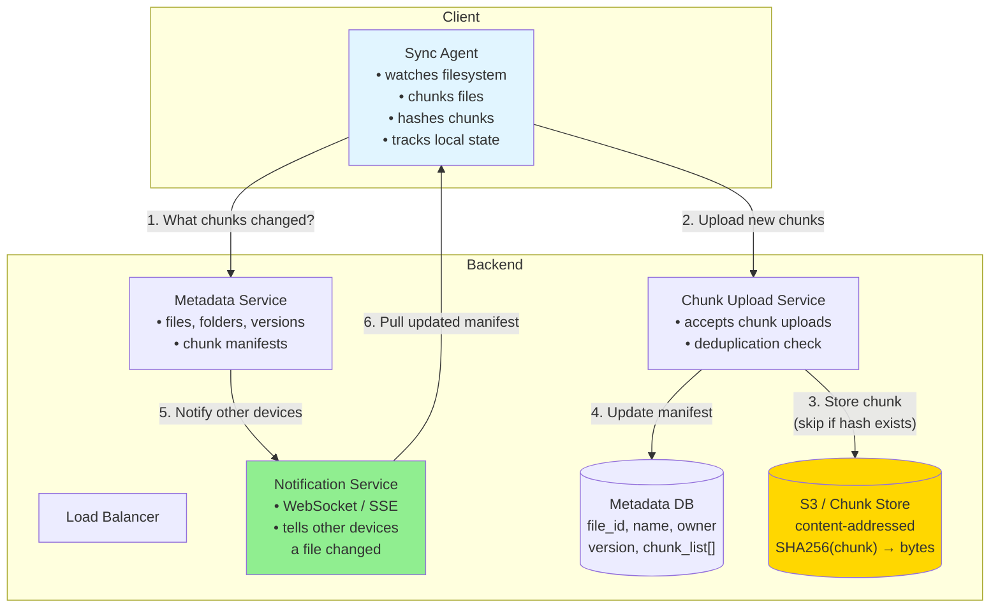
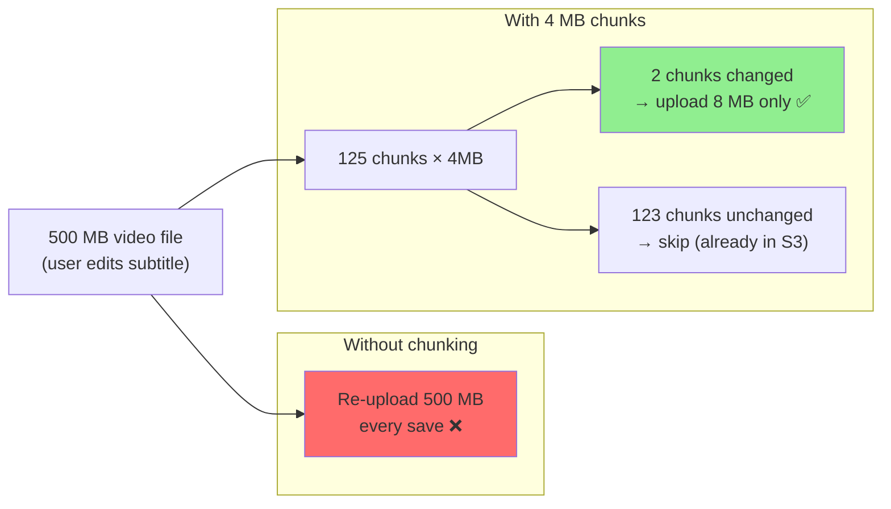

# 04 · Dropbox

> **Difficulty**: Easy
> **Introduces**: file chunking, delta sync, conflict resolution basics, client-side sync agent
> **Builds on**: [02 · Pastebin](02-pastebin.md) — metadata + blob split; [03 · Key-Value Store](03-key-value-store.md) — replication

---

## How I Should Think About This

Dropbox is Pastebin but the files change over time and must stay in sync across multiple devices. The metadata + blob split from Q02 still applies — you store file metadata in a database and file content in S3. What's new is the **sync problem**: when a user edits a file on their laptop, that change must propagate to their phone, tablet, and any shared collaborators. You can't re-upload the entire file on every edit (a 500MB video file would be impossibly slow to sync). The solution is **file chunking** — split files into 4MB blocks, hash each chunk, and only upload chunks that changed. If you edit one paragraph of a 500MB file, only a few 4MB chunks change and only those get uploaded.

The second hard problem is **conflict resolution**: what happens when two people edit the same file offline and both try to sync? Dropbox's real-world answer is pragmatic — it doesn't try to merge (that's Google Docs' job). It creates a **conflicted copy**: `resume (John's conflicted copy 2024-01-15).docx`. Both versions are preserved, and the user resolves it manually. Understanding this tradeoff — merge vs conflict copy — is the core of what makes Q30 (Google Drive Sync) a hard question. Here you just need to identify the problem exists and state how you'd handle it.

---

## Whiteboard Diagram



---

## Key Decisions

**1. File chunking: why and how**



Each chunk is identified by `SHA256(chunk_bytes)`. If the hash already exists in S3, skip the upload — **content-addressed deduplication**. Two users with the same file pay for storage once.

**2. What is a chunk manifest?**

The metadata DB stores a file not as a blob path but as an ordered list of chunk hashes:

```
File: report.pdf  (version 3)
Chunks: [
  "a3f2c1...",   ← chunk 0 (unchanged from v2)
  "9e71ab...",   ← chunk 1 (unchanged)
  "d4c8f2...",   ← chunk 2 (CHANGED — new content)
  "a3f2c1..."    ← chunk 3 (unchanged)
]
```

Syncing means comparing your local chunk list to the server's manifest and fetching only what differs.

**3. Conflict handling**

| Strategy | What happens | Used by |
|----------|-------------|---------|
| **Last write wins** | One edit silently overwrites the other | Simple but loses data |
| **Conflicted copy** | Both versions preserved, user resolves | Dropbox |
| **Operational transform / CRDT** | Auto-merge character-by-character | Google Docs (Q30) |

> For this interview: propose **conflicted copy**. It's simple, safe, and what Dropbox actually does.

---

## Capacity Estimation

```
Users:           500M registered, 100M DAU
Files synced/day: 100M users × 5 file events = 500M events/day
Avg upload:      1 MB of changed chunks per event
Upload volume:   500M × 1 MB = 500 TB/day → S3 handles this

Metadata DB:     ~1 KB per file version × billions of files → sharded
S3 storage:      total unique chunks across all users (dedup saves ~30%)
```

---

## Concepts Introduced

- **File chunking + content-addressed storage** — split files into fixed-size blocks, identify by hash. Only transfer what changed. Reappears in: Google Drive (Q30).
- **Chunk manifest** — a file is an ordered list of chunk references. Syncing = manifest diff. The foundation of any efficient sync protocol.
- **Conflict copy strategy** — simplest conflict resolution: preserve both, let the user decide. Sets up the contrast with CRDT-based merge in Q30.
- **Push notification for sync** — when server state changes, notify clients via WebSocket/SSE so they pull the diff. Reappears in: all real-time systems.

---

## What to Study Next

➜ **[05 · News Aggregator](05-news-aggregator.md)** — shifts from user-driven uploads to **system-driven crawling**. Introduces the polling and deduplication patterns that feed into Web Crawler (Q25).
