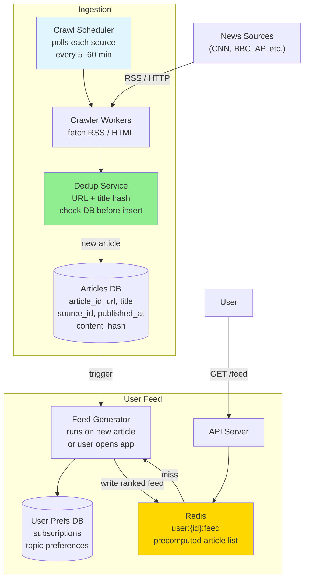

# 05 · News Aggregator

> **Difficulty**: Easy
> **Introduces**: polling vs push (webhooks), RSS crawling, deduplication, feed ranking
> **Builds on**: [Caching](../../in-a-hurry/04-caching.md) · [DB Indexing](../../in-a-hurry/08-database-indexing.md) · [API Design](../../in-a-hurry/02-api-design.md)

---

## How I Should Think About This

A news aggregator (think Google News or Feedly) has two sides: **ingestion** (pulling articles from hundreds of sources) and **serving** (showing each user a ranked feed of relevant articles). The ingestion side is driven by your system — you run scheduled crawlers that periodically fetch RSS feeds or scrape news sites. This is your first encounter with a **system-driven write path**, where the data comes from the outside world rather than from a user action. The key problems here are crawl scheduling (how often do you poll each source?), deduplication (the same article might appear on CNN, BBC, and AP Wire — you only want it once), and freshness (breaking news should appear within minutes, not hours).

The serving side introduces **feed generation**: given a user's subscriptions and preferences, compute a ranked list of articles. At small scale this is a simple SQL query with a join. At large scale you precompute feeds in the background and store them in Redis, so reads are instant. This is the same fan-out tradeoff you'll see in FB News Feed (Q10) — the key question is whether you generate the feed at read time (fresh but slow) or write time (fast but requires precomputation). For a news aggregator the answer is usually a hybrid: precompute cached feeds but rebuild them when the user actively opens the app.

---

## Whiteboard Diagram



---

## Key Decisions

**1. Polling vs webhooks for ingestion**

| | Polling (you call them) | Webhooks (they call you) |
|--|------------------------|--------------------------|
| **Control** | Full — you decide frequency | They decide when to push |
| **Freshness** | Delayed by poll interval | Near-instant |
| **Complexity** | Simple | Requires sources to support it |
| **Works with** | Any RSS/HTML source | Only sources that implement webhooks |

> Most news sources only support RSS/polling. Webhooks are nice when available (some APIs like Twitter) but can't be relied on universally. **Start with polling, add webhook support opportunistically.**

**2. Deduplication: how to detect the same story from multiple sources**

```
Same article published by Reuters and picked up by 50 outlets:

Level 1: URL dedup
  → hash(canonical_url) → easy but misses syndicated content

Level 2: Content hash
  → hash(title + first_paragraph) → catches near-duplicates
  → store in a bloom filter for O(1) fast negative check

Level 3: Near-duplicate detection
  → SimHash or MinHash for fuzzy similarity
  → More expensive, catches rewritten articles
```

> For interviews: **URL dedup + content hash** is the right answer. Mention bloom filter for performance.

**3. Feed ranking signals**

A basic ranked feed uses:
- **Recency** — newer articles score higher
- **Source credibility** — trusted outlets scored up
- **User affinity** — articles matching user's subscribed topics/sources
- **Engagement** — if trending (many clicks), boost score

```sql
score = (1 / hours_since_published) * source_weight * topic_match_boost
```

Pre-rank at write time when an article is ingested. Store `(userId, articleId, score)` in Redis sorted set.

---

## Capacity Estimation

```
Sources:          10,000 news sites
Poll frequency:   every 15 min on average
Crawls/hour:      10,000 × 4 = 40,000 crawls/hour
New articles/day: 1M articles/day across all sources
Article size:     5 KB (title + summary + metadata)
Storage/day:      1M × 5 KB = 5 GB/day

Users:            50M DAU
Feed reads:       50M × 5 opens/day = 250M reads/day → 3,000 RPS
→ Precomputed Redis feeds serve this easily
```

---

## Concepts Introduced

- **Crawl scheduler** — a job queue that fires crawl tasks on a schedule. Each source has its own crawl interval. Reappears directly in: Web Crawler (Q25).
- **Deduplication via hashing** — content-fingerprinting to detect duplicates before inserting. Reappears in: Web Crawler (Q25), Dropbox chunks (Q04).
- **Bloom filter** — probabilistic data structure for fast "definitely not in set" checks. Used to gate expensive DB lookups. Reappears in: Web Crawler (Q25), distributed systems.
- **Feed precomputation** — generate and cache feeds in the background rather than at read time. The core tradeoff explored deeply in FB News Feed (Q10).

---

## What to Study Next

➜ **[06 · Local Delivery Service](06-local-delivery.md)** — introduces geolocation and proximity matching. The geo indexing fundamentals here are the prerequisite for Tinder (Q12), Yelp (Q13), and Uber (Q23).
