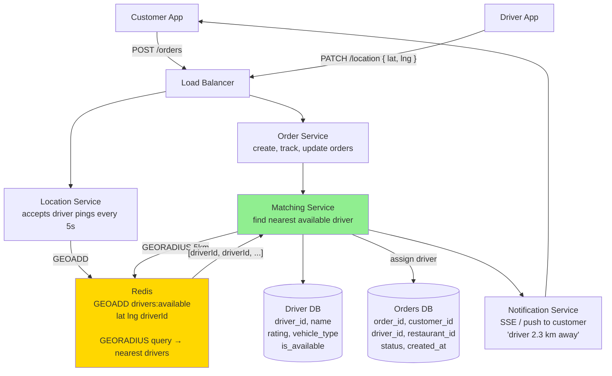
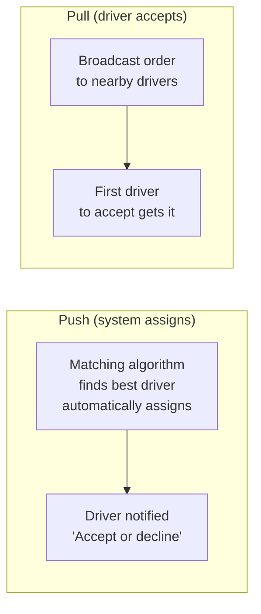

# 06 · Local Delivery Service

> **Difficulty**: Easy
> **Introduces**: geolocation storage, proximity queries, driver/order matching, basic real-time location
> **Builds on**: [REST API Design](../../in-a-hurry/02-api-design.md) · [DB Indexing](../../in-a-hurry/08-database-indexing.md)

---

## How I Should Think About This

A local delivery service (think DoorDash or Instacart) has three interacting actors: **customers** placing orders, **drivers** accepting and fulfilling them, and **restaurants/stores** preparing them. The core design problem is **proximity matching**: given an incoming order, which available driver is closest and should be assigned? This sounds simple — just find drivers near the restaurant — but requires thinking about how to store and query location data efficiently. Storing lat/lng in a plain SQL table and running `SELECT * WHERE distance < 5km` does a full table scan on every order. At scale you need a geospatial index.

The second key problem is **real-time location tracking**. Once a driver accepts an order, the customer wants to see them moving on a map. This is a **write-heavy, ephemeral data problem**: driver locations update every few seconds, but you don't need to keep the history (unlike Strava in Q15). The right store for this is Redis, not your relational database. Redis lets you update a driver's position with `GEOADD` and query nearby drivers with `GEORADIUS` — a geospatial index built in. This is the foundational geo pattern that Tinder, Yelp, and Uber all build upon.

---

## Whiteboard Diagram



---

## Key Decisions

**1. How do you store and query driver locations?**

```
❌ Plain SQL:
   SELECT driver_id FROM drivers
   WHERE ST_Distance(location, order_point) < 5000  ← meters
   AND is_available = true
   → Full table scan without geospatial index. Slow.

✅ Redis GEOADD + GEORADIUS:
   GEOADD drivers:available 40.7128 -74.0060 "driver_42"
   GEORADIUS drivers:available 40.7128 -74.0060 5 km ASC COUNT 10
   → Returns 10 nearest available drivers. O(N+log M) where N is result set.

✅ PostgreSQL with PostGIS extension:
   CREATE INDEX ON drivers USING GIST(location);
   → Geospatial B-tree. Good for persistence + complex queries.
```

> For interviews: **Redis for the live location index** (hot, fast, ephemeral) + **PostgreSQL/PostGIS for historical data** if needed.

**2. How often do drivers ping their location?**

| Frequency | Freshness | Battery + Bandwidth cost |
|-----------|-----------|--------------------------|
| Every 1s | Near-perfect | High — drains battery |
| Every 5s | Good enough for delivery | Reasonable |
| Every 30s | Stale — bad UX | Low |

> Standard answer: **every 3–5 seconds** when on an active delivery, **every 30s** when idle. Adaptive frequency based on state.

**3. Order assignment: push vs pull**



> DoorDash uses push with a 30s accept window then reassigns. This prevents order rot.

---

## Capacity Estimation

```
Drivers active:     100,000 at peak
Location updates:   100K × 1 update/5s = 20,000 writes/sec to Redis
Active orders:      50,000 concurrent
Matching queries:   50,000 GEORADIUS calls/sec at peak (one per new order)

Redis handles 100K ops/sec easily — this fits on a few Redis nodes.
Order DB: millions of rows/day, straightforward RDBMS with indexing.
```

---

## Concepts Introduced

- **Geospatial index (Redis GEO / PostGIS)** — storing lat/lng in a structure that supports "find everything within X km." Reappears in: Tinder (Q12), Yelp (Q13), Uber (Q23), Google Maps (Q24).
- **Ephemeral vs durable data** — driver location is fast-changing and doesn't need history → Redis. Order history must persist → relational DB. Knowing *which* store fits *which* data is a recurring design decision.
- **Adaptive polling frequency** — update rate based on state (active delivery vs idle). Reappears in: Uber (Q23).
- **Proximity matching** — the "find nearest available X" query. The building block of all geo-matching systems.

---

## What to Study Next

➜ **[07 · Top K / Leaderboard](07-leaderboard.md)** — introduces Redis sorted sets for ranking. The last Easy question before you hit Medium difficulty, where all these concepts start combining.
