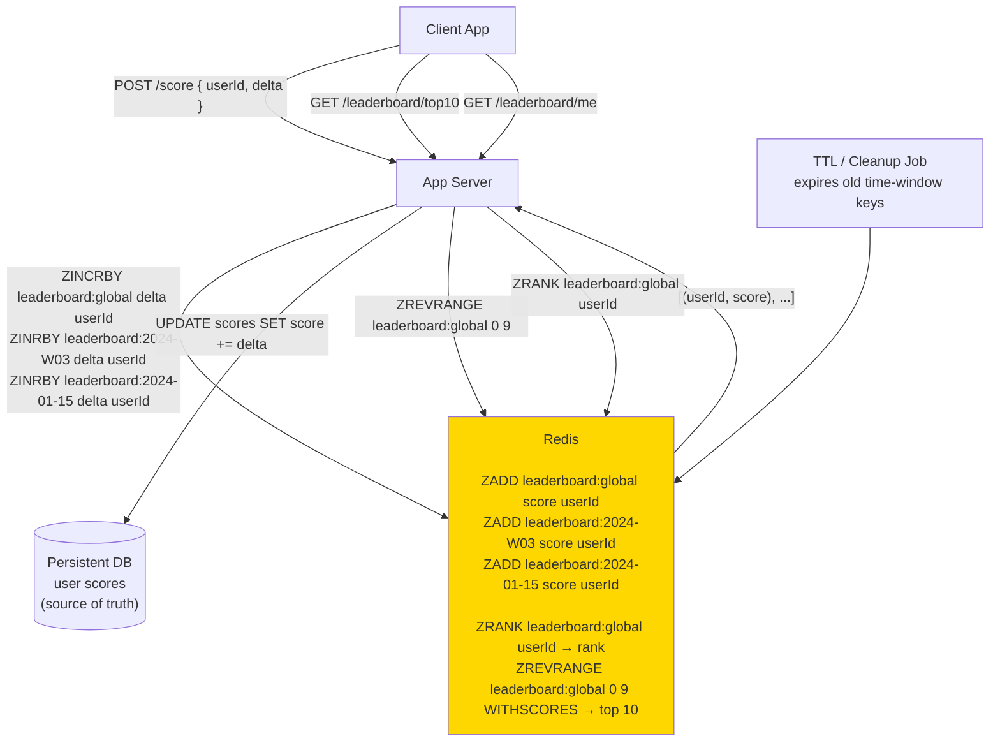

# 07 · Top K / Leaderboard

> **Difficulty**: Easy
> **Introduces**: Redis sorted sets, time-windowed leaderboards, approximate counting (HyperLogLog)
> **Builds on**: [Caching](../../in-a-hurry/04-caching.md) · [Numbers to Know](../../in-a-hurry/09-numbers-to-know.md)

---

## How I Should Think About This

A leaderboard seems trivial — just sort by score. The interesting design question is **at what scale does a naive approach break?** A simple `SELECT user_id, score ORDER BY score DESC LIMIT 10` works fine with 10,000 users. At 100 million users updating scores in real time, that query becomes impossibly expensive. The solution is Redis sorted sets: a data structure that keeps scores sorted at all times, so `ZRANGE` and `ZRANK` are O(log N) regardless of how many users. This is your first encounter with choosing the right data structure for a query pattern rather than forcing a relational model to do something it's bad at.

The second dimension is **time windows**. A global all-time leaderboard is one thing, but "top players this week" or "top scores today" requires a different approach. You can't modify historical data; instead you maintain **separate sorted sets per time window** (`leaderboard:2024-W03`, `leaderboard:2024-01-15`) and expire old ones automatically. At massive scale (think YouTube view counts or Twitter trending topics), even Redis can't count billions of events exactly with bounded memory, so you use **approximate counting** with HyperLogLog — trading a small error margin (~0.8%) for dramatically lower memory use. Knowing when exact vs approximate is acceptable is the mature engineering judgment interviewers want to see.

---

## Whiteboard Diagram



---

## Key Decisions

**1. Redis sorted set operations you need to know**

```
ZADD   leaderboard "score" "userId"    → add/update member
ZINCRBY leaderboard delta "userId"     → increment score atomically
ZRANK   leaderboard "userId"           → 0-indexed rank (ascending)
ZREVRANK leaderboard "userId"          → rank from top (descending)
ZREVRANGE leaderboard 0 9 WITHSCORES  → top 10 with scores
ZRANGEBYSCORE leaderboard min max      → members in score range
ZCARD   leaderboard                    → total members
```

All O(log N) for single-member ops. O(log N + K) for range queries where K = results returned.

**2. Time-windowed leaderboards**

```
Global:     ZADD leaderboard:global     score userId
Weekly:     ZADD leaderboard:2024-W03   score userId
Daily:      ZADD leaderboard:2024-01-15 score userId

TTL on time-window keys:
  SET leaderboard:2024-01-15 → EXPIRE after 8 days (keep 7 days of history)
  SET leaderboard:2024-W03   → EXPIRE after 5 weeks
```

Each time a user scores, you update all three keys atomically in a Redis pipeline. Old keys expire automatically — no cleanup job needed.

**3. Exact vs approximate counting**

| Method | Accuracy | Memory | Use When |
|--------|----------|--------|----------|
| Redis ZADD (exact) | 100% | O(N) — 1 entry per user | Scores for millions of users |
| HyperLogLog | ~99.2% | 12 KB regardless of N | Counting *unique* events (unique viewers, distinct IPs) |

```
PFADD  video:123:viewers userId   → add to HyperLogLog
PFCOUNT video:123:viewers         → estimate unique viewers
→ 12 KB max memory even with 1 billion unique viewers
```

> Use HyperLogLog when you need "how many *unique* users did X" and exact count doesn't matter. Use sorted sets when ranking and exact scores matter.

---

## Capacity Estimation

```
Users:            100M active players
Score events/day: 100M × 10 events = 1B events/day → 12,000/sec average
Peak:             ~50,000 score updates/sec

Redis sorted set for 100M users:
  Per entry:  ~40 bytes (8-byte score + userId + overhead)
  Total:      100M × 40B = 4 GB → fits in memory

Time windows: 3 active keys × 4 GB = 12 GB total → single Redis cluster
```

---

## Concepts Introduced

- **Redis sorted set (ZSET)** — the canonical data structure for ranking. Always-sorted, O(log N) insert and rank lookup. Reappears in: Strava (Q15), Notification priority queues, rate limiter windows.
- **Time-windowed keys with TTL** — separate Redis keys per time period, auto-expired. A simple but powerful pattern for "leaderboard this week vs all time."
- **HyperLogLog** — approximate unique-count structure. 12 KB regardless of cardinality. Reappears in: Ad Click Aggregator (Q29).
- **Atomic multi-key updates via pipeline** — updating multiple sorted sets in one Redis round-trip. Prevents inconsistency between global and weekly leaderboards.

---

## What to Study Next

➜ **[08 · Rate Limiter](../medium/08-rate-limiter.md)** — your first Medium question. Combines Redis atomic operations (INCR, EXPIRE) with algorithmic thinking. You now have all the Redis fundamentals needed to implement distributed rate limiting.
