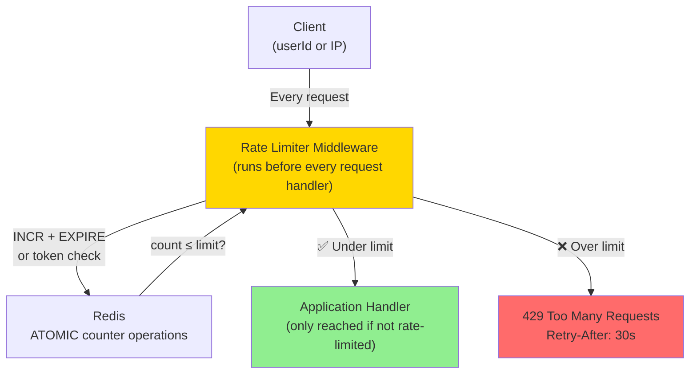
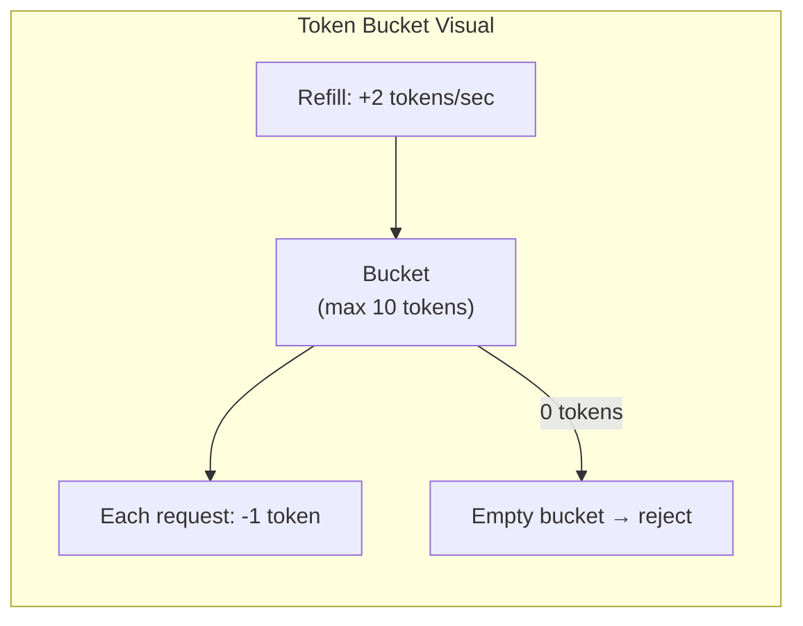

# 08 · Rate Limiter

> **Difficulty**: Medium
> **Introduces**: token bucket, fixed window, sliding window, distributed rate limiting
> **Builds on**: [07 · Leaderboard](../easy/07-leaderboard.md) — Redis atomic ops; [03 · Key-Value Store](../easy/03-key-value-store.md) — Redis internals

---

## How I Should Think About This

A rate limiter answers one question: "has this client made too many requests in a given window?" The tricky part is that this check happens on every single request, must be extremely fast (sub-millisecond), and must work correctly even when spread across 100 app servers. If each server tracked its own counters locally, a client could hit 100 servers and get 100× the allowed limit. The counter must live in **one shared place** — Redis — and every server atomically increments it and checks the result.

The algorithm choice matters. **Fixed window** (count resets every second) is simple but allows bursting: a client can send N requests at second 0:59 and N more at second 1:00 — effectively 2N in two seconds. **Sliding window** is more accurate but costs more memory (stores every request timestamp). **Token bucket** is the best balance: it allows short bursts up to a max capacity while enforcing a long-term average rate. Most production systems (Stripe, AWS API Gateway) use token bucket or a sliding window log. Understanding the tradeoff between precision and memory/cost is exactly what interviewers want to hear.

---

## Whiteboard Diagram



---

## Key Decisions

**1. The three algorithms**

**Fixed Window** — simplest. Counter per window (1s, 1min). Reset at window boundary.
```
Key: rate:{userId}:{unix_minute}
INCR  → count
EXPIRE → 60 seconds
If count > limit: reject
```
Problem: burst at window boundary (2× limit in 2 seconds).

**Sliding Window Log** — precise. Store timestamp of every request.
```
Key: rate:{userId}:log
ZADD  → add current timestamp
ZREMRANGEBYSCORE → remove entries older than window
ZCARD → count remaining
If count >= limit: reject
```
Problem: stores every request timestamp — expensive at high volume.

**Token Bucket** — best balance. Bucket holds N tokens, refills at rate R/sec. Each request consumes 1 token.
```
Key: rate:{userId}:tokens  (current token count)
Key: rate:{userId}:last    (last refill timestamp)

On each request:
  elapsed = now - last_refill
  tokens = min(capacity, stored_tokens + elapsed × refill_rate)
  if tokens >= 1: tokens -= 1; allow
  else: reject
```
Allows short bursts (bucket can be full), enforces long-term rate.



**2. Where to put the rate limiter**

| Location | Pros | Cons |
|----------|------|------|
| **API Gateway / LB** | Catches before app servers | Less context (no user auth yet) |
| **App middleware** | Has full context (userId, route) | Adds latency to every request |
| **Both** | IP-level at gateway + user-level in app | Correct approach for prod |

**3. What to rate limit by**

- **IP address** — default, no auth required. Weak (shared IPs in offices/NAT).
- **User ID** — requires auth. Better for logged-in users.
- **API key** — for developer APIs (Stripe, Twilio).
- **Endpoint** — different limits for `/search` vs `/checkout`.

> Real systems stack these: IP limit at the edge, user limit in the app.

---

## Capacity Estimation

```
API traffic:        100,000 requests/sec
Rate limit check:   1 Redis op per request = 100,000 Redis ops/sec
Redis capacity:     ~100,000 ops/sec single node → borderline
Solution:           Redis Cluster, or shard by userId hash

Memory per user:    ~100 bytes (token bucket state)
100M users:         100M × 100 bytes = 10 GB → fits in Redis cluster
```

---

## Concepts Introduced

- **Token bucket algorithm** — the standard for allowing bursts while enforcing average rate. Reappears framed differently in: Ticketmaster waiting room (Q09), any API gateway question.
- **Redis atomic INCR + EXPIRE** — the building block for distributed counters. The same pattern powers: view counters, vote counts, seat holds.
- **Multi-tier limiting** — IP at edge, user at app layer, endpoint-specific limits. The defense-in-depth approach for real APIs.
- **429 Too Many Requests** — the correct HTTP status. Always include `Retry-After` header so clients back off properly.

---

## What to Study Next

➜ **[09 · Ticketmaster](09-ticketmaster.md)** — takes the concurrency control you've seen here (rate limiting access) and applies it to inventory: not just "too many requests" but "too many buyers for the same seat."
