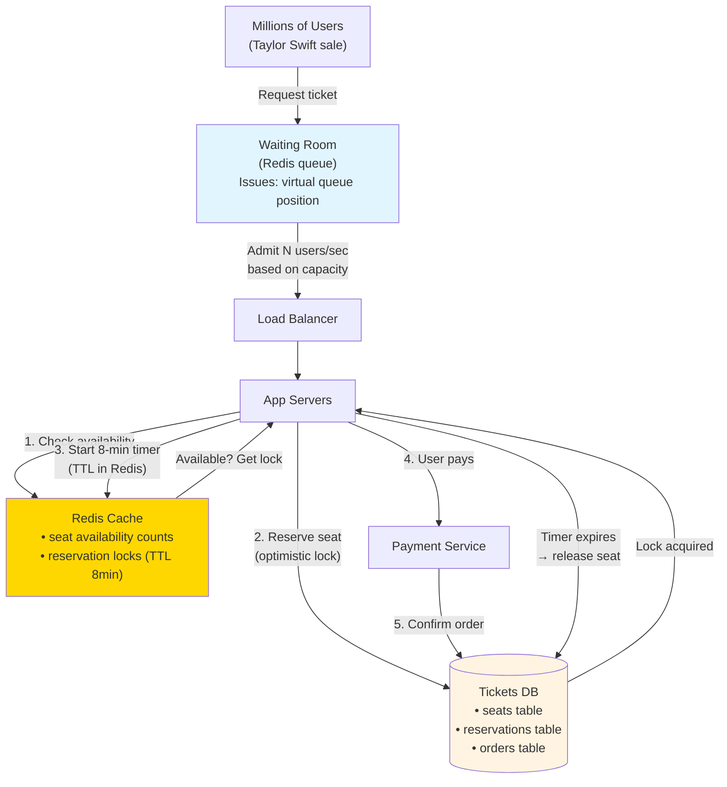
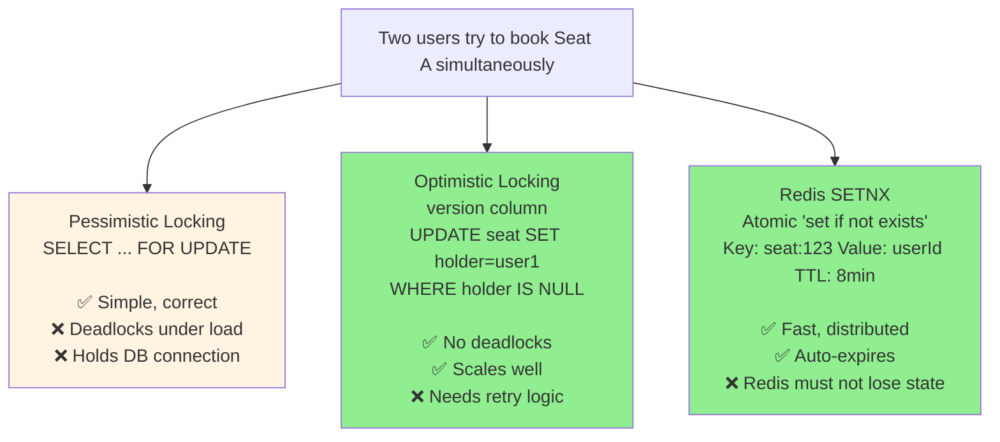
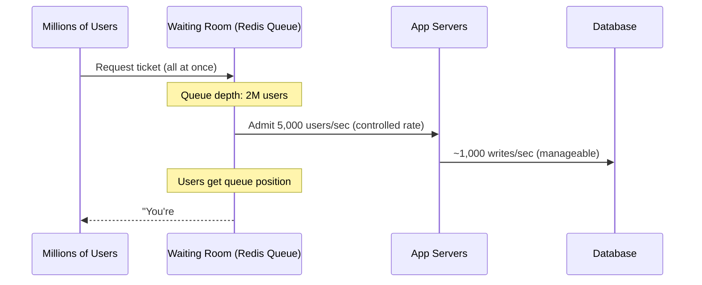

# 09 · Ticketmaster

> **Difficulty**: Medium
> **Introduces**: inventory + concurrency, optimistic locking, traffic spike handling, waiting room queue
> **Builds on**: [01 · URL Shortener](../easy/01-url-shortener.md) (caching, read-heavy), [07 · Leaderboard](../easy/07-leaderboard.md) (Redis for counts)
> **Prerequisites**: [Caching](../../in-a-hurry/04-caching.md) · [CAP Theorem](../../in-a-hurry/07-cap-theorem.md) · [DB Indexing](../../in-a-hurry/08-database-indexing.md)

---

## How I Should Think About This

Ticketmaster looks like a simple e-commerce problem until you add two constraints: **scarcity** and **spikes**. Seats are finite and every user thinks they deserve the last one. When Taylor Swift tickets go on sale, millions of users hit the system simultaneously, all trying to reserve the same pool of ~50,000 seats. That's not a read-heavy problem like Bit.ly — it's a **write-contention problem**. The hard part isn't storing or retrieving ticket data; it's ensuring two users can't buy the same seat while under extreme concurrency.

The second insight is that you can't just throw more servers at this — the bottleneck is the database row representing a seat. Even with 100 app servers, they all serialize at that one row when checking and reserving. Your job is to manage this contention intelligently: hold a reservation lock for a time window (like an 8-minute cart timer), use **optimistic locking** to avoid deadlocks, and push the overflow traffic into a **waiting room queue** so the database never sees more concurrent writers than it can handle.

---

## Whiteboard Diagram



---

## Key Decisions

**1. How do you prevent double-booking?**

You need to ensure only one user can hold a seat at a time. Three approaches:



> Best answer: **Redis SETNX for the reservation lock** (fast, auto-expiring), then **optimistic locking on the DB** for the final commit. Two-layer protection.

**2. How do you handle the traffic spike?**

When tickets go on sale, millions of requests arrive in seconds. You can't admit them all — your DB has a write limit.



The waiting room absorbs the spike. The DB sees steady, controlled write volume. Users with a queue position feel better than users getting errors.

**3. What happens when the 8-minute reservation timer expires?**

If a user holds a seat but doesn't complete payment, the seat must be released back to inventory.

- **Redis TTL** automatically expires the lock key after 8 minutes
- A background job scans for expired reservations in the DB and flips `status: reserved → available`
- The seat reappears in inventory — the next user in the waiting room can claim it

---

## Capacity Estimation

```
Popular event: 50,000 seats
Users trying to buy: 2,000,000 (40:1 demand ratio)
Sale window: 10 minutes

Peak write QPS: 2M users / 600 seconds = ~3,300 requests/sec
Seat contention: 40 users per seat on average

DB: seats (50K rows), reservations (50K rows), orders (millions/day)
Redis: holds ~50K active reservation locks simultaneously
```

---

## New Concept: Optimistic Locking

You haven't seen this pattern before. It's critical for any system with concurrent writes to shared rows.

```sql
-- The seat table has a version column
SELECT id, version FROM seats WHERE id = 123 AND status = 'available';
-- Returns: { id: 123, version: 5 }

-- Try to claim it — only succeeds if no one else claimed it since we read
UPDATE seats
SET status = 'reserved', holder_id = 'user_abc', version = 6
WHERE id = 123 AND version = 5;  -- ← the guard

-- If 0 rows updated: someone else got there first → retry with fresh read
-- If 1 row updated: you got the seat
```

No locks held. No blocking. Just a compare-and-swap. If two users race, one wins and the other sees 0 rows affected and retries.

---

## Concepts Introduced

- **Optimistic locking** — compare-and-swap pattern for concurrent writes to shared rows. Reappears in: Online Auction (#17), Amazon E-commerce (#27).
- **Redis SETNX** — atomic "set if not exists." The building block for distributed locks. Reappears in: Rate Limiter (#08), Distributed Cache (#28).
- **Waiting room / virtual queue** — admitting traffic at a controlled rate to protect downstream systems. The pattern behind any high-demand sale (sneakers, concerts, game launches).
- **Reservation with TTL** — hold-and-expire pattern. User holds a resource for a time window, then it's released automatically. Reappears in: Online Auction, hotel/flight booking systems.

---

## What to Study Next

➜ **[10 · FB News Feed](10-fb-news-feed.md)** — shifts from write-contention to read-scale. You've handled millions writing to the same rows; now handle millions reading personalized feeds.
