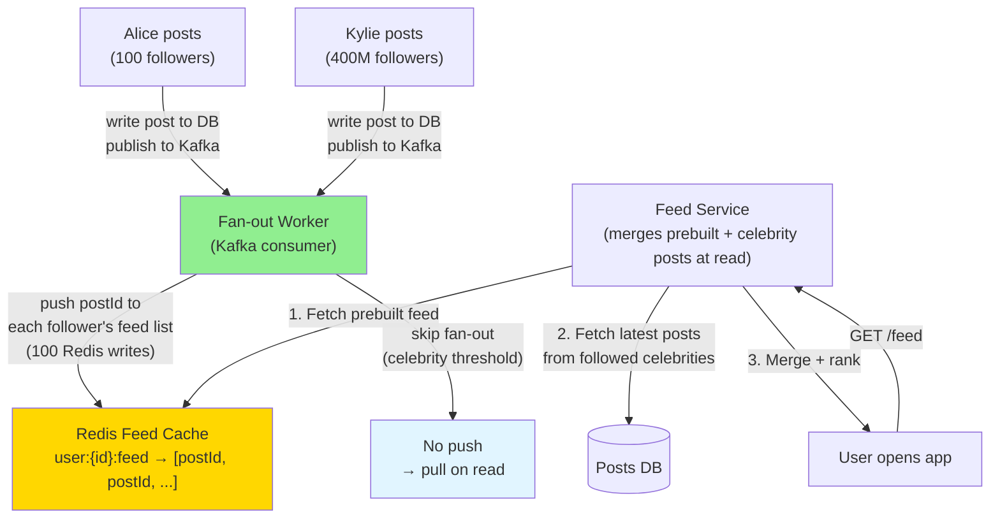
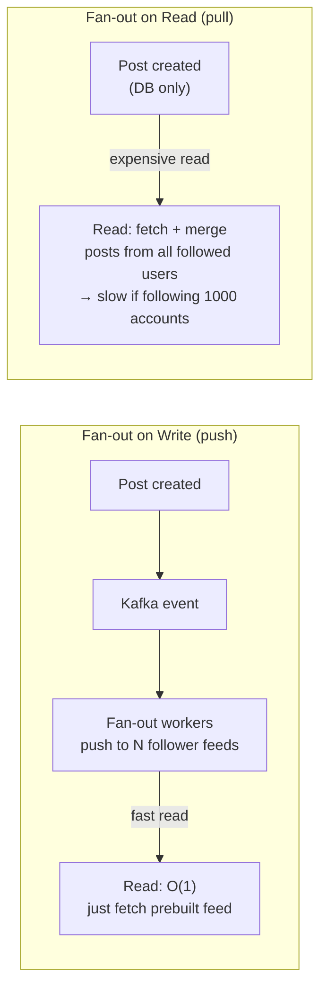

# 10 · Facebook News Feed

> **Difficulty**: Medium
> **Introduces**: fan-out on write vs read, celebrity problem, feed ranking
> **Builds on**: [09 · Ticketmaster](09-ticketmaster.md) — write contention; [01 · URL Shortener](../easy/01-url-shortener.md) — caching cascade

---

## How I Should Think About This

A news feed has two problems: **write** (when someone posts, how do all their followers learn about it?) and **read** (when someone opens the app, how do you serve them a relevant, ranked feed instantly?). These two problems pull in opposite directions. The simplest read — "pull all posts from all accounts I follow, sort by time" — requires a database join across potentially thousands of followed accounts on every open. That's far too slow. Instead, you pre-build each user's feed at write time and store it in Redis so reads are O(1). This is **fan-out on write**: when Alice posts, immediately push her post into the Redis feeds of all her followers.

The model breaks when Alice is Kylie Jenner with 400 million followers. Fan-out on write means one post triggers 400 million Redis writes — that's catastrophically expensive. The solution is **hybrid fan-out**: normal users get push (fan-out on write), celebrities get pull (fan-out on read). When you open the app, your feed is pre-built from the people you follow who are normal users, and the posts from celebrities you follow are fetched and merged in at read time. The threshold for "celebrity" is typically ~10,000 followers. This hybrid is the core design insight and what separates a good answer from a great one.

---

## Whiteboard Diagram



---

## Key Decisions

**1. Fan-out on write vs read**



| | Fan-out on Write | Fan-out on Read |
|--|-----------------|-----------------|
| **Read speed** | O(1) — prebuilt | O(following_count) — must merge |
| **Write cost** | O(followers) per post | O(1) per post |
| **Good for** | Regular users | Celebrity accounts |

**2. The celebrity threshold**

Define a "celebrity" as any account with > 10,000 followers. On post creation:

```
if poster.follower_count < CELEBRITY_THRESHOLD:
    fan_out_to_all_followers()   // push model
else:
    store_post_in_db_only()      // pull at read time
```

At read time for a user's feed:
1. Fetch prebuilt feed (all normal accounts) from Redis
2. For each celebrity the user follows: fetch their last 10 posts from PostDB
3. Merge, rank, return top 50

**3. Feed ranking**

Raw chronological is simple but poor. Real feeds rank by:
- **Recency** — newer posts score higher
- **Engagement** — posts with many reactions/comments score higher
- **Relationship closeness** — posts from close friends ranked above acquaintances
- **Content type affinity** — user tends to engage with videos → boost videos

Pre-rank at fan-out time. Store `(score, postId)` in Redis sorted set per user, not just postId.

---

## Capacity Estimation

```
DAU:                 1B users
Posts/day:           500M posts
Avg followers:       300
Fan-out writes:      500M × 300 = 150B Redis writes/day → 1.7M/sec
(80% of users have < 300 followers; 20% celebrity accounts excluded)

Feed reads:          1B users × 10 opens/day = 10B reads/day → 115K RPS
Redis memory:        each feed = 50 postIds × 8 bytes × 1B users = 400 GB
                     → sharded Redis cluster
```

---

## Concepts Introduced

- **Fan-out on write** — push to all N followers when a post is created. Expensive writes, instant reads. Reappears in: Twitter Timeline (Q19), Notification System (Q22), FB Live Comments (Q16).
- **Celebrity problem** — accounts with huge follower counts break fan-out on write. Hybrid threshold approach is the standard solution. Reappears in: Twitter at Scale (Q26).
- **Prebuilt feed in Redis** — store post IDs per user, not full post content. Fetch post content separately. The indirection keeps memory lean and data fresh.
- **Kafka as the fan-out backbone** — post creation publishes to Kafka; fan-out workers consume and distribute. The write path decouples cleanly. Reappears in: FB Live Comments (Q16), Notification System (Q22).

---

## What to Study Next

➜ **[11 · WhatsApp](11-whatsapp.md)** — shifts from broadcasting (one → many) to direct messaging (one → one). Introduces the real-time delivery guarantees and offline queue patterns that underpin FB Live Comments.
